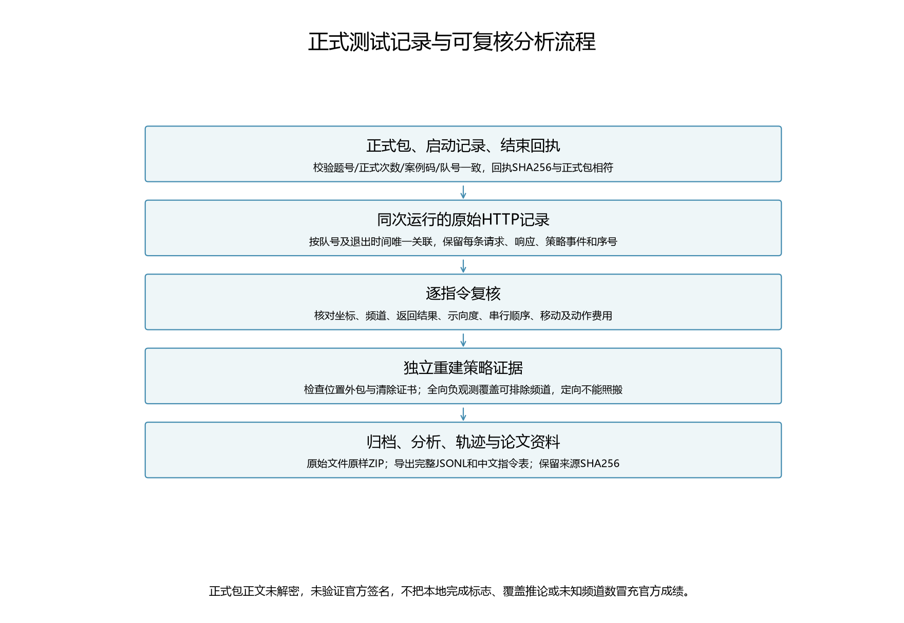
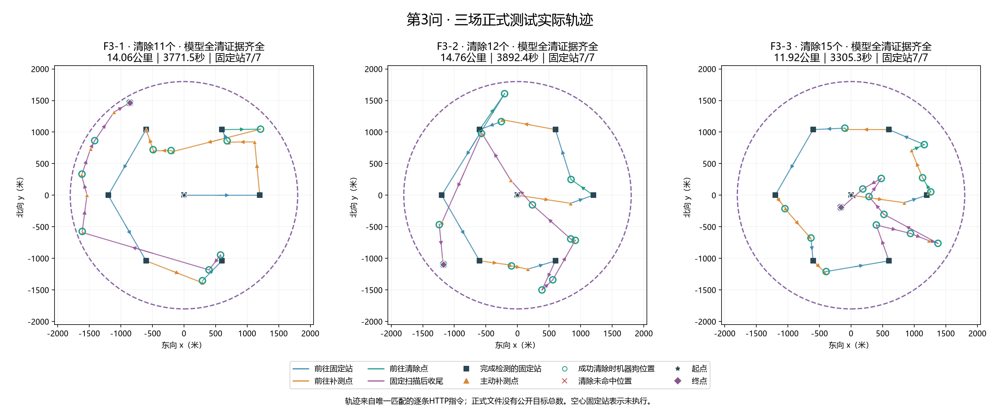
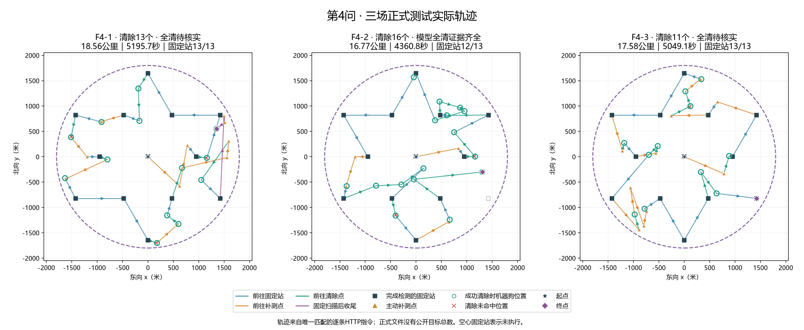
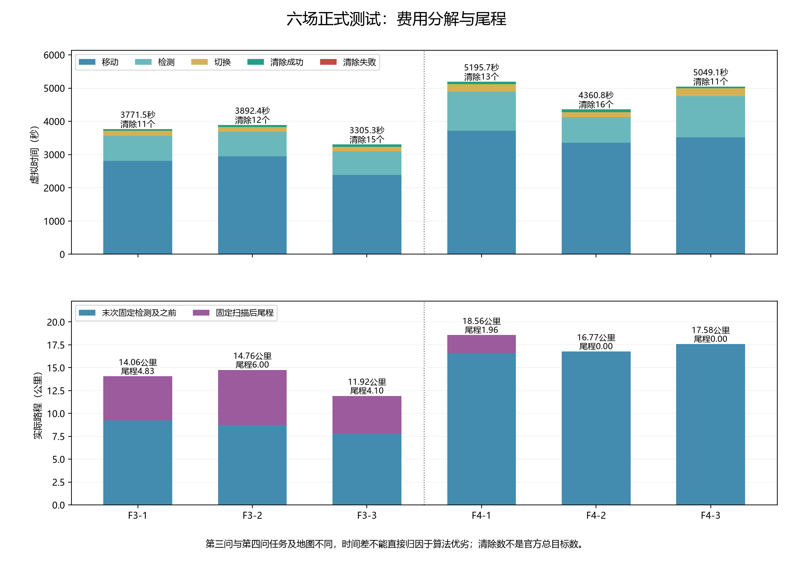
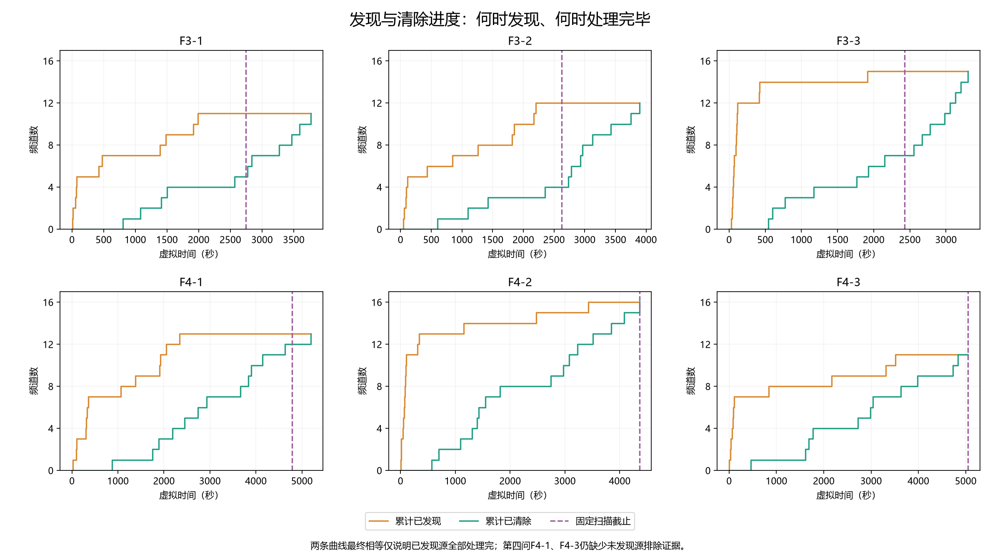

# 第三、四问正式测试：结果、完整指令记录与实际轨迹

本报告对应用户提供的`q3form`和`q4form`，每组3次正式测试。文件头明确为`formal_behavior_log`，正式次数分别为1、2、3。本次只整理已完成的正式运行，没有发起新测试，也没有修改机器人策略。

**第三问三场分别清除11、12、15个源，均有可复核的全向逐频道覆盖排除证据。第四问三场分别清除13、16、11个源；第二场达到16源上界，其余两场全清待核实。六场已发现的源都已清除。**

这批正式结果JSON只提供案例码、结束时间和正式包SHA256，没有提供目标总数或官方得分；`.jlog`正文加密。因此报告没有把“程序正常退出”当成全清，也没有把未发现频道数当成漏源数。以下轨迹和动作统计来自同队号、退出时间唯一吻合的原始HTTP记录，匹配时间差为2—4毫秒。正式包未解密、包签名未验证，时间关联不等同密文内容认证。

## 1. 六场结果

| 正式场次 | 实际使用策略 | 成功清除数 | 完成证据 | 虚拟时间/秒 | 路程/公里 | 检测次数 | 清除未命中次数 | 固定站完成 |
|---|---|---:|---|---:|---:|---:|---:|---:|
| F3-1 | 第三问方案一路线版 | 11 | 其余9频道覆盖排除 | 3771.454 | 14.057 | 152 | 0 | 7/7 |
| F3-2 | 第三问方案一路线版 | 12 | 其余8频道覆盖排除 | 3892.437 | 14.762 | 148 | 0 | 7/7 |
| F3-3 | 第三问方案一路线版 | 15 | 其余5频道覆盖排除 | 3305.262 | 11.921 | 142 | 0 | 7/7 |
| F4-1 | 第四问13站方案一 | 13 | 全清待核实 | 5195.711 | 18.564 | 237 | 3 | 13/13 |
| F4-2 | 第四问13站方案一 | 16 | 达到16源数量上界 | 4360.832 | 16.774 | 155 | 2 | 12/13 |
| F4-3 | 第四问13站方案一 | 11 | 全清待核实 | 5049.104 | 17.576 | 248 | 1 | 13/13 |

第三问合计清除38个源，平均3656.384秒、13.580公里；第四问合计确认清除40个源，平均4868.549秒、17.638公里。两题任务、发射模型及地图不同，不能据此声称某个算法快多少。时间为模拟器虚拟时间，不能与约1.6—3.1秒的本地程序执行时间混淆。

第三问有证据推得总数为11、12、15，但这不是正式结果文件公开的目标总数。第四问F4-1可能遗漏0—3个源，F4-3可能遗漏0—5个源；上限仅由题设每局最多16源减去成功清除数得到，**不能直接判定它们漏了源，也不能确认已经全清**。

## 2. 正式身份、时间与版本

| 场次 | 案例码 | 正式结束时间（北京时间） | 与HTTP退出匹配差/毫秒 |
|---|---|---|---:|
| F3-1 | 25JF-58ZD-WZUU-VGW3 | 2026-09-13 12:05:48 | 2 |
| F3-2 | H36R-KYWW-PCQ7-VFKN | 2026-09-13 12:07:15 | 2 |
| F3-3 | 2FP4-6P3M-98QY-RJEC | 2026-09-13 12:08:14 | 2 |
| F4-1 | 2YBS-Y9BB-RTM6-YJFV | 2026-09-13 02:17:26 | 3 |
| F4-2 | C6AX-446N-FT7J-FZN7 | 2026-09-13 12:00:46 | 4 |
| F4-3 | YFRA-6UAF-YQK5-K2XP | 2026-09-13 12:02:29 | 3 |

每场启动记录、正式包和结果回执中的队号、题号、正式次数和案例码一致，结果回执SHA256与完整`.jlog`逐字节匹配。F4-1是当天凌晨的正式测试，应保留其真实顺序和时间，不能改成中午场次。

第四问三场原始记录均保存Git提交`15817449452b52d57d7973b0f5d57649affed64c`、干净工作区、`reliable`入口及源码哈希；逐一与该提交内文件比对通过。**这三场都使用13站方案一，没有使用新增的19站方案二。** 方案二在同一提交中存在，不代表实际运行选择了它。

第三问原始记录没有记录源码哈希和Git提交。其方案名、配置、七站坐标及动作都对应方案一路线版，绕行门槛400米；无法从这些材料追认精确代码提交，因此不补写一个推测的版本号。

## 3. 原始材料与指令响应如何保存

用户要求保存正式测试期间的指令序列与响应信息，本次按三个层次归档：

1. **原始文件原样保存。** 两组各9个正式文件：3个启动记录、3个加密`.jlog`、3个结果回执，共18份；再加入对应6场的原始`请求响应日志.jsonl`与`运行结果.json`，共12份。两份ZIP合计保存30份原始文件，逐字节保留，不重写换行或正文。
2. **完整逐指令JSONL。** 每行是一对原始请求与响应，包含接口、原始payload、请求ID、HTTP状态、全部响应字段、原日志记录序号、策略步骤、用途、移动起终点及费用。没有事后伪造测试指令或响应。
3. **中文指令表与分析结果。** 指令表按发送顺序展示坐标、频道、结果、示向度、虚拟时刻和本次费用，完整字段可回查JSONL。每局另保存完整策略结果、公开头摘要、来源关系、逐频道过程、尾程与清除证据审计。

| 场次 | 指令响应对数 | 中文指令表 | 完整请求响应JSONL |
|---|---:|---|---|
| F3-1 | 165 | [查看](../../results/tables/正式测试/2026-09-13/F3-1_指令序列.md) | [查看](../../results/tables/正式测试/2026-09-13/F3-1_指令响应.jsonl) |
| F3-2 | 162 | [查看](../../results/tables/正式测试/2026-09-13/F3-2_指令序列.md) | [查看](../../results/tables/正式测试/2026-09-13/F3-2_指令响应.jsonl) |
| F3-3 | 159 | [查看](../../results/tables/正式测试/2026-09-13/F3-3_指令序列.md) | [查看](../../results/tables/正式测试/2026-09-13/F3-3_指令响应.jsonl) |
| F4-1 | 255 | [查看](../../results/tables/正式测试/2026-09-13/F4-1_指令序列.md) | [查看](../../results/tables/正式测试/2026-09-13/F4-1_指令响应.jsonl) |
| F4-2 | 175 | [查看](../../results/tables/正式测试/2026-09-13/F4-2_指令序列.md) | [查看](../../results/tables/正式测试/2026-09-13/F4-2_指令响应.jsonl) |
| F4-3 | 262 | [查看](../../results/tables/正式测试/2026-09-13/F4-3_指令序列.md) | [查看](../../results/tables/正式测试/2026-09-13/F4-3_指令响应.jsonl) |

合计1178对请求响应，其中1082次检测、84次清除尝试（78次成功、6次未命中）、6次进入和6次退出。原日志记录序号连续，请求ID与响应一一对应，串行发送顺序通过；所有响应HTTP 200且accepted=true，重试和通信异常均为0。ZIP内的原始JSONL还保留策略日志中的每条决策，和结果文件的动作列表逐条一致。

原始包下载：[q3form.zip](../../materials/original/formal_tests/2026-09-13/q3form.zip)、[q4form.zip](../../materials/original/formal_tests/2026-09-13/q4form.zip)。[归档清单](../../materials/original/formal_tests/2026-09-13/归档清单.json)记录每个ZIP内文件的原始路径、字节数和SHA256。

ZIP内保留原文件中的队号及正式包封装票据，分析过程没有使用票据发起任何额外操作。本轮GitHub实时查询显示现有仓库为公开状态，与此前文档中的私有记录不同；本轮未改变仓库可见性，按用户上传这两组文件及完整过程记录的要求归档。



## 4. 第三问结果分析

第三问三场的38次清除全部成功，没有主动补测无信号。逐个重建连续位置外包，并检查清除点到所有可能位置的最远距离小于20米，38次清除安全证书均通过。

对未发现频道，原始检测记录确实包含全部七个覆盖站的负观测。中心站加半径1200米六站的最大最近距离约968.902米，小于1000米接收半径下界，因此全向源若存在就应该至少被一个站接收。由实际七站负观测逐频道排除，与成功清除频道一起覆盖全部20个频道，构成题设模型内的全清证据。

目前主要时间开销是移动，合计占74.28%。三场仍有较明显的末尾收尾：

| 场次 | 扫描中清除数 | 最后一次固定站检测后清除数 | 尾程/公里 | 尾程虚拟时间/秒 |
|---|---:|---:|---:|---:|
| F3-1 | 5 | 6 | 4.831 | 1025.118 |
| F3-2 | 4 | 8 | 5.995 | 1268.050 |
| F3-3 | 7 | 8 | 4.099 | 877.798 |

38个源中22个在最后一次固定站检测后才清除，尾程合计3170.966秒，约占三场总时间28.91%。这说明顺路机制确实执行了，但仍有较多已发现目标延期处理。F3-1有一段约2088米的尾程移动；F3-2尾程接近6公里。F3-3虽然源更多，整体反而最快，说明目标布局、顺路程度和定位几何对费用影响明显，不能只按目标数预测耗时。

若后续继续优化，优先离线检查延期目标在更早路段插入的完整增量费用，并进行同图构造比较。不能仅由这些轨迹断言把400米门槛提高就一定节省时间；本次保持正式使用代码不变。



## 5. 第四问结果分析

第四问仍是13站无自动补漏方案一，800米绕行门槛、方向反馈、路线可行替代、超距免测、小范围顺路覆盖等机制均启用。三场40个已发现目标全部清除，39个在固定扫描结束前清除，只有F4-1的频道3需要收尾。移动费用合计占72.46%。

- **F4-1：主要局部问题是频道3的延后与再次无信号。** 频道3在固定站3首次发现，累计4次主动补测，其中2次无信号，最后为它走了1.958公里尾程、耗时407.582秒，尾程最长单段约1626.8米。全场10次主动补测、3次无信号。13个已发现源均清除，但剩下7个未知频道不能直接说不存在。
- **F4-2：本批第四问表现最明确。** 成功清除16个源，达到题目数量上界，在完成12个固定站后提前退出，未执行第13站是合理终止。仅4次主动补测，无主动补测无信号，也没有尾程。不能将图上未执行的最后一站补画成已走过。
- **F4-3：清除调度已较靠前，全清证据不足仍在发现侧。** 11个已发现源全部在固定扫描期间清除，尾程为0；10次主动补测中1次无信号。最后一次成功清除后仍执行了约212.028秒扫描，这是由于目标总数未知而继续扫描未知频道，不能事后用“已清完已知源”判为无用操作。剩余9个未知频道中可能全部不存在，也可能仍有未发现源。

三场共有6次清除未命中，全部发生在小范围覆盖清除过程中，随后相应目标均清除成功。这些动作没有安全单点清除证书，并非“已证明20米内却清除失败”；未命中动作本身仅增加18秒，额外移动另计。相比数千秒总时间，不能把这6次失败当作整体慢的主要原因。

三场有10个源是在已有停点的顺路扫描中首次发现（分别6、3、1个），表明顺路附带扫描确实提供了发现收益。由于未知目标真值不可读，无法断定F4-1/F4-3存在几个漏源或漏源位于哪里，也不能在轨迹图上编造红色漏源点。

后续如比较19站方案二，应使用独立同图构造或可对齐的测评材料，并同时比较清除证据与费用。不能把这三场13站成绩写成19站方案二的正式成绩，也不应为本次分析再消耗正式次数。



## 6. 图表与使用口径

共11张中文图，每张保存PNG和SVG：6张单局轨迹、2张分题总览、费用与尾程图、发现清除进度图、记录分析流程图。

1. [F3-1单局轨迹](../../results/figures/正式测试/2026-09-13/01_F3-1_正式测试轨迹.png)
2. [F3-2单局轨迹](../../results/figures/正式测试/2026-09-13/02_F3-2_正式测试轨迹.png)
3. [F3-3单局轨迹](../../results/figures/正式测试/2026-09-13/03_F3-3_正式测试轨迹.png)
4. [F4-1单局轨迹](../../results/figures/正式测试/2026-09-13/04_F4-1_正式测试轨迹.png)
5. [F4-2单局轨迹](../../results/figures/正式测试/2026-09-13/05_F4-2_正式测试轨迹.png)
6. [F4-3单局轨迹](../../results/figures/正式测试/2026-09-13/06_F4-3_正式测试轨迹.png)

图中1800米虚线圈是干扰源所在区域的边界；绿色空心圆是成功清除时的机器狗位置，它与真实目标之间仍可能相差最多20米，不应当成目标精确坐标。橙色三角为主动补测，紫色线为固定扫描后的尾程，箭头表示实际行进方向。图上固定站用从1开始的显示编号；原始第三问日志的“搜索站0”等名称在指令表中原样保留。





## 7. 复核与后续记录

```powershell
Set-Location 'D:\mywork\code\cumcm2026-b'
.\.venv\Scripts\python.exe -X utf8 .\scripts\analyze_formal_tests.py --verify
.\.venv\Scripts\python.exe -X utf8 .\scripts\build_formal_test_assets.py --verify
```

以上命令从已归档ZIP复核，不依赖本机被忽略的模拟器目录。原始文件仍在本机时，可另外加`--source-check`逐字节比对。归档脚本不会覆盖不一致的已有ZIP；任何文件、摘要、指令、响应、策略事件或费用不一致会停止并报错。

检测费用为5秒，检测频道切换另加1秒；清除成功5秒、未命中3秒，清除不改变当前检测频道；移动速度5米/秒。每个动作按这些规则独立累计，与HTTP返回虚拟时间及结果汇总对照，允许小于0.001秒的累计舍入差。

现有机器人运行入口已自动记录请求、响应和策略事件，应继续保留每次运行目录。今后若执行测试，记录表应同时保留运行命令、实际配置、开始/结束时间和可获得的源码版本信息；本次第三问缺失的历史命令文本与源码哈希不凭空补造。原始日志中的请求指令序列已完整保存。

机读汇总见[汇总JSON](../../results/tables/正式测试/2026-09-13/汇总.json)，逐场诊断见[模型结果目录](../../results/models/正式测试/2026-09-13)，论文文字见[正式测试论文备用说明](../../paper/sections/第三四问_正式测试_论文备用说明.md)。
