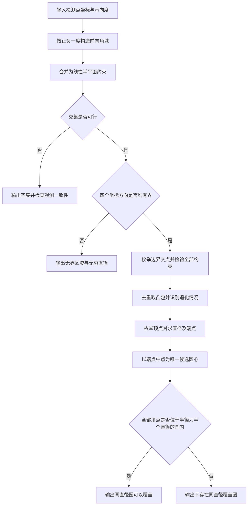

# 第一问：交会定位区域的直径与同直径圆覆盖

## 1. 这份材料怎样使用

本文供队友理解模型、核对实现和撰写论文使用。先看第 2—4 节把握题意与建模，再看第 5—7 节理解证明和反例，最后看算法、边界情况与数值注意事项。可改写入论文的版本见 [`../../paper/sections/第一问_论文备用稿.md`](../../paper/sections/第一问_论文备用稿.md)。

**第一问的结论**：将每次测向的 ±1° 误差写成两个线性不等式，求其交集；当交集是非空有界多边形时，枚举顶点对即可得到区域直径。以该直径为直径的圆不一定覆盖区域；对任意一组直径端点，检查其中点到所有顶点的距离是否不超过半个直径，即得到必要充分判定。

## 2. 题意、资料与模型范围

### 2.1 题目要求与依据

资料来源为项目归档文件 [`../../materials/original/problem/B题.pdf`](../../materials/original/problem/B题.pdf)：

- 第 1 页问题 1：给定若干检测点坐标及同一干扰源关于这些点的示向度，要求给出交会定位法计算多边形定位区域直径的算法，并判断以区域直径为直径的圆能否覆盖区域。
- 第 2 页附录 2 第（1）项：示向度以 $x$ 轴正向为起点，逆时针计角，单位为度，范围为 $[0,360)$；全部示向误差落在 $[-1^\circ,1^\circ]$ 内。
- 第 3 页附录 2 第（3）项及图 2：每个检测点的测量方向左右各偏转 $1^\circ$，不同检测点所确定的角域交集形成定位区域。

同一地点重复检测的误差不因重复测量而改变，因此不能默认通过同地点多次取平均缩小误差范围。

### 2.2 本问明确采用的范围

1. 所有输入示向度已经对应到**同一干扰源**，不在本问中求解多个干扰源的测量关联。
2. 采用确定性的有界误差模型：保留全部满足角度范围的位置，不引入误差独立、正态分布或均匀分布假设。
3. 定位区域采用附录 2 图 2 的**前向角域交集**。每个角域无限延伸，由两条射线围成，不能用两条完整直线的夹角代替。
4. 背景中的半径 1800 米目标分布圆，以及检测距离上下限，不额外加入本问的多边形定义。若把分布圆或接收圆相交，边界可能出现圆弧；若剔除站点附近的距离禁区，集合还可能失去凸性。那是扩展模型，不能继续直接套用本文的多边形顶点算法。
5. 第一问没有给定一组必须计算的检测点数表，因而核心交付是一般算法、正确性证明及可复现构造算例。项目中的数值案例应明确标为“构造算例”，不能称为官方模拟器实测数据。

上述第 3—4 项决定了算法处理的几何对象，也是后续引用本问结论时必须保留的条件。

## 3. 符号与输入输出

| 符号 | 含义 | 单位或说明 |
|---|---|---|
| $n$ | 检测点数量 | 非负整数 |
| $S_i=(x_i,y_i)$ | 第 $i$ 个检测点 | 米 |
| $\theta_i$ | 第 $i$ 个示向度 | 度，从 $x$ 轴正向逆时针计 |
| $\delta$ | 最大示向误差 | 本题为 $1^\circ$ |
| $X=(x,y)$ | 干扰源的候选位置 | 米 |
| $W_i$ | 第 $i$ 个检测点给出的前向角域 | 闭凸集 |
| $P$ | 所有角域的交集 | $P=\bigcap_i W_i$ |
| $V_1,\ldots,V_m$ | 有界交集的顶点 | 去重后按边界顺序排列 |
| $D$ | 定位区域的直径 | 米 |
| $A,B$ | 实现直径的一组端点 | 顶点对 |
| $M$ | 端点中点 | $M=(A+B)/2$ |
| $R_M$ | 所有顶点到 $M$ 的最大距离 | 用于同直径圆判定 |

输入为检测点坐标及各自示向度。输出至少包含交集类型；对于有界非空交集，再给出顶点、直径、直径端点、中点和同直径圆能否覆盖的判定。空集与无界集必须明确报告，不能用一个普通有限直径掩盖异常情况。

## 4. 由示向度构造多边形

### 4.1 一次检测对应两个半平面

记二维叉积为

$$
\operatorname{cross}(a,b)=a_xb_y-a_yb_x.
$$

令下、上边界方向分别为

$$
u_i^-=(\cos(\theta_i-\delta),\sin(\theta_i-\delta)),\qquad
u_i^+=(\cos(\theta_i+\delta),\sin(\theta_i+\delta)).
$$

三角函数实际计算时须将角度转换为弧度。由于 $2\delta=2^\circ<180^\circ$，候选点处于前向角域内当且仅当

$$
\operatorname{cross}(u_i^-,X-S_i)\geq 0,
\qquad
\operatorname{cross}(u_i^+,X-S_i)\leq 0.
\tag{1}
$$

这是两个闭半平面的交集。使用方向向量而不是对角度数值作大小比较，可以自然处理示向度跨越 $0^\circ/360^\circ$ 的情况，也避免斜率形式在竖直方向失效。

写成标准线性不等式，令 $\alpha_i=\theta_i-\delta$、$\beta_i=\theta_i+\delta$，则

$$
\begin{aligned}
\sin\alpha_i\,x-\cos\alpha_i\,y
&\leq \sin\alpha_i\,x_i-\cos\alpha_i\,y_i,\\
-\sin\beta_i\,x+\cos\beta_i\,y
&\leq-\sin\beta_i\,x_i+\cos\beta_i\,y_i.
\end{aligned}
\tag{2}
$$

将所有不等式叠加得到

$$
P=\{X\in\mathbb R^2:HX\leq b\},\qquad H\in\mathbb R^{2n\times2}.
\tag{3}
$$

例如测得正东方向 $\theta_i=0^\circ$ 时，候选点必须在检测点以东、位于上下各 $1^\circ$ 的狭窄角域中。检测点正西方的点不满足式（1）。这可作为实现符号方向的直观核对。

### 4.2 凸性与多边形性质

**命题 1。** 若式（3）的交集非空、有界且有非空内部，则 $P$ 是凸多边形。

**证明。** 半平面是凸集，有限个凸集的交集仍为凸集，故 $P$ 为凸集。式（3）由有限条线性不等式给出，边界只能来自有限条直线。在非空、有界且有内部的条件下，该边界围成一个凸多边形。证毕。

条件不能省略。任意检测点组合可能产生空集、无界区域、单点或线段。只有满足上述三个条件时，才应将结果称为具有面积的定位多边形。

## 5. 直径为什么只需要比较顶点

**命题 2。** 设 $P$ 为非空有界凸多边形，顶点为 $V_1,\ldots,V_m$，则

$$
\operatorname{diam}(P)
=\max_{X,Y\in P}\|X-Y\|_2
=\max_{1\leq i,j\leq m}\|V_i-V_j\|_2.
\tag{4}
$$

**证明。** 对任意 $X,Y\in P$，由凸多边形的表示性质，存在非负系数 $\lambda_i,\mu_j$，满足

$$
X=\sum_i\lambda_iV_i,\quad Y=\sum_j\mu_jV_j,\quad
\sum_i\lambda_i=\sum_j\mu_j=1.
$$

因而

$$
\begin{aligned}
\|X-Y\|_2
&=\left\|\sum_{i,j}\lambda_i\mu_j(V_i-V_j)\right\|_2\\
&\leq\sum_{i,j}\lambda_i\mu_j\|V_i-V_j\|_2\\
&\leq\max_{i,j}\|V_i-V_j\|_2.
\end{aligned}
$$

另一方面，顶点属于 $P$，最远顶点对的距离当然不大于区域直径，两侧不等式合并得到式（4）。证毕。

计算时枚举 $i<j$，比较平方距离

$$
D^2=\max_{i<j}\big[(V_{ix}-V_{jx})^2+(V_{iy}-V_{jy})^2\big],
$$

最后取平方根，并保存实现最大值的顶点对。若有多组最远点对，任选一组即可用于下一节的判定。

同样的结论也适用于线段及单点：线段直径为端点距离；单点直径为 $0$。

## 6. 同直径圆覆盖的必要充分条件

### 6.1 圆心并非可以任意选择

设 $A,B\in P$ 满足 $\|A-B\|=D>0$。若半径为 $D/2$、圆心为 $O$ 的闭圆盘覆盖 $P$，它必须同时包含 $A,B$，从而

$$
D=\|A-B\|\leq\|A-O\|+\|O-B\|\leq D.
$$

两次不等式只能同时取等号。因此 $A,O,B$ 共线，且

$$
\|A-O\|=\|B-O\|=D/2,
\qquad O=M=\frac{A+B}{2}.
\tag{5}
$$

也就是说，一旦选定一组直径端点，任何可能的同直径覆盖圆都只能以其中点为圆心。若该候选圆失败，移动圆心也不能补救。

### 6.2 只检查顶点就足够

**命题 3。** 对非空有界定位多边形，存在直径为 $D$ 的覆盖圆，当且仅当

$$
R_M:=\max_k\|V_k-M\|_2\leq D/2.
\tag{6}
$$

**证明。** 必要性由式（5）及所有顶点必须落在覆盖圆盘中得到。充分性来自圆盘的凸性：若所有顶点落在圆盘内，则这些顶点的凸包，即整个 $P$，也落在圆盘内。证毕。

这里日常所说的“圆覆盖”严格指圆及其内部组成的闭圆盘，而不是仅指圆周。

若有多组直径端点且其中点不同，那么同直径覆盖圆不可能存在，因为它不可能同时拥有两个不同圆心。实际程序无需专门判断这件事，任取一组端点后应用式（6）即可。

### 6.3 与最小覆盖圆的区别

- 区域直径 $D$：区域中最远两点的距离。
- 同直径候选圆：圆心 $M$、半径 $D/2$，本问判断它是否覆盖。
- 最小覆盖圆：在所有能够覆盖区域的圆中，使半径最小的圆；其半径记为 $R_\ast$。

总有 $R_\ast\geq D/2$，但不保证等号。尤其不能把 $(D/2)^2\pi$ 当作定位区域的面积，也不能把 $R_M$ 误认为最小覆盖圆半径。求最小覆盖圆不是第一问算法的必要步骤。

## 7. 符合本题角度误差的反例

仅画一个任意三角形不足以说明它确实能够由本题测向角域形成。本节给出一个可核查的三检测点构造。

### 7.1 目标定位区域

令边长 $L=20$ 米，取等边三角形

$$
A=(0,0),\quad B=(20,0),\quad C=(10,10\sqrt3).
$$

其区域直径为 $D=20$ 米。取端点 $A,B$，候选圆心 $M=(10,0)$、半径 $10$ 米，但

$$
\|C-M\|=10\sqrt3>10,
$$

所以该圆不覆盖三角形，由命题 3 可知任何直径为 $20$ 米的圆都不可能覆盖它。其最小覆盖圆以重心为圆心，半径为

$$
R_\ast=\frac{20}{\sqrt3}>10.
\tag{7}
$$

### 7.2 将三角形实现为三个前向角域的交集

沿 $A\to B\to C\to A$ 逆时针依次记起点为 $P_i$，边向量为 $e_i=P_{i+1}-P_i$。令

$$
S_i=P_i-25e_i,
\qquad
\theta_i=\arg(e_i)+1^\circ \pmod{360^\circ}.
\tag{8}
$$

对应输入如下，坐标单位为米。

| 检测点 | 横坐标 | 纵坐标 | 示向度 |
|---|---:|---:|---:|
| $S_1$ | $-500$ | $0$ | $1^\circ$ |
| $S_2$ | $270$ | $-250\sqrt3$ | $121^\circ$ |
| $S_3$ | $260$ | $260\sqrt3$ | $241^\circ$ |

每个角域的下边界方向是 $e_i$，其左半平面正是三角形相应边的内侧半平面；三个这样的内侧半平面相交恰好得到三角形。

还需要验证每个角域的另一条边界没有切掉三角形。从 $S_i$ 观察相应边上的两个顶点，夹角均为 $0$；观察第三个顶点，沿 $e_i$ 的投影距离是 $25.5L$，垂直高度为 $\sqrt3L/2$，因此偏转角为

$$
\gamma=\arctan\frac{\sqrt3/2}{25.5}
=\arctan\frac{\sqrt3}{51}<2^\circ.
\tag{9}
$$

三个顶点均处于该前向角域中。由角域的凸性，整个三角形也在角域中。因此三个角域的交集既包含该三角形，又被三个边的内侧半平面限制在三角形内，交集**恰好**为该三角形。

还可取实际干扰源为三角形重心 $G=(10,10\sqrt3/3)$。它属于全部角域，因此三组误差均在 ±1° 内。三检测点到 $G$ 的距离相同，均为

$$
\sqrt{510^2+(10\sqrt3/3)^2}=\sqrt{780400/3}\ \text{米},
$$

约为 $510$ 米，大于题设的 $5$ 米近距阈值、且小于全部题设有效接收半径的下限 $1000$ 米，因此可选择全向干扰源保证能够获得示向度。所有坐标也都可置于半径 1800 米的背景区域中。这里说明构造具有物理范围相容性，并不改变第 2.2 节定义的纯角域交集模型。

上述值来自显式数学构造，**不是官方模拟器的采集结果**。

## 8. 可实现的一般算法

### 8.1 计算步骤

1. **检查输入。** 检测点坐标和角度须为有限数值，检测点数量和示向度数量一致。
2. **建立约束。** 按式（2）生成 $2n$ 条半平面不等式。
3. **检查可行性。** 通过线性规划判断是否存在满足所有不等式的点；不可行时报告空集。
4. **检查有界性。** 对可行集分别优化 $x,-x,y,-y$ 四个线性目标；任一目标无界，说明交集无界，不能输出有限定位直径。四个坐标方向都有上下界时，整个集合包含在有限矩形内，故有界。
5. **枚举候选顶点。** 枚举两条不平行边界直线，求交点；仅保留满足全部半平面约束的交点，去重后取凸包，并按点、线段或多边形分类。
6. **求直径。** 对多边形顶点枚举所有点对，按式（4）输出 $D,A,B$；点和线段按退化情况处理。
7. **判定覆盖。** 计算 $M=(A+B)/2$ 和 $R_M$，按照式（6）返回能否覆盖。

若两条边界的法向量分别为 $a_p=(a_{px},a_{py})$、$a_q=(a_{qx},a_{qy})$，常数为 $b_p,b_q$，且

$$
\Delta=a_{px}a_{qy}-a_{py}a_{qx}\ne0,
$$

则交点为

$$
x=\frac{b_pa_{qy}-a_{py}b_q}{\Delta},\qquad
y=\frac{a_{px}b_q-b_pa_{qx}}{\Delta}.
$$

精确平行的边界无唯一交点，应跳过；浮点实现中还需考虑近乎平行时的误差与容差。

**顶点枚举为何完整。** 对平面有界多面体的任一顶点，至少有两条法向量线性无关的边界约束同时取等号。否则，沿所有有效边界的公共切向，可以向两侧作足够小的移动而仍留在集合内，与该点是极点矛盾。因此每个顶点一定在某对边界的交点列表中；检验全部约束保证保留点的可行性，取凸包便得到原有界交集。这也解释了为何不能只求相邻检测点的边界交点，而应枚举所有边界对。

### 8.2 算法伪代码

```text
输入：检测点坐标，示向度，最大角误差 δ = 1°
建立所有前向角域的半平面约束 H X ≤ b
若没有检测点：返回“无界，全平面”
若约束不可行：返回“空集，直径不适用”
若四个坐标方向中任一线性目标无界：返回“无界，直径为无穷”

候选点集合 ← 空
对于每一对边界直线：
    若具有唯一交点：
        求交点 Q
        若 Q 满足全部约束：加入候选点集合
顶点集合 ← 候选点去重并取凸包
根据顶点集合识别单点、线段或多边形

若为单点：D ← 0；A ← 该点；B ← 该点
否则：枚举顶点对，得到最大距离 D 及端点 A、B
M ← (A + B) / 2
R_M ← 顶点到 M 的最大距离
覆盖判定 ← R_M ≤ D / 2
输出区域类型、顶点、D、A、B、M、R_M、覆盖判定
```

### 8.3 流程图



### 8.4 复杂度与方法选择

共有 $N=2n$ 条半平面约束。边界对数量为 $O(N^2)$，每个交点需验证 $N$ 条不等式，因此枚举与过滤阶段为 $O(n^3)$。候选点凸包至多需要 $O(n^2\log n)$，直径枚举为 $O(m^2)$。此外还有可行性及四个坐标方向的线性规划开销。

本文实现选择枚举法，原因是检测点数量不大时逻辑直接，便于逐条验证与处理退化情形。不能把本实现的整体复杂度写成 $O(n\log n)$。若未来需要处理大量检测点，可以采用排序半平面交和旋转卡壳减少计算量；它们是可选优化，不是当前交付的已实现方法。

## 9. 特殊情况与数值边界

| 交集类型 | 数学含义 | 直径 | 同直径圆判定 |
|---|---|---|---|
| 空集 | 观测约束相互矛盾 | 本问中记为不适用 | 不进行物理覆盖解释 |
| 无界 | 现有示向约束不足以形成有界定位区域 | $+\infty$ | 不存在有限覆盖圆 |
| 单点 | 理想或退化定位结果 | $0$ | 半径为 $0$ 的退化圆盘覆盖 |
| 线段 | 有界但面积为 $0$ | 线段长度 | 端点中点、半长半径的圆盘覆盖 |
| 多边形 | 非空、有界且具有面积 | 最远顶点对距离 | 按式（6）判断 |

没有检测点时，约束交集为整个平面，归入无界情况。单个检测点通常仅提供无界角域。空集可能来自输入错误、同源关联错误或误差上界不相容；算法只报告约束不相容，不能未经证据就认定是哪一种原因。

数学证明基于精确实数运算。程序使用浮点数时采用坐标平移、尺度归一化与显式容差：

- 测向接口以检测点平均坐标为平移原点，以检测点到该原点的最大距离为尺度；全重合时使用尺度 1。
- 在归一化后的检测点坐标中直接构造约束常数，避免先用巨大绝对坐标计算常数、再相减所产生的消减误差。
- 约束法向量单位化，使约束残差具有可比较的尺度。
- 默认容差为归一化坐标下的 $10^{-9}$，用于可行性、重复点、退化与覆盖边界判断；对应原坐标中的长度量级为“容差 × 尺度”。
- 近乎平行的边界、极薄区域、很远的交点和刚好相切的覆盖圆会更敏感。容差内差异只能解释为数值判定，不能当成严格的实数证明；需要时应改变容差复核或使用更高精度算法。
- 线性规划变量 $x,y$ 均允许取任意实数，不能沿用某些求解器默认的非负变量约束。

还应区分数学无穷与文件格式：JSON 等输出可以使用空值表示“不提供有限直径”，并用明确的区域类型说明原因；不能仅凭一个空值判断是空集还是无界。

## 10. 队友复核与论文使用建议

理论复核可沿以下顺序完成：

1. 用正东方向核查式（2）的符号，确认没有错误地保留反向区域。
2. 检查“非空、有界、有内部”是否写在凸多边形结论之前。
3. 检查直径证明是否同时证明上界和可达性，而不是只凭图形断言最远点在顶点。
4. 检查覆盖判定是否先证明候选圆心唯一，再使用顶点包含条件。
5. 用第 7 节的三站反例验证“不一定能覆盖”确实发生在本题允许的角域结构中。
6. 将数值案例、图示、软件版本和运行命令与项目的实验记录一并引用；不要把构造算例写成模拟器结果。

适合论文的图包括：单站角域构造图、多站角域交会图、最远顶点对及候选圆图、等边三角形不可覆盖反例图、算法流程图。图中应使用中文标题与图例，坐标标注“米”，并明确示例数据来源。理论图负责解释方法，数值表负责支持复算，两者不应互相替代。

本问输出的直径描述所有可行位置之间的最大距离，不能未经证明就将 $D/2$ 当作某个定位估计点的误差上界。若估计点取在 $P$ 内，$D$ 是一个保守误差上界；若要得到该估计点对应的精确最坏误差界，应计算它到整个区域的最大距离，即到所有顶点距离的最大值。
