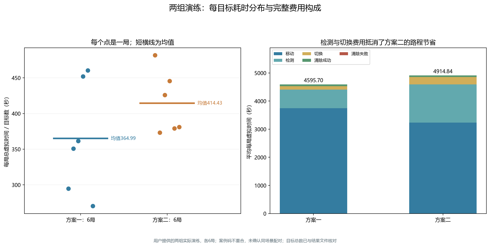
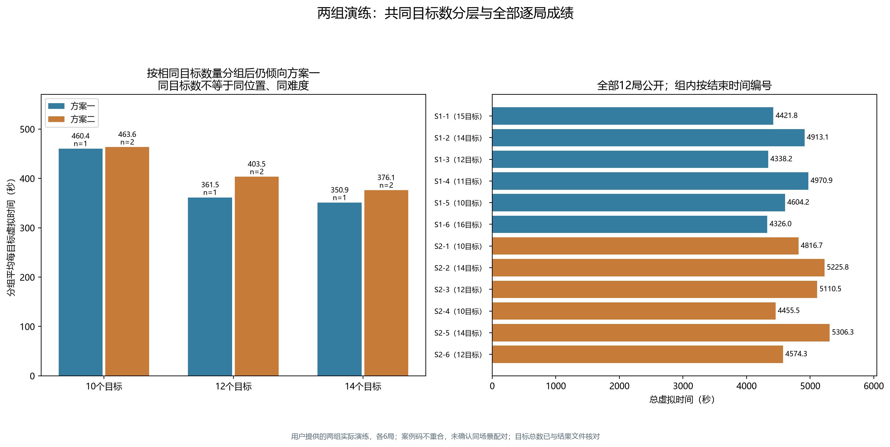

# 方案一与方案二：用户提供的两组演练评估

评估日期：2026-09-11。范围为用户指定的s1、s2两个目录，各6次演练，共36份文件。本轮只分析已完成测试，不启动新测试，不改动算法或原始文件。

## 1. 判断

当前数据优先支持方案一：两组均6局全清，方案一平均总虚拟时间较低；按每局T/N比较，方案一平均少11.93%。但两组目标数构成不同、案例码不重合，不能把11.93%直接当作算法本身的确定收益。

进一步只比较两组共有的10、12、14目标层，并对这三层等权平均，方案一仍少5.66%。这支持当前优先使用方案一、保留方案二作为对照，但样本仍小，目标位置和接收半径等场景差异未被消除。这里没有获得“方案一普遍更优”或“成功率更高”的证明。

## 2. 这次证据比上次多了什么

每次演练包含一份jlog、一份psum和一份result.json：

- jlog与psum的公开头均标明问题3、演练类型、相同案例码和运行编号；正文仍加密，本轮未解密或验证包签名。
- result.json直接提供`jammer_count`、全向/定向源数量及关联日志包SHA256。12份结果文件中的包哈希均与对应jlog一致。
- 依据同队号和退出时间，12次运行分别唯一关联到本地HTTP明文记录；生成时间与退出响应相差1～2毫秒。组内配置一致，s1确为方案一默认，s2确为方案二14站主布局。
- 对每局核对“官方结果文件目标总数＝成功清除的不同频道数”，12局全部相等，且全部正常退出。两组分别清除78和72个目标，共150个，均为全向源。
- 重算2605个不同动作的移动、检测、切换及清除费用，与服务器逐次虚拟时钟在0.001秒容差内一致。两组均无重试或通信异常。

因此，这12局的全清判断已与模拟器导出的目标总数交叉核对，不再仅依靠程序自身的不存在证书。结果仍属于演练，不是正式测试成绩；文件之间及本地记录之间的一致性校验，不等同于官方数字签名验真。

## 3. 主要结果

设第i局总虚拟时间为T_i，官方结果文件中的目标总数为N_i。本页主要报告各局T_i/N_i的算术平均，另外保留总时间、总路程及费用分项。T_i/N_i包括搜索、定位、清除的全部费用。

| 指标 | 方案一 s1 | 方案二 s2 |
|---|---:|---:|
| 演练局数 | 6 | 6 |
| 全清且正常退出 | 6/6 | 6/6 |
| 成功清除目标总数 | 78 | 72 |
| 平均每局目标数 | 13 | 12 |
| 平均总虚拟时间（秒） | 4595.698 | 4914.840 |
| 各局每目标时间的均值（秒） | 364.989 | 414.429 |
| 各局每目标时间的中位数（秒） | 356.224 | 403.535 |
| 最大总虚拟时间（秒） | 4970.921 | 5306.260 |
| 平均路程（米） | 18727.657 | 16154.201 |
| 平均检测次数 | 131.833 | 273.000 |
| 平均切换次数 | 125 | 259 |
| 平均专门追加测向次数 | 16.667 | 1 |
| 失败清除总次数 | 2 | 0 |
| 本地平均程序时间（秒） | 1.518 | 1.300 |

方案一平均每局少319.142秒，即总时间低6.49%；每局每目标时间的均值低49.440秒，即11.93%。方案一的两次失败清除都来自有限方格覆盖，已计入费用，之后成功清除了目标；没有带完整覆盖证书的清除失败。

若采用另一种加权口径“合计时间/合计目标”，两组为353.515和409.570秒。该值对目标更多的局赋予更大权重，不能与上述每局等权均值混称或只挑差异更大的口径报告。

## 4. 可比性检查：目标数量并不平衡

方案一的目标数为10、11、12、14、15、16，各1局；方案二为10、12、14，各2局。固定搜索成本会被更多目标分摊，因此直接比较T/N仍可能受到目标数构成影响。12个案例码全部不同，没有可确认的同场景配对，不能按文件顺序计算“六局对战胜率”。

两组共同目标数分层结果如下。每一层均为方案一1局、方案二2局：

| 目标数 | 方案一平均T/N（秒） | 方案二平均T/N（秒） | 方案一相对减少 |
|---:|---:|---:|---:|
| 10 | 460.419 | 463.608 | 0.69% |
| 12 | 361.514 | 403.535 | 10.41% |
| 14 | 350.934 | 376.145 | 6.70% |

对共同的三个目标数层等权平均，结果为390.956和414.429秒，方案一减少5.66%。这个计算只使用方案一3局、方案二6局，是分层敏感性分析，不是同场景比较，也不能代表10～16全部目标数上的无偏平均效果。

作为样本不确定性的辅助检查，在独立样本近似下，原始T/N均值差“方案一减方案二”为−49.440秒，探索性Welch 95%区间约为[−134.346,35.466]秒，跨过0。样本量仅各6局，且未确认随机分配、目标数分布也不同，因此不能据此宣称方案一总体显著更快，更不能将该区间解释成纯算法因果效应区间。

## 5. 为什么方案二路程更短，总费用反而更高

| 平均分项（秒/局） | 方案一 | 方案二 | 方案二减方案一 |
|---|---:|---:|---:|
| 移动 | 3745.531 | 3230.840 | −514.691 |
| 检测 | 659.167 | 1365.000 | +705.833 |
| 切换 | 125.000 | 259.000 | +134.000 |
| 清除成功 | 65.000 | 60.000 | −5.000 |
| 清除失败 | 1.000 | 0.000 | −1.000 |
| 合计 | 4595.698 | 4914.840 | +319.142 |

方案二平均少走2573.455米，约节省514.691秒移动时间，但增加的检测与切换共839.833秒。扫描获得更多信息、减少后续追加测向的收益，在这组运行中不足以抵消固定扫描开销。

方案二本组没有失败清除，T/N样本标准差43.984秒，低于方案一的78.422秒。但两组目标数构成不同，不能据此断言方案二普遍更稳定或更可靠。就已核对的全清结果而言，两组都是6/6，尚未拉开完成率差异。



## 6. 全部逐局数据

组内按结束时间顺序编号；各局均已清除全部目标。

| 编号 | 案例码 | 目标数 | 总虚拟时间（秒） | T/N（秒） | 检测次数 | 失败清除 |
|---|---|---:|---:|---:|---:|---:|
| S1-1 | 3ZZU-E2GU-MGNT-8VNW | 15 | 4421.805 | 294.787 | 123 | 0 |
| S1-2 | N4DC-GJKT-ACSH-36E3 | 14 | 4913.070 | 350.934 | 130 | 1 |
| S1-3 | RMNS-APTK-D5UV-M9AC | 12 | 4338.168 | 361.514 | 124 | 0 |
| S1-4 | 8JYD-AQKN-NQ8Y-K8RQ | 11 | 4970.921 | 451.902 | 148 | 0 |
| S1-5 | GZNA-9DK4-K9SM-ZJQ7 | 10 | 4604.192 | 460.419 | 152 | 1 |
| S1-6 | XU63-YVNP-MJ2B-RTQB | 16 | 4326.032 | 270.377 | 114 | 0 |
| S2-1 | 4HXX-WDAY-UJR9-B7JV | 10 | 4816.654 | 481.665 | 271 | 0 |
| S2-2 | VPPX-944E-PF3G-YHT4 | 14 | 5225.789 | 373.271 | 275 | 0 |
| S2-3 | WWEW-QGFP-ZABZ-47X8 | 12 | 5110.524 | 425.877 | 273 | 0 |
| S2-4 | FVXF-BZD6-AT2W-PGEB | 10 | 4455.505 | 445.550 | 271 | 0 |
| S2-5 | F5UA-35TK-RTYM-XF35 | 14 | 5306.260 | 379.019 | 276 | 0 |
| S2-6 | 9QDY-39K6-EAX8-XKNR | 12 | 4574.310 | 381.193 | 272 | 0 |



## 7. 下一步选择

当前优先保留方案一作为主要候选。方案二已验证能在这些场景中完成清除，且路线较短，继续作为对照有价值。若后续优化方案一，首先评估总路程；若优化方案二，重点评估哪些固定站/频道检测可以凭可靠证据省略，而不是单纯减少已很少的追加测向。

继续比较时，两方案应预先固定版本和取样规则，交替进行更多演练，按相同目标数分层报告，并保留失败或中断。若没有官方支持的同场景重放能力，不应声称实现了真实同场景对照；已有本地构造的同场景结果可以单独作为补充证据。

此前30个本地同场景构造也倾向方案一，但其场景分布是人为构造，不能与这12局实际演练混合后声称“42局官方验证”。本轮没有执行新演练、正式测试或算法修改。

## 8. 复现与文件

- [结构化结果与63项来源哈希](../../results/tables/第三问/两组演练评估_s1_s2.json)
- [评估脚本](../../scripts/evaluate_q3_practice_groups.py)
- [每目标时间与费用SVG](../../results/figures/第三问/两组演练_每目标时间与费用.svg)
- [分组与逐局结果SVG](../../results/figures/第三问/两组演练_同目标数分组与逐局结果.svg)

在仓库根目录执行：

```powershell
.venv/Scripts/python.exe -X utf8 scripts/evaluate_q3_practice_groups.py
```

脚本需要用户给定的s1/s2三件套及本机对应HTTP日志。原始文件与含队号/票据的内容不入库，脱敏的结论、统计和图表入库；仅克隆仓库无法重新取得这些本机私有输入。
