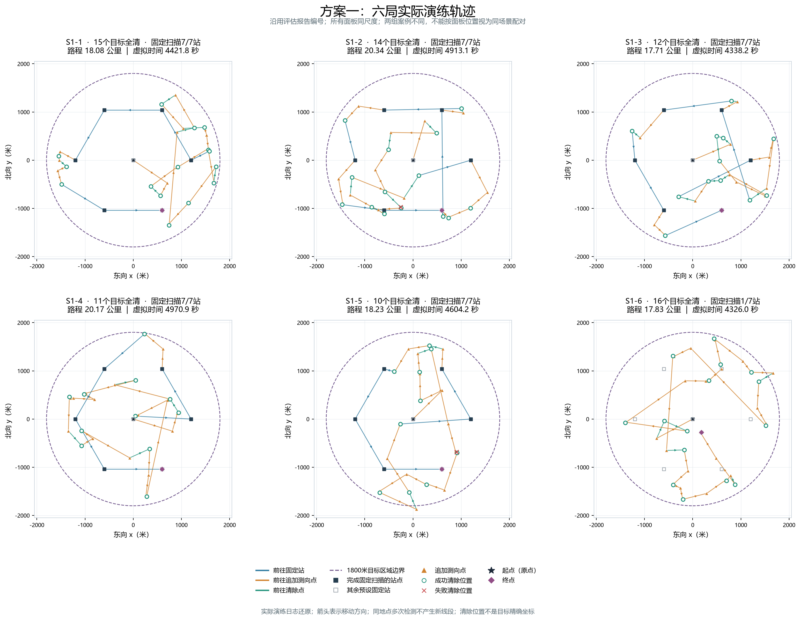
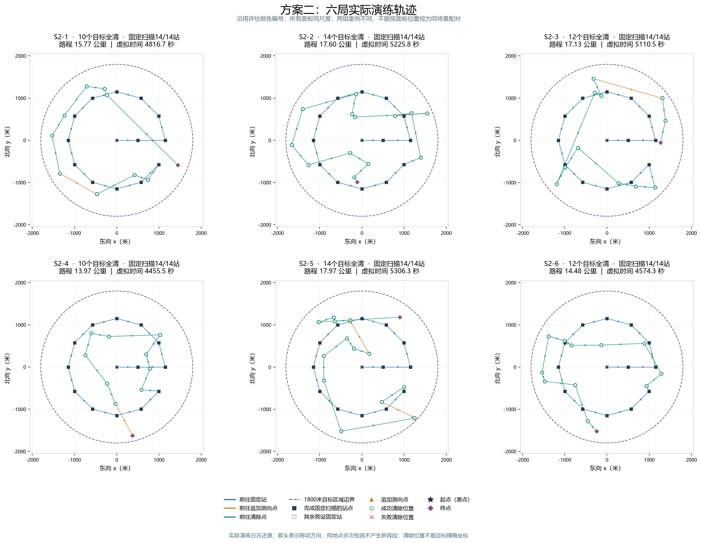

# 十二局实际演练轨迹

数据范围：此前s1/s2各6局，沿用S1-1至S2-6编号。图中使用已经核验关联的本地HTTP实际动作坐标，不是新运行或构造轨迹。

## 读图方式

- 蓝线：前往固定站；橙线：前往追加测向点；绿线：前往清除点。颜色按该段终点动作归类。
- 箭头表示较长移动段的行进方向；按动作顺序连线，同地点多次检测不产生新线段，不添加返回原点路线。
- 实心方块是完成固定扫描的站点，空心方块是其余预设固定站（可能被用作追加测向点）；三角形是追加测向点；绿色空心圆是成功清除位置，红叉是失败清除位置。
- 黑色星形为原点起点，紫色菱形为最后一个动作的位置；单局图的站号从0开始。
- 虚线圆半径1800米，表示目标所在区域，不是机器狗的移动限制。清除标记是机器狗的位置，不代表目标精确坐标。
- 所有面板使用相同坐标范围及等比例坐标轴；案例不同，左右或上下相邻面板不是配对实验。

## 方案一：六局总览

## 方案二：六局总览

## 单局高清图

| 编号 | 案例码 | 目标数 | 路程（公里） | 固定扫描完成数 | PNG | SVG |
|---|---|---:|---:|---:|---|---|
| S1-1 | 3ZZU-E2GU-MGNT-8VNW | 15 | 18.084 | 7/7 | [查看](../../results/figures/第三问/实际演练轨迹/S1-1_实际轨迹.png) | [矢量图](../../results/figures/第三问/实际演练轨迹/S1-1_实际轨迹.svg) |
| S1-2 | N4DC-GJKT-ACSH-36E3 | 14 | 20.335 | 7/7 | [查看](../../results/figures/第三问/实际演练轨迹/S1-2_实际轨迹.png) | [矢量图](../../results/figures/第三问/实际演练轨迹/S1-2_实际轨迹.svg) |
| S1-3 | RMNS-APTK-D5UV-M9AC | 12 | 17.711 | 7/7 | [查看](../../results/figures/第三问/实际演练轨迹/S1-3_实际轨迹.png) | [矢量图](../../results/figures/第三问/实际演练轨迹/S1-3_实际轨迹.svg) |
| S1-4 | 8JYD-AQKN-NQ8Y-K8RQ | 11 | 20.175 | 7/7 | [查看](../../results/figures/第三问/实际演练轨迹/S1-4_实际轨迹.png) | [矢量图](../../results/figures/第三问/实际演练轨迹/S1-4_实际轨迹.svg) |
| S1-5 | GZNA-9DK4-K9SM-ZJQ7 | 10 | 18.231 | 7/7 | [查看](../../results/figures/第三问/实际演练轨迹/S1-5_实际轨迹.png) | [矢量图](../../results/figures/第三问/实际演练轨迹/S1-5_实际轨迹.svg) |
| S1-6 | XU63-YVNP-MJ2B-RTQB | 16 | 17.830 | 1/7 | [查看](../../results/figures/第三问/实际演练轨迹/S1-6_实际轨迹.png) | [矢量图](../../results/figures/第三问/实际演练轨迹/S1-6_实际轨迹.svg) |
| S2-1 | 4HXX-WDAY-UJR9-B7JV | 10 | 15.773 | 14/14 | [查看](../../results/figures/第三问/实际演练轨迹/S2-1_实际轨迹.png) | [矢量图](../../results/figures/第三问/实际演练轨迹/S2-1_实际轨迹.svg) |
| S2-2 | VPPX-944E-PF3G-YHT4 | 14 | 17.599 | 14/14 | [查看](../../results/figures/第三问/实际演练轨迹/S2-2_实际轨迹.png) | [矢量图](../../results/figures/第三问/实际演练轨迹/S2-2_实际轨迹.svg) |
| S2-3 | WWEW-QGFP-ZABZ-47X8 | 12 | 17.133 | 14/14 | [查看](../../results/figures/第三问/实际演练轨迹/S2-3_实际轨迹.png) | [矢量图](../../results/figures/第三问/实际演练轨迹/S2-3_实际轨迹.svg) |
| S2-4 | FVXF-BZD6-AT2W-PGEB | 10 | 13.973 | 14/14 | [查看](../../results/figures/第三问/实际演练轨迹/S2-4_实际轨迹.png) | [矢量图](../../results/figures/第三问/实际演练轨迹/S2-4_实际轨迹.svg) |
| S2-5 | F5UA-35TK-RTYM-XF35 | 14 | 17.971 | 14/14 | [查看](../../results/figures/第三问/实际演练轨迹/S2-5_实际轨迹.png) | [矢量图](../../results/figures/第三问/实际演练轨迹/S2-5_实际轨迹.svg) |
| S2-6 | 9QDY-39K6-EAX8-XKNR | 12 | 14.477 | 14/14 | [查看](../../results/figures/第三问/实际演练轨迹/S2-6_实际轨迹.png) | [矢量图](../../results/figures/第三问/实际演练轨迹/S2-6_实际轨迹.svg) |

## 可从图中直接核对的情况

S1-6仅完成站0的固定扫描，通过后续自适应定位及顺路检测清除了16个目标，按题目上限结束。其余6个预设固定站画为空心；其中站2曾用于频道20追加测向及其他频道顺路检测，但没有执行该站完整固定扫描。空心不等于从未到达。没有用预设七站折线替代实际轨迹。

方案二六局均访问全部14个固定站。蓝色固定扫描路线相似，后续清除路线随本局观测而变化；这不代表六局目标位置相同。

S1-5部分动作位于1800米圆外，按真实记录保留，未裁剪到目标区域内。路线交叉只能说明几何路径交叉，不能单凭图判断某段必然可省。

## 复现与核验

每局重新累加从原点到各检测/清除位置的直线距离，与已核验运行总路程相差小于0.00001米；核对检测、成功/失败清除次数及固定扫描完成记录。原始输入哈希与此前评估一致。

[脱敏轨迹数据与来源哈希](../../results/tables/第三问/十二局实际演练轨迹.json)包含完整检测/清除位置、次序和虚拟时刻，供队友重绘；不含队号、票据或目标真值。

在仓库根目录执行`.venv/Scripts/python.exe -X utf8 scripts/plot_q3_practice_trajectories.py`即可从已归档脱敏数据重绘。加`--refresh-source`可重新读取本机原始运行结果并校验，需保留原始私有输入。

[绘图脚本](../../scripts/plot_q3_practice_trajectories.py)；[原始评估报告](两组演练评估_s1_s2.md)；[优化建议](基于两组演练的优化建议.md)。
