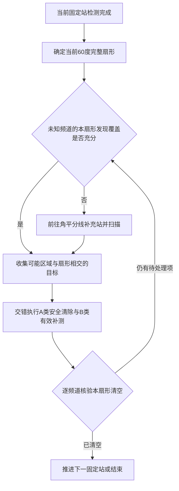

# 扇形清空规则与覆盖补充（待实施）

日期：2026-09-11。依据用户最新要求，将“相邻固定站附近”明确替换为“相邻站对应圆心角的完整扇形”，本扇形清空后才推进至下一固定站。本文件取代上一版关于附近范围、归属评分及允许带本段遗留任务前进的规则；仅更新设计，尚未修改运行程序。

## 1. 扇形的严格定义

搜索圆圆心为O、半径为1800米；外圈固定站到O的距离为1200米。以正东为0°，暂沿用逆时针站序。当前站与下一站的径向射线、1800米圆弧围成当前扇形。

$$S_i=\{O+r(\cos\theta,\sin\theta):0\le r\le1800,\ 60(i-1)^\circ\le\theta\le60i^\circ\},\quad i=1,\ldots,6.$$

即0°—60°、60°—120°、120°—180°、180°—240°、240°—300°、300°—360°。最后一块是东南站至东方射线的扇形。中央初始检测不产生单独扇形，因为圆心没有径向方向。

扇形包含从圆心到1800米边界的全部区域，不是两站连线附近的带状区域，也不是半径1200米以内的三角形。路线费用只用于排列本扇形内的处理动作，不再决定目标是否属于本扇形。

相邻扇形按闭集处理，共享径向边界；边界附近的可能目标允许进入相邻两块的检查清单，已清除频道统一跳过，从而避免边界漏管和重复清除。几何容差采取保守相交判定。


图为解析构造示意，不是新策略实际轨迹。[SVG矢量图](../../results/figures/第三问/扇形清空_边界与补充扫描.svg)。

## 2. A/B类目标的处理责任

令F为某频道根据全部历史观测得到的保守可能区域。

- 若F与当前扇形没有交集，可留至对应后续扇形；这必须由区域排除证据支持。
- 若F与当前扇形相交且已属于A类，优先在当前阶段安全清除。即使只有边界附近的小部分相交，也不能仅因估计圆心位于外侧而跳过。
- 若F与当前扇形相交且属于B类，继续补测，直到能够安全清除，或新的实际观测证明F与本扇形无交集。

A类仍以找到覆盖整个F的19.5米清除证书为标准；多次观测未达此精度仍属于B类。

**不能因为在处理S_i，就擅自把F替换为F∩S_i来提高定位精度。** 真实目标仍可能在扇形外；相交只用于确定处理责任，清除安全性必须对完整可能区域检查。新增观测后，只有真实反馈支持的约束才能收缩F。

“扇形清空”是任务验收条件，不限制机器人每个补测位置必须在扇形内。为形成有效测向交角，可能需要局部跨边界运动；但不能因此把当前扇形的未完成任务留到环行结束之后。

## 3. 必须补上未知目标的发现覆盖

只清除当前已发现目标，不能证明真实扇形已经清空。第一扇形中，在半径1800米、极角50°处放置一个构造目标：它距中心1800米，距当前东方站1379.55米。当接收半径为允许的最低1000米时，中心和东方站都可能没有发现它。

因此，若严格执行用户要求，还需要在进入下一固定站之前完成本扇形对尚未发现频道的接收覆盖。不能提前使用下一站尚未取得的观测作为证据。

一个确定可行的补充发现站为扇形角平分线上、距圆心1200米的位置：

$$M_i=O+1200\bigl(\cos(60i-30)^\circ,\sin(60i-30)^\circ\bigr).$$

第一块的补充站为M=(1039.230485,600)米。中心O与M联合覆盖整个0°—60°扇形，其最坏最近距离为968.901572米，小于最低接收半径1000米，也小于程序可靠候选采用的999.5米余量。

连续覆盖证明：记目标极角相对角平分线为φ，|φ|≤30°。半径r≤900米的点由中心覆盖。对900≤r≤1800，有

$$d_M^2=r^2+1200^2-2400r\cos\varphi.$$

它在角度边界|φ|=30°处最大；固定角度后关于r为凸二次式，故径向区间内最大值在r=900或1800处。两端距离分别为615.942471和968.901572米。因此整个扇形都在O或M的1000米接收圆内。最外端的径向边界点达到968.901572米，故该界也是联合覆盖的最大最近距离。旋转可得其他五块同样成立。

这里的900米只是证明分段，未另设清理区域。证明只保证发现覆盖，不保证M的一次测向就能将所有B类变成A类。

## 4. 扫描与清除的闭环

1. 中心首次扫描按原计划完成，保存各频道结果。
2. 到达当前外圈固定站后完成计划内检测，建立当前扇形的A/B待处理清单。
3. 检查各未知频道是否已有足以覆盖本扇形的无信号观测证据；需要补充时前往M_i，扫描这些频道。已发现B类在可靠且有价值时可共用此站测向；已清除频道跳过。
4. 利用现有全部信息，交错安排A类清除、B类补测和新发现目标处理。每次动作取得真实反馈后重新规划。
5. 核验当前扇形清空，再推进下一固定站。最后一块也执行同样检查；全部完成后无需强制返回东方站或中心。

对每个频道，离开本扇形前必须至少满足以下一项：已成功清除；已知目标的可能区域与扇形无交集；该频道已有足够的无信号接收圆联合覆盖本扇形，从而排除扇形内存在该频道目标。保守判据不能确认时继续处理，不能将“暂时没有检测到”写成“已经清空”。

中心与M_i提供一个可直接使用的充分覆盖构造。若已有实际观测站能证明完成同等覆盖，可以省略M_i；若清空和全局完成条件提前满足，也不强制访问剩余站点。按完整构造使用六个M_i时，名义扫描站由原来的7个增加到13个，另可能需要自适应定位补测站。



预算或几何困难不能把扇形自动标为清空；应采用允许的本地后续定位/有限覆盖回退，预算耗尽则如实报告未完成。当前尚未证明在所有允许场景和现实限时内都能完成该严格规则。

## 5. 费用与后续验证

第一段仅比较固定站连线：当前站→M→下一站比当前站→下一站增加42.331416米。该数字不包括扫描、频道切换、定位和清除费用，不是总体优化收益。六个补充发现站会增加检测成本，必须与减少大范围返回的收益一起比较。

下一版以本扇形清空作为推进条件，原400米绕行门槛不再允许否决必需的本扇形处理。路线优化在该条件下减少站间移动、共享补测位置和排列清除次序。未知目标覆盖与A/B定位测向是不同任务，日志和图表应分别记录。

本地成对验证应检查：扇形判定及360°接缝、边界跨区目标的完整清除证书、每次推进前逐频道清空证据、遗漏目标数、总虚拟时间、额外扫描费用及是否仍有跨区返回。此时不能沿用“只改变目标排列，仍然仅七站扫描”的描述，也不能预先宣称比当前版更快。

解析核算、网格交叉复核与图表来源保存在[几何核算JSON](../../results/tables/第三问/扇形清空_几何核算.json)。重绘和检查命令：

```powershell
.venv/Scripts/python.exe -X utf8 scripts/build_q3_sector_design.py
.venv/Scripts/python.exe -X utf8 scripts/build_q3_sector_design.py --check
```

本次未实现扇形调度、未运行新策略或模拟器，未修改原算法和配置。
