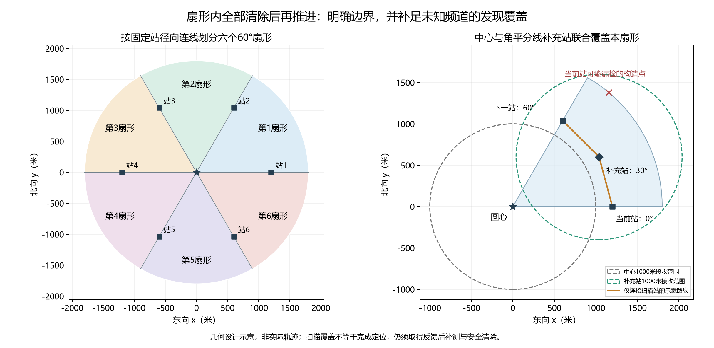
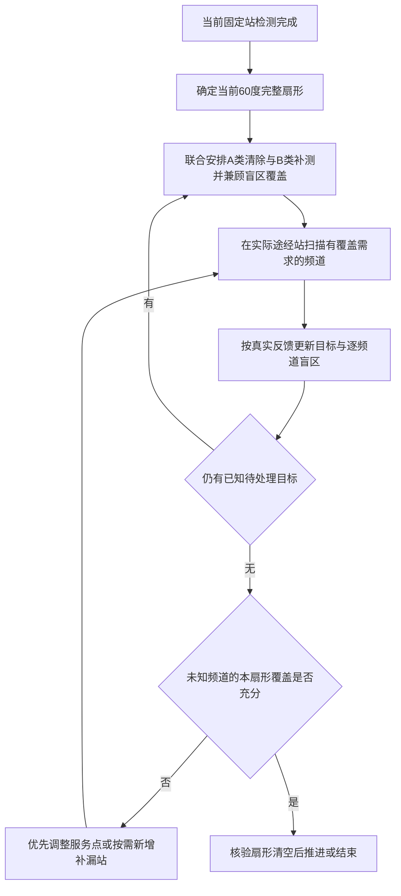

# 扇形清空规则与覆盖补充（设计存档）

**用户已撤回本设计的运行应用，当前恢复路线版。** 见[回退说明](撤回扇形版_恢复路线版.md)。以下为此前设计和实施过程存档。

当前状态：已完成实现及120次成对构造验证，见[实现与运行](扇形版_实现与运行.md)、[验证与结果](扇形版_验证与结果.md)。本文件保留当时的设计与几何计算，文件名沿用历史名称；实际行为以实现说明为准。

设计日期：2026-09-11。依据用户要求，将“相邻固定站附近”明确替换为“相邻站对应圆心角的完整扇形”，本扇形清空后才推进至下一固定站。本设计取代上一版关于附近范围、归属评分及允许带本段遗留任务前进的规则。

最新修订：按用户减少额外设站、复用途中智能站的要求，保留原七个固定站，优先共享已有测向站及清除位置；仅在实际覆盖检查仍存在缺口时按需补站。文中的角平分线位置保留为几何可行备选，不预设六个新增必经站，也不把圆心附近预定为补漏位置。

## 1. 扇形的严格定义

搜索圆圆心为O、半径为1800米；外圈固定站到O的距离为1200米。以正东为0°，暂沿用逆时针站序。当前站与下一站的径向射线、1800米圆弧围成当前扇形。

$$S_i=\{O+r(\cos\theta,\sin\theta):0\le r\le1800,\ 60(i-1)^\circ\le\theta\le60i^\circ\},\quad i=1,\ldots,6.$$

即0°—60°、60°—120°、120°—180°、180°—240°、240°—300°、300°—360°。最后一块是东南站至东方射线的扇形。中央初始检测不产生单独扇形，因为圆心没有径向方向。

扇形包含从圆心到1800米边界的全部区域，不是两站连线附近的带状区域，也不是半径1200米以内的三角形。路线费用只用于排列本扇形内的处理动作，不再决定目标是否属于本扇形。

相邻扇形按闭集处理，共享径向边界；边界附近的可能目标允许进入相邻两块的检查清单，已清除频道统一跳过，从而避免边界漏管和重复清除。几何容差采取保守相交判定。



图为一个可行覆盖构造示意，不表示每个扇形必须新增此站，也不是新策略实际轨迹。[SVG矢量图](../../results/figures/第三问/扇形清空_边界与补充扫描.svg)。

## 2. A/B类目标的处理责任

令F为某频道根据全部历史观测得到的保守可能区域。

- 若F与当前扇形没有交集，可留至对应后续扇形；这必须由区域排除证据支持。
- 若F与当前扇形相交且已属于A类，优先在当前阶段安全清除。即使只有边界附近的小部分相交，也不能仅因估计圆心位于外侧而跳过。
- 若F与当前扇形相交且属于B类，继续补测，直到能够安全清除，或新的实际观测证明F与本扇形无交集。

A类仍以找到覆盖整个F的19.5米清除证书为标准；多次观测未达此精度仍属于B类。

**不能因为在处理S_i，就擅自把F替换为F∩S_i来提高定位精度。** 真实目标仍可能在扇形外；相交只用于确定处理责任，清除安全性必须对完整可能区域检查。新增观测后，只有真实反馈支持的约束才能收缩F。

“扇形清空”是任务验收条件，不限制机器人每个补测位置必须在扇形内。为形成有效测向交角，可能需要局部跨边界运动；但不能因此把当前扇形的未完成任务留到环行结束之后。

## 3. 必须补上未知目标的发现覆盖

只清除当前已发现目标，不能证明真实扇形已经清空。第一扇形中，在半径1800米、极角50°处放置一个构造目标：它距中心1800米，距当前东方站1379.55米。当接收半径为允许的最低1000米时，中心和东方站都可能没有发现它。

因此，若严格执行用户要求，还需要在进入下一固定站之前完成本扇形对尚未发现频道的接收覆盖。不能提前使用下一站尚未取得的观测作为证据。

优先复用实际途中站。若仍缺少覆盖，一个确定可行的备选补充发现站为扇形角平分线上、距圆心1200米的位置：

$$M_i=O+1200\bigl(\cos(60i-30)^\circ,\sin(60i-30)^\circ\bigr).$$

第一块的补充站为M=(1039.230485,600)米。中心O与M联合覆盖整个0°—60°扇形，其最坏最近距离为968.901572米，小于最低接收半径1000米，也小于程序可靠候选采用的999.5米余量。

连续覆盖证明：记目标极角相对角平分线为φ，|φ|≤30°。半径r≤900米的点由中心覆盖。对900≤r≤1800，有

$$d_M^2=r^2+1200^2-2400r\cos\varphi.$$

它在角度边界|φ|=30°处最大；固定角度后关于r为凸二次式，故径向区间内最大值在r=900或1800处。两端距离分别为615.942471和968.901572米。因此整个扇形都在O或M的1000米接收圆内。最外端的径向边界点达到968.901572米，故该界也是联合覆盖的最大最近距离。旋转可得其他五块同样成立。

这里的900米只是证明分段，未另设清理区域。证明只保证发现覆盖，不保证M的一次测向就能将所有B类变成A类。

### 3.1 盲区在何处，以及为何不能统一在圆心附近补站

只使用中心与当前东方站、最低1000米接收半径时，半径不超过1000米的中心区域已经被初始扫描覆盖。第一扇形的漏检部分位于更外侧、靠下一站一边，外圆从极角约31.59°开始不在当前站覆盖内。

对上述条件进行径角积分，盲区面积约337442.61平方米，占完整60°扇形的19.89%。这个数字是尚无途中观测时的几何基准，不是各局实际遗留比例；智能补测站、实际更大的接收半径均可能减小盲区。未知目标可以出现在盲区内，不能只按盲区面积较小就判定无目标。

对于距圆心h米的补充站，到半径1800米外圆任一点的距离至少为1800−h。若h<800米，则该站在1000米接收半径下无法到达任何外圆点。例如距圆心300米的站，到外圆最近仍需1500米。因此中心附近设站可以因定位交角而有价值，但不能统一用来保证外围补漏；站位应由实际剩余盲区决定。

核算采用角度θ下当前站接收圆的径向上交点r_+=1200cosθ+√(1000²−1200²sin²θ)，仅在判别式非负时使用。盲区角向面积密度为[1800²−min(1800,max(1000,r_+))²]/2；没有交点时按整段1000—1800米径向区间漏检积分。该数值不是定位或路线算法性能测试。

## 4. 扫描与清除的闭环

1. 中心首次扫描按原计划完成，保存各频道结果。
2. 到达当前外圈固定站后完成计划内检测，建立当前扇形的A/B待处理清单。
3. 优先联合安排本来需要执行的B类补测、A类清除。选择测向点时，同时考虑定位效果、当前至下一站的完整服务费用，以及该点对未知频道剩余盲区的覆盖贡献；可小幅调整计划中的测向点以兼顾两项任务，不提前强制前往M_i。
4. 到达这些位置时，按频道补充有必要的扫描，复用相同移动；清除动作本身不产生其他频道检测证据。维护每个未知频道的本扇形剩余盲区，已清除频道跳过，已证明本扇形不存在的频道无需为覆盖重复扫描。新发现频道进入A/B处理流程，每次反馈后重规划。
5. 准备推进时检查仍存在的实际覆盖缺口。优先利用尚待执行或可调整的服务点；只有仍不足时才增加面向剩余盲区的补漏站，选择能完成覆盖且总费用较低的位置。M_i仅作可行备选，实际合适的站可以更接近现有路线。
6. 核验当前扇形清空，再推进下一固定站。最后一块也执行同样检查；全部完成后无需强制返回东方站或中心。

对每个频道，离开本扇形前必须至少满足以下一项：已成功清除；已知目标的可能区域与扇形无交集；该频道已有足够的无信号接收圆联合覆盖本扇形，从而排除扇形内存在该频道目标。保守判据不能确认时继续处理，不能将“暂时没有检测到”写成“已经清空”。

中心与M_i提供一个充分覆盖构造，但不再把全套13站作为待实施默认方案。实际新增补漏站可能为零；不能未经反馈和覆盖验收就预先保证整圈最多只需要一个新增位置，定位所需站数也另受观测几何影响。

必须按频道核算：一个位置仅检测了频道甲，不能自动将它的1000米圆加入其他频道的无信号排除证据。当前程序的顺路检测默认每次至多4个频道，并有距既有测点600米的筛选；下一版需对尚缺覆盖的频道显式安排扫描，不能假定现有智能设站机制已经实现全频道补漏。仍记录真实检测和切换费用。



预算或几何困难不能把扇形自动标为清空；应采用允许的本地后续定位/有限覆盖回退，预算耗尽则如实报告未完成。当前尚未证明在所有允许场景和现实限时内都能完成该严格规则。

## 5. 费用与后续验证

第一段仅比较固定站连线：当前站→M→下一站比当前站→下一站增加42.331416米。该数字不包括扫描、频道切换、定位和清除费用，不是总体优化收益。复用已有位置可以减少新增移动，但同站扫描仍有检测和切换成本，必须与减少大范围返回的收益一起比较。

下一版以本扇形清空作为推进条件，原400米绕行门槛不再允许否决必需的本扇形处理。路线优化在该条件下减少站间移动、共享补测位置和排列清除次序。未知目标覆盖与A/B定位测向是不同任务，日志和图表应分别记录。

本地成对验证应检查：扇形判定及360°接缝、边界跨区目标的完整清除证书、每次推进前逐频道清空证据、遗漏目标数、总虚拟时间、额外扫描费用及是否仍有跨区返回。分别记录原七固定站、定位所需站、复用站扫描与纯补漏新增站的数量；不能把保留七个固定站描述成全程只在七处检测，也不能预先宣称比当前版更快。

解析核算、网格交叉复核与图表来源保存在[几何核算JSON](../../results/tables/第三问/扇形清空_几何核算.json)。重绘和检查命令：

```powershell
.venv/Scripts/python.exe -X utf8 scripts/build_q3_sector_design.py
.venv/Scripts/python.exe -X utf8 scripts/build_q3_sector_design.py --check
```

本次未实现扇形调度、未运行新策略或模拟器，未修改原算法和配置。
