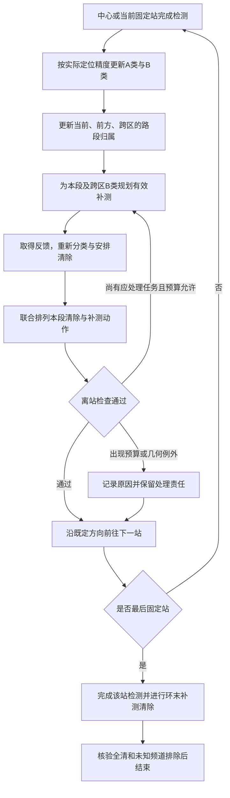

# 按用户思路细化：单向环行与站间清除方案

日期：2026-09-11。状态：供用户审核的下一版设计，尚未修改或运行策略。

后续用户已将“附近区域”明确指定为两站径向射线对应的完整扇形；当前设计以[扇形清空规则与覆盖补充](扇形清空规则与覆盖补充_待实施.md)为准。下文保留上一轮讨论记录，其中附近归属评分和允许带本段未完成任务前进的建议不再采用。

## 1. 本轮采用的主线

按用户提出的流程，将固定站之间的路段作为处理单元：完成当前站检测后，对已发现目标分类，给需要定位的目标安排补测，将适合当前路段的目标清除，再前往下一站。重点防止上方已经发现的目标被留到下半圈完成之后再返回处理。

方向暂沿用当前轨迹的中心→东→东北→西北→西→西南→东南，即逆时针。用户同时提到顺时针，本方案将其理解为强调始终沿同一方向推进；若最终选择顺时针，反转外圈站序即可应用同样的调度规则。方向选择本身不保证缩短路程。

主设计目标是完成一次环向推进时尽量全清，不再形成大范围反向清理。固定站访问次序保持单向；局部补测和清除允许小范围横向、径向移动，不能要求每一小段运动的极角都严格增加。

## 2. 保留A/B分类，按清除精度判定

| 类别 | 程序判据 | 下一步 |
|---|---|---|
| A：已可安全清除 | 找到一个清除位置，使整个当前保守目标区域到该点的最远距离不超过19.5米 | 按所属路段安排清除 |
| B：已发现但尚不能安全清除 | 已有正观测，但没有满足上述条件的清除位置 | 继续安排有效补测 |
| 未知频道 | 尚无正观测，也没有完整不存在证据 | 继续原有固定扫描与排除流程 |

B再记录为“只有一次方向观测”和“多次观测仍不够精确”，方便解释和调度，但都不能直接清除。观测次数不作为A/B转换标准：一次近距离反馈也可能已经可清除，两次方向观测也可能仍不够精确。

已有反例见[折返诊断](方案一折返诊断与下一版路线建议.md)：S11-5频道11在第二次正观测后外包覆盖圆半径仍为23.94米，S11-2频道8为21.55米，均超过19.5米。补测后的A/B状态必须由实际反馈更新，不能预先假定“再测一次必然成为A”。

## 3. 将“中间附近区域”变成可执行判断

设当前固定站为S，下一个为N；实际当前位置为P，处理一个目标后P会变化，不能始终当作还在S。

对目标区域及可安全清除位置，结合沿外圈路线的先后位置、到本路段的距离和插入路线的总费用，划分三个调度状态：

1. **当前路段目标**：适合在S→N这一段处理，或现在已经位于过去路段但尚未处理。列入本段待完成清单。
2. **前方目标**：目标区域明确位于后续路段，后面本来就会接近。明确指定后续处理路段，避免一发现就跨区追赶。
3. **跨区或位置仍不明确的目标**：可能位于当前与后续区域，不能只根据一条示向射线或外包圆心归类。优先补测缩小区域，再更新所属路段。

外圈按单向进度展开，起点附近采用跨周处理，避免将最后路段邻近东方的目标错误判为最早路段遗留。靠近中心的目标不宜仅按极角分类，改用与实际路径的接近程度和处理费用判断。几何区域用于归属和预测，最终清除点仍需完整证书。

关键离站规则：**本段待完成清单中的A类目标应先清除；可能因离站而被留在身后的B类目标应先补测并尽力在本地完成。** 已明确归于未来路段的目标必须有具体处理计划，不能笼统地延后到全局扫描结束。

## 4. A类怎样清除

收集本段A类及已经处于后方的A类，比较它们的服务次序和安全清除位置。目标少时枚举小组顺序，较多时采用受时间预算限制的插入和局部改进；不宣称全局最短。

例如可以安排P→清除甲→清除乙→N，而不是处理一个就返回S。可清除位置通常是一个小区域，不必强制到达估计圆心，可以在仍满足19.5米证书的范围内选择更适合接续路线的位置。

明确位于前方的A类保留至相应路段；实际途中如果出现更省路的服务机会，允许提前清除。对当前及后方A类，不再允许仅因贪心插入尾段更方便而默认留到最后。

## 5. B类怎样在站间转成A类

遵循用户“主动补测后再评估”的思路：新发现、跨区，以及本段即将错过的B类先进入补测候选队列。能确认适合后续路段处理的前方B类，允许指定后续站或路段补测；这是为避免把所有远处B类都立即追到完成定位而增加路程的细化。若是否应延后无法确定，优先补测消除归属不确定性。

选点不固定在S和N的中点，也不只看是否落在连线上，而是联合比较：

**P→候选补测点Q→按可能反馈继续定位或清除→N。**

候选点首先从当前路段及邻近区域生成，再加入原有几何构造候选；必须满足可靠接收条件，并有助于改变测向几何。沿第一次观测的方向前后移动，可能使两次方向仍接近共线，不能仅因为顺路就采用。

评分计入整段移动、检测、切换、后续定位清除与接到N的费用，比较时采用共同的终点和任务范围。预测只能使用已取得的观测区域；有限反馈角采样属于规划近似，实际清除安全另行检查。

反馈后处理如下：

- 已达A标准：立刻重新判断归属，本段或后方目标接着清除，明确在前方的目标纳入对应路段。
- 仍为B且属于本段、后方或归属不清：在预算内继续选择有效补测点，不因已经取得两次观测就强制停止。
- 明确应在前方处理：保存具体处理路段及延后理由，到达该路段必须重新检查。

多个B类可以共用补测站，但每个频道分别检测和付费，并分别检查可靠接收与定位效果；不存在合适公共站时分开安排。每次新反馈后更新全部受影响的计划，不预先执行未经证实的后续清除。

## 6. 离站检查与环末处理

出发去N前，执行一次明确的检查：

1. 本段和后方A类是否已经清除？
2. 本段、后方及跨区B类是否已补测并处理，或者存在明确的预算/几何例外？
3. 暂留前方的目标是否逐个指定了后续处理路段？
4. 是否仍在按计划推进未知频道的覆盖搜索？

400米不再作为所有B类的统一否决线。对可能被留在身后的目标，比较当下完整服务与后续返回的费用；动作次数及现实时间仍有上限。若方向补测迟迟不足，可以在费用和预算允许时采用已有有限覆盖方法在当地完成；否则记录例外，保留最终处理机制，不掩饰为已经实现一圈全清。

中心检测后至东站单独作为初始路段。最后一个外圈站之后增加环末检查，处理该处首次发现的目标及东南至东方交界目标；不能一到最后固定站就把所有任务转为反向清理。环末的东方位置只作规划参照，全部目标已清除且未知频道已有排除证据后即可结束，不为画出闭合圆额外回到东站或中心。

图中的补测与清除会交错执行；若没有待补测B类，直接服务A类并检查离站。尚未全清时不能把环末检查画成自动成功，执行中仍受预算和既有异常处理约束。

## 7. 预期效果与验证顺序

S11-5的左上频道11应在左上/左侧阶段进入本段或即将错过的B类，追加测向后当地清除；S11-2的上方频道8、17也不应无明确后续窗口地留至下方扫描结束。这些是下一版要验证的行为，不是已经取得的新成绩。

一次环行结束时全清是优化目标，尚不是一般性保证。首次发现可能发生在最后站，第二次测向可能不足，固定站一次覆盖本身也不保证所有目标在走过其附近之前已被发现。允许必要的局部移动，优先减少跨区域大返回。

后续实施分三步：先增加A/B精度状态、路段归属与离站检查；再加入补测/清除/下一站的联合选点与动作排序；最后完善环末处理和诊断图。保留当前版作为对照，在同一组本地场景中比较全清率、总虚拟时间、总路程、末段路程、延后到末段的早发现目标数及现实规划时间，并用独立场景复核。不将模拟器旧日志的最终清除位置当作未知目标真值重放。

本次仅保存设计及流程，不更改策略、参数或历史成果，不启动模拟器。
