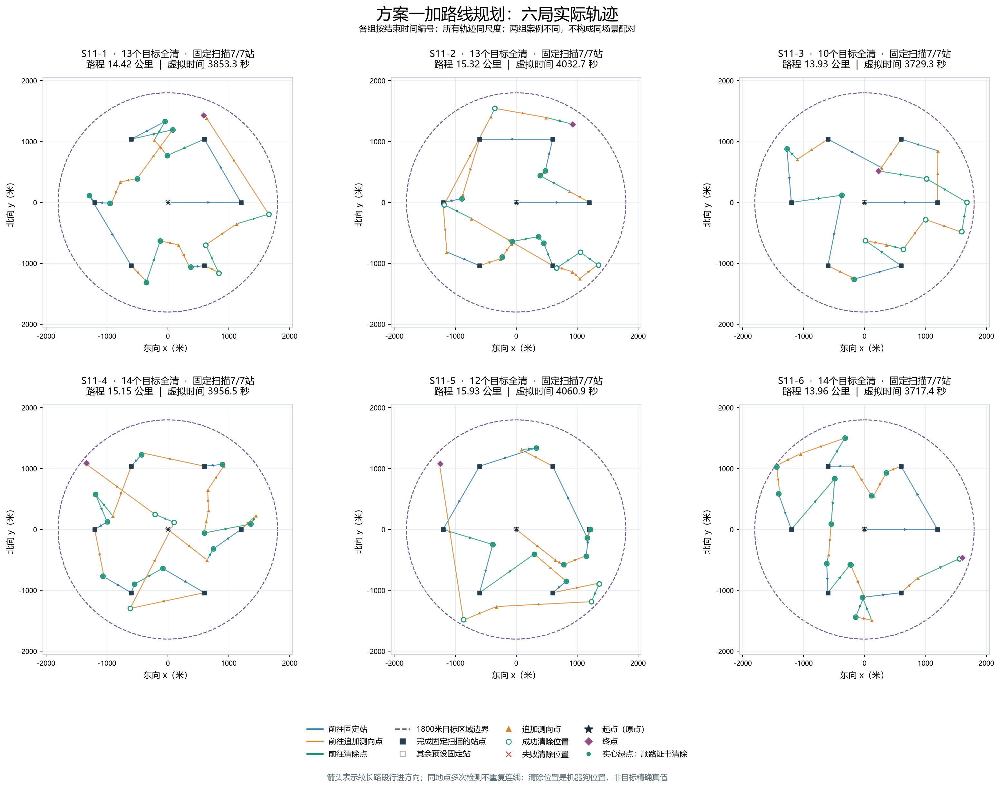
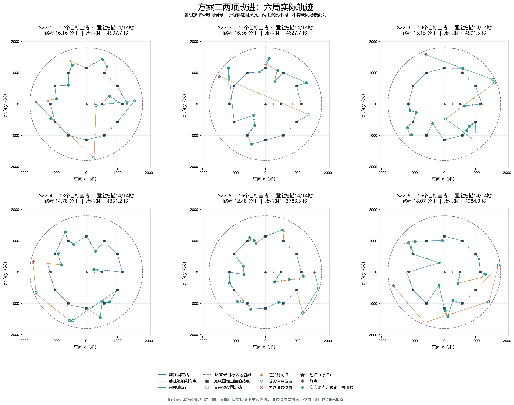

# 新版十二局实际演练轨迹：s11 / s22

本页对应用户提供的s11、s22各6局，按各组结束时间编号。s11为方案一加路线规划，s22为方案二同时启用路线规划与停止重复扫描。所有图均由实际请求/反馈核对后的动作坐标还原，原12局s1/s2图表保留不变。

## 读图方式

- 蓝线前往固定站，橙线前往追加测向点，绿线前往清除点。颜色按该段终点动作归类，不表示目标类别。
- 较长线段的箭头表示行进方向，同位置的多次检测不重复连线；不人为闭合路线或添加返回原点的路程。
- 绿色空心圆为成功清除位置，圆内实心绿点表示顺路证书清除；红叉表示失败清除。清除位置是机器狗的位置，不是目标精确真值。
- 方块为固定站，实心表示该站完成固定扫描，空心表示其余预设固定站；三角形为追加测向点。黑星为起点，紫菱形为终点。
- 虚线圆半径1800米，为目标所在区域；机器狗可以在圆外行动。所有轨迹使用±2050米的同一坐标范围与等比例坐标轴。
- 本组方案一六局均完成7站，方案二六局均完成14站；固定站次序保持，目标清除穿插其中。两组案例不同，相同面板位置不是同场景配对。

## 方案一：六局总览

## 方案二：六局总览

## 十二张单局高清图

| 编号 | 案例码 | 目标数 | 路程/公里 | 顺路证书清除数 | PNG | SVG |
|---|---|---:|---:|---:|---|---|
| S11-1 | UVP8-5SDC-HBJJ-3T9Z | 13 | 14.417 | 9 | [查看](../../results/figures/第三问/新版演练轨迹/S11-1_实际轨迹.png) | [矢量图](../../results/figures/第三问/新版演练轨迹/S11-1_实际轨迹.svg) |
| S11-2 | 5UJC-D4K8-25A5-HZCS | 13 | 15.319 | 7 | [查看](../../results/figures/第三问/新版演练轨迹/S11-2_实际轨迹.png) | [矢量图](../../results/figures/第三问/新版演练轨迹/S11-2_实际轨迹.svg) |
| S11-3 | 2KYU-9DPZ-PPCD-S9Z3 | 10 | 13.931 | 3 | [查看](../../results/figures/第三问/新版演练轨迹/S11-3_实际轨迹.png) | [矢量图](../../results/figures/第三问/新版演练轨迹/S11-3_实际轨迹.svg) |
| S11-4 | JW4Z-UQK6-ZHGF-WHAU | 14 | 15.148 | 10 | [查看](../../results/figures/第三问/新版演练轨迹/S11-4_实际轨迹.png) | [矢量图](../../results/figures/第三问/新版演练轨迹/S11-4_实际轨迹.svg) |
| S11-5 | ARA6-EN2E-RUNQ-ERGS | 12 | 15.930 | 8 | [查看](../../results/figures/第三问/新版演练轨迹/S11-5_实际轨迹.png) | [矢量图](../../results/figures/第三问/新版演练轨迹/S11-5_实际轨迹.svg) |
| S11-6 | T374-2CE8-5ZJU-7Z4B | 14 | 13.962 | 12 | [查看](../../results/figures/第三问/新版演练轨迹/S11-6_实际轨迹.png) | [矢量图](../../results/figures/第三问/新版演练轨迹/S11-6_实际轨迹.svg) |
| S22-1 | 5B4D-3TKH-VQTJ-6ABH | 12 | 16.163 | 8 | [查看](../../results/figures/第三问/新版演练轨迹/S22-1_实际轨迹.png) | [矢量图](../../results/figures/第三问/新版演练轨迹/S22-1_实际轨迹.svg) |
| S22-2 | JW43-9F9G-AZKR-QWAV | 11 | 16.358 | 9 | [查看](../../results/figures/第三问/新版演练轨迹/S22-2_实际轨迹.png) | [矢量图](../../results/figures/第三问/新版演练轨迹/S22-2_实际轨迹.svg) |
| S22-3 | DXZP-H2NQ-U9BR-WEJH | 14 | 15.152 | 9 | [查看](../../results/figures/第三问/新版演练轨迹/S22-3_实际轨迹.png) | [矢量图](../../results/figures/第三问/新版演练轨迹/S22-3_实际轨迹.svg) |
| S22-4 | FVG3-EZKG-8YAU-W5ZM | 13 | 14.776 | 9 | [查看](../../results/figures/第三问/新版演练轨迹/S22-4_实际轨迹.png) | [矢量图](../../results/figures/第三问/新版演练轨迹/S22-4_实际轨迹.svg) |
| S22-5 | 8JCW-2QQH-N6CX-8SYH | 16 | 12.477 | 13 | [查看](../../results/figures/第三问/新版演练轨迹/S22-5_实际轨迹.png) | [矢量图](../../results/figures/第三问/新版演练轨迹/S22-5_实际轨迹.svg) |
| S22-6 | 9BH3-82QJ-6ZBX-4W9J | 16 | 18.070 | 12 | [查看](../../results/figures/第三问/新版演练轨迹/S22-6_实际轨迹.png) | [矢量图](../../results/figures/第三问/新版演练轨迹/S22-6_实际轨迹.svg) |

S22-3保留一次有限方格搜索失败的红叉及后续成功清除位置。S22-5与S22-6均为16个目标，但路程相差约5.59公里，图中按实际记录保留；同目标数并不代表同场景。

路线交叉、折返或最后阶段的较长路程，不能单凭轨迹图判定为完全可省。是否可以延后或改换测向位置，还需结合当时已经获得的观测与清除证书。

## 数据与复现

[完整评估报告](新版演练评估_s11_s22.md)；[脱敏完整轨迹](../../results/tables/第三问/新版十二局实际轨迹_s11_s22.json)；[图表来源与哈希](../../results/tables/第三问/新版演练图表清单_s11_s22.json)。

从仓库根目录执行`.venv/Scripts/python.exe -X utf8 scripts/plot_q3_routed_practice.py`即可读取已归档的脱敏数据重绘，不需要本机原始私有日志。

如要重新提取数据，先执行`scripts/evaluate_q3_routed_practice.py`，需要本机s11/s22三件套与已关联的HTTP日志，并保留原s1/s2来源用于核对历史对照哈希；该操作只读取现有文件，不启动演练。

[绘图脚本](../../scripts/plot_q3_routed_practice.py)；[数据提取及核验脚本](../../scripts/evaluate_q3_routed_practice.py)。
