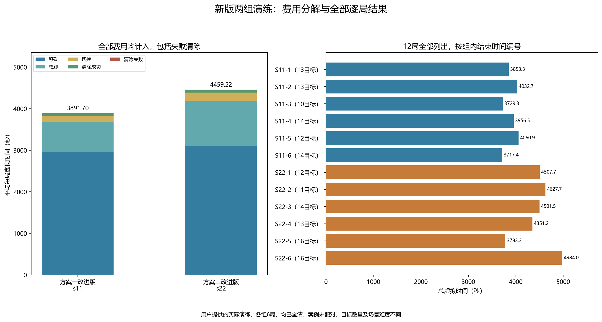
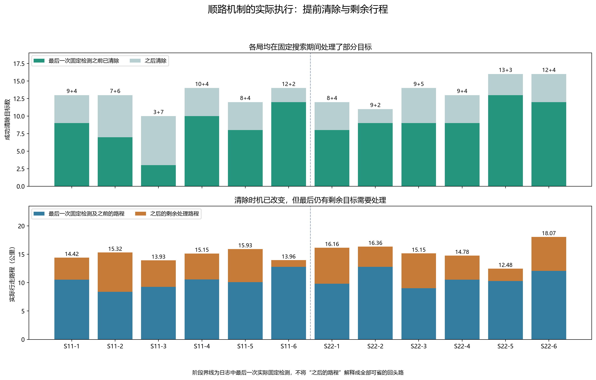
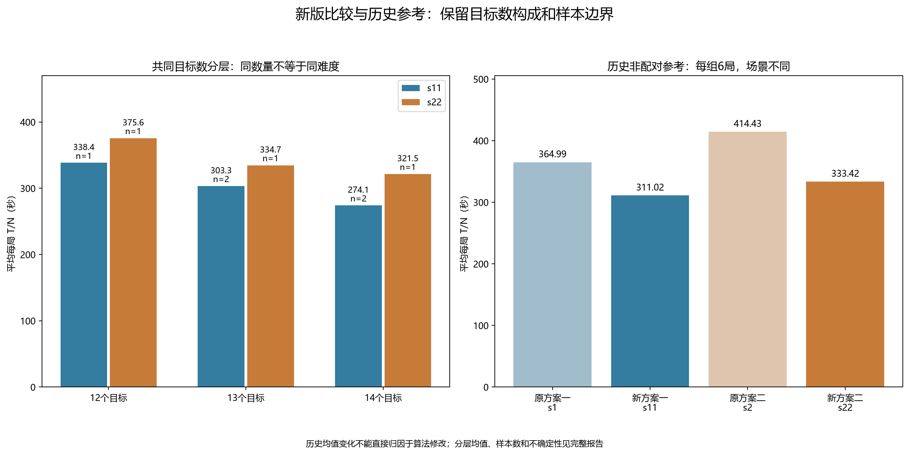

# 新版两组实际演练评估：s11 / s22

评估日期：2026-09-11。用户指定s11与s22各6局，共36份测试文件。本轮只分析已完成演练、绘制实际轨迹，不修改策略或原始文件，不启动新演练或正式测试。

## 1. 结论

本组数据仍倾向方案一：s11为加入路线规划的方案一，s22为同时启用路线规划与停止重复扫描的方案二。两组均6/6全清，分别清除76与82个全向干扰源，共158个；所有运行正常退出。

方案一平均总时间3891.697秒，方案二4459.224秒，前者低12.73%。按各局总时间除以本局目标数后再平均，分别为311.016与333.423秒，方案一低6.72%。在共有的12、13、14目标层等权比较，方案一低11.25%。两组案例码不重合，不能将这些比例直接理解为同场景下的确定算法收益。

顺路调度确实执行：方案一有49/76个目标、方案二有60/82个目标在最后一次固定检测之前清除，分别占64.47%和73.17%。方案二已经不再等到14站全部检测结束后才处理这些目标。完整轨迹见[12张单局图与两张总览](新版十二局实际轨迹_s11_s22.md)。

## 2. 证据核对与版本识别

- 每局jlog、psum公开头和result.json中的问题号、案例码、演练编号一致，均为问题3演练；结果JSON中的包SHA256与对应jlog一致。正文未解密，也未进行数字签名验证。
- 每局通过同队号及退出响应时间唯一关联到本地HTTP明文记录，日志生成时间与退出响应相差1—2毫秒。脱敏输出不保留队号、票据或密钥封装。
- 12局成功清除的不同频道数均与模拟器结果JSON中的目标总数一致，并核对程序完成状态及正常退出。
- 独立重算2364个不同请求响应动作的费用，其中2340次为实际检测/清除。将这2340次请求中的位置、频道、反馈和虚拟时钟与绘图动作逐条核对；行走路程误差小于0.00001米，逐动作虚拟时间误差小于0.001秒。无重试或通信异常。
- 两组运行配置分别与当前改进版默认JSON逐项一致，日志包含路线重规划与延后决策；s22同时记录定位证书和跳过固定检测。运行结果未记录源码提交号，因此这里按配置和实际行为识别版本，不把它解释为对运行时源码字节的反向证明。

完整结构化结果保存66项来源哈希。上述核对证明所提供文件与本地行为的一致性，不等同于解密读取官方目标位置，也不等同于官方签名验真。

## 3. 主要指标

T为一局从进入至退出的总虚拟时间，N为该局结果JSON中的目标总数。以下T/N按每局等权平均；移动、检测、切换及成功/失败清除费用均计入T。

| 指标 | 方案一改进版 s11 | 方案二改进版 s22 |
|---|---:|---:|
| 演练局数、全清局数 | 6、6 | 6、6 |
| 清除目标总数 | 76 | 82 |
| 平均每局目标数 | 12.667 | 13.667 |
| 平均总虚拟时间/秒 | 3891.697 | 4459.224 |
| 平均每局T/N/秒 | 311.016 | 333.423 |
| 每局T/N中位数/秒 | 303.309 | 328.120 |
| 每局T/N样本标准差/秒 | 39.175 | 62.330 |
| 最大总虚拟时间/秒 | 4060.916 | 4984.035 |
| 平均路程/米 | 14784.319 | 15499.455 |
| 平均检测次数 | 146.500 | 217.000 |
| 平均频道切换次数 | 139.000 | 205.500 |
| 平均专门追加测向次数 | 10.167 | 8.000 |
| 失败清除总次数 | 0 | 1 |
| 平均程序运行时间/秒 | 1.500 | 2.060 |

若采用“合计时间/合计目标”的另一加权口径，结果为307.239与326.285秒。该口径对目标数更多的局赋予更大权重，不与上面的每局等权均值混称。程序运行时间与虚拟任务时间也分别报告。

## 4. 为什么本组方案一更快

| 平均费用/秒 | s11 | s22 | s22减s11 |
|---|---:|---:|---:|
| 移动 | 2956.864 | 3099.891 | 143.027 |
| 检测 | 732.500 | 1085.000 | 352.500 |
| 切换 | 139.000 | 205.500 | 66.500 |
| 清除成功 | 63.333 | 68.333 | 5.000 |
| 清除失败 | 0.000 | 0.500 | 0.500 |
| 合计 | 3891.697 | 4459.224 | 567.527 |

本组方案二平均多走715.136米，增加143.027秒移动费用；同时多70.5次检测和66.5次频道切换，增加419秒费用。这两部分构成主要差距。方案二平均目标多1个，因此不能只凭总时间差判断算法纯效率；下一节按目标数进行敏感性比较。



## 5. 同目标数量比较

s11的目标数为10、12、13、13、14、14；s22为11、12、13、14、16、16。两组共同目标数如下：

| 目标数 | s11样本数 | s22样本数 | s11平均T/N/秒 | s22平均T/N/秒 | s11相对降低 |
|---:|---:|---:|---:|---:|---:|
| 12 | 1 | 1 | 338.410 | 375.641 | 9.91% |
| 13 | 2 | 1 | 303.309 | 334.706 | 9.38% |
| 14 | 2 | 1 | 274.069 | 321.535 | 14.76% |

三层等权均值为305.263与343.960秒，方案一低11.25%。这里使用s11的5局和s22的3局，控制了目标数量层的权重，仍未控制目标位置、接收半径和实际测向误差等场景差异。不能按照文件顺序计算“六场对战胜率”。

全部12局原始T/N均值差“s11减s22”为−22.407秒。在近似独立样本假设下，探索性Welch 95%区间为[−91.120,46.306]秒，跨过0；各组仅6局且未确认随机分配，不据此宣称方案一总体显著更快或给出算法因果结论。

## 6. 顺路机制实际做了什么

| 执行指标 | s11 | s22 |
|---|---:|---:|
| 路线重规划总次数 | 199 | 260 |
| 延后目标决策总次数 | 26 | 52 |
| 顺路证书清除目标总数 | 49 | 60 |
| 末次固定检测前清除比例 | 64.47% | 73.17% |
| 末次固定检测后剩余清除目标总数 | 27 | 22 |
| 末次固定检测后平均路程/米 | 4511.333 | 4751.971 |
| 因已定位而记录的跳过固定检测次数 | 不适用 | 26 |

本组每局均完成全部预设固定站，但清除穿插于站间。图中的实心绿点对应顺路证书清除；这与“先跑完所有站，再回去清除所有目标”的行为不同。

s22的26次跳过只统计“已经定位、尚未清除”的频道在后续站被跳过；提前清除后的频道也不再扫描，但不会计入这26条记录。因此，不能用26次来衡量全部减少扫描的效果，也不能把它与旧日志的370次潜在机会直接作同场景差分。

末次固定检测之后仍有较长行程：S11-2剩余6个目标，后续走6.933公里；S22-1剩余4个目标，后续走6.363公里；S22-6剩余4个目标，后续走6.002公里。这是后续研究最终处理顺序与跨站延后的切入点，但这些路程包含必要定位和清除移动，不能全部视为可省回头路。



S22-5、S22-6同为16个目标，总时间分别3783.304与4984.035秒，相差1200.730秒；路程相差5593.652米，其移动费用差为1118.730秒，约占总时间差93.17%。这说明本组较大的场次波动主要体现在行走距离，但两场目标位置不同，不能把该差额直接认定为调度错误。

唯一失败清除发生于S22-3：频道9执行有限方格覆盖，步骤342在虚拟时刻4492.485506秒清除失败，随后继续搜索并成功清除，总任务于4501.485506秒结束。该动作没有完整覆盖证书，失败费用已计入；12局没有带完整覆盖证书的清除失败。方案一另有两次有限方格搜索在首次尝试就成功，有限搜索本身不等于清除失败。

## 7. 与前一批原版s1/s2的历史参考

下表是不同场景、不同批次的描述性变化，不是修改前后的同场景配对实验。

| 比较 | 原版平均T/秒 | 新版平均T/秒 | 平均T降低 | 原版平均T/N/秒 | 新版平均T/N/秒 | 共同目标层等权T/N降低 |
|---|---:|---:|---:|---:|---:|---:|
| 方案一：s1→s11 | 4595.698 | 3891.697 | 15.32% | 364.989 | 311.016 | 15.98% |
| 方案二：s2→s22 | 4914.840 | 4459.224 | 9.27% | 414.429 | 333.423 | 10.58% |

方案一的共同层为10、12、14目标，使用新版4局、原版3局；方案二共同层为12、14目标，使用新版2局、原版4局。按各局T/N直接平均，新版分别低14.79%和19.55%；尤其方案二原版平均12个目标、新版平均13.667个目标，目标数分摊效应会影响这个百分比，不能只挑19.55%作为“算法提升率”。

方案一平均路程由18.728公里变为14.784公里，检测由131.833次变为146.500次；方案二平均路程由16.154公里变为15.499公里，检测由273次变为217次。变化方向与路线调度、提前清除和停止重复扫描的预期一致，但没有识别各机制的单独实际净收益。

原始T/N的历史Welch区间，方案一新版减原版为[−137.790,29.844]秒，方案二为[−151.470,−10.543]秒。后者虽未跨0，仍受到目标数构成和不同场景的混杂，不能解释成方案二优化的因果显著性证明。



## 8. 全部逐局结果

编号按各组结束时间排列。12局均全清，S22-3的有限搜索失败保留在费用与轨迹中。

| 编号 | 案例码 | 目标数 | 总时间/秒 | T/N/秒 | 路程/公里 | 检测 | 顺路证书清除 |
|---|---|---:|---:|---:|---:|---:|---:|
| S11-1 | UVP8-5SDC-HBJJ-3T9Z | 13 | 3853.310 | 296.408 | 14.417 | 152 | 9 |
| S11-2 | 5UJC-D4K8-25A5-HZCS | 13 | 4032.735 | 310.210 | 15.319 | 152 | 7 |
| S11-3 | 2KYU-9DPZ-PPCD-S9Z3 | 10 | 3729.284 | 372.928 | 13.931 | 150 | 3 |
| S11-4 | JW4Z-UQK6-ZHGF-WHAU | 14 | 3956.525 | 282.609 | 15.148 | 144 | 10 |
| S11-5 | ARA6-EN2E-RUNQ-ERGS | 12 | 4060.916 | 338.410 | 15.930 | 137 | 8 |
| S11-6 | T374-2CE8-5ZJU-7Z4B | 14 | 3717.413 | 265.529 | 13.962 | 144 | 12 |
| S22-1 | 5B4D-3TKH-VQTJ-6ABH | 12 | 4507.689 | 375.641 | 16.163 | 204 | 8 |
| S22-2 | JW43-9F9G-AZKR-QWAV | 11 | 4627.655 | 420.696 | 16.358 | 219 | 9 |
| S22-3 | DXZP-H2NQ-U9BR-WEJH | 14 | 4501.486 | 321.535 | 15.152 | 235 | 9 |
| S22-4 | FVG3-EZKG-8YAU-W5ZM | 13 | 4351.177 | 334.706 | 14.776 | 224 | 9 |
| S22-5 | 8JCW-2QQH-N6CX-8SYH | 16 | 3783.304 | 236.457 | 12.477 | 203 | 13 |
| S22-6 | 9BH3-82QJ-6ZBX-4W9J | 16 | 4984.035 | 311.502 | 18.070 | 217 | 12 |

## 9. 下一步与资料

当前可继续把方案一作为主要候选，方案二保留为对照。进一步优化宜针对“最后剩余少数目标但行程较长”的局，核查目标被延后时的信息状态，以及是否能将追加测向与后续固定站结合；方案二还需比较提前追加测向的费用与等待下一固定站反馈的收益。仅凭现有轨迹不能确定最优阈值，本轮未据此调整算法或消耗测试机会。

- [12张高清轨迹与2张总览](新版十二局实际轨迹_s11_s22.md)
- [统计、逐局数据与66项来源哈希](../../results/tables/第三问/新版演练评估_s11_s22.json)
- [脱敏完整行动坐标](../../results/tables/第三问/新版十二局实际轨迹_s11_s22.json)
- [论文备用段落](../../paper/sections/第三问_新版实际演练评估_论文备用段落.md)
- [数据评估脚本](../../scripts/evaluate_q3_routed_practice.py)、[绘图脚本](../../scripts/plot_q3_routed_practice.py)、[验收脚本](../../scripts/verify_q3_routed_practice.py)

在仓库根目录运行`python`时，使用项目虚拟环境：

```powershell
Set-Location 'D:\mywork\code\cumcm2026-b'
.\.venv\Scripts\python.exe -X utf8 scripts/plot_q3_routed_practice.py
.\.venv\Scripts\python.exe -X utf8 scripts/verify_q3_routed_practice.py
```

以上命令从仓库内脱敏数据重绘和验收。重新提取时先运行`scripts/evaluate_q3_routed_practice.py`，再绘图；需要本机s11/s22三件套及对应HTTP日志，并保留原s1/s2来源以核对历史对照哈希。验收增加`--with-source`可重新读取并核对这些私有输入。原始文件不上传，原版12局报告与轨迹保留。
