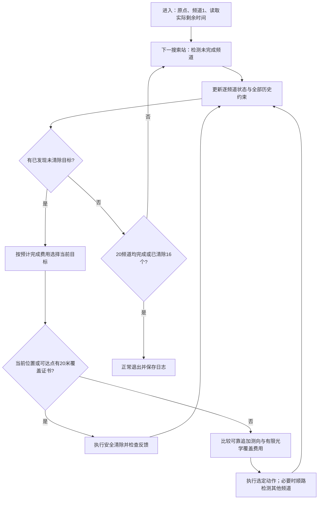

# 方案一：实现与使用说明

本页保留原版基线逻辑与历史验证记录。当前入口默认启用路线规划，不再要求每站清完全部已知目标；请先看[当前实现与使用说明](路线调度_实现与使用说明.md)。在运行命令中追加`--no-route-planning`可恢复本页所述原版行为。

版本日期：2026-09-11。这是七站搜索加自适应定位清除的第一套完整实现，支持本地构造运行与已就绪的本机HTTP接口。当前只完成本地运行、真实HTTP传输的自建服务测试，尚未连接官方模拟器。

## 1. 当前程序的实际流程

机器狗从原点开始，按原点及半径1200米正六边形的七站顺序推进。在每个搜索站完成尚未清除、尚未排除频道的检测后，处理当前已发现目标，再进入下一个搜索站。已知目标的处理有有限测向预算和有限光学覆盖回退，因此不会无止境搁置未发现频道。

每个频道记录unknown（未发现且可能存在）、found（已发现待清除）、cleared（已清除）、absent（已证明不存在）四种状态。负观测仅排除该频道的1000米圆；七个固定站均无信号可提供解析不存在证书，其他站的无信号还可通过保守四叉树提供充分覆盖证书。有限格点抽查不作为不存在证明。



near反馈使当前位置成为安全清除点，立即原地处理。找到10个目标或处理完已知目标都不会单独触发退出；只有20频道均清除/证明不存在，或已清除16个不同频道时，才有全部完成证据。

## 2. 多次观测几何与清除证书

第一问角域半平面构造函数保持不变。第三问单独使用±1.005°半宽，显式包含接口两位小数舍入可能带来的0.005°余量。每次正向观测都与全部既有角域相交，并加1500米接收上限，初始还包含1800米目标圆约束。

圆约束用128个外切半平面形成保守外包。半径r的圆最大外伸约为r(sec(π/128)−1)，1500米圆约0.452米；它是外包误差，不是把真实圆缩小。真实目标仍包含在多边形中。无信号和清除失败的圆形排除区域单独保存，不把有孔集合当凸域使用；当前可靠接收和安全清除主要依据保守凸外包。

最小覆盖圆由多边形顶点的1/2/3个支持点枚举得到。若某点到全部外包顶点的最远距离不超过19.5米，则整个凸外包都在20米清除范围内。19.5米用于留出0.5米执行/数值裕度；它不是赛题清除半径的改写。实际清除位置沿当前位置到最小覆盖圆心的线段寻找首个安全点，从而减少不必要移动，但不宣称该点是全体安全清除点中的全局最近点。

不能用D≤40米替代覆盖圆判据；等边三角形反例已进入回归测试。若声称有证书的清除仍失败，程序记录异常并停止，不吞掉模型或协议问题。

## 3. 追加站点与时间评价

候选来源包括第二问中心线透镜候选的内缩点、当前区域主轴/侧向的多尺度位置和七个搜索站。每次都对当前全部历史外包重新检查：最远可能目标距离≤999.5米、最近距离>5.5米，才作为保证方向反馈的候选。初始中心射线可能落在目标圆外而角楔仍相交，这时跳过不适用的透镜构造，继续用其他候选。

对每个候选，先由凸域可见角范围得到可能观测区间，再采样9个观测角，每个分支与全部历史外包相交。默认最多评价24个候选，规划预算0.8秒。

评分为移动时间＋检测5秒＋必要的切换1秒＋分支后续清除费用的采样最大值。后续费用来自明确可执行的动作：小区域直接去安全圆清除，其他区域按20米方格蛇形光学覆盖计算最坏费用。观测角只作有限采样，因而该评分不是连续最坏值证书，也不是全局动态规划解；实际动作的可靠性和清除证书独立核查。

当前目标采用预计完成费用较小者优先，每次只执行一个动作再更新。当前版本尚未实现全局路径2-opt、全任务两步前瞻、共享未知接收半径的联合推断，不能把总体设计中的这些候选优化写成已经实现。

## 4. 顺路检测与有限回退

默认开启顺路检测。在追加测向的新位置，最多顺路检测4个其他频道：距该频道已测位置至少600米；已发现频道还需通过可靠接收检查。优先已发现目标及检测较少的频道。该规则是时间启发式，不替代七站的完整覆盖责任。

如果追加测向没有更低的预测费用，或一个目标已用满8次专门追加测向，就对当前外包旋转包围盒进行20米方格覆盖。每格保留中心，任意格内点到中心≤10√2米，依次尝试至成功；即使清除失败，也记录正确的3秒费用并继续。不会只保留中心位于目标域内的格子而丢失边界。

理论分析中首次精确角域可用225点矩形覆盖。实现对保守外包的主轴包围盒自动离散，外切误差及旋转可能改变点数，因此225不是程序硬限制；实际覆盖点数进入日志。完整性仍受现实限时、虚拟限时及通信可用性约束，达到预算时如实标记未完成。

## 5. 本地运行

在仓库根目录执行：

```powershell
.venv/Scripts/python.exe -X utf8 scripts/run_q3_scheme1.py --seed 1 --count 10
```

默认只运行本地构造，结果和请求日志保存在新的local-only/第三问/local-*目录。可选参数：

```powershell
.venv/Scripts/python.exe -X utf8 scripts/run_q3_scheme1.py --count 16 --layout boundary --radius min --error plus
.venv/Scripts/python.exe -X utf8 scripts/run_q3_scheme1.py --no-opportunistic
```

布局包括uniform、boundary、cluster、center；半径包括min、max、mixed；误差包括hash、zero、plus、minus、alternating。hash由种子、频道和坐标确定，同地点误差固定；本地接口也执行两位小数舍入。本地场景分布不是官方分布。

配置文件为[configs/q3_scheme1.json](../../configs/q3_scheme1.json)，可用--config指定另一份配置。--output要求一个尚不存在的目录，防止覆盖已有日志。

## 6. 接入官方演练的运行方式

先由用户在官方模拟器登录并启动“问题3演练测试”，等待接口就绪，然后运行：

```powershell
.venv/Scripts/python.exe -X utf8 scripts/run_q3_scheme1.py --mode http --robot-id "实际参赛队号"
```

端口改变时指定--base-url，例如http://127.0.0.1:2027；也可通过本机CUMCM_ROBOT_ID环境变量传队号。程序不会登录模拟器、选择演练/正式类型或启动新测试，仅连接已经就绪的会话；因此必须以模拟器界面确认正在运行的测试类型。HTTP接口本身不返回是否为正式局，日志不会擅自标为正式成绩。

本轮没有执行这条官方连接命令，没有使用正式机会。默认地址仅允许本机回环HTTP，禁用代理和自动重定向。

## 7. 协议、失败处理与日志

四种动作严格串行，每个新动作使用新UUID前缀与序号。连接中断、响应丢失或服务器内部错误时，最多3次额外重试，保持原路径、完整内容和request_id不变。重试耗尽仍未确认时保留pending，禁止发送新动作；不能把未决清除当失败再换新ID执行。

同时检查HTTP状态和accepted。明确拒绝不改变位置、频道和虚拟时钟；clear只指定清除对象，永不改变测向机当前频道。程序逐步核对移动/检测/切换/清除费用，兼容模拟器微秒级累计。enter的remaining_real_duration_s设置实际截止，预留5秒正常退出；虚拟检测5秒不会转换成现实sleep5秒。

每条请求、响应、异常和策略动作均逐条落盘。正常运行输出运行结果.json和请求响应日志.jsonl，后者可能含参赛队号，所以默认不进Git。中断或预算不足时保留已执行记录，结果中的运行成功=false，不能以有部分清除就报告全部完成。

## 8. 文件职责

| 文件 | 职责 |
|---|---|
| [q3_protocol.py](../../src/cumcm2026_b/q3_protocol.py) | HTTP、幂等、状态、计时与日志 |
| [q3_geometry.py](../../src/cumcm2026_b/q3_geometry.py) | 历史角域外包、圆覆盖、有限覆盖及搜索证书 |
| [q3_strategy.py](../../src/cumcm2026_b/q3_strategy.py) | 七站推进、逐频道状态、选点、清除和调度 |
| [q3_local_env.py](../../src/cumcm2026_b/q3_local_env.py) | 独立本地构造环境；真值只供结束后评估 |
| [run_q3_scheme1.py](../../scripts/run_q3_scheme1.py) | 本地/HTTP统一入口 |
| [build_q3_scheme1_assets.py](../../scripts/build_q3_scheme1_assets.py) | 成组对照与中文图表 |

策略代码没有调用本地环境的真值查询；图表中的真实位置由评估器在运行后读取。现有第一问、第二问源码和原有输出继续保留。
