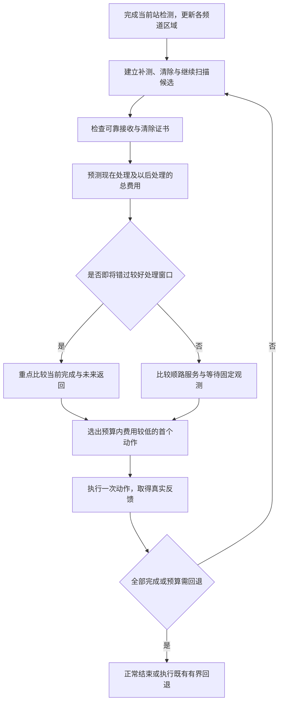

# 方案一折返诊断与下一版路线建议

日期：2026-09-11。状态：根据S11-2、S11-5实际日志提出的设计建议，尚未实施。原策略、配置、历史结果保持原样。

## 1. 结论

仍有优化空间。当前路线模块把目标插入固定站路线，但未精定位目标使用外包圆心预测服务位置，实际追加测向仍按单个目标的完成费用选点，随后才检查是否偏离下一站路线。路线预测与实际测向没有共同优化，也没有比较错过当前机会之后的处理代价。

下一版优先把“测向—清除—衔接下一站”作为一个整体，增加离开当前区域前的延后检查。目标是降低总虚拟时间和远距离返回，不要求所有轨迹绝对不反向。七站发现覆盖不等于七站结束时所有目标均达到清除精度。

## 2. 两张图对应的日志证据

来源为[既有评估](新版演练评估_s11_s22.md)唯一关联的本地HTTP动作记录，抽取结果见[脱敏诊断JSON](../../results/tables/第三问/方案一折返诊断_S11-2_S11-5.json)。下表站序采用程序编号0—6：0为中心，1为右，2为右上，3为左上，4为左，5为左下，6为右下。

| 记录 | 当时信息与实际决策 | 后续结果 |
|---|---|---|
| S11-5，频道11 | 站3首次发现，步骤111预计测向绕行559.31米，超过400米而延后；站4第二次正观测后外包覆盖圆半径23.94米，仍不能按19.5米证书清除 | 步骤129、150又分别以2075.04米、3814.30米绕行延后；最后从下方返回左上，步骤193补测，195清除 |
| S11-5，频道16 | 站5首次发现，步骤148测向绕行414.93米，仅比门槛高14.93米，仍被延后 | 完成站6及右下目标后，再返回左下补测并清除 |
| S11-2，频道17 | 站2首次发现，步骤76预计绕行464.90米，超过门槛而延后 | 最后才返回右上，步骤214补测，216清除 |
| S11-2，频道8 | 站2首次发现并延后；站3正观测后半径21.55米，步骤99预计绕行825.18米，再次延后 | 最后回到上方，步骤209补测，211清除 |

这些是原算法在各自历史状态下记录的候选绕行费用。它们说明门槛造成了处理机会的推迟，但不能把559→2075→3814米之差直接当成改进后的实际节省：当时的观测信息、当前位置、下一站以及候选测向点均可能变化，假设提前测向的反馈也尚未取得。

两个接近完成定位的例子分别为23.94米和21.55米，仍大于当前19.5米阈值。不能依据最终图上的清除位置，反推当时可以直接清除，也不应通过放宽清除证书消除折返。

| 场次 | 总路程 | 末次固定检测后路程 | 占总路程 | 末段清除频道顺序 |
|---|---:|---:|---:|---|
| S11-5 | 15.930公里 | 5.841公里 | 36.67% | 19、5、16、11 |
| S11-2 | 15.319公里 | 6.933公里 | 45.26% | 1、20、9、15、8、17 |

末段路程不等于浪费。例如S11-2的频道1、9分别到步骤174、179，即最后一个固定站6，才首次出现正观测。此前程序没有这两个目标的定位信息，必须留出补测与清除行程。上方早已发现的频道8、17被留到末尾，与这类晚发现目标应分别统计。

## 3. 当前实现为何会出现这种路线

参见[目标路线插入](../../src/cumcm2026_b/q3_route_planning.py)、[路线执行层](../../src/cumcm2026_b/q3_routed_strategies.py)、[单源测向评分](../../src/cumcm2026_b/q3_strategy.py)。

1. **预测位置不等于服务路径。** 对未精定位目标，路线插入只使用外包圆心；后续可能需要走到旁边形成测向交角，再到清除位置。只看圆心增加的路程，会低估或误判整套服务代价。
2. **先选单源测向点，再检查400米。** 单源评分考虑当前移动、检测以及这个目标的预计后续完成费用，没有下一固定站的衔接费用。它挑中的点超限后，执行层直接延后该目标，不继续挑选更适合当前路线的候选。
3. **400米门槛没有等待代价。** 它保护固定搜索推进，但不判断“这次省下的小绕行，是否会变成之后的大返回”。也不区分下一个站可能顺便提供有效观测，还是整条剩余固定路线已远离目标区域。
4. **尾段始终可以接收遗留任务。** 插入路线包括最后固定站之后的开放尾段；固定站顺序保持不变，局部反转只发生在固定站之间连续目标块内。它能优化给定代表位置的排列，但不能消除前面定位时机产生的缺口。

## 4. 推荐的具体改法

### 4.1 第一优先：联合选择测向点与下一站衔接

在当前位置A和下一固定站B之间，对每个未清除目标，比较多个完整候选：

- 已有证书：A→安全清除点→B。
- 仍需定位：A→候选测向点P→根据可能反馈继续定位或清除→B。
- 允许等待：A→B，在B得到计划内观测后再决定如何处理。

所有方案应在同一未来固定站或同一剩余路线终点上比较费用，计入移动、检测、切换、清除以及衔接路线，避免只比较不同终点的局部距离。对反馈分支只能使用当时已取得的外包区域进行预测；有限角采样仍是数值预测，不是连续最坏费用保证。

候选池除既有第二问构造点及主轴候选外，增加当前至下一站、下下一站路段附近的点与偏移点。逐个检查可靠接收和测向几何；不满足条件的路上点不能为了路线平滑而采用。候选排序也要考虑衔接费用，避免只按离当前位置近远截断候选池。

关键执行变化：一个测向点不合适时，尝试其他合格候选；不能因单源最优点超400米就放弃整个目标。清除后直接前往下一节点，无需返回原固定站。每次真实反馈后重新规划，预测的清除动作必须重新取得完整区域证书才能执行。

### 4.2 第二优先：离开区域前检查，比较现在与以后

为每个已知目标计算剩余固定站提供观测的潜力，以及在不同未来路段完成服务的预测总费用，记录较好的处理窗口。使用固定站序号或沿计划路线的进度表示窗口；目标靠近圆心、区域跨扇区时，不能仅凭极角划分。

当下一段即将离开该窗口时，比较：

$$\widehat J_{\text{现在处理后继续}}\quad\text{与}\quad\widehat J_{\text{继续扫描后再处理}}.$$

两项均覆盖相同的剩余任务与终点，并计入未来固定观测可能带来的定位改善。若现在处理更省，允许适度突破原400米门槛；若后面还会经过、固定扫描能补充测向，则保留延后。不能仅因未来站不满足保守可靠接收条件，就断言一定无信号；也不能只用外包圆心判断整个区域已经错过。

窗口是规划预测，应随观测更新，并保留动作、现实时间预算和尾段回退。它不是“每经过一个扇区必须清空”的强制规则；未知目标不可能在发现之前被纳入清除计划。

### 4.3 第三优先：临近目标成组处理，短程前瞻

将适合当前路段的少量目标一起比较处理顺序，例如A→目标甲测向/清除→目标乙测向/清除→B，同时比较先乙后甲以及其中一个延后的方案。用有限宽度的搜索向前看1—2个固定站，控制规划耗时，并执行第一步后重规划。

该层需要联合预测服务点，单纯对最终目标坐标再做旅行商排序仍不能解决信息尚不足的问题。固定站的大范围重排、扫描起点与方向的优化可放到后续，先验证前两项是否能解决已发现的主要延后问题。



## 5. 对这两局的预期处理方向与限制

S11-5应优先检查：频道11在左上、左侧阶段能否完成补测清除后接回原路线；频道16在左下阶段能否用合适候选补测后继续右下。S11-2应优先检查：能否在上方阶段处理频道17、8，避免完成下方任务后再次横穿区域。这些是待实验比较的行动方向，不是已验证最优轨迹。

“整体沿一圈推进，尽量及时完成已知目标”可以作为设计目标；“任意场景都不反向、走完七站便全清”目前没有保证。七站布局提供发现覆盖，最后才发现的目标、较差测向交角以及边界附近目标仍可能需要额外运动。局部折返也可能比强行绕行更省时间，不能只按图形外观评价算法。

建议先实现4.1与4.2，再决定是否增加4.3。验证以同一批本地场景成对运行当前版、新版为主，并设置独立验证集；不能把不同官方演练案例当作配对实验，也不能用最终清除坐标替代未知真值重新生成旧场景。

主要指标为全清率、总虚拟时间、移动距离与现实规划耗时；辅助记录末次固定检测后路程、早已发现却延至末段的目标数及服务窗口错过情况。必须同时报告变快与变慢场次，并保持未知频道搜索保证、可靠接收检查和安全清除证书。

## 6. 证据复算

项目根目录执行：

```powershell
.venv/Scripts/python.exe -X utf8 scripts/diagnose_q3_route_revisits.py --check
```

脚本依据原评估中的唯一关联目录读取两份本机私有运行结果，核对原SHA256，抽取首次发现、延后时最近正观测、最终清除与末段路程，并与脱敏诊断逐项比较。省略`--check`可重建诊断JSON。脚本需要本机原日志；仓库内JSON可独立阅读，不含队号和访问票据。本次未运行任何新模拟器测试，未修改实际调度逻辑。
