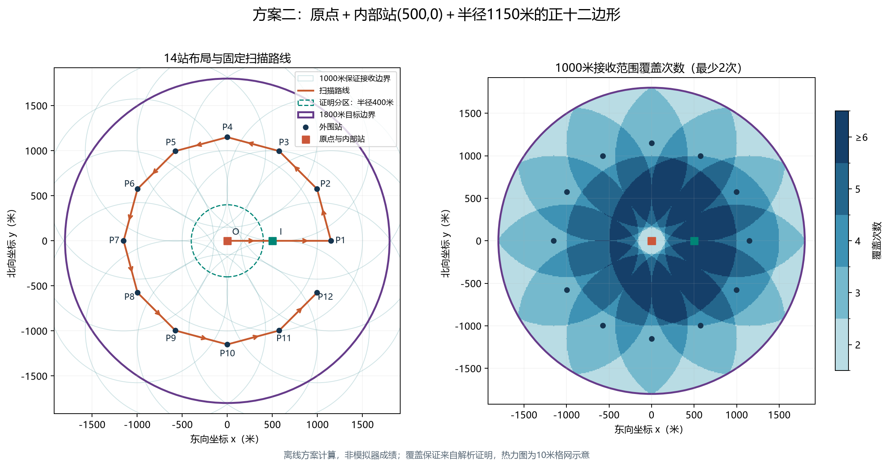
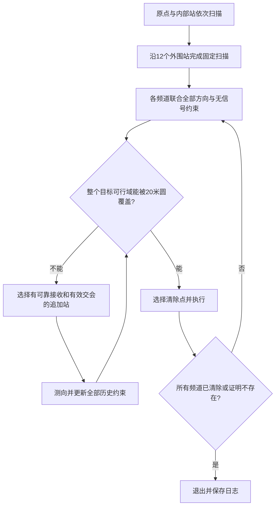
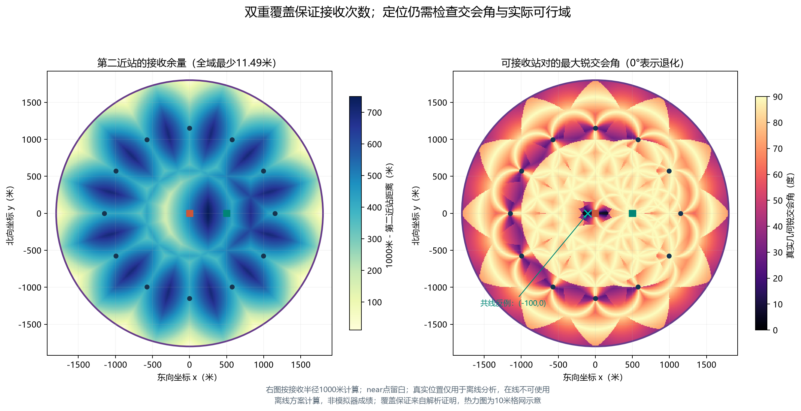

# 第三问方案二：固定双重覆盖扫描与后续精定位

日期：2026-09-11。本文件保留离线布局计算与证明；后续已完成[方案二完整实现](方案二_实现与使用说明.md)和[两方案本地闭环对照](方案二_验证与两方案对照.md)。文中的时间是固定扫描路线的解析费用，不能当作完成全部定位清除的时间或官方成绩。尚未启动官方模拟器。

## 1. 本轮建议

采用14个固定检测站：原点O=(0,0)、内部补充站I=(500,0)，以及半径1150米圆上每隔30°布置的12个外围站。

这组站点严格保证：半径1800米目标圆内任意位置，到第二近站的距离不超过988.511420米。因此对最小接收半径1000米的目标也至少有两个不同站可接收，保留11.488580米余量。若某次反馈为near，则可直接清除，无需坚持取得两条方向。

“全域双重覆盖”是接收保证。完成扫描后仍逐目标核查20米覆盖清除条件，精度不足时使用自适应追加测向。不能把覆盖两次写成已经保证定位清除全部目标。



## 2. 为什么不是任意增加几个站

先推导站数下界。一个1000米检测圆在半径1800米目标圆边界上最多覆盖的圆心角为

\[
\beta_{\max}=2\arcsin(1000/1800)\approx67.497977^\circ.
\]

设站点到原点距离为s，可覆盖的半角满足cos(β/2)=(1800²+s²−1000²)/(3600s)。右侧在s=√(1800²−1000²)时最小，得到上述最大弧长；不与目标边界相交时覆盖弧长为0。

双重覆盖整个圆周要求各站覆盖弧长的总和至少为720°，因此仅边界就至少需要11站。但11站仍不够覆盖整个圆盘两次：原点也必须被至少两个站覆盖，这两个站满足s≤1000，其各自最大边界弧长只有

\[
\beta_{\rm inner}\le2\arccos(1800/2000)\approx51.683866^\circ.
\]

于是11站的边界弧长总和至多为

\[
2\beta_{\rm inner}+9\beta_{\max}
\approx710.849526^\circ<720^\circ.
\]

因此全域双重覆盖至少需要12站。这是必要条件；本轮没有证明12站一定能构造，也没有证明14站为全局最少站数。

## 3. 对称布局的计算比较

考察“原点＋必要时一个内部站＋n个等间隔外围站”的候选族，外围半径记为ρ。任意极角与第二近外围站的夹角至多为Δ=2π/n，边界上的最坏第二近距离满足

\[
d_{2,\partial A}^2=1800^2+\rho^2-3600\rho\cos\Delta.
\]

为了进行一致的对照，本轮先要求至少10米保证接收余量，即距离≤990米。**10米是本轮的设计对照参数，不是题面新增的约束。** 对可行的n，满足边界要求的最小半径为

\[
\rho_{\min}=1800\cos\Delta-
\sqrt{990^2-1800^2\sin^2\Delta}.
\]

若ρ>990米，增加内部站(400,0)并用半径500米作证明分区：中央区域由原点和内部站覆盖，外围区域由两个外围站覆盖。程序逐案核查分区两端的距离上界；不会只验证目标外圆。若ρ≤990米，则外围站自身可以完成中央区域的双重覆盖，原点仍保留初始扫描以统一计费口径。

固定路线为原点出发，经过共线的内部站（如有），到达第一外围站，再沿外围相邻站依次走完，无需回原点。外围相邻站走直线弦长，不沿圆弧走。

| 外围站数 | 外围半径（米） | 总检测站数 | 扫描路程（米） | 全频道扫描虚拟时间（秒） |
|---:|---:|---:|---:|---:|
| 11 | 1332.398 | 13 | 8839.998 | 3315.000 |
| 12 | 1146.414 | 14 | 7674.117 | 3200.823 |
| 13 | 1064.326 | 15 | 7177.363 | 3220.473 |
| 14 | 1013.342 | 16 | 6876.074 | 3279.215 |
| 15 | 977.980 | 16 | 6671.316 | 3238.263 |
| 16 | 951.918 | 17 | 6523.221 | 3327.644 |

本轮实际计算n=11～24，12个外围站在这个候选族和10米余量标准下扫描时间最少。对3≤n≤10，1800sin(2π/n)>990，不能采用这里的相邻外围站构造完成边界双覆盖；原点和内部站不覆盖目标边界。此比较不是任意站点布局或任意访问路径的全局优化。

为了采用简洁参数，主方案取ρ=1150米，并取内部站I=(500,0)。相比表中的14站方案，固定扫描时间只增加约4.801秒，连续覆盖余量增至11.489米，内部站仍落在起始直线上，不额外增加路程。

另保留一个小余量对照：原点加半径998.924638米的14个外围站，共15站，可保证约1.075362米余量，扫描时间3140.649秒，比主方案少约64.975秒。这说明14站主方案不是本轮所有参数中扫描最快的选择；后续应将余量、定位效果及总完成时间一起比较，不预先排除这个对照。

## 4. 14站的明确坐标与顺序

\[
O=(0,0),\quad I=(500,0),\quad
P_{k+1}=1150(\cos(k\pi/6),\sin(k\pi/6)),\ k=0,\ldots,11.
\]

| 顺序 | 站点 | x（米） | y（米） |
|---:|---|---:|---:|
| 1 | O | 0 | 0 |
| 2 | I | 500 | 0 |
| 3 | P1 | 1150 | 0 |
| 4 | P2 | 995.929214 | 575 |
| 5 | P3 | 575 | 995.929214 |
| 6 | P4 | 0 | 1150 |
| 7 | P5 | −575 | 995.929214 |
| 8 | P6 | −995.929214 | 575 |
| 9 | P7 | −1150 | 0 |
| 10 | P8 | −995.929214 | −575 |
| 11 | P9 | −575 | −995.929214 |
| 12 | P10 | 0 | −1150 |
| 13 | P11 | 575 | −995.929214 |
| 14 | P12 | 995.929214 | −575 |

表中坐标用于阅读，执行时由公式生成完整精度坐标。允许整体旋转或反向遍历，但改变访问路线后必须重新计费。

## 5. 连续双重覆盖证明

### 5.1 中央部分：距原点不超过400米

对任意‖G‖≤400米的目标，距O不超过400米，距I不超过‖G‖+500≤900米，故至少由O、I两站保证接收。

### 5.2 外围部分：距原点400～1800米

12个外围站将圆周等分为30°的区间。选取夹住目标极角的相邻两站，目标与这两站的极角差各不超过30°，两站都满足

\[
\|G-P\|^2\le f(r)=r^2+1150^2-2300r\cos30^\circ.
\]

f(r)为凸二次函数，在[400,1800]上的最大值位于端点。计算得

\[
\sqrt{f(400)}\approx828.104238\text{米},\qquad
\sqrt{f(1800)}\approx988.511420\text{米}<1000\text{米}.
\]

所以外围部分也至少有两个保证接收站。结合中央部分，全域第二近距离不超过988.511420米；在G=(1800,0)处确实达到该值，因此这也是本布局的精确最大第二近距离。

10米格网共检查101765个域内点，覆盖次数最少2、最多7，最大第二近距离与解析结果一致。格网仅作数值抽查，连续覆盖保证由上述证明给出。

## 6. 固定扫描的操作流程

为了比较两种方案，先采用固定扫描阶段与后续精定位阶段分开的基线。后续再比较沿途绕行清除，避免用未经测量的动态路线费用替代固定路线计算。

1. 原点按1→20检测全部频道，记录direction、near、no_signal。
2. 前往I，随后依次访问P1～P12；到站停止后再测量。用当前频道开始本轮检测；全频道基准可以交替使用1→20与20→1，避免站间多切换一次。
3. 未发现频道逐站积累无信号覆盖证据；已发现频道保存所有可用方向，而不只取最早的两个。达到两次接收后，不能自动假定已能清除。
4. 反馈near时可原地清除；当前地点已能覆盖某目标全部可能位置时，也可原地清除。成功清除的频道不再需要测量。
5. 对尚未发现的频道，若已经获得完整无信号覆盖证据，可以标记不存在并停止后续检测。实际省略检测需单独计费，不能继续声称每站都有20次检测。
6. 固定扫描结束时，所有真实存在且未清除的目标在完整检测基准下都应至少有两处接收；near应已直接处理。仍只有一次方向且未清除时，要检查是否漏测频道、动作未被接受、计时中断或错误地提前跳过，不能视为正常完成。
7. 对未清除目标进行物理可行域与20米覆盖核查，安排直接清除或追加测向，然后执行原方案的无遗漏终止判断。

全频道固定扫描是费用与几何效果的对照基准。实际版本会因原地清除和已证明不存在而减少检测，增加的清除动作则按成功5秒/失败3秒计入总时间。



## 7. 时间核算

从O到I再到P1总长为500+650=1150米。外围相邻站距为

\[
b=2\times1150\sin15^\circ\approx595.283804\text{米}.
\]

P1到P12共走11段，故

\[
L=1150+11b\approx7698.121841\text{米}.
\]

全频道基准有14×20=280次检测、14×19=266次切换，因此

\[
T_{\rm scan}=L/5+280\times5+266
\approx3205.624368\text{秒}.
\]

即53分25.624秒虚拟时间；这是扫描费用，不包括后续移动清除、追加测向，也不包括扫描中执行的清除动作。虚拟时间与现实程序运行时间独立，仍应遵守enter返回的实际剩余现实时间。

与方案一七站全频道固定扫描2273秒相比，主方案多932.624秒，约15分32.624秒。在这两个固定扫描基准下，只有方案二的后续精定位与清除阶段能省下超过这部分费用，它的总时间才更优。按10～16个目标折算，约需平均每个目标省58.289～93.262秒后续费用；这只是盈亏比较，不是预测成绩。

## 8. 两次接收之后，定位效果实际如何

离线构造令目标实际接收半径为1000米、各站真实误差为0°，但仍按±1°角域求交，复用第一问原函数。下表只用正向角域P，没有把目标圆、1500米上限或无信号排除叠加进去；未模拟HTTP两位小数舍入。这些是构造算例，不是误差最坏值或官方分布统计。

| 目标位置 | 有方向站数 | 角域直径（米） | 角域最小覆盖圆半径（米） | 仅角域判据 |
|---|---:|---:|---:|---|
| (1800,0) | 3 | 59.362 | 29.681 | 尚不能保证20米覆盖 |
| 外圆15°方向 | 2 | 66.208 | 33.104 | 尚不能保证20米覆盖 |
| (400,300) | 6 | 24.699 | 12.350 | 可保证20米覆盖 |
| (−100,0) | 2 | 无界 | 无界 | 需其他信息或追加动作 |
| (1150,10) | 4 | 21.367 | 10.684 | 可保证20米覆盖 |

角域圆半径超过20米时，仍应继续核查更小的物理可行域；不能只凭这个保守外包失败，就断言物理域也无法清除。下述同反馈反例则对完整14站观测也成立。

### 8.1 完整扫描仍不足以清除的明确反例

取两个候选目标G1=(−149,0)、G2=(−6,0)，接收半径均为1000米，各站真实角误差均为0。两个目标都使O、I返回180°，且都不触发near；对12个外围站均返回no_signal。其中G1到最近外围站P7的距离为1001米，G2到P7为1144米，其他外围站更远。

两个目标产生完全相同的全部14站反馈，但相距143米。任何半径20米的圆都不能同时覆盖它们。因此即使充分利用无信号信息，这种情况下也不能根据固定扫描直接保证一次清除成功，必须增加观测或有计划的光学覆盖尝试。

### 8.2 追加定位规则

用全部历史观测构造保守物理域，先求能否被20米圆覆盖。可以覆盖时，选择更近的安全清除点；否则从第二问可靠接收候选、近距离侧向点等生成追加站。选点时同时考虑到站费用、交会角与预计剩余清除时间。用完整历史重新求交，不只保留最近两条方向；无进展时使用总体方案中已列出的有限覆盖回退。



右图指标为可接收站对中最大的锐交会角γ=arcsin|sinα|，范围0°～90°；0°同时包含同向与反向共线。图中使用真实目标位置仅为离线评估，不能作为在线算法可获取的输入。near点留白，因为已能直接清除。

## 9. 与方案一的后续比较安排

采用同一组本地目标、接收半径和固定误差规则分别运行两套方案，再比较总路程、检测次数、追加测向次数、切换次数、清除失败数、全部完成率和总虚拟时间。避免只比较扫描阶段或只报告容易场景。

方案二至少保留三个对照：14站主布局；半径1146.414米的14站参数；15站小余量布局。再比较固定扫描后统一清除与扫描中穿插清除。每次只改变一个主要策略，才能解释时间变化来源。

本文件对应的早期离线步骤完成了解析证明、14个n值候选计算、主布局费用、101765格点核查、5个定位构造、2个全反馈相同目标反例及两组中文PNG/SVG图。后续完整运行结果见页首链接；尚无官方模拟器成绩。

## 10. 复现与文件

在仓库根目录执行：

```powershell
.venv/Scripts/python.exe -X utf8 scripts/analyze_q3_plan2.py
```

- [离线计算脚本](../../scripts/analyze_q3_plan2.py)
- [完整坐标、参数比较、构造输入输出与源码哈希](../../results/tables/第三问/方案二计算结果.json)
- [双覆盖图SVG](../../results/figures/第三问/方案二_双重覆盖与路线.svg)
- [交会角图SVG](../../results/figures/第三问/方案二_覆盖裕度与交会角.svg)
- [第三问总体方案](详细方案_待审核.md)

脚本只读取第一问几何函数，生成离线数据与图表，不连接网络或模拟器。Python、NumPy、SciPy、Matplotlib版本与脚本/第一问源码哈希均记录在JSON来源字段。
