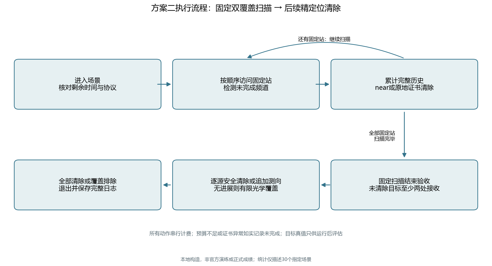
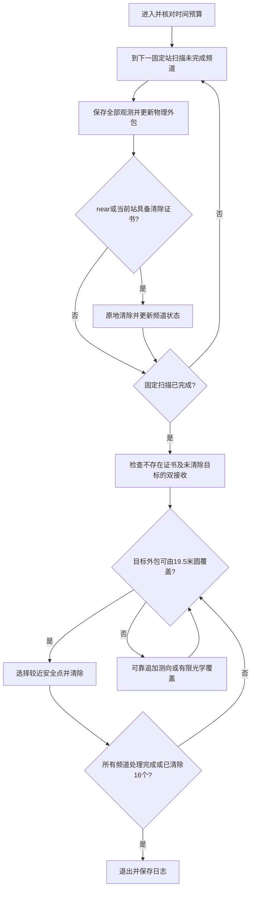

# 方案二：固定双覆盖扫描与后续精定位清除

日期：2026-09-11。方案二已实现可运行版本；本页说明程序实际行为。全部实验为本地构造，尚未连接官方模拟器，也没有消耗正式测试机会。

## 1. 完整流程

方案二先完成固定扫描，再统一安排后续定位清除。14站主布局为原点、内部站(500,0)、半径1150米圆上每隔30°的12站；固定访问顺序沿相邻站直线前进，无需回原点。

1. `/enter`核对实际剩余现实时间，建立20个频道的独立状态。
2. 按固定站顺序检测未完成频道；优先从接收机当前频道开始，避免不必要切换。
3. 每次观测保存位置、反馈、方向和全部历史。已发现目标不会因已接收两次而停止检测。
4. near反馈立即原地清除。默认也允许在当前扫描站满足完整外包覆盖证书时原地清除；此阶段不为清除目标绕行。
5. 清除成功或已获不存在证书的频道跳过。无信号集合的保守四叉树证书，或完整固定布局的连续覆盖证明，均可用于判定不存在。
6. 固定扫描结束，逐频道检查：不得仍为未知；所有尚未清除的目标必须具有至少两个不同站的direction反馈。否则停止并记录异常。near目标已经直接处理。
7. 对未清除目标，以全部历史外包安排安全清除或自适应追加测向。必要时执行有限光学方格覆盖，避免定位迭代没有进展。
8. 仅当全部频道已清除或有不存在证书，或者已经清除16个不同频道时判定全部完成；退出并保存记录。动作次数、现实或虚拟预算不足均如实标为未完成。





流程图省略各动作前的预算检查及异常退出分支。有限光学覆盖成功后直接更新清除状态；达到16个目标上界时允许提前终止固定扫描。

## 2. 三种可执行布局

| 配置标识 | 固定站组成 | 连续保证接收余量（米） | 全频道固定扫描费用（虚拟秒） |
|---|---|---:|---:|
| main14（默认） | 原点＋(500,0)＋半径1150米的12外围站 | 11.488580 | 3205.624368 |
| margin14 | 原点＋(400,0)＋半径1146.413914米的12外围站 | 10.000000 | 3200.823303 |
| compact15 | 原点＋半径998.924638米的14外围站 | 1.075362 | 3140.649473 |

执行坐标通过公式产生完整精度值，不使用表中舍入数据。上述扫描基准每站检测20个频道，不包含清除；实际运行会省略已完成频道，按真实动作计费。15站布局只保留约1米余量，本地费用较小不能替代对误差与官方环境的核验。

连续证明、站数下界和参数来源见[原计算方案](方案二_固定双重覆盖扫描_计算方案.md)。中央区域与外围区域分开证明；外围距离平方在径向为凸二次函数，检查分区两端给出全域上界。实现另外用独立极坐标格网复核，格网不充当连续证明。

## 3. “双覆盖”与“完成定位”的区别

固定扫描只能保证每个仍存在的目标有至少两处接收。若交会角小，两条方向仍可能留下很长的区域。程序使用目标圆、1500米接收上界及全部历史方向构成保守外包；无信号和失败清除形成的非凸排除约束独立保存，当前实现不将其强行塞进凸多边形。

用128边外切多边形表示圆约束，角误差取1.005°，包括题面±1°和两位小数舍入包络。外包可以比真实可行域更大；不能把外包不满足清除判据当作真实可行域一定不满足。

安全清除先求外包最小覆盖圆。实现用19.5米阈值，为题面20米光学范围预留0.5米；选择当前位置到圆心线段上较近的安全点，并再次检查所有外包顶点。near的5米范围直接触发原地清除。

精度不足时复用方案一的可靠候选生成和有限角度费用预测，综合移动、检测、切换和后续清除。该评分是启发式有限搜索，不是连续全局最优解。每目标最多8次专门追加测向，之后使用覆盖完整旋转包围盒的有限方格路径；每次失败清除的3秒照实计费。精定位阶段默认允许顺路检测其他尚未清除频道。

## 4. 运行方法

在仓库根目录运行一个本地场景：

```powershell
.venv/Scripts/python.exe -X utf8 scripts/run_q3_scheme2.py
```

指定边界场景、16个目标及15站布局：

```powershell
.venv/Scripts/python.exe -X utf8 scripts/run_q3_scheme2.py --seed 20260913 --count 16 --layout boundary --station-layout compact15
```

`--layout`是本地目标分布；`--station-layout`是检测站布局，二者不同。其余参数：

| 参数 | 用途 |
|---|---|
| `--radius min/max/mixed` | 本地目标接收半径1000/1500/混合 |
| `--error hash/zero/plus/minus/alternating` | 本地固定误差模式 |
| `--no-scan-clear` | 关闭可选扫描站原地证书清除；near仍立即清除 |
| `--no-opportunistic` | 关闭后续精定位阶段顺路检测 |
| `--config 路径` | 使用指定JSON配置 |
| `--output 路径` | 结果目录；必须不存在，避免覆盖旧记录 |

默认结果与真实接口日志写入被Git忽略的`local-only/第三问/scheme2-类型-唯一编号/`，包含`运行结果.json`和`请求响应日志.jsonl`。本地结果附加的真值仅由运行结束后的评估器读取，策略不读取目标位置、半径或未测频道真值。

官方HTTP模式复用已实现的协议客户端，仅连接当前已就绪场景：

```powershell
.venv/Scripts/python.exe -X utf8 scripts/run_q3_scheme2.py --mode http --robot-id 实际队号
```

也可通过`CUMCM_ROBOT_ID`环境变量提供实际队号。默认地址`http://127.0.0.1:2026`，客户端限制本机HTTP，串行发送四种POST接口。移动费用由请求位置推断，没有另造move接口。clear不切换接收频道；网络异常保持同ID同载荷重试，结果未决时停止发新动作。客户端不会登录、点击开始正式测试，也无法仅凭协议判断演练/正式属性，须以模拟器及官方日志为准。官方日志应保留原名，不能由本地JSONL替代。

## 5. 本轮交付与边界

- 已实现完整固定扫描后精定位的方案二，以及三种布局与可选原地清除设置。
- 使用相同30个场景运行方案一默认、方案二四设置，共150次完整对照，见[验证与两方案对照](方案二_验证与两方案对照.md)。
- 原地清除不增加扫描路线；“扫描中绕行清除再回归固定路线”尚未实现。未进行全局路线优化或任意站点的全局最优搜索。
- 官方演练联调、正式成绩及第四问尚未开展。本地测试通过不代表未知官方场景的成功概率证明。

代码：[策略与布局](../../src/cumcm2026_b/q3_scheme2.py)、[入口](../../scripts/run_q3_scheme2.py)、[配置](../../configs/q3_scheme2.json)、[测试](../../tests/test_q3_scheme2.py)。
