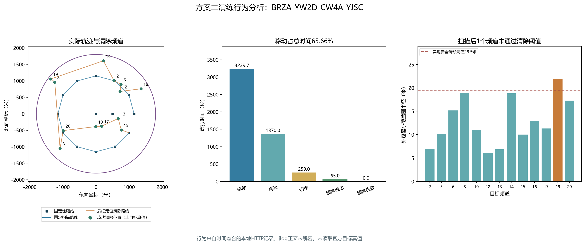

# 第三问演练日志分析：BRZA-YW2D-CW4A-YJSC

分析日期：2026-09-11。用户提供的文件为`practice-p3-3298932400212429975-BRZA-YW2D-CW4A-YJSC.jlog`，原文件保持不变。

## 1. 信息来源与限制

这份jlog具有可读JSON文件头，头后的行为正文标注为加密内容。本次仅解析公开文件头，没有解密行为正文或验证包签名。因此，不能声称从jlog正文直接读取了逐条动作、目标真值或官方目标总数。

本地存在`local-only/第三问/scheme2-http-c6bff595833f/`的明文请求响应及运行结果。其请求队号与文件头一致，最后一次成功退出响应为北京时间17:55:57.848，jlog头记录的生成时间为17:55:57.849，二者相差1毫秒，且没有另一份记录满足本次时间匹配条件。以下将它作为高度吻合的方案二运行记录分析；关联依据是时间与队号，并非解密后的内容比对。

本页是首次实际演练关联分析，区别于之前的本地构造实验。原jlog、明文原始请求和队号仍留在本机；入库内容不包含队号、票据或密钥封装内容。

## 2. 可以从jlog文件头直接读取的信息

| 项目 | 内容 |
|---|---|
| 日志类型 | practice_behavior_log，即演练行为日志 |
| 问题编号 | 3 |
| 正式测试序号 | null，文件头没有标为正式测试 |
| 演练运行编号 | 3298932400212429975 |
| 案例码 | BRZA-YW2D-CW4A-YJSC |
| 模拟器客户端版本 | 1.1.0 |
| 生成时间 | 2026-09-11 17:55:57.849，北京时间 |
| 文件大小 | 59,448字节，约58.05KiB |
| 文件标识与格式版本 | JMBPLOG1，版本1 |
| 公开JSON头长度 | 2,772字节 |
| 压缩标识 | gzip，级别6 |
| 内容加密标识 | aes-256-gcm-chunked |
| 内容密钥封装标识 | rsa-oaep-sha256 |

文件SHA256：`4941ca8e1a8fce7f55180298ea5305df4e77a23200f226a459a6fbed75d21e18`。该哈希用于核对后续是否仍为同一文件，不等同于验证官方签名。

## 3. 从关联本地明文记录得到的运行结果

| 指标 | 值 |
|---|---:|
| 策略 | 方案二，14站主布局 |
| 成功清除频道数 | 13 |
| 已证明不存在频道数 | 7 |
| 程序判定 | 全部完成，正常退出 |
| 清除失败次数 | 0 |
| 虚拟总时间 | 4933.666369秒，即82分13.666秒 |
| 每清除目标平均时间 | 379.512798秒 |
| 总路程 | 16198.331825米 |
| 检测次数 | 274 |
| 频道切换次数 | 259 |
| 本地程序运行时间 | 约0.938秒 |

成功清除频道为2、3、6、8、10、12、13、14、15、16、17、19、20；覆盖排除频道为1、4、5、7、9、11、18。程序按“所有20个频道已清除或有不存在证书”结束，没有仅根据清除数达到13而退出。

13次clear均收到success，证明接口报告了13次成功清除；“全清”仍是程序基于覆盖证据的判定。本次没有从加密正文独立读取官方目标总数，应进一步对照演练结束界面的目标总数。

虚拟时间与现实程序运行时间不同。检测的5秒增加虚拟时钟，不要求现实等待5秒，所以约1秒的程序运行和约82分钟的虚拟任务时间可以同时成立。

## 4. 固定扫描与追加定位实际发生了什么

固定扫描完整访问14站，路程7698.121841米，用时3163.624371虚拟秒。前13站各检测20个频道，最后一站仅检测13个仍存在的频道，共273次；七个不存在频道在此前已获覆盖证书，因此最后一站省略7次检测和相应切换。与全频道基准3205.624368秒相比，实际节省约42秒。扫描过程中没有清除目标。

扫描结束时13个目标均取得至少3处方向，最多10处方向。其中12个的外包最小覆盖圆半径不超过19.5米，已经可以选择安全位置清除；频道19的半径为21.891170米，尚未通过这一充分判据。

程序随后只为频道19增加一次测向：

- 观测站约为(−1346.189,1052.352)米。
- 返回方向169.68°。
- 更新完整历史后，外包覆盖圆半径缩至9.408053米。
- 此后清除成功。全程未触发有限方格覆盖或其他频道的顺路检测。

清除顺序为：15 → 13 → 17 → 10 → 20 → 3 → 8 → 19 → 14 → 2 → 6 → 12 → 16。所有13次清除均使用完整外包覆盖证书，最远可能目标距离约19.5米。图中的清除位置不是目标真实坐标，成功清除只能说明目标在其20米范围内。

## 5. 主要时间花在哪里

| 分项 | 虚拟时间（秒） | 占比 |
|---|---:|---:|
| 移动 | 3239.666365 | 65.66% |
| 检测 | 1370 | 27.77% |
| 频道切换 | 259 | 5.25% |
| 成功清除 | 65 | 1.32% |
| 失败清除 | 0 | 0% |

固定扫描约占总时间64.12%；扫描后精定位与清除用时1770.041998秒，增加路程8500.209984米。由于只有一次专门追加测向，当前这局的主要费用不是测向迭代，而是固定扫描和清除路线。

后续可评估清除访问顺序、满足信息条件后是否提前结束固定扫描等改进，但须继续保证所有未知频道有覆盖排除证据，以及清除点的完整几何证书。本轮只分析日志，不改动算法，也没有用单次演练推断两方案整体优劣。



## 6. 协议和费用核验

按本地原始HTTP记录重新逐动作核算，共289个不同动作：进入1次、检测274次、清除13次、退出1次。289个响应全部HTTP200且accepted=true；没有重试、通信异常或清除失败。

检测反馈包括76次direction和198次no_signal，没有near。274次检测为273次固定扫描加1次追加测向。逐次移动距离、检测、切换及清除费用重算后与每次服务器虚拟时钟的差异均在0.001秒以内。

这些是当前一次运行的记录核验，不代表后续所有场景都不会出现异常。此前未做官方联调的状态是历史阶段记录；目前已获得这次与官方演练文件头高度吻合的实际HTTP运行证据，正式测试仍未据此产生任何结论。

## 7. 复算与归档

- [可复算分析脚本](../../scripts/analyze_q3_practice_log.py)
- [脱敏结构化结果](../../results/tables/第三问/演练日志分析_BRZA-YW2D-CW4A-YJSC.json)
- [SVG图](../../results/figures/第三问/演练日志分析_BRZA-YW2D-CW4A-YJSC.svg)

脚本需要原jlog及对应`local-only/第三问`明文记录；仅从GitHub克隆无法重建本机私有原始输入。它不连接网络，不启动新测试，不解密正文，不编辑原文件。运行命令：

```powershell
.venv/Scripts/python.exe -X utf8 scripts/analyze_q3_practice_log.py --jlog "materials/original/simulator/CUMCM2026B/Jammers-simulator-win64/Jammers-simulator/log/practice-p3-3298932400212429975-BRZA-YW2D-CW4A-YJSC.jlog"
```
