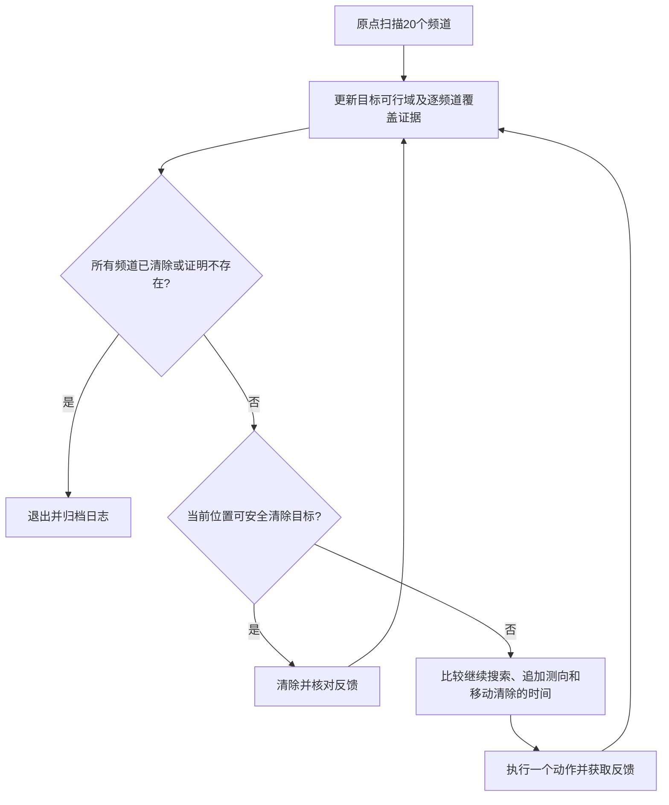

# 第三问总体设计（两套方案均已实现）

日期：2026-09-11。实施更新：方案一已完成可执行基线、HTTP客户端与本地闭环验证，入口见[阅读导航](阅读导航.md)。本文件保留总体设计及后续优化方向，实际已实现功能以[实施说明](方案一_实现与使用说明.md)为准；未调用官方模拟器或消耗正式机会。下文七站扫描时间仍为解析扫描估算，不是完整运行成绩。

方案二已完成[固定双重覆盖扫描的详细计算](方案二_固定双重覆盖扫描_计算方案.md)、[完整闭环实现](方案二_实现与使用说明.md)及[同场景两方案对照](方案二_验证与两方案对照.md)。两套策略均只完成本地验证，尚无官方成绩。下文保留原设计与待实施优化，实际功能以各方案实施说明为准。

## 1. 推荐的总体路线

采用“全频道覆盖保证不遗漏 + 多目标可行域持续更新 + 面向清除耗时的滚动决策 + 可证明安全的光学清除 + 有限覆盖兜底”。

先实现一套能够说明为什么不会漏掉目标、为什么能够结束的基线，然后逐层加入顺路检测、检测站复用、移动代价比较和有限步预测。第三问的首要约束是清除全部目标，不能以平均时间更小为由提前退出并留下难找的目标。

第一问提供角域交集、顶点和直径；第二问提供单次测向之后的物理域、可靠检测条件、侧向候选及鲁棒评价思路。第三问要新增频道状态、搜索覆盖、连续多次观测、光学清除判据和任务调度，不能将第二问单目标的数值最佳偏移机械套用于所有目标。

## 2. 正式规则与计时

依据：[B题题面](../../materials/original/problem/B题.pdf)问题3及附录1～3、[附件1](../../materials/original/problem/附件/附件1.docx)第1～4节、[附件2](../../materials/original/problem/附件/附件2.docx)第1～10节。

| 项目 | 核对后的规则 | 对方案的影响 |
|---|---|---|
| 目标 | 全部全向，10～16个，具体数未知 | 必须建立没有遗漏的终止证据 |
| 频道 | 1～20，每频道最多一个目标 | 以频道作为目标身份，无需猜测多源关联 |
| 初始状态 | 原点、测向机频道1 | 初始扫描先检测频道1 |
| 测向 | 停止后检测一次5秒，切换频道另1秒 | 在同一站有选择地批量测向，避免无用切换 |
| 移动 | 两指令位置间直线距离÷（5米/秒） | 移动通常比一次测量昂贵 |
| 光学清除 | 距离≤20米成功；成功5秒，失败3秒 | 无须把目标精确到点才清除 |
| near | 测向距离≤5米，无方向 | 对这个频道可在当前位置直接清除 |
| clear频道 | 仅指定目标，不切换测向机频道 | 当前频道必须与清除对象分别存储 |
| 接口动作 | enter、measure、clear、exit，动作串行 | 不发送独立移动指令，也不并发发送动作 |
| 现实限时 | enter返回实际剩余时间，最多1200秒；同时受25分钟窗口限制 | 计算与网络耗时需要独立预算 |
| 虚拟限时 | 100小时 | 虚拟检测5秒不意味着现实需要sleep5秒 |

虚拟总耗时：

\[
T=\frac{L}{5}+N_{\rm switch}+5N_{\rm measure}
  +3N_{\rm clear,fail}+5N_{\rm clear,success}.
\]

首要优化问题为在全部清除约束下减小T；现实运行时间是另外的硬约束。不能把二者相加，也不能将T/清除数的改善作为漏清目标的理由。

接口响应角度保留两位小数，正式误差界为±1°。第三问实现时要明确舍入与误差界的关系：若无法确认±1°是否已包含末位舍入，可在第三问信息集构造中保守使用1.005°并单独注明，不静默改变前两问成果，不靠重复同地点观测平均误差。

## 3. 搜索覆盖与不遗漏证据

### 3.1 每个频道单独维护覆盖信息

对尚未发现目标的频道c，令未知存在区域初始为目标圆A。每次在S测得no_signal，由于第三问全为全向源、接收半径至少1000米，假设该频道有源，则源不在B(S,1000)内。因此可维护

\[
U_c=A\setminus\bigcup_{i:\,c\text{在}S_i\text{无信号}}B(S_i,1000).
\]

如果U_c经连续覆盖证据确认为空，可判定该频道没有目标。只有测过该频道的站点才计入它的覆盖；机器狗路过某区域不代表检测过，更不能由一个频道的no_signal排除其他频道。

程序维护四种状态：未发现且仍可能存在、已发现待定位/清除、已清除、已证明不存在。发现过但尚未清除的频道后来no_signal，只说明超出接收范围，不能改成不存在。

### 3.2 七个站的解析覆盖基线

设中心站S0=(0,0)，外围六站为

\[
S_{k+1}=1200(\cos(k\pi/3),\sin(k\pi/3)),\quad k=0,\ldots,5.
\]

外围坐标分别为(1200,0)、(600,600√3)、(−600,600√3)、(−1200,0)、(−600,−600√3)、(600,−600√3)。整组允许整体旋转，覆盖性质不变。

对半径r≤900米的目标，原点直接保证接收。对900≤r≤1800米的目标，总有一个外围站与其极角差不超过30°，到该站的距离平方不超过

\[
f(r)=r^2+1200^2-2400r\cos30^\circ.
\]

f是凸二次函数，区间最大值在端点取得，其中

\[
f(900)\approx379385.128,
\quad f(1800)\approx938770.256,
\]

故距离不超过968.901572米，小于1000米。这给出整个目标圆的连续覆盖证明，且留有约31米余量。七站不是已经证明的最少站点或最短路径解，而是容易复核、可作兜底的方案。

若某未知频道在这七站全部no_signal，就能证明不存在。若有目标，它至少在一个站返回direction或near，因而不会永远漏掉。

初始基线可以先原点扫描20频道，再依次访问六站，收集方向并安排清除。性能版本允许穿插定位/清除、提前利用机会检测、跳过已清除或已证明不存在的频道，并动态调整待访问站顺序，但必须保留每频道的不遗漏证据。

单独估算固定扫描流程：原点到第一外围站及外围相邻五段共7200米，移动1440秒；七站各测20频道共700秒；每站先测当前频道再测其余19频道，切换共133秒。扫描部分合计2273秒，即37分53秒虚拟时间，未包含定位清除绕行、追加测量或清除动作，不能当第三问完成时间或模拟器成绩。

### 3.3 机会检测如何减少固定站访问

在定位其他目标的过程中，已发生的合法no_signal也能缩小对应U_c。若其覆盖已足以排除该频道，则省略剩余固定站检测。覆盖核查用有证据的圆盘并覆盖或保守四叉树：只有整块单元均被已测圆盘覆盖，才记作已排除；无法证明的边界单元保持未决，最终由七站覆盖补齐。不用有限目标采样全被覆盖冒充连续覆盖证明。

### 3.4 单次覆盖不能作为全部定位的保证

七站方案只保证每个真实目标至少有一次接收机会，不保证双重覆盖，更不保证扫描结束后所有目标均可清除。扫描全部频道并保存观测，只是完成发现与排除未知频道的工作；未达到清除精度的目标仍需追加观测或启用有限覆盖清除。

反例取合法目标G=(1800,0)，则到七站的距离为：

| 检测站 | 距离（米） |
|---|---:|
| S0=(0,0) | 1800 |
| S1=(1200,0) | 600 |
| S2、S6 | √2520000≈1587.450787 |
| S3、S5 | √6840000≈2615.339366 |
| S4=(−1200,0) | 3000 |

除S1外均超过最大接收半径1500米，因此即使目标接收半径取1500米，七站也只能在S1取得方向。不能把单覆盖的解析证明解释为七站完成全定位的证明。

如果设计要求仅靠预先设置的固定站，让每个目标至少在两个不同位置获得接收机会，那么应要求对任意G∈A都有∑ᵢ1{‖G−Sᵢ‖≤1000}≥2，并在对应站实际检测该频道。这是最小接收半径下的双重覆盖要求。采用“先发现、再根据该目标的观测追加站点”的自适应方案，则不要求最初的固定搜索站满足双重覆盖，但必须执行追加观测，不能扫描一轮便假定定位完成。near或已有区域能够直接安全清除时，可以提前清除。

双重覆盖也不充分保证定位精度。例如两个站位于(0,0)和(500,0)，目标位于(900,0)，接收半径1000米且两次误差均为0°。两站均返回0°，而候选目标(600,0)和(1000,0)在同一接收半径下也产生完全相同的两次观测，两候选相距400米。即使有两次无误差测向，共线同向几何仍不能确定沿射线的距离；±1°条件还需考虑角域厚度。最终仍以整个可能区域能被20米圆覆盖或near反馈作为安全清除依据。

后续可将“单覆盖搜索加自适应追加测向”与“固定双重覆盖搜索加必要的精定位”作为待比较方案，以包含移动、测向和清除的总时间评价，不预先断言哪种更快。本轮只澄清理论保证，未调整站点或实施第三问算法。

## 4. 已发现目标的连续信息更新

对频道c保存全部测向记录(S_i,θ_i)、接收结果、清除失败位置以及当前不确定集。

正向观测给出W_i和B(S_i,1500)约束。一个方便处理的凸外包为

\[
\overline\Omega_c=A\cap\bigcap_iW_i\cap\bigcap_{i\in\rm positive}B(S_i,1500).
\]

no_signal还排除对应1000米圆，clear失败排除20米圆；这些排除可能使更精细的信息集带孔或不连通。因此分开维护完整观测约束和保守凸外包，不能把非凸域当成第二问的凸PhysicalRegion直接套用方向区间公式。

每个源的接收半径固定但未知，正观测还蕴含R≥‖G−S_i‖。后续可利用共同R∈[1000,1500]联立正、负观测进一步收缩信息集；第一版仍可用保守外包作可靠判断，先保证推理正确和实现稳定。

第一问P_c=∩W_i及D(P_c)继续作为角域定位质量指标。第三问为决定清除位置，可以另用包含真实目标的物理外包求覆盖半径，必须标明这种物理扩展，不更改第一问P的定义。

## 5. 怎样确定下一次测量的位置

只有一次测向时，可复用第二问的完整可靠域、解析候选和近优点生成方法；不直接固定使用(798.3,±602.3)。受截断、已发生移动、其他目标和后续清除路线影响，第三问的最短完成时间方案可能不是第二问直径最小方案。

候选位置至少来自：第二问侧向候选及近优点、向目标域靠近但仍有足够侧向基线的位置、尚需访问的搜索覆盖站，以及能同时改善多个已知目标的公共观测位置。先用连续距离筛选，再用预测观测评价几何效果。

多次测向时，预测新观测必须与**全部历史角域**相交。现有q2的二站评价函数不直接支持这一点，第三问需要增加历史半平面加新角域的评价层，复用第一问solve_halfplanes/solve_bearings；不能只保留最近两次测向。

评价动作时，以时间为单位：

\[
\widehat Q(S,c)=\frac{\|S-X\|}{5}+5+\mathbf1_{c\ne c_{\rm current}}
 +\max_{\theta\in\Theta_c(S)}\widehat T_{\rm finish}
       (\overline\Omega_c\cap W(S,\theta),S).
\]

X是当前狗位置，最后一项为观测之后完成该目标清除的预测时间。初版可用一至两步前瞻加明确的后续策略估计；终端估计是规划近似，不宣称求解了全任务的严格动态规划最优解。当前动作的距离、测量和切换费用必须精确计算。

第二问的J、覆盖半径缩减和移动距离可以用于候选剪枝，但不任意把“米、平方米、秒”加成没有解释的分数。需要权重时转换为时间代价并用演练做消融比较。

不能保证接收的候选必须包含no_signal分支；可能near的候选必须包含直接清除分支。第一版优先使用可靠测向候选简化分支，后续将near作为有利终止结果而非永远禁止接近。

## 6. 清除判据：必须能被20米圆覆盖

收到near时，原地对该频道clear即可保证成功，无需继续测向。

一般情形定义

\[
R_c^*=\min_z\max_{G\in\overline\Omega_c}\|G-z\|.
\]

当能找到z使连续最大距离≤20米减安全裕度时，移到z执行clear，保证覆盖全部可能目标。初版可求外包多边形的最小覆盖圆圆心；有圆弧时使用连续最远距离查询，或带已知误差的外接多边形作保守证书，不能用内接采样多边形代替外包。

不能只用D≤40米作为充分条件：边长40米等边三角形的最小覆盖圆半径为40/√3≈23.094米，已经超过20米。这个问题正是第一问“同直径圆不一定覆盖”的实际用途。

若允许性能改进，还可在

\[
\mathcal Q_c=\bigcap_{G\in\overline\Omega_c}B(G,20)
\]

内选择距当前位置更近的清除点，而不固定去最小覆盖圆圆心；必须重新核查最大距离。

clear失败更新20米排除信息，不能把目标记为已清除；若此前声称有覆盖保证却失败，应先核对误差、坐标、协议接受状态和几何容差。无信号、清除失败都不是可以吞掉的异常。

## 7. 定位无法继续收缩时的有限兜底

多次测向、局部优化都不自动构成“有限步一定能清除”的证明，因此需要独立兜底：在确认包含目标的紧区域上构造光学覆盖点。

一种易验证做法是将该区域包围盒划分成边长20米的小正方形，对所有可能与目标域相交的单元保留中心点。任意单元内点距中心最多10√2≈14.142米，小于20米。依次在覆盖点对已知存在的频道clear，至多有限次必能成功；路径用蛇形次序或近邻优化。

不能只保留中心位于Ω内的单元，否则会漏掉边界；任何空间删减必须有排除证明。该兜底只是正确性保险，效率版本应尽量通过少量测向先缩小区域再使用。设置有限的定位/试探预算，避免无止境重复测向或反复尝试同一失败位置。

这里还可以给出具体的数量上界：以首次收到方向的位置为原点，沿示向方向建立局部纵轴，目标纵向坐标在[0,1500]米内，横向偏移不超过1500sin(1.005°)≈26.31米。因此[0,1500]×[−30,30]米的旋转矩形已包含目标，20米方格至多产生75×3=225个清除点；已有观测还可以进一步删减。这是单个已发现目标的保守兜底上界，不是建议常规执行225次清除，也不代表现实限时内已验证可行。

完备性结论建立在题设正确、动作能执行、响应可信且时间预算允许的条件下。现实20分钟窗口与网络异常下不能无条件保证完成；需要通过演练测得规划耗时及接口吞吐，设置运行预算与回退阈值。

## 8. 多目标与频道调度

机器人状态为当前位置、测向机当前频道、已用虚拟/现实时间；每频道记录状态、历史观测、外包和排除域、是否可安全清除、待选观测位置。

建议动作优先级和滚动机制：

1. 当前位置near目标或已经被20米覆盖保证的目标，优先清除。
2. 在当前站处理有明确新增覆盖或定位收益的频道，当前频道优先；清除动作不影响这个频道状态。
3. 建立“搜索覆盖、追加测向、直接清除”候选任务，比较移动及后续完成时间；考虑同一站能服务多个目标的收益。
4. 对已知目标的清除顺序先使用可解释的插入/近邻及2-opt改进，清除点可从各目标的安全清除区域中选择，不把不确定域中心直接当作已知精确坐标。
5. 只执行当前选定的一步，读到新反馈后立即更新再规划；为覆盖任务设置必达进度或最大延迟，防止总是追逐已知目标而让未发现频道长期得不到核查。

先做固定覆盖、逐源定位清除的可靠基线；再加机会检测和路线协调；最后比较两步前瞻、不同侧向站点及有限光学试探。若引入试探清除，限制失败次数，并保留上述终止证据与覆盖兜底。

## 9. 严格终止条件

通常只有所有20个频道均为“已清除”或“已证明不存在”时才主动exit；或者已成功清除16个不同频道，可直接利用题设总数上界证明任务完成。

发现或清除10个、连续多次没信号、所有已发现目标已清除，都不足以单独证明任务完成。若用时即将到达硬截止，按真实状态报告未完成，不能将超时保护退出称为全清除。

## 10. 接口可靠性与计算预算

只使用题面开放的HTTP+JSON反馈，不读取隐藏案例真值。四接口动作串行。每个新动作使用新request_id；网络重试必须复用原ID和完全相同请求，避免重复移动或重复清除。同ID改内容会409。

同时检查HTTP状态与accepted；accepted=false时不能更新位置、频道或用响应中的0覆盖当前虚拟时钟。只在direction时读取svd_deg。clear不切换频道。以enter返回remaining_real_duration_s设硬截止，并留出正常exit及日志落盘时间，不假设每局都有1200秒。

第二问的绘图/批量收敛脚本不在在线回路重复执行。几何参数不变时可以缓存第二问标准形状候选；每次动作只做有限候选与短前瞻，设定例如0.5～2秒的单次规划预算作为待演练调参项，超时即执行已知可靠动作。正式运行期间不绘制高分辨率图、不进行整套参数扫描，也不把虚拟检测5秒变成现实sleep。

本地逐动作记录请求、响应、频道状态、位置、虚拟时间分项、候选评分和终止依据。模拟器导出的加密正式日志保持原文件名，另存SHA256与案例编码，不编辑内容。

## 11. 验证与实施顺序（待审核）

| 阶段 | 工作 | 验收依据 |
|---|---|---|
| A | 协议状态机、计时器、频道记录、本地构造环境 | 与附件计时示例一致；幂等重试与异常状态正确 |
| B | 七站搜索、逐频道覆盖、不存在证明 | 边界/夹角中线/最小接收半径等独立解析构造；不漏检 |
| C | 多次测向、20米覆盖清除、有限兜底 | 前两问回归；等边三角形反例；near、清除失败、浮点边界 |
| D | 基础闭环完成全清除 | 未知10/16源、稀疏/聚集、外圆边缘、对抗±1°误差等 |
| E | 机会检测、路径协调、短前瞻 | 对同一组本地场景比较全清除率、T/清除数和各时间分项 |
| F | 官方不限次演练 | 只能使用接口反馈；结束后以公布总数核查清除比例 |
| G | 固定版本后进行三次正式测试 | 三次结果全部报告，保留官方案例编码及未改名加密日志 |

本地拟设置普通与边界构造集，分别覆盖10/13/16源、接收半径1000/1500米、圆边缘与窄簇、同地点误差固定、误差端点、频道组合和响应故障。普通随机构造分布只属于测试设计，不宣称为官方分布。先用不少于若干组独立场景验证基线，再确定例如30～50组本地对照及多轮官方演练的实际规模；这些是计划，不是已运行数量。

比较至少四个版本：七站固定扫描+逐源清除；加入顺路批量测向；加入移动时间选点及路线协调；加入短前瞻。可选试探清除单独消融，不在没有证据时宣称一定更快。

演练记录清除数、公布总数、清除比例、虚拟总时间、平均定位清除时间、现实程序运行时间、路程、检测/切换/清除成功失败次数。零清除时平均时间记为未定义并标失败。正式测试不显示真值总数，不虚构分母；按题面表1填案例编码、清除数、T/清除数和程序运行时间，并附算法终止证据。

## 12. 后续成果结构与当前边界

审核后拟新增独立q3协议客户端、频道信息状态、连续多次观测几何、搜索覆盖、调度器和统一运行入口；具体模块拆分以实施时保持职责清楚为准，核心不依赖绘图。

中文资料应包含第三问阅读导航、推导、验证与演练记录、论文备用稿，以及算法流程、七站覆盖、每频道剩余搜索区、多目标路线、逐次区域收缩、时间分项、策略消融、演练结果和正式测试表。全部图区分本地构造、官方演练、正式测试。

方案一与方案二现均已实现并取得本地完整运行结果，见阅读导航。尚未启动官方模拟器会话或进行正式测试。题面规定充分演练后再做三次正式测试，安排在算法版本及演练结果确定之后。
