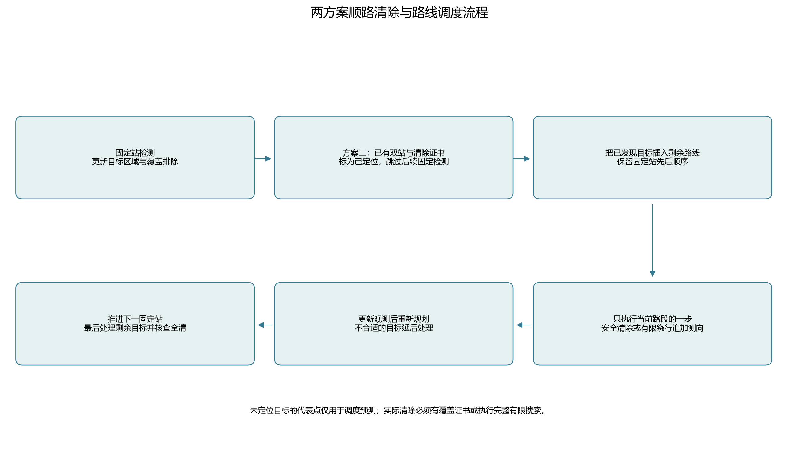

# 两方案顺路清除与路线规划：实现及使用说明

日期：2026-09-11。本页为当前默认运行逻辑。原版实现与历史数据保留；本轮新结果属于独立本地构造测试，不是此前12局官方演练的重放或正式成绩。

## 1. 这轮修改

方案一与方案二都在完成一个固定站的检测后，根据当前位置、剩余固定站、已经发现的目标重新规划路线。适合当前路段的目标顺路处理，适合后面路段的目标延后。处理后直接衔接下一固定站，不要求先返回刚才的站点。

方案二另外默认开启停止已定位频道检测：已有至少两个不同站点的direction观测，且整个保守候选区域能由半径不超过19.5米的圆覆盖时，扫描层标为localized（已定位、待清除）。后续固定站跳过该频道，但仍须实际清除成功，不能把已定位当作已完成。

原方案一每站处理完所有已知目标的调度、原方案二先完整扫描再集中处理的调度，均可通过开关恢复。原核心文件及既有配置保留原样，新功能在独立模块实现。

## 2. 怎样决定哪个目标现在处理

建立一条从当前位置开始、按原顺序经过剩余固定站的路线。对已发现目标逐个尝试插入各条路段，也允许安排在最后一个固定站之后。若把处理点p插在a、b之间，增加的几何路程为

\[
\Delta L=\|a-p\|+\|p-b\|-\|a-b\|.
\]

贪心选择增加路程较小的插入方式，再对固定站之间的连续目标顺序做有限的局部反转改良。固定站的顺序不会被打乱。每次只执行下一项服务，新的观测、清除结果与当前位置会触发重新规划，不把整条旧计划机械执行到底。一轮追加测向仍可能包含原有的顺路检测与near清除。

如果计划中的下一项就是下一个固定站，当前已经发现的目标暂缓处理；如果下一项是目标，就根据该目标当前精度选择安全清除或追加测向。

这里是受约束的几何路线启发式，不是连续全局最优解。路线插入主要比较移动距离；对于已可清除目标，成功清除次数与固定费用不因插入位置改变。未定位目标的后续检测、反馈和精确清除点仍不确定，不能把预计几何路线当成完整任务时间的精确预测。

## 3. 清除点与未定位目标的处理

对于已满足19.5米覆盖判据的目标，在其安全清除区域内选择路线位置。候选包括覆盖圆心、从路段两端朝圆心移动的较近安全点，以及当前直线段与安全区域的交点。最后逐顶点复核覆盖距离；允许在原路线经过的安全位置清除，避免总要走到圆心。

对于尚未定位准确的目标，候选区域的覆盖圆心只用于安排大致服务顺序，绝不会直接把这个预测点当成目标真值去执行证书清除。实际处理时仍调用已有的可靠测向候选与费用预测：检测位置须保证可靠方向反馈，收到观测后重新更新区域。

在两固定站之间，若本次追加测向相对直接去下一站的额外行走超过400米，暂缓该目标，尝试其他目标或继续搜索。这个阈值是明确的启发式参数，不是最优常数。每路段开始新一轮处理前检查24次服务动作的预算；一轮追加测向包含其顺路检测及near处理，可能在该轮结束时略超过该数，之后不再开始新一轮，以保证固定搜索持续推进。

中途不开展大范围有限光学方格搜索。若目前追加测向不划算，先延后；最后一个固定站之后，尚未完成的目标仍有追加测向与完整有限光学覆盖回退，避免因反复延后而漏清。方案一原有顺路检测规则继续保留；本轮没有另外实施基于信息价值的频道筛选优化。

## 4. 停止扫描与完整性

未发现频道继续固定扫描及覆盖排除，不能依据事后结果文件中的目标总数提前停扫。方案二只有当所有剩余目标均已定位、其他频道均已清除或有不存在证书时，才能在没有待测频道的情况下结束扫描；随后仍要处理待清除目标。

正常退出的全清判定不变：全部20个频道已成功清除或证明不存在，或已成功清除16个不同频道。预算不足、协议未决、几何证书异常仍如实记录未完成。实际清除前继续核查整个保守外包，角误差及圆外包安全余量不降低。



## 5. 运行命令

先进入项目目录，避免从用户主目录执行相对路径时报错：

```powershell
Set-Location 'D:\mywork\code\cumcm2026-b'
```

本地运行当前默认方案：

```powershell
.\.venv\Scripts\python.exe -X utf8 scripts/run_q3_scheme1.py
.\.venv\Scripts\python.exe -X utf8 scripts/run_q3_scheme2.py
```

在模拟器已经启动问题3演练、接口就绪后，使用原来的命令即可运行新逻辑：

```powershell
.\.venv\Scripts\python.exe -X utf8 scripts/run_q3_scheme1.py --mode http --robot-id '实际队号'
.\.venv\Scripts\python.exe -X utf8 scripts/run_q3_scheme2.py --mode http --robot-id '实际队号'
```

| 想运行的版本 | 附加参数 |
|---|---|
| 方案一原版 | `--no-route-planning` |
| 方案二仅停止已定位频道扫描 | `--no-route-planning` |
| 方案二仅路线规划 | `--no-skip-localized` |
| 方案二原版 | `--no-route-planning --no-skip-localized` |

默认配置改用[方案一路线配置](../../configs/q3_scheme1_routed.json)与[方案二路线配置](../../configs/q3_scheme2_routed.json)。旧JSON配置不含新开关；若要准确恢复原版，应使用上面的显式关闭参数。每次运行写入新的local-only目录，不覆盖旧日志。

全套本地对照与验收：`pwsh -NoProfile -File scripts/run-q3-routes.ps1`；仅重绘已归档数据并核验，追加`-PlotsOnly`。运行默认实验为60个场景、每场六设置，可能需要数分钟；不会连接官方模拟器。

## 6. 证据与文件

- [完整对照与验证结果](路线调度_验证与结果.md)
- [共享路线规划](../../src/cumcm2026_b/q3_route_planning.py)
- [两方案路线执行层](../../src/cumcm2026_b/q3_routed_strategies.py)
- [方案二停止已定位频道扫描](../../src/cumcm2026_b/q3_scheme2_localized.py)
- [路线测试](../../tests/test_q3_route_planning.py)、[停止扫描测试](../../tests/test_q3_scheme2_localized.py)

运行结果新增路线规划、延后目标、定位完成证书和跳过固定检测等中文记录，可核查每次决定的依据。新构造轨迹与原12局实际演练轨迹分开保存，不能把修改后的策略成绩归到旧日志上。
