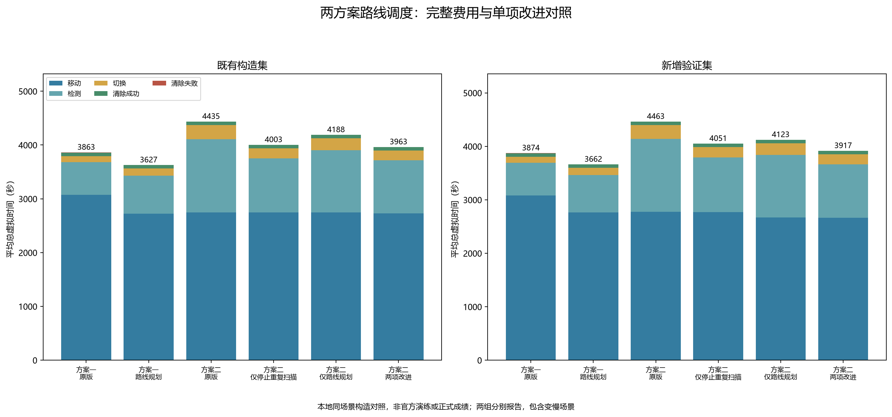
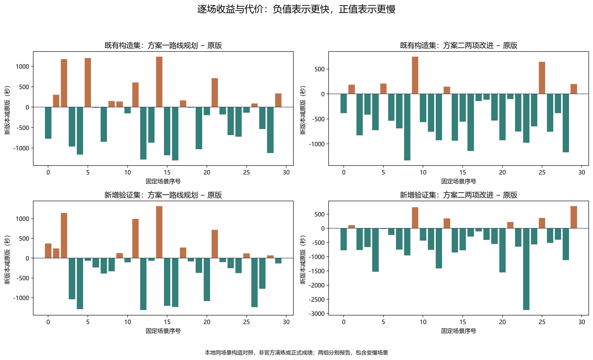
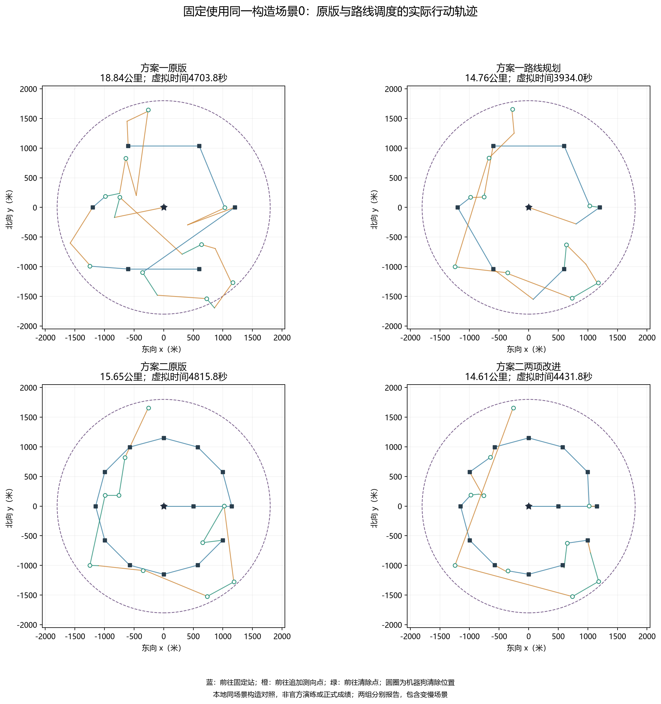

# 两方案路线调度：验证与结果

日期：2026-09-11。以下是独立本地构造环境的完整闭环结果，不是官方演练或正式成绩，也不是此前12局实际演练的重放。原策略、配置、原始演练文件与历史统计保留不变。

## 1. 比较哪些修改

每个场景运行以下六种设置，分别从初始状态开始，源位置、接收半径和误差规则相同。

| 设置 | 固定站之间如何处理目标 | 方案二已定位频道是否停止固定检测 |
|---|---|---|
| 方案一原版 | 每站后处理全部已发现目标 | 不适用 |
| 方案一加路线规划 | 将目标分配到剩余路线，顺路处理或延后 | 不适用 |
| 方案二原版 | 扫描期间只做原地清除，扫描结束后集中处理 | 否 |
| 方案二仅停止重复扫描 | 同方案二原版 | 是 |
| 方案二仅路线规划 | 固定站之间允许顺路处理，最后处理剩余目标 | 否 |
| 方案二两项改进合用 | 同上 | 是 |

“已定位”要求至少两个不同位置的方向观测，且保守候选区域的最小覆盖圆半径不超过19.5米；仍须真正清除成功。“重复扫描”在本文中特指达到这一条件后仍安排的固定站检测，不表示之前的观测没有价值。

路线规划保留固定站次序，用增加路程的贪心插入与局部反转安排目标；每轮执行后重规划。站间追加测向绕行阈值为400米，开始新服务轮次前的动作上限为24次，未针对新增验证集调整参数。详见[实现与使用说明](路线调度_实现与使用说明.md)。

## 2. 数据与验收方法

共60个场景，每场六设置，共360次完整运行：

- 既有构造集30场，种子20260911—20260940，沿用此前本地实验的场景生成参数。
- 新增验证集30场，种子20261911—20261940，与前组不重叠，未用于调参。
- 每组目标数10、13、16各10场；按场景序号组合均匀、边界、聚集、中心四类位置分布，最小、最大、混合三种接收半径，以及哈希、零误差、正极值、负极值、交替极值五种误差模式。这是预先指定的组合覆盖，不是全部因素的笛卡尔积。
- 两方案沿用既有测向误差、可靠接收、外包区域、安全清除和有限光学回退规则。六设置对照中的方案二均使用14站主布局；另外的14站余量与15站布局由自动测试覆盖。

求解器只接收协议允许的反馈，目标真值只在运行后由评估器读取。独立验收逐动作重算直线移动、检测、频道切换及成功/失败清除费用，并校核接收类型、角误差、区域包含、清除距离、频道排除证据和固定站顺序。总虚拟时间含实际失败清除费用；程序在电脑上运行的耗时另行记录，不混入虚拟费用。

全库自动测试实际通过174项，其中本轮新增39项，涵盖停止检测的证书条件、跳过动作不虚构移动、near与原地清除、路线插入和安全清除点、站间提前清除、三种布局闭环、开关恢复原版、预算不足和最终有限搜索回退。最终还针对关闭停止扫描时的结果名称完成回归核查。

360次归档均通过完整性与费用核验，全部目标最终清除。累计检查74867个实际检测/清除动作、18579项观测或定位证书外包真值包含、1262份定位完成证书，以及5846条有证书支持的跳过固定检测记录。跳过次数属于当前运行的记录量，不能直接等同于相对原版的净节省检测次数。

## 3. 平均总时间

单位：秒。每个单元格均为同组30场的平均值，每个设置在两组均为30/30全清。

| 设置 | 既有构造集 | 新增验证集 |
|---|---:|---:|
| 方案一原版 | 3862.598 | 3873.673 |
| 方案一加路线规划 | 3627.148 | 3662.406 |
| 方案二原版 | 4435.381 | 4463.084 |
| 方案二仅停止重复扫描 | 4002.803 | 4050.615 |
| 方案二仅路线规划 | 4188.188 | 4122.964 |
| 方案二两项改进合用 | 3962.624 | 3916.590 |

新增验证集中，方案一加路线规划较原版平均降低5.45%，方案二两项合用较原版平均降低12.24%。既有构造集对应降低6.10%和10.66%。百分比用两设置的组平均总时间计算，不是逐场百分比的平均。

新增验证集的费用变化有助于解释结果：方案一平均路程从15411.866米降到13824.697米，但检测次数从121.8增至139.8，移动节省部分被额外测向和切换抵消。方案二两项合用后，平均路程从13869.589米降到13314.619米，检测次数从272.967降到200.167；两类费用共同下降。

因此，应依据总虚拟费用判断效果，不能仅凭轨迹更短就认定任务更快。在这组数据上，改进后的方案一平均仍比改进后的方案二快254.184秒；方案二有11场更快、19场更慢，不据此断言所有场景或官方演练中谁一定更优。

## 4. 保留变慢的场景

下表全部为新增验证集的30场配对比较。“最多变慢”是新设置减旧设置的最大正差，单位秒。

| 新设置相对对照 | 更快 | 更慢 | 平均降低 | 最多变慢 |
|---|---:|---:|---:|---:|
| 方案一加路线规划，相对方案一原版 | 20 | 10 | 5.45% | 1312.438 |
| 方案二仅停止重复扫描，相对方案二原版 | 30 | 0 | 9.24% | 无 |
| 方案二仅路线规划，相对方案二原版 | 21 | 9 | 7.62% | 982.750 |
| 方案二两项合用，相对方案二原版 | 24 | 6 | 12.24% | 778.750 |
| 方案二两项合用，相对仅停止重复扫描 | 20 | 10 | 3.31% | 841.415 |

两项修改的收益不能直接相加：中途清除会改变后续待扫描频道，停止扫描会改变定位区域与清除路线。独立保留两种单项设置，才能看清路线规划在减少重复检测之后的额外贡献。新增验证集中这一额外平均收益为134.024秒，同时有10场变慢。

出现变慢有明确的机制风险：未定位目标暂用区域圆心安排位置，实际追加测向位置和观测结果可能改变后续路线；提前处理会失去下一固定站本来可以提供的观测；几何贪心插入也不保证最小总时间。上述因素解释了为什么不能承诺逐场改善，并非已逐局判明每个不利样本的唯一原因。未来如据这些样本调参，应再引入新的验证场景，不能继续将本组当作未参与调参的数据。

按本次用户要求，两个入口默认开启路线规划。若需要做演练对照，方案一用`--no-route-planning`恢复原调度；方案二用该参数保留停止重复检测、关闭路线规划。方案二两个开关都关闭才是原版。具体命令见[运行说明](路线调度_实现与使用说明.md)。

## 5. 轨迹和流程

以下轨迹固定使用既有构造集场景0，比较同一构造下两方案各自的原版与新版；不是筛选平均收益最大的场景。清除标记是机器狗执行动作的位置，不是目标精确真值。图中固定站为预设布局，是否完成该站全部固定扫描应结合归档中的“已完成搜索站”字段判断。

- [执行流程PNG](../../results/figures/第三问/路线调度_执行流程.png)、[SVG](../../results/figures/第三问/路线调度_执行流程.svg)
- [费用对照SVG](../../results/figures/第三问/路线调度_六设置费用对照.svg)
- [逐场变化SVG](../../results/figures/第三问/路线调度_逐场收益与代价.svg)
- [同场景轨迹SVG](../../results/figures/第三问/路线调度_同场景轨迹.svg)

## 6. 复现与资料

- [完整360次JSONL记录](../../experiments/第三问/路线调度/六设置完整对照.jsonl)：构造参数、运行后真值、全部动作、频道约束、定位证书和独立核验结果。
- [统计、逐场摘要和来源哈希](../../results/tables/第三问/路线调度_六设置对照汇总.json)。完整归档约51MiB，建议用脚本逐行读取。
- [实验与绘图脚本](../../scripts/build_q3_route_assets.py)、[独立验收脚本](../../scripts/verify_q3_route_results.py)、[统一入口](../../scripts/run-q3-routes.ps1)。
- [论文备用段落](../../paper/sections/第三问_路线调度与停止重复扫描_论文备用段落.md)。

在项目目录运行`pwsh -NoProfile -File scripts/run-q3-routes.ps1`会执行自动测试、重跑六设置对照并验收新旧成果；追加`-PlotsOnly`只读取归档重绘及核验。本轮没有连接官方模拟器、没有运行新演练或消耗正式机会。此前12局实际演练仍按原运行结果保存，新策略的官方表现需要后续独立演练验证。
