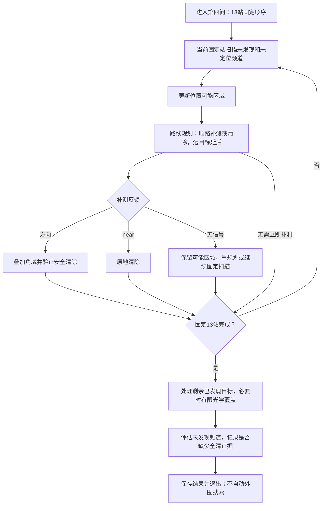

# 第四问13站试验版：实现与运行

状态：2026-09-12，按用户“先按圆内13站做一版，全部跑完再看是否需要增站”实现。保留顺路补测、清除和路线规划；未发现频道不触发自动外围搜索。第三问继续使用此前方案一路线版，其源码、配置和历史结果保持不变。

## 1. 本版实际做什么

1. 从圆心出发，依次扫描[13站最短路线](圆内十三站_覆盖核查与最短路线.md)，最后停在东南侧；只访问这些站的基线路程11.4公里，不要求返回圆心。
2. 每个固定站检测未发现频道与仍需定位的频道；已清除频道停止检测，已经具备19.5米安全清除位置的频道默认停止重复测向。同一点测过的频道不重复测量。
3. 固定站之间沿用第三问方案一路线版的目标插入、顺路清除和目标延后。固定站顺序保持不变，补测和清除位置可以动态变化，执行一个动作后重新规划。
4. 同一位置的补测或清除完成后，按需检测其他频道，默认最多4个。尚未发现的频道不会因此被宣告不存在。
5. 补测无信号是正常反馈：保留位置可能区域、记录“可能超距或处于发射背侧”，改选候选；同一路段连续两次无信号可将该目标延后，继续固定扫描。
6. 固定站结束后处理剩余已发现目标。最多8次主动定位测向；仍不够精确时，采用20米方格覆盖整个位置外包的有限光学清除。该回退只针对确认存在的源。
7. 最后输出增站评估和未发现频道，保存日志并退出。本版不会自动接着跑外围候选站。未知频道可能不存在，也可能尚未被接收，单凭无信号无法区分。

“不自动外围搜索”指没有为未知频道主动生成额外发现站。已发现目标的定位点、清除点仍按几何和路线选择，题目允许它们位于圆盘外；本版没有把机器狗的所有活动强行限制在圆内。

## 2. 如何测试

PowerShell先切换到项目根目录，避免相对路径在用户主目录下找不到：

```powershell
Set-Location 'D:\mywork\code\cumcm2026-b'
```

本地混合场景（不连接模拟器）：

```powershell
.\.venv\Scripts\python.exe -X utf8 .\scripts\run_q4.py
```

不同构造条件：

```powershell
.\.venv\Scripts\python.exe -X utf8 .\scripts\run_q4.py --seed 20260913 --count 16 --layout boundary --radius min --directional-fraction 0.5 --orientation random
```

用边界全部朝外的定向源检查漏检记录（预期13站可能无法发现源，不是脚本故障）：

```powershell
.\.venv\Scripts\python.exe -X utf8 .\scripts\run_q4.py --layout boundary --directional-fraction 1 --orientation outward
```

官方演练：先在模拟器中选择**第四问演练**并启动接口，然后执行：

```powershell
.\.venv\Scripts\python.exe -X utf8 .\scripts\run_q4.py --mode http --robot-id '202623003006'
```

本入口不控制模拟器的题号、演练/正式选择；这些由模拟器界面确定。开发期间没有调用官方模拟器，也没有使用正式测试机会。`--base-url`默认`http://127.0.0.1:2026`。

结果默认保存在`local-only/第四问/local-随机编号`或`local-only/第四问/http-随机编号`中。可以用`--output 'local-only/第四问/我的测试01'`指定尚不存在的目录；不覆盖旧记录。

## 3. 怎样读结果

每局保存`请求响应日志.jsonl`和`运行结果.json`，记录实际配置、源码SHA256、Git提交及运行时工作区状态。源码哈希用于精确识别包含未提交修改的本地运行，不能只凭Git提交号认定运行版本。

| 字段 | 含义 |
|---|---|
| 流程正常完成 | 按本版要求完成固定扫描、已发现源处理、末尾评估并正常退出；16源全清时可以提前结束 |
| 全部完成证据 | 运行中是否已经证明全部目标清除；本版只能利用成功清除16个不同频道这一上界条件 |
| 运行成功 | 延用项目严格含义：流程正常且有全部完成证据；不要与进程退出码混淆 |
| 未发现频道 | 从未返回方向或near的频道；不是“确认还有这些干扰源” |
| 已发现未清除频道 | 已经确认存在但未完成处理的频道，正常流程结束应为空 |
| 末尾增站评估 | 是否仍欠缺全清证明、待核查频道；自动新增未知源搜索站数固定为0 |
| 离线真值核验 | 仅本地构造在退出后附加，说明实际目标数、清除数和遗漏；HTTP运行没有此字段 |

本地一局实际13源全清时，仍可能显示“全部完成证据=false”，因为运行中接口没有告诉策略总数，另外7个频道也没有完整发现排除证书。这个结果表示证据范围，不等于已经证实有遗漏。官方演练是否实际全清，需要结合模拟器结束后的结果核对。

进程退出码0表示试验流程正常完成，1表示预算、协议或模型异常；不以退出码0声称官方全清。若预算中断，会保存已完成动作和异常，正常退出能否确认也单独记录。

## 4. 本版数学范围与参数

定向物理环境使用源位置G、检测位置S、固定半径R和轴单位向量u：接收需满足距离不超过R且u·(S−G)≥0。清除只检查20米距离，不受发射朝向影响；near需先满足接收条件。

位置外包复用第一至三问的角域裁剪和保守圆盘外包。无信号只存为含糊负反馈，不增加1000米排除圆；清除失败保留20米排除约束。本版没有实现位置与发射轴的联合区间细分。补测候选和角采样费用启发式沿用第三问，明确只估计接收到方向后的几何效果，不保证实际接收。失去信号通过执行分支和有限回退处理。

配置为[configs/q4_inner13.json](../../configs/q4_inner13.json)，主要参数如下：

| 参数 | 默认值 | 用途 |
|---|---:|---|
| angle_samples / candidate_limit | 9 / 24 | 每次规划的角度节点及候选数量 |
| planning_seconds | 0.8秒 | 单次候选评分现实时间上限 |
| max_localization_measurements | 8 | 单目标主动定位测向预算，不含固定和顺路扫描 |
| localization_detour_limit_m | 400米 | 固定站之间补测的绕行门槛 |
| route_action_limit | 24 | 一段固定站之间的检测/清除动作预算 |
| opportunistic_limit | 4 | 同站顺路检测其他频道的上限 |
| consecutive_no_signal_limit | 2 | 本路段连续无信号后延后该目标 |
| max_actions / runtime_limit | 10000 / 1200秒 | 总动作与现实时间预算，另保留退出时间 |

运行时可用`--no-opportunistic`关闭顺路检测，`--no-route-planning`关闭固定站间的路线插入与400米绕行筛选。后者仍保留每段动作预算和有限光学覆盖留到末尾的规则，属于第四问对照设置，不声称逐动作等于第三问原版。

## 5. 执行流程



任一阶段成功清除16个不同频道，或预算不足时，分别进入有依据的提前结束或异常停止流程。预算停止不标为正常完成。

## 6. 文件与验证

本阶段新增26项测试全部通过（9.22秒），全库226项通过（67.86秒）。首次默认13源本地试跑实际全清，虚拟时间6628.606秒，属于单次开发构造，不作为整体效率结论。修正了near反馈后不必要的最小覆盖圆穷举；近距直接用当前检测点验证清除证书。

随后固定该实现完成[12场景构造验证与中文图集](十三站试验版_验证与图集.md)：流程均正常结束，8场实际全清，2场各漏1源，2场边界全部朝外构造未发现源；合计清除128/156个源。记录漏检，不据此擅自启用外围补站。这些场景用于检查不同物理条件下的行为，不是官方成功概率估计。

- [运行入口](../../scripts/run_q4.py)。
- [第四问策略](../../src/cumcm2026_b/q4_strategy.py)。
- [本地物理环境](../../src/cumcm2026_b/q4_local_env.py)。
- [回归测试](../../tests/test_q4_inner13.py)：接收边界、背侧near与清除、协议幂等、负反馈保守性、13站不自动外围搜索、无信号后的有限清除、混合闭环、预算停止和本机HTTP入口联调。

测试命令：

```powershell
.\.venv\Scripts\python.exe -X utf8 -m pytest tests/test_q4_inner13.py -q
```

本地构造、临时HTTP测试服务和官方演练三者分别记录。本版适合先取得13站策略的真实测试信息；没有把此前反例中的覆盖缺口当成已经解决。
