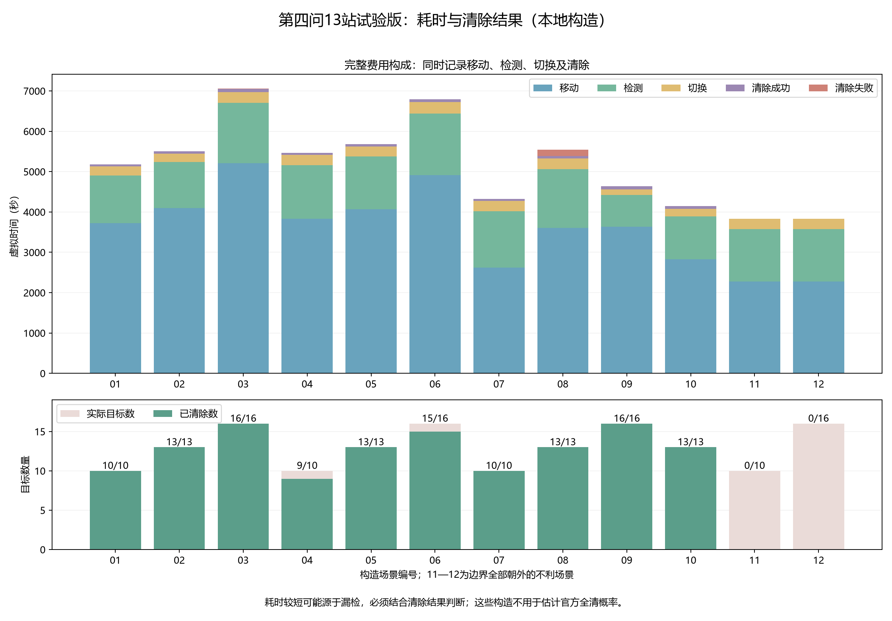
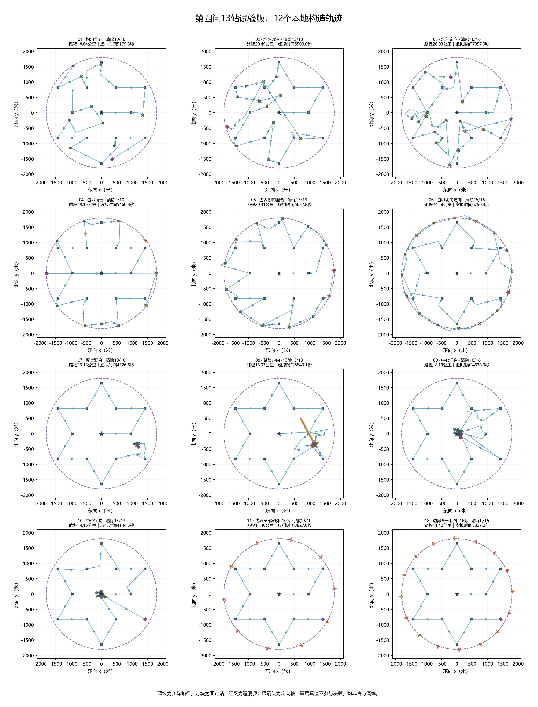

# 第四问13站试验版：本地验证与图集

2026-09-12。按用户要求先运行圆内13站，保留顺路定位清除，末尾评估而不自动外围搜索。以下均为本地构造，未调用官方模拟器，不是正式成绩。

固定策略来源提交：`1904860dd9c0940268d251c8f8248a47ab8d63cc`。运行记录保存实际配置和源码哈希；新增评估文件可使工作区显示非空，但逐个源码哈希已重新核对。

12个构造流程均正常结束，实际全清8/12场，合计清除128/156个目标。这些布局经过明确选择，不能把场数比例当成官方场景的成功概率。

## 逐场结果

| 编号 | 构造布局 | 清除/目标 | 路程（公里） | 总时间（秒） | 补测无信号次数 |
|---|---|---:|---:|---:|---:|
| 01 | 均匀全向 | 10/10 | 18.639 | 5179.820 | 0 |
| 02 | 均匀混合 | 13/13 | 20.485 | 5509.036 | 11 |
| 03 | 均匀定向 | 16/16 | 26.029 | 7057.864 | 28 |
| 04 | 边界混合 | 9/10 | 19.154 | 5460.800 | 0 |
| 05 | 边界朝内混合 | 13/13 | 20.314 | 5682.782 | 2 |
| 06 | 边界切向定向 | 15/16 | 24.577 | 6796.307 | 0 |
| 07 | 聚集混合 | 10/10 | 13.128 | 4326.551 | 7 |
| 08 | 聚集定向 | 13/13 | 18.030 | 5543.074 | 18 |
| 09 | 中心混合 | 16/16 | 18.192 | 4638.336 | 12 |
| 10 | 中心定向 | 13/13 | 14.153 | 4144.518 | 9 |
| 11 | 边界全部朝外_10源 | 0/10 | 11.400 | 3827.000 | 0 |
| 12 | 边界全部朝外_16源 | 0/16 | 11.400 | 3827.000 | 0 |

第11—12场把全部源放在圆盘边界附近并朝外发射，用于检查固定13站不足时的真实行为。程序不会为追求全清而擅自增加未知源搜索站；漏检及未发现频道保留在结果里。

实际全清是退出后的真值核验；运行中全清证据只在清除16个不同频道时成立。本版少于16源的场景即使事后全清，仍保留未知频道待核查状态。

## 动作核验

逐条重算3052次检测、128次成功清除和54次失败清除；检查535份位置外包包含真实源。

对每个动作独立按距离、固定发射轴、近距及光学半径重算反馈；核对示向误差、移动、切换、累计虚拟时间、固定站次序、同站扫描和清除证书。检查无信号没有添加1000米排除圆，不存在虚假的频道不存在证书。

本阶段沿用已通过的26项第四问回归及226项全库回归。构造检查没有调节默认策略参数，也没有据结果自动启用外侧补站。

## 中文图表





固定站、真实动作、起终点、顺路与其他清除均作标记。绿色实心圆为顺路证书清除，空心圆为其他成功清除，橙色加号为未命中尝试。真值位置和发射方向只用于事后绘图，不提供给策略；清除标记表示机器狗位置，可能与源真值略有不同。

| 场景 | 高清轨迹 | 可编辑矢量图 |
|---|---|---|
| 01 均匀全向 | [PNG](../../results/figures/第四问/十三站初版/轨迹01.png) | [SVG](../../results/figures/第四问/十三站初版/轨迹01.svg) |
| 02 均匀混合 | [PNG](../../results/figures/第四问/十三站初版/轨迹02.png) | [SVG](../../results/figures/第四问/十三站初版/轨迹02.svg) |
| 03 均匀定向 | [PNG](../../results/figures/第四问/十三站初版/轨迹03.png) | [SVG](../../results/figures/第四问/十三站初版/轨迹03.svg) |
| 04 边界混合 | [PNG](../../results/figures/第四问/十三站初版/轨迹04.png) | [SVG](../../results/figures/第四问/十三站初版/轨迹04.svg) |
| 05 边界朝内混合 | [PNG](../../results/figures/第四问/十三站初版/轨迹05.png) | [SVG](../../results/figures/第四问/十三站初版/轨迹05.svg) |
| 06 边界切向定向 | [PNG](../../results/figures/第四问/十三站初版/轨迹06.png) | [SVG](../../results/figures/第四问/十三站初版/轨迹06.svg) |
| 07 聚集混合 | [PNG](../../results/figures/第四问/十三站初版/轨迹07.png) | [SVG](../../results/figures/第四问/十三站初版/轨迹07.svg) |
| 08 聚集定向 | [PNG](../../results/figures/第四问/十三站初版/轨迹08.png) | [SVG](../../results/figures/第四问/十三站初版/轨迹08.svg) |
| 09 中心混合 | [PNG](../../results/figures/第四问/十三站初版/轨迹09.png) | [SVG](../../results/figures/第四问/十三站初版/轨迹09.svg) |
| 10 中心定向 | [PNG](../../results/figures/第四问/十三站初版/轨迹10.png) | [SVG](../../results/figures/第四问/十三站初版/轨迹10.svg) |
| 11 边界全部朝外_10源 | [PNG](../../results/figures/第四问/十三站初版/轨迹11.png) | [SVG](../../results/figures/第四问/十三站初版/轨迹11.svg) |
| 12 边界全部朝外_16源 | [PNG](../../results/figures/第四问/十三站初版/轨迹12.png) | [SVG](../../results/figures/第四问/十三站初版/轨迹12.svg) |

## 复现

在项目根目录执行：

```powershell
.\.venv\Scripts\python.exe -X utf8 .\scripts\build_q4_inner13_assets.py
```

以上重新运行12个构造并更新图表。只重读归档、核验和重绘：

```powershell
.\.venv\Scripts\python.exe -X utf8 .\scripts\build_q4_inner13_assets.py --plots-only
```

只核验已有数据与图表来源：

```powershell
.\.venv\Scripts\python.exe -X utf8 .\scripts\build_q4_inner13_assets.py --verify
```

[统计与来源哈希](../../results/tables/第四问/十三站初版_验证汇总.json)；[完整运行记录目录](../../results/models/第四问/十三站初版)；[使用说明](十三站试验版_实现与运行.md)。
