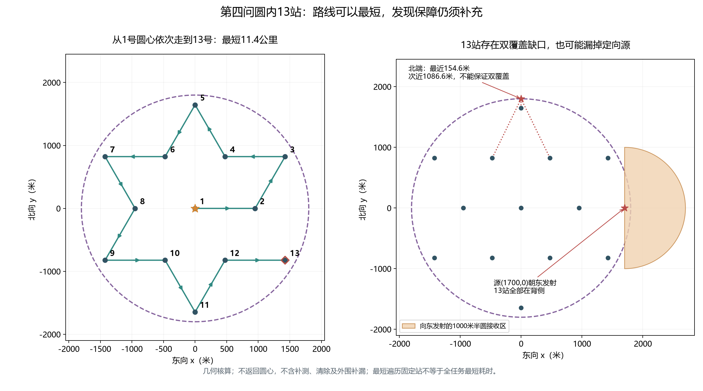

# 圆内13站：覆盖核查、最短路线与后续建议

**后续决定：用户要求先按13站做一版，全部跑完再评估增站。** 已建立[13站试验版实现与运行说明](十三站试验版_实现与运行.md)，本版不自动执行本分析建议的未知频道外侧补测；本文反例和最短路线证明作为依据保留。

状态：2026-09-12，针对用户提出的圆内13站及红线扫描路线进行分析。仅计算几何、整理待审核思路；未实现第四问运行策略，未修改第三问代码，未调用模拟器。

结论：从圆心出发遍历这13个固定站，可以构造并证明11.4公里的最短开放路线；但仅这13站不能保证全圆盘双重距离覆盖，也不能保证发现所有定向源。建议保留“主扫描路线加顺路定位清除”的思路，同时把未知频道所需的外侧补测纳入规划。

## 1. 使用了哪些站

取[上一轮构造数据](../../results/tables/第四问/初步覆盖构造核算.json)中距圆心不超过1800米的13个点，与用户附图蓝色站点对应。三角网边长为950米：中心1点，内圈半径950米的6点，外圈半径950√3≈1645.448米的6点。

用户附图红线作为路线建议分析，不作为对算法的新授权。其连线中间经过的蓝点，若停下检测，可以算作固定扫描站；仅移动经过不算观测。

## 2. 全向源也存在不能双覆盖的位置

取圆盘最北端G=(0,1800)，其最近的三个站为：

| 站坐标（米） | 距离（米） |
|---|---:|
| (0,1645.448) | 154.552 |
| (475,822.724) | 1086.597 |
| (−475,822.724) | 1086.597 |

题目允许该源的实际接收半径等于1000米，此时只有最近的一个站能接收到它。因此“圆内13站能保证所有源二次覆盖”不成立。真实半径较大时这些位置可能收到多次，但不能用未知的较大半径给出通用保证。

这也不是仅边界一点的退化现象：G=(0,1790)时第二近距离约1077.612米，仍大于1000米。几何上的两个检测圆覆盖，即使满足，也不代表两个带误差示向度足以达到清除精度。

## 3. 定向源可能连一次都收不到

取严格位于圆盘内部的源G=(1700,0)，发射轴向东。所有13站的x坐标最大为1425米，均小于1700米，因此全部位于发射背侧。

其中3个站明明距离G不超过1000米，却仍然全部无信号；即使实际半径取1500米，也无法消除背侧问题。只在这些固定站之间走直线，途中的x坐标同样不会超过1425米，增加线段上的停点也不能发现这个例子中的源。

第三问的顺路清除和自适应测点通常由已经发现的目标触发。它们可能偶然带狗到更合适的位置，但对这个一直没有被发现的源，不存在必然触发补测的依据。因此“发现以后再补第二站”和“怎样首先发现隐藏源”需要分别保障。

## 4. 从圆心出发，13站的最短路线为11.4公里

以下结论的条件是：所有13站都要访问，起点为圆心，自由选择终点，不要求返回起点；暂不计补测点、清除点和外围补漏点，允许任意直线移动。



按左图1—13顺序前进，先向东，然后沿内外站交替的路线向北、向西、向南，最后停在东南侧。每段恰好950米，共12段：

\[
L=12\times950=11400\text{米}.
\]

最优性证明：这13站任意不同两站的距离至少950米。从圆心起依次首次到达其余12个不同站，每段实际路径长度至少等于两站直线距离，因此任意可行路线总长不小于12×950米。所给路线达到该下界，所以在上述条件下为全局最短。

另用子集动态规划遍历站点子集，独立得到最短长度11400米。纯移动对应虚拟时间2280秒，不含检测、切换、补测、清除，也不是实际演练成绩。完整站序和坐标见[核算JSON](../../results/tables/第四问/圆内十三站_覆盖与最短路线.json)。

对用户附图，若将红线理解为从最北端到最南端的开放折线，其本身长约12.791公里；从圆心先直接接到最北端再完整走红线，则为约14.436公里。附图没有指定圆心如何接入，这里只记录一种解释，不把它视为用户唯一指定的路线。新构造直接从圆心出发，不需要先接到红线端点。

一旦插入真实目标的补测和清除点，11.4公里不再是整个任务的最短结果；应依据实际位置重新评估剩余站序及插入位置。

## 5. 我建议怎样保留用户的思路

### 主扫描路线

将这条11.4公里路线作为13站候选基线。它解决的是已给站点的遍历问题；是否将13站全部设为必经点，仍要与其他布局比较完整任务费用，不能仅凭固定站路程最短就确定第四问全局方案。

### 顺路定位与清除

保留第三问方案一路线版的目标延后、顺路服务和路线重规划。已达到19.5米安全清除条件的目标可以插入后续路线；未达到的，比较补测点、后续清除与回接搜索路线的整体费用。仍不恢复扇形清空机制。

第四问需调整两处物理判断：无信号不能删除站点周围1000米圆盘；按距离选出的补测点也不保证一定有信号。策略框架可以复用，这两项全向假设不能原样沿用。

### 对未知频道保留必要的外侧补测

上一轮31站中的外侧站可作为候选池，而非自动全部执行。每次实际检测后，按频道核对还有哪些源位置与发射朝向未被排除，再选能补这些缺口且方便衔接的站。

补测的触发依据必须包括未知频道的覆盖缺口，不能只看有没有已发现目标需要补第二次方向。对外向边界源，完整发现保障必然涉及圆盘外的检测位置；某个圆内近边界例子可能用更靠外的圆内站解决，但不能据此取消所有区域外站。

必要补测应提前与主路线一起规划，避免机械走完13站后再去外围重新绕一遍。智能补测站和清除位置可以替代部分候选站的作用，但要实际测过同一频道，并通过相应方向覆盖核查才能删减；不能把路过当作完成检查。

目前不承诺只需要额外两三个站，也不坚持31站最少。下一步可先计算13站之后不同发射朝向的剩余发现缺口，再联合优化外侧补测位置与整条路线；通过完整费用比较决定保留多少站。

## 6. 复现与本轮边界

在项目根目录运行：

```powershell
.venv/Scripts/python.exe -X utf8 scripts/analyze_q4_inner13.py
```

- [脚本](../../scripts/analyze_q4_inner13.py)：站点集合核对、路线下界、子集动态规划、距离和朝向反例、中文绘图。
- [核算数据](../../results/tables/第四问/圆内十三站_覆盖与最短路线.json)：包含站序、逐段距离、反例和来源哈希。
- [PNG](../../results/figures/第四问/圆内十三站_最短路线与覆盖反例.png)、[SVG](../../results/figures/第四问/圆内十三站_最短路线与覆盖反例.svg)。

原始定向源和接收规则依据见[上一轮详细方案](详细思路_待审核.md)。本轮为待审核分析，不改变第三问已选方案、不修改第四问运行配置或调用模拟器。
