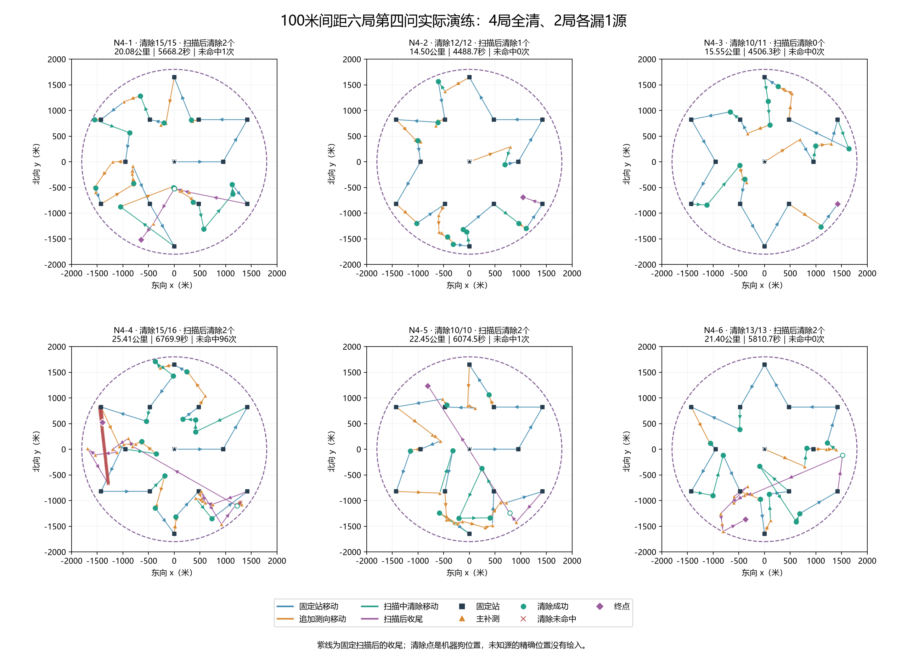
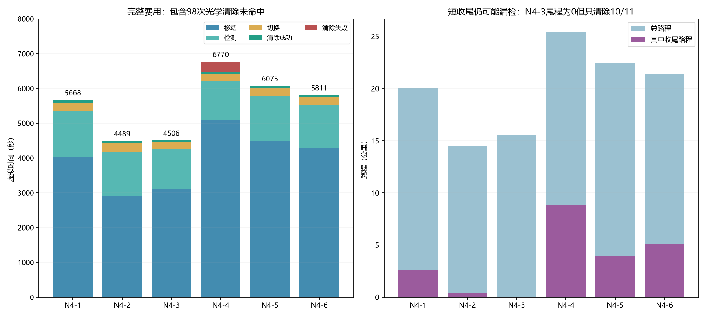
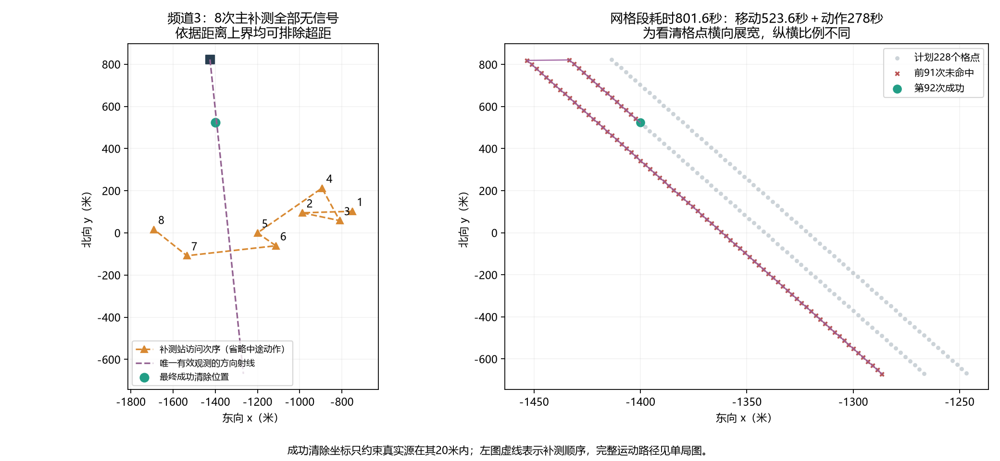

# 100米间距版本：新建文件夹七局演练分析

**六局第四问清除75/77个源，4局全清、2局各漏1源；不能认定当前100米间距版本已改善整体结果。** 第4局连续补测无信号及网格清除开销突出。另有一局官方第三问，实际执行了第四问13站脚本，单独统计。

## 数据与版本核验

输入目录含21个文件：7组jlog、psum和result.json。核对题号、案例码、演练号、摘要头和包SHA256，按同队号及唯一退出时间关联本地HTTP记录。没有解密日志正文或验证包签名；来源字段与逐动作证据均保存，队号、请求ID及原始HTTP内容不纳入新归档。

七局均记录提交`d4dfa86`、运行时工作区干净；实际配置均为100米补测优先间距、400米单次绕行门槛，运行源码逐文件SHA256一致。本批没有折线运行，所有场景都执行13个固定站；分析未运行模拟器或修改策略。

## 六局第四问结果（按结束时间排序）

| 编号 | 案例码 | 全向/定向 | 清除/目标 | 路程/公里 | 虚拟时间/秒 | 主补测/无信号 | 清除未命中 | 收尾/公里 |
|---|---|---:|---:|---:|---:|---:|---:|---:|
| N4-1 | PQHA-V36W-UMK2-ZC5E | 0/15 | 15/15 | 20.081 | 5668.2 | 18/8 | 1 | 2.653 |
| N4-2 | HET2-F2FK-WKWJ-BGTU | 8/4 | 12/12 | 14.499 | 4488.7 | 12/2 | 0 | 0.406 |
| N4-3 | QS6H-BQ3X-HYXH-6ZJW | 5/6 | 10/11 | 15.552 | 4506.3 | 9/2 | 0 | 0.000 |
| N4-4 | JM98-H5KZ-BP4H-J9BJ | 12/4 | 15/16 | 25.409 | 6769.9 | 23/15 | 96 | 8.822 |
| N4-5 | W7TP-2XAP-TQ4A-B2PH | 1/9 | 10/10 | 22.453 | 6074.5 | 17/11 | 1 | 3.952 |
| N4-6 | AJVR-N6WY-J9QT-UUR6 | 8/5 | 13/13 | 21.403 | 5810.7 | 14/7 | 0 | 5.074 |

N4-3漏1源，N4-4漏1源。两局都已处理完全部已发现频道，说明遗漏发生在发现阶段，没有把一个已发现目标留着不清除。日志缺少隐藏源真值，不能确定遗漏频道、坐标、类型或发射轴；官方只给本局数量及类型总数，不能直接断言漏的一定是定向源。

所有运行均正常退出，但程序的严格“运行成功=false”表示没有取得16源在线全清证明，并不等于六局都实际失败。本批实际全清与否按成功清除数和官方目标总数分别判断。



## 与此前六局演练比较

| 指标 | 此前原几何六局 | 本批100米六局 |
|---|---:|---:|
| 实际清除 | 79/79 | 75/77 |
| 全清局数 | 6/6 | 4/6 |
| 平均时间/秒 | 5181.4 | 5553.1 |
| 平均路程/公里 | 18.788 | 19.900 |
| 平均收尾/公里 | 3.713 | 3.484 |
| 主补测/无信号 | 93/49 | 93/45 |
| 顺路首次发现数 | 12 | 9 |
| 光学清除未命中 | 0 | 98 |

平均时间增加371.6秒（7.17%），平均路程增加1.112公里。这两批案例码全部不同，目标数及类型比例也不同，不是同地图配对，不能据此把退化归因于100米参数，也不能宣称100米提高了发现概率。

较短尾程不自动意味着更好：N4-3尾程为0，但漏1个源；N4-4最后只处理2个已知源，却走了8.822公里尾程。



## N4-4为何最慢

N4-4共6769.9秒、25.409公里，只清除15/16；23次主补测中15次无信号，光学清除96次未命中。其中频道3占91次，频道17占5次。这些未命中来自有限网格搜索，不能直接称为定位证书错误；本批所有带证书清除均成功。

- 频道3在固定站7首次收到方向，此后8次主补测全部无信号，达到8次预算；计划228个覆盖格点，实际第92次清除成功。该网格段移动2617.9米、移动时间523.6秒，清除动作278秒，总共801.6秒，占该局约11.84%。
- 频道17在固定站11首次发现，8次主补测中7次无信号；最终计划16个格点，实际6次清除，49.6秒。
- 两频道共96次未命中只直接花288秒；还存在到网格及格点之间的移动、前序无信号补测和跨区收尾。因此不能只减去288秒就当作修复后的耗时。

用成功清除站C给出的|真实源−C|≤20米，可得任一补测站P到源的距离上界|P−C|+20。频道3八次上界均不超过795.1米；频道17七次均不超过840.9米。由于题目接收半径至少1000米，可以排除超距，按题面物理规则将这15次无信号归因于发射背侧。100米间距拉开了位置，但并没有建立避开发射背侧的选点规则。



## 当前结论与下一步侧重点

100米规则确实执行了：本批六局全部93次主补测的实际位移及同频道上次站间距均通过核验，没有放宽间距。无信号仍有45次（48.39%），已知目标处理和未知源发现均存在缺口，不能靠继续机械增大间距解决。

优先分析如何用已有正负反馈筛掉明显位于发射背侧的候选点，以及何时等待后续固定站，尤其避免同一目标8次补测都无信号。另需区分“更好地处理已发现源”与“发现尚未接收的源”：后者受固定站和途中扫描位置影响，缩短尾程或拉开站距均没有完整发现保证。本轮只记录建议，没有恢复折线、自动加外围站、改变参数或重跑正式测试。

## 混入的第三问

`UC57-TCRC-AV9M-JQY6`的官方题号为3、10个全向源；实际日志保存在第四问目录，源码与配置均为第四问13站100米版本。结果10/10全清、4146.5秒、13.703公里。它可以证明这次运行完成，但不能混作第三问方案一七站策略的成绩，也不计入上述六局第四问。

后续演练应核对模拟器题号与运行入口是否对应。当前协议日志足以识别本次不一致，未据此推测操作者的具体原因。

## 逐局图与复核

- [N4-1 高清轨迹](../../results/figures/第四问/实测100米间距/N4-1_轨迹.png)
- [N4-2 高清轨迹](../../results/figures/第四问/实测100米间距/N4-2_轨迹.png)
- [N4-3 高清轨迹](../../results/figures/第四问/实测100米间距/N4-3_轨迹.png)
- [N4-4 高清轨迹](../../results/figures/第四问/实测100米间距/N4-4_轨迹.png)
- [N4-5 高清轨迹](../../results/figures/第四问/实测100米间距/N4-5_轨迹.png)
- [N4-6 高清轨迹](../../results/figures/第四问/实测100米间距/N4-6_轨迹.png)
- [混入P3-1 高清轨迹](../../results/figures/第四问/实测100米间距/混入P3-1_轨迹.png)

全部图另存SVG。清除位置是机器狗位置，不是真实源精确坐标；未发现源位置未画出。

```powershell
.\.venv\Scripts\python.exe -X utf8 scripts/analyze_q4_spacing_practice.py --verify --source-check
```

首次采集使用`--collect`；默认命令从归档重算并重绘。原始日志及HTTP仅用于只读核验，脱敏动作、来源与统计均单独保存。
