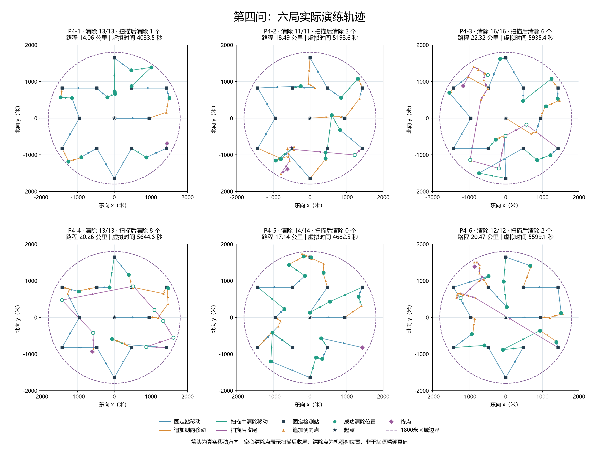
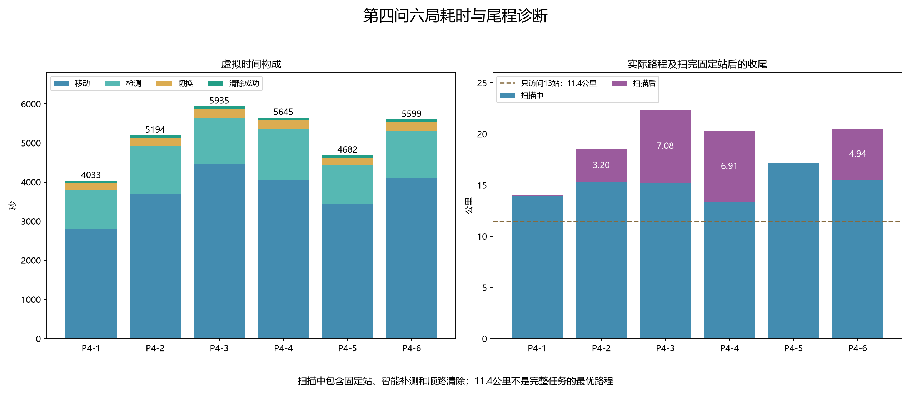
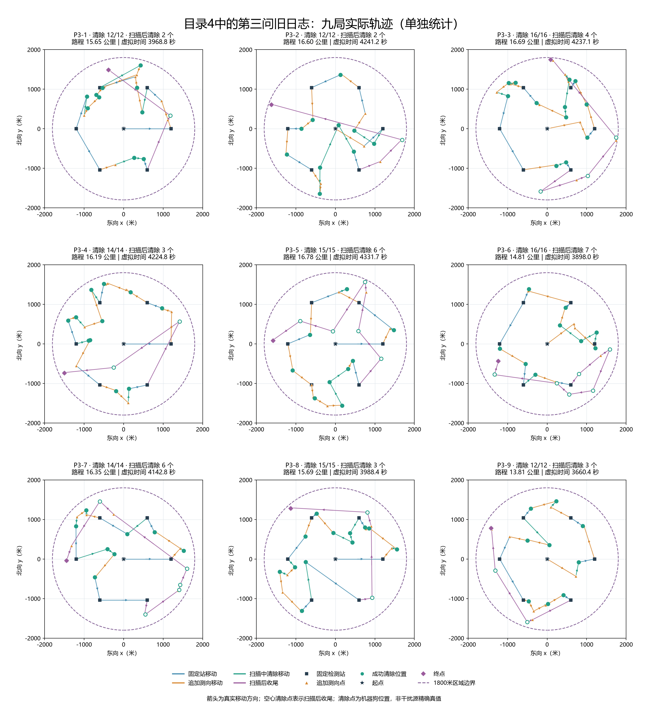

# 目录4：第四问实测结果与轨迹

本报告只分析用户提供的既有演练文件，未运行模拟器或修改策略。目录共有15组文件：6局第四问、9局第三问旧记录，各含jlog、psum、result.json。编号按各题结束时间排序；两题分别统计。

## 1. 第四问结果

6局均全清，共清除79/79个干扰源，均完成13站扫描，无清除失败、通信重试或通信异常。平均路程18.788公里，平均虚拟时间5181.433秒。这里的全清由结果文件目标总数与HTTP成功清除的不同频道数核对得出，不是程序仅凭13站自行证明。

| 编号 | 案例码 | 全向/定向 | 清除/目标 | 路程（公里） | 虚拟时间（秒） | 检测次数 |
|---|---|---:|---:|---:|---:|---:|
| P4-1 | 7DQH-AUK6-Y2NK-5H73 | 12/1 | 13/13 | 14.057 | 4033.475 | 195 |
| P4-2 | S5FC-XP5Q-3PRB-NQX2 | 9/2 | 11/11 | 18.493 | 5193.592 | 243 |
| P4-3 | 5MR2-3ATF-YHXH-XNMX | 10/6 | 16/16 | 22.317 | 5935.366 | 235 |
| P4-4 | 5HMT-R68C-3YQP-6E3M | 1/12 | 13/13 | 20.258 | 5644.601 | 258 |
| P4-5 | D8W7-U2PV-UXM6-2D5X | 12/2 | 14/14 | 17.137 | 4682.477 | 200 |
| P4-6 | HY42-E2ZN-W2SX-8JJH | 7/5 | 12/12 | 20.465 | 5599.086 | 245 |



图上固定方块是检测站，橙色三角形是追加测向点，绿色圆是成功清除时机器狗的位置；空心圆表示固定扫描结束后清除。紫色路径为扫描后收尾，箭头为实际方向。清除位置与干扰源真值可有20米以内的差异，未用清除位置冒充精确目标坐标。

## 2. 路程与时间花在哪里

平均移动时间3757.6秒，占总时间72.52%；检测与切换合计1358.0秒，占26.21%。主要成本仍是移动，检测也不能忽略。

| 编号 | 扫描中清除 | 扫描后清除 | 尾程（公里） | 尾程时间（秒） | 主动补测次数 | 其中无信号 |
|---|---:|---:|---:|---:|---:|---:|
| P4-1 | 12 | 1 | 0.137 | 32.345 | 5 | 0 |
| P4-2 | 9 | 2 | 3.200 | 693.988 | 14 | 8 |
| P4-3 | 10 | 6 | 7.084 | 1501.807 | 18 | 10 |
| P4-4 | 5 | 8 | 6.913 | 1466.585 | 24 | 14 |
| P4-5 | 14 | 0 | 0.000 | 0.000 | 10 | 4 |
| P4-6 | 10 | 2 | 4.945 | 1125.954 | 22 | 13 |



尾程以“固定扫描完成”事件为界，包含此后对已发现源的补测、清除及相关移动；它不是返回起点的路程。移动用途按目的动作归类，只用于费用归属，不能把所有去补测的线段都称为可删除的浪费。

以下逐局数据用于定位具体问题：

- **P4-1**：扫完13站后清除频道19，尾程0.137公里；主动补测5次，其中0次无信号。首次由顺路检测发现的频道：7、1、3。
- **P4-2**：扫完13站后清除频道3、16，尾程3.200公里；主动补测14次，其中8次无信号。首次由顺路检测发现的频道：无。
- **P4-3**：扫完13站后清除频道1、9、13、16、17、20，尾程7.084公里；主动补测18次，其中10次无信号。首次由顺路检测发现的频道：4、5、6、9、3、17。
- **P4-4**：扫完13站后清除频道4、7、8、9、13、14、15、17，尾程6.913公里；主动补测24次，其中14次无信号。首次由顺路检测发现的频道：6。
- **P4-5**：扫完13站后清除频道无，尾程0.000公里；主动补测10次，其中4次无信号。首次由顺路检测发现的频道：17、5。
- **P4-6**：扫完13站后清除频道11、16，尾程4.945公里；主动补测22次，其中13次无信号。首次由顺路检测发现的频道：无。

## 3. 如何解释这组结果

1. **13站加现有自适应机制，在本次6局中全部成功。** 这支持继续保留当前实验版本；不是任意位置、朝向都能发现的证明，也不能据此认定每个目标均被13个固定站中的两个接收到。顺路检测和主动补测也参与了发现、定位，目标清除后不会再在后续固定站接收。
2. **顺路清除确实工作，但收尾仍有明显差异。** P4-4只有5个目标在扫描中清除，8个留到末尾；P4-5的14个目标均在扫描中清除。固定站顺序虽然达到纯遍历11.4公里下界，却没有保证加入动态目标后的总路线最短。
3. **定向条件下，主动选出的几何补测点可能无信号。** 无信号动作仍要付移动、检测和切换费用。P4-2、P4-3、P4-4、P4-6均出现多次这种反馈；但不能仅凭无信号判断超距还是位于发射背侧，也不能凭6个不同案例断言定向源数量直接决定时间。
4. **结果字段要区分在线证明与事后核对。** 只有清除16源的P4-3具有在线全清证据。其余5局的“运行成功=false”代表未获得策略定义的全清证据；它们流程正常且经目标总数核对实际全清，不是异常退出。未发现频道可以实际不存在。

**两个具体瓶颈：** P4-4尾程6.913公里、耗时1466.585秒；其中频道8、9、13、17在扫描结束时已定位，最小覆盖圆半径分别约17.77、17.59、16.90、14.76米，均低于19.5米安全阈值，其余4个仍需补测。P4-3尾程更长，为7.084公里、1501.807秒，6个收尾目标中3个在扫描结束时已定位。这里只证明扫描结束时的状态，并未证明它们在更早经过附近时也已经满足清除条件。

P4-6尾程只处理频道11和16，却走了4.945公里、耗时1125.954秒。频道11在末尾连续7次主动补测无信号，第8次收到方向；频道16连续6次主动补测无信号，第7次收到方向（期间可能夹有其他频道的顺路检测）。合计15次主动补测中13次无信号，说明补测接收效率低。P4-2频道3及P4-6频道16还进入了有限方格光学覆盖，均在第一处清除便成功；这两次不带单点覆盖证书，是正常回退分支，不属于清除失败。其余77次成功清除的覆盖证书均已重算通过。

六局合计主动补测93次，其中无信号49次。六局有12个目标首次通过顺路检测发现；这说明实测验证的是“13站＋自适应机制”的组合，不能把成果全部归因于13个固定站。

后续若优化，优先考虑“更早处理预计会留在身后的目标”和“利用已有正负反馈约束定向朝向，提高补测接收概率”，并用相同场景对照验证。未作反事实计算前，不能把本表尾程全部当作可节约路程。本轮不改参数、不增加外围站、不修改既有策略。

## 4. 图集与复现

| 第四问 | PNG | SVG |
|---|---|---|
| P4-1 | [查看](../../results/figures/第四问/实测4目录/第四问/P4-1_轨迹.png) | [矢量图](../../results/figures/第四问/实测4目录/第四问/P4-1_轨迹.svg) |
| P4-2 | [查看](../../results/figures/第四问/实测4目录/第四问/P4-2_轨迹.png) | [矢量图](../../results/figures/第四问/实测4目录/第四问/P4-2_轨迹.svg) |
| P4-3 | [查看](../../results/figures/第四问/实测4目录/第四问/P4-3_轨迹.png) | [矢量图](../../results/figures/第四问/实测4目录/第四问/P4-3_轨迹.svg) |
| P4-4 | [查看](../../results/figures/第四问/实测4目录/第四问/P4-4_轨迹.png) | [矢量图](../../results/figures/第四问/实测4目录/第四问/P4-4_轨迹.svg) |
| P4-5 | [查看](../../results/figures/第四问/实测4目录/第四问/P4-5_轨迹.png) | [矢量图](../../results/figures/第四问/实测4目录/第四问/P4-5_轨迹.svg) |
| P4-6 | [查看](../../results/figures/第四问/实测4目录/第四问/P4-6_轨迹.png) | [矢量图](../../results/figures/第四问/实测4目录/第四问/P4-6_轨迹.svg) |

从项目根目录执行：

```powershell
.\.venv\Scripts\python.exe -X utf8 scripts/analyze_q4_practice_4.py --verify
# 使用归档动作重绘全部图表，不连接模拟器
.\.venv\Scripts\python.exe -X utf8 scripts/analyze_q4_practice_4.py
# 在保留本地原日志的电脑上，额外核对原文件SHA256
.\.venv\Scripts\python.exe -X utf8 scripts/analyze_q4_practice_4.py --verify --source-check
```

首次采集使用`--collect`；归档后的重绘和费用复核无需原始私有HTTP日志。统计见[评估JSON](../../results/tables/第四问/实测4目录_评估.json)，脱敏动作见[归档目录](../../results/models/第四问/实测4目录)。

## 5. 数据来源与验证边界

第四问运行版本均为`eec554a`，运行时Git工作区干净；逐文件源码与配置SHA256已核对。jlog公开头、psum公开头及result.json的题号、案例码、演练号一致，结果文件所记包哈希与jlog一致；同队号和唯一退出时间匹配本地HTTP记录。公开头不是密文内容证明，本报告未解密正文、未验证包签名。

HTTP请求逐动作与策略的动作、频道、位置、结果、示向度及虚拟时间核对；独立按距离÷5、检测5秒、切换1秒、清除成功5秒/失败3秒复算。第四问额外重建观测外包并复核清除证书，确认无信号未生成错误的1000米排除圆。官方文件没有提供可读取的精确目标位置与发射轴，不能重算隐藏真值物理反馈或在图中标出真值。

本次全部为既有演练，不是正式测试成绩，不是与第三问相同地图的配对实验。以下第三问只作目录完整性归档。

## 附录：同目录9局第三问旧日志

这些记录来自2026-09-11，均为第三问方案一路线版，与2026-09-12的六局第四问分别统计。

| 编号 | 案例码 | 清除/目标 | 路程（公里） | 虚拟时间（秒） | 轨迹 |
|---|---|---:|---:|---:|---|
| P3-1 | V3WR-N7MV-9WZA-77K9 | 12/12 | 15.649 | 3968.830 | [PNG](../../results/figures/第四问/实测4目录/第三问旧日志/P3-1_轨迹.png) / [SVG](../../results/figures/第四问/实测4目录/第三问旧日志/P3-1_轨迹.svg) |
| P3-2 | WW39-57ZH-JCXE-3V6A | 12/12 | 16.596 | 4241.216 | [PNG](../../results/figures/第四问/实测4目录/第三问旧日志/P3-2_轨迹.png) / [SVG](../../results/figures/第四问/实测4目录/第三问旧日志/P3-2_轨迹.svg) |
| P3-3 | SJP5-QCCF-4XGX-EYNT | 16/16 | 16.686 | 4237.114 | [PNG](../../results/figures/第四问/实测4目录/第三问旧日志/P3-3_轨迹.png) / [SVG](../../results/figures/第四问/实测4目录/第三问旧日志/P3-3_轨迹.svg) |
| P3-4 | NHJQ-9QD3-ECNM-4ZFW | 14/14 | 16.194 | 4224.777 | [PNG](../../results/figures/第四问/实测4目录/第三问旧日志/P3-4_轨迹.png) / [SVG](../../results/figures/第四问/实测4目录/第三问旧日志/P3-4_轨迹.svg) |
| P3-5 | EAG7-Z6HK-BJ9C-J73W | 15/15 | 16.784 | 4331.745 | [PNG](../../results/figures/第四问/实测4目录/第三问旧日志/P3-5_轨迹.png) / [SVG](../../results/figures/第四问/实测4目录/第三问旧日志/P3-5_轨迹.svg) |
| P3-6 | AR8E-DP34-5FAP-PEZ7 | 16/16 | 14.810 | 3898.050 | [PNG](../../results/figures/第四问/实测4目录/第三问旧日志/P3-6_轨迹.png) / [SVG](../../results/figures/第四问/实测4目录/第三问旧日志/P3-6_轨迹.svg) |
| P3-7 | HRAP-Q983-QRMW-M7UK | 14/14 | 16.354 | 4142.767 | [PNG](../../results/figures/第四问/实测4目录/第三问旧日志/P3-7_轨迹.png) / [SVG](../../results/figures/第四问/实测4目录/第三问旧日志/P3-7_轨迹.svg) |
| P3-8 | WDNK-4ZGV-8QPQ-WXHM | 15/15 | 15.692 | 3988.430 | [PNG](../../results/figures/第四问/实测4目录/第三问旧日志/P3-8_轨迹.png) / [SVG](../../results/figures/第四问/实测4目录/第三问旧日志/P3-8_轨迹.svg) |
| P3-9 | VEC8-AN2K-ZXWV-EX59 | 12/12 | 13.807 | 3660.440 | [PNG](../../results/figures/第四问/实测4目录/第三问旧日志/P3-9_轨迹.png) / [SVG](../../results/figures/第四问/实测4目录/第三问旧日志/P3-9_轨迹.svg) |

第三问合计清除126/126个源，平均路程15.841公里，平均虚拟时间4077.041秒。第三问尾程以最后一次固定站检测为界，与其原日志结构一致。


