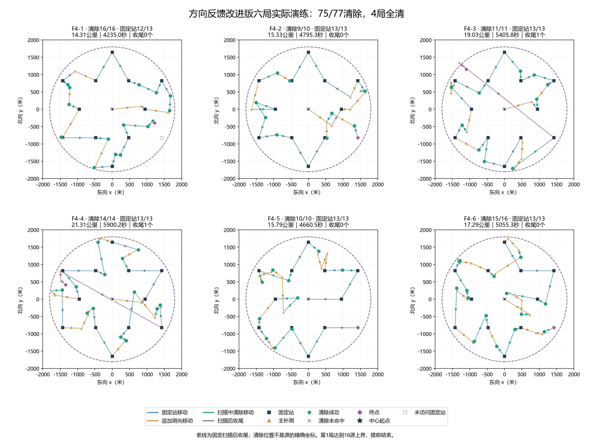
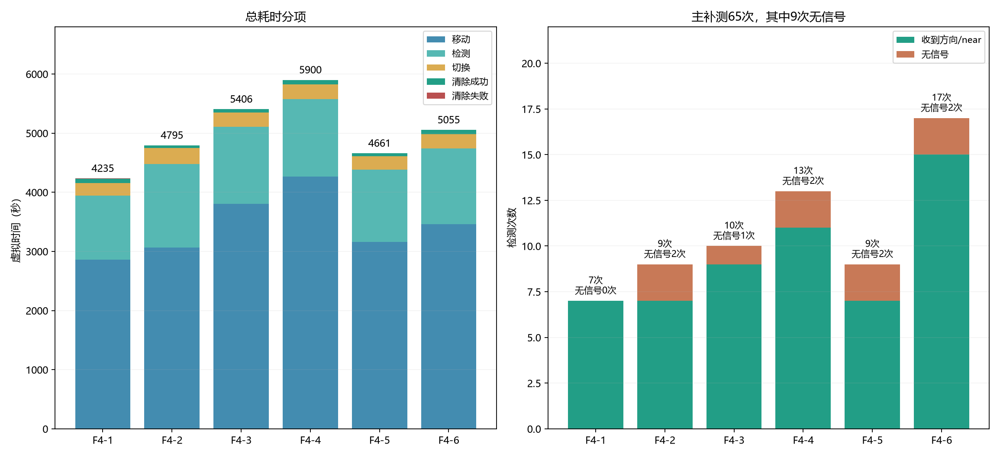
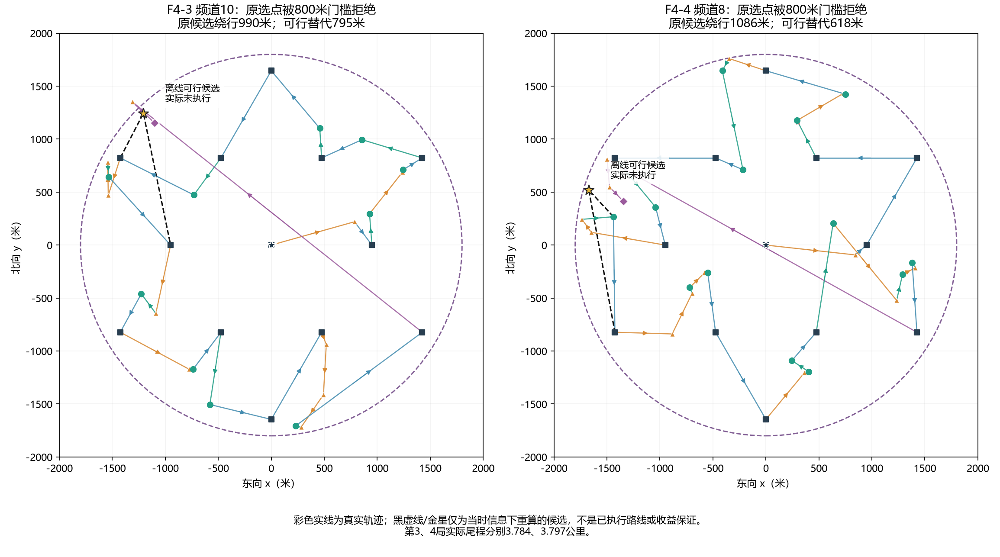
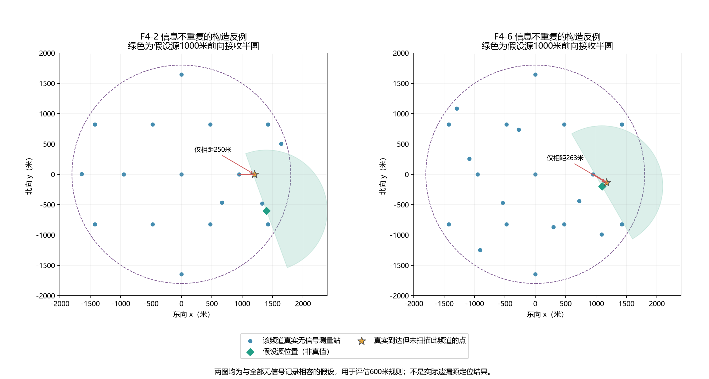

# 方向反馈改进版六局实际演练：结果、轨迹与后续优化

本批六局清除75/77个源，4局全清；F4-2、F4-6各漏1源。平均时间5008.7秒，平均路程17.177公里。已发现目标全部清除，发现缺口仍未解决；不存在“大量已定位目标未处理”的现象。

## 1. 来源、版本与真实轨迹

输入为“新建文件夹 (2)”的18份文件（六组jlog、psum、result.json），按官方结束时间编号F4-1至F4-6，与旧批N4及初版P4编号区分。六局均为第四问演练，记录提交`6dddfd5`、工作区干净；当前配置800米绕行、100米优先补测间距、方向反馈、小范围覆盖和未知频道补全均开启。已核对包SHA256、两个公开头和结果字段，并唯一关联本地HTTP记录逐动作复算。正文未解密、包签名未验证；原始材料未修改，没有新增模拟器调用。

| 编号 | 案例码 | 全向/定向 | 清除/目标 | 路程/公里 | 时间/秒 | 主补测/无信号 | 尾程/公里 |
|---|---|---:|---:|---:|---:|---:|---:|
| [F4-1](../../results/figures/第四问/实测方向反馈_新建文件夹2/F4-1_轨迹.png) | DUMK-V35F-37HH-XB3P | 14/2 | 16/16 | 14.305 | 4235.0 | 7/0 | 0.000 |
| [F4-2](../../results/figures/第四问/实测方向反馈_新建文件夹2/F4-2_轨迹.png) | 95WS-W3BR-X66V-UN5Q | 1/9 | 9/10 | 15.332 | 4795.3 | 9/2 | 0.000 |
| [F4-3](../../results/figures/第四问/实测方向反馈_新建文件夹2/F4-3_轨迹.png) | QW7N-AN2W-CFWA-P78N | 1/10 | 11/11 | 19.029 | 5405.8 | 10/1 | 3.784 |
| [F4-4](../../results/figures/第四问/实测方向反馈_新建文件夹2/F4-4_轨迹.png) | KPJB-BGQS-KW6J-78P6 | 6/8 | 14/14 | 21.311 | 5900.2 | 13/2 | 3.797 |
| [F4-5](../../results/figures/第四问/实测方向反馈_新建文件夹2/F4-5_轨迹.png) | UU46-GZ45-ZXVS-CRNN | 6/4 | 10/10 | 15.793 | 4660.5 | 9/2 | 0.000 |
| [F4-6](../../results/figures/第四问/实测方向反馈_新建文件夹2/F4-6_轨迹.png) | VR8U-5WA2-J8J2-H8K4 | 7/9 | 15/16 | 17.292 | 5055.3 | 17/2 | 0.000 |


F4-1在12个固定站后已清除16个不同频道，达到题目目标数上界，合法提前结束；图中站13为空心灰方块。其余五局访问13站。F4-2、F4-6均正常完成程序流程，但实际未全清。未知频道列表同时包含不存在的空频道，不能把列表长度当剩余源数，也不能从现有日志识别究竟哪个未知频道或坐标对应漏源。



表格编号链接到六张单局大图，均标注1800米边界、真实行进方向、固定站、补测点、清除频道、起终点及扫描后紫色尾程。圆点是机器人成功清除位置，真实源只能确定在其20米内，不能当成精确源坐标。

## 2. 哪些问题已经减轻

| 指标 | 上批100米/400米 | 本批反馈/800米 |
|---|---:|---:|
| 清除数量 | 75 | 75 |
| 全清场次 | 4 | 4 |
| 平均时间/秒 | 5553.1 | 5008.7 |
| 平均路程/公里 | 19.900 | 17.177 |
| 平均尾程/公里 | 3.484 | 1.263 |
| 主补测次数 | 93 | 65 |
| 主补测无信号 | 45 | 9 |
| 清除未命中 | 98 | 4 |
| 扫描后清除目标数 | 9 | 2 |
| 顺路首次发现目标数 | 9 | 22 |


两批案例码全部不同，虽然同为77个源、定向源数量也接近（上批43、本批42），空间位置、发射朝向及目标数量分布仍不同。平均时间变化-9.80%、路程变化-13.68%是两批描述性差值，不是同地图因果收益；全清数量仍为4/6，没有证据称本批发现能力已完全解决。

本批65次主补测有9次无信号，比例13.85%；上批45/93，48.39%。方向反馈实际启用32次，其中31次得到有效方向、1次无信号；这是本批选择过的检测结果，不能把31/32解释为候选支持度的概率校准。小范围顺路覆盖处理12个目标，全批仅4次清除未命中，未触发末尾大面积有限网格清除。

未知频道补全增加230次检测与1380秒检测/切换费用（平均每局230秒），其中18个源在这些新增检测中首次发现；全批顺路首次发现22个源。这说明附带扫描很有价值，但“首次在此发现”不等于关闭机制后必然少清除18源，其他后续站是否发现需要同地图对照。不能为降低时间直接关闭未知频道补扫。

| 编号 | 小范围清除目标 | 方向反馈次数/无信号 | 补齐未知检测 | 补齐首次发现 | 已知超距附带检测 |
|---|---:|---:|---:|---:|---:|
| F4-1 | 2 | 1/0 | 45 | 6 | 3 |
| F4-2 | 2 | 2/0 | 41 | 2 | 19 |
| F4-3 | 3 | 5/0 | 41 | 3 | 6 |
| F4-4 | 1 | 8/1 | 35 | 1 | 28 |
| F4-5 | 1 | 5/0 | 24 | 2 | 6 |
| F4-6 | 3 | 11/0 | 44 | 4 | 10 |



## 3. 优先优化：在可行补测点中选最优

F4-3和F4-4的长尾程分别为3.784公里/767.8秒、3.797公里/775.4秒，各只为一个早已发现的目标收尾。F4-3频道10在第7站首次发现，补测绕行989.8米被800米门槛拒绝；末尾从东南向西北返回，第一段就走3495.1米。F4-4频道8也在第7站发现，第8站后一次补测无信号，之后候选绕行1086.4米被拒，末尾第一段返回3347.9米。

代码当前先选综合评分最好的补测点，再在执行层检查绕行门槛；被拒后直接延后整个频道，没有在剩余合格点中重新选择。仅用当时已有观测、当前位置、剩余固定站离线重建候选池，可精确复现上述两次被拒绕行，并找到仍符合原两项路线规则的替代点：

| 案例/频道 | 被拒候选绕行/米 | 合格候选数 | 次优可行绕行/米 | 接收支持度 |
|---|---:|---:|---:|---:|
| F4-3/频道10 | 989.8 | 23 | 794.6 | 0.820 |
| F4-4/频道8 | 1086.4 | 14 | 618.1 | 0.706 |


建议先把800米补测约束及完整任务延后条件用于候选筛选，再在合格集合中评分。若合格集合为空，再比较是否延后或有限放宽门槛。这样优先修正选点与路线约束的衔接，避免只把800米统一加大。

替代点没有实际测量，支持度是启发式权重，并非接收概率或保证。特别是F4-4替代点对整个外包的最远距离约1292米，无法保证接收；不能承诺因此省下全部约770秒尾程。F4-3原被拒点的完整任务预测1492米、延后3247米，也提示应在无合格点时审查门槛与延后费用，而非一律把目标留到最后。



## 4. 同时优化：未知频道不能只按600米判定重复

F4-2和F4-6末尾分别有11、5个未知频道，每个都在13个固定站测过，实际只分别残留1源。由于缺少漏源真值，无法断言这两个源的具体位置、频道或发射轴；现有全部观测只证明其从未给出有效信号，不能判定是站点空间缺口还是顺路停点未扫描造成。

现有补全修复了4频道数量上限，但仍保留距该频道所有旧测量站至少600米的规则。对定向源，两个相距很近的点也可能分居前后半平面；“距离近”不能证明测量信息重复。已在两局真实停点找到构造反例：F4-2有未扫描停点距旧测量站仅250米；F4-6类似距离262.9米。为各自未知频道构造一个圆内位置、1000米半径与朝向，可同时满足所有真实无信号记录，却在该停点能够接收。位置与朝向是验证规则局限的假设，绝非实际漏源定位。

建议把600米改为常规稀疏扫描条件，并允许“此停点可区分仍相容的位置/朝向假设”的例外；只复用已到达停点，设置额外检测费用预算。已知目标朝向约束和未知频道假设应分开维护，未知频道没有第一条方向，不能直接套用已发现目标的反馈定位。该例外的收益仍需本地同图对照，不能据构造反例承诺补齐这两源。

若需要任意朝向发现保证，仅优化现有停点扫描仍不充分，13站及实际停点可能整体不经过某接收区。是否最终增加少量发现站应作为独立方案再评估；本轮未启用外围搜索或修改布局。



## 5. 次优先级：跳过可严格证明超距的已知目标检测

根据每次测量之前的连续正观测外包，发现72次附带检测对已知目标的最短可能距离已超过1500米，即便最大检测半径也不可能接收。这些检测的纯检测费用合计360秒，平均每局60.0秒；切换顺序变化及整体路线需要重算，不能简单加上全部原切换费用。

建议先核验严格距离下界再跳过，仅用于已经发现、外包有效的频道。未知频道不能以此排除。此项节省幅度小于长尾程问题，但判断依据明确，不需要放宽检测或清除安全条件。

## 6. 建议验证顺序与复现

优先比较“可行候选内选点”，再单独加入“未知频道信息增量补扫”，最后检查“已知目标确定超距免测”。预先固定地图，记录清除数量、全清、总虚拟时间及分位数、尾程、检测量、主补测无信号；保留更慢与漏源案例，不只追求一次绕圈或更少点数。当前800米版本作为基线，参数扫描与新验证场景分离；当前策略源码和配置未改。

```powershell
Set-Location 'D:\mywork\code\cumcm2026-b'
.\.venv\Scripts\python.exe -X utf8 scripts/analyze_q4_feedback_practice.py --verify --source-check
```

不带参数时从已归档脱敏动作重绘；`--collect`从现有六组原始文件及对应本地HTTP记录重新采集，不调用模拟器。保存6份脱敏逐动作JSON、费用及机制核验、两处候选重算、两个几何反例、10张中文图各PNG/SVG和来源清单。来源核验包括原始包、关联记录、运行代码与图文依赖。
