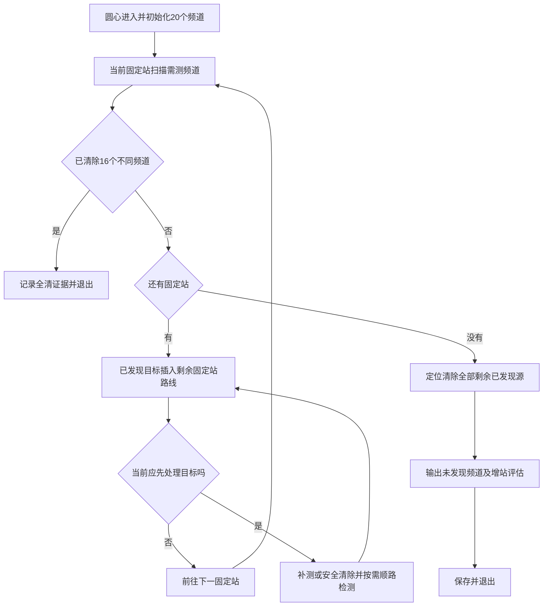

# 第四问当前策略完整说明

> 当前更新：折线方案已撤回。`run_q4.py`继续几何补测，默认配置改为`configs/q4_geometric_spacing.json`、优先间距100米；加`--probe-spacing 0`恢复本文原版行为。原13站及其他规则保持，详见[撤回后的运行与验证说明](撤回折线_几何补测间距.md)。

说明日期：2026-09-12。对应默认入口`scripts/run_q4.py`及配置`configs/q4_inner13.json`，核对时仓库提交为`ff0612a`。本次仅整理现有实现，没有把讨论过的朝向优化、额外外围站或扇形清空重新加入程序。

更新说明：用户已撤回[折线补测试验版](折线补测_对照实验与运行.md)，继续采用本文所述原几何选点及路线。折线记录只作为历史材料。

## 1. 整体任务与策略结构

当前策略是“13个固定站负责主扫描，已发现源通过动态补测定位，按剩余路线顺路清除，最后处理剩余已发现源并输出增站评估”。机器人从圆心出发，不要求回到圆心。

算法运行中不知道目标总数、坐标、发射朝向和每个频道的源类型。它对1—20频道维护记录，只读取检测和清除接口反馈。题面目标总数上界16用于结束证明；模拟器结束后的真实数量只用于事后评估，不参与动作选择。

当前有三个依次工作的层次：

| 层次 | 已实现内容 | 决策范围 |
|---|---|---|
| 固定扫描 | 13站及访问顺序固定 | 主搜索骨架 |
| 路线调度 | 把已发现目标插入剩余固定站路线 | 按几何路程安排先处理谁 |
| 单目标处理 | 安全清除，或候选补测，或有限覆盖 | 如何使该频道完成清除 |

这不是位置、发射方向、未来信息收益和总时间的联合全局优化。

流程图省略异常、预算和延后分支，下文逐项说明。13站结束后的评估不自动生成未知频道外围搜索点。

## 2. 固定站位置与顺序

令三角网边长a=950米，h=950√3/2≈822.724米。13站为圆心、半径950米的6个内圈点和半径950√3米的6个外圈点。

| 访问顺序 | 东向x（米） | 北向y（米） |
|---|---:|---:|
| 1 | 0 | 0 |
| 2 | 950 | 0 |
| 3 | 1425 | h |
| 4 | 475 | h |
| 5 | 0 | 2h |
| 6 | -475 | h |
| 7 | -1425 | h |
| 8 | -950 | 0 |
| 9 | -1425 | -h |
| 10 | -475 | -h |
| 11 | 0 | -2h |
| 12 | 475 | -h |
| 13 | 1425 | -h |

12段基线均为950米，总长11.4公里。对于必须访问这13个点、从圆心出发且终点自由的纯遍历问题，该长度达到下界。补测和清除加入后，不再宣称总路径最短。固定站顺序不随新发现目标改变，机器人也不按扇形逐区验收。

13站均在半径1800米圆内，但机器狗的补测点或清除点允许在圆外。“不自动外围搜索”限制的是为了发现未知源主动生成额外搜索站，不是把全部运动限制在1800米圆内。

## 3. 每个频道维护什么

每频道保存状态、已测坐标、检测反馈、方向约束形成的位置外包、失败清除排除约束、主动补测计数。

| 阅读时的分类 | 实际含义 | 后续处理 |
|---|---|---|
| 未发现 | 尚未收到方向或near | 固定站继续检测，也可能进入顺路检测名单 |
| 已发现未定位 | 已收到正反馈，但没有19.5米安全清除位置 | 继续测向或等待后续固定站 |
| 已定位待清除 | 已收到正反馈，存在19.5米安全清除位置 | 停止重复扫描，参与清除路线规划 |
| 已清除 | 对该频道成功清除 | 不再检测或清除 |

代码中的未定位、已定位待清除都属于`found`，每次按外包几何重新计算是否可安全清除，二者不是独立的持久状态。第四问不把未发现频道标为已证明不存在。

## 4. 收到反馈后如何定位

初始可能区域为半径1800米的圆盘，数值上用128边外切多边形保守包围。

### 返回方向direction

设检测站为S、示向度为θ，则用θ±1.005°角带以及以S为圆心的1500米圆约束裁剪既有位置外包。1.005°包含±1°误差与两位小数的0.005°舍入余量；1500米取允许的最大接收半径，不能将未知半径当作固定1000米而错误删除真实源。

圆约束采用外切多边形，故保存的是保守外包，不是精确物理可行域或单一交点。新方向与旧方向共同约束位置；当前凸外包也未为了direction反馈显式挖去5米近区。

### 返回near

先有接收才可能返回near。将可能区域与检测点周围5米圆的外包相交，随后立即在当前点尝试带证书清除。这是固定站扫描中可能插入立即清除的例外。

### 返回no_signal

保存反馈和已测坐标，但不以该点为圆心删除1000米区域，不改变当前位置外包。第四问无信号可能与发射方向有关，不能沿用第三问全向源的负圆排除方法。

当前没有建立位置与发射轴的联合模型，也没有进一步把可排除超距的无信号用于剪除背侧朝向。这使其稳妥保留位置可能性，但浪费了一部分可利用的信息。

## 5. 定位何时算足够，在哪里清除

对当前凸外包K计算最小覆盖圆：

$$r_* = \min_C\max_{G\in K}\|G-C\|.$$

若r*≤19.5米，就存在能够覆盖全部可能位置的安全清除点。判断的是“从某点进行20米光学清除是否有保证”，不是“至少收到两次方向”或“已经求出精确坐标”。两次交会角较差的观测仍可能不够，更多次测向也不必然更有用。

实际清除点不必是最小覆盖圆圆心。程序还尝试从前一位置、后一位置向圆心靠近的安全点，以及前后路线直线段上的安全点，并选择所考察候选中绕路较少的点。每个候选必须通过外包最远距离检查；执行前再次核验距全部可能位置小于20米。

安全清除失败时，程序记录20米排除约束并异常停止，要求核对物理或误差模型；不会假装成功继续。无单点证书的有限覆盖失败则属正常搜索过程，见第10节。

## 6. 固定站实际扫描哪些频道

到一个固定站后，程序扫描未发现和已发现但尚未定位的频道，默认跳过已定位待清除、已清除以及在同一坐标已测过的频道。尽量先扫描机器狗当前频道，再按频道号顺序测量，以减少切换。

除near立即清除、16源提前结束或异常外，先完成本站需测频道，再开始站间路线调度。发现一个普通方向不会立刻中断本站剩余频道扫描、马上追踪该源。

## 7. 如何进行顺路处理与路线规划

以“当前位置→全部剩余固定站”为路线骨架，将当前未延后的已发现目标逐个插入某条边或最后一个固定站之后。对每种插入计算几何增量：

$$\Delta L=|A-P|+|P-B|-|A-B|.$$

尾端插入没有后继B，只计从当前尾点到目标点的新增距离。程序反复选择当前增量最小的插入，再在不改变固定站顺序的条件下，对连续目标段做有限次反转改善。

已定位目标使用经验证的清除候选P；未定位目标暂用外包最小覆盖圆圆心代表其可能位置。这个圆心只是调度预测，不能直接据此清除。实际补测点另由测向规划器决定，可能与路线中的预测圆心不同。

只执行当前轮最前面的目标处理及本批顺路检测，然后根据最新反馈重规划。如果下一个任务是固定站，就退出本轮服务、继续固定扫描。因此即使目标已经定位，也可能被安排到更后的固定站之间或全部固定站之后，不保证一圈内清空。

路线层使用几何路程，不联合预测未来固定站将带来的定位精度、朝向接收概率、频道扫描费用和目标延迟清除的全部后果。

## 8. 自动补测选点及延后规则

只有轮到处理且仍未定位的已发现目标，才会专门计划补测。未知频道不单独生成补测搜索点。

候选池包括第二问几何构造的内缩候选、当前区域主轴坐标系下8个方向与30/75/150/300/500/650米偏移，以及第三问七站坐标。七站坐标只是候选池的一部分，不是额外固定七站扫描。

候选须满足：距外包最远点≤999.5米、距外包最近点>5.5米、距该频道所有已测坐标>0.01米，并去重。候选按距当前位置排序，在最多24个候选及0.8秒规划预算内考察；每个候选采样9个可能方向结果。

评分为移动距离÷5、一次检测5秒和“接收到所采样方向后”的收尾费用最大值之和。收尾费用取安全圆清除或有限蛇形光学覆盖；比较补测与直接有限覆盖，可能提前选择覆盖，无需等满8次。

当前未将无信号分支纳入评分。额外记录的“无信号后的保守回退费用”没有参与选点。距离约束保证了接收距离条件，并不保证位于定向发射正面。

| 限制 | 默认值 | 实際作用 |
|---|---:|---|
| 相对下一固定站的补测绕行 | 400米 | 超过则本轮延后；仅约束单次补测，不限制安全清除点 |
| 同轮同频道连续主补测无信号 | 2次 | 当前固定站间服务中暂缓该频道，下一轮可以再试 |
| 站间服务动作门槛 | 24次 | 每轮调度开始检查，达到后继续固定扫描；本批顺路检测可使计数越过门槛 |
| 每频道主动补测预算 | 8次 | 全过程累计，不包括固定站和顺路扫描 |

单次绕行以当前位置X、补测点P和下一固定站S计算：|XP|+|PS|−|XS|。若单目标规划选择有限覆盖但还有固定站，先将其延后，等固定扫描完成再覆盖。收尾阶段没有下一固定站，400米绕行、分段两次无信号和站间24次门槛不再适用；全局动作、时间和单频道补测预算仍然生效。

## 9. “顺路检测”如何工作

在一次主补测或成功清除位置，程序可以不增加移动地测其他频道，默认每次调用最多4个。它不会在连续移动中的每一米自动扫描，也不会在每个补测点重新扫遍全部20频道。

候选是非当前主目标、尚未完成的频道，并满足：当前位置与该频道所有既往检测位置的距离至少600米；该频道若已发现，当前点距其外包的最远距离还须≤999.5米；已定位待清除和同位置已测仍跳过。未发现频道没有位置可靠接收约束，只复用新停点尝试发现。

排序优先已发现但未定位频道，再优先既往检测次数较少者，最后按频道号。每次顺路检测仍消耗检测和频道切换时间；仅免去为此另走一段路。若它返回near，仍会立即原地清除。

## 10. 固定站扫完后如何收尾

重新规划所有剩余已发现目标的处理顺序。已定位者清除，未定位者继续补测；预算已用完、没有更划算的候选或规划判定覆盖较好时，执行有限光学覆盖。

具体是把位置外包放入随主轴旋转的包围矩形，以边长20米的方格覆盖整个矩形，按蛇形顺序访问格子中心；从四种起始方向中选择接入距离较短者。方格中心到格内任何点不超过10√2≈14.14米，小于20米清除半径。覆盖整个包围矩形，不会只留下“中心恰好落在多边形内”的格子而漏掉边缘。

机器人在这些点直接尝试指定频道的光学清除，成功就结束该目标；未命中记一次正常清除失败并继续下一格。它不要求清除点收到无线信号，也不重新对未知频道生成一轮网格搜索。有限覆盖的单个点不保证清除成功，整个覆盖序列在物理模型正确且执行预算足够时覆盖当前外包。

## 11. 停止条件、费用与记录

若任何阶段已成功清除16个不同频道，利用题面上界获得全清证据，可以提前结束。

否则，按用户指定试验流程：完成13站、处理全部已发现源，列出仍未发现频道并输出是否还欠缺全清证明，保存结果后退出。这个增站评估只是状态评估，不会计算并执行一条额外外围补漏路线，也不代表列出的所有未知频道都有源。

总费用按

$$T=\frac{L}{5}+5N_{\rm measure}+N_{\rm switch}+5N_{\rm success}+3N_{\rm failure}$$

核算。移动速度5米/秒，检测5秒，频道切换1秒，成功清除5秒、失败3秒。0.8秒候选规划和1200秒运行限制属于现实时间，与图表中的虚拟时间不同。实际执行还有10000个策略检测/清除动作预算、接口返回的期限及虚拟上限、正常退出预留时间等约束。

接口请求串行执行，通信不确定时同ID重试；未决动作不会被当作no_signal。异常或预算停止保存已有结果。日志记录实际动作、原始反馈、虚拟时间、配置及源码哈希。

`流程正常完成`只说明指定流程和退出正常；`全部完成证据`说明在线是否有全清证明；`运行成功`采用二者同时满足的严格口径。因此13/13实际全清的一局，在线也可能显示缺少全清证据，需要事后用模拟器结果核对。

## 12. 当前成果及尚未实现内容

用户提供的六局第四问演练共清除79/79个源，均正常结束；平均18.788公里、5181.433秒。它们验证当前组合策略在这些案例中的表现，不证明13个固定站具备任意朝向发现保障或完整双覆盖。

尚未实现：发射轴与位置联合推断、利用可排除超距的无信号约束朝向、以接收概率或完整无信号分支计入补测评分、预测下一固定站定位收益并与现在补测比较、根据目标信息改变固定站顺序、未知源外围发现保障和全任务最优证明。

已经实现但有局限：几何贪心路线插入、单步绕行门槛、保守位置外包和有限候选角采样。不能把“有路线规划”理解成“不会走回头路”，也不能把“有补测失败回退”理解成“补测点已经考虑了发射朝向”。

## 代码与资料

- [独立运行入口](../../scripts/run_q4.py)、[当前配置](../../configs/q4_inner13.json)。
- [第四问策略](../../src/cumcm2026_b/q4_strategy.py)：状态更新、固定扫描、服务调度、顺路检测和结束评估。
- [补测评分](../../src/cumcm2026_b/q3_strategy.py)、[几何外包与有限覆盖](../../src/cumcm2026_b/q3_geometry.py)、[路线插入](../../src/cumcm2026_b/q3_route_planning.py)。
- [实际演练与轨迹](实测4目录_结果分析与轨迹.md)、[P4-2和P4-4补测成因](追加检测逻辑与P4-2_P4-4成因.md)。

本说明由现有代码逐项核对形成；阅读本说明不需要运行模拟器。后续若修改配置或实现，应同步更新这里的规则和数值。
