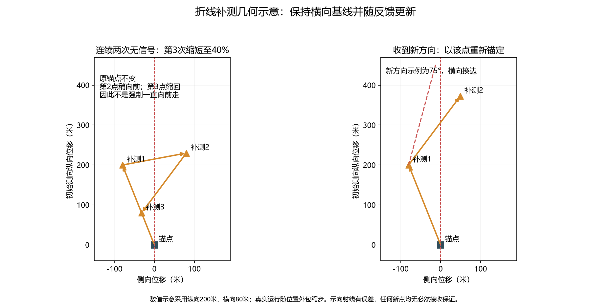
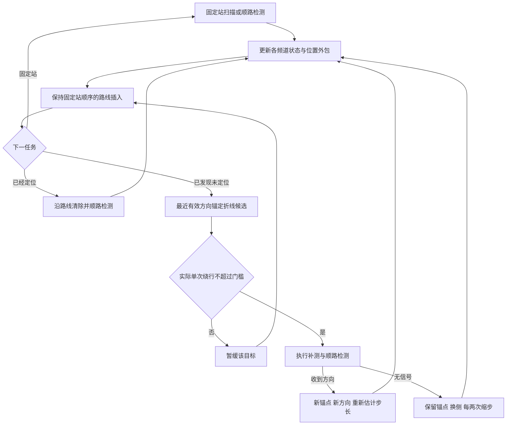
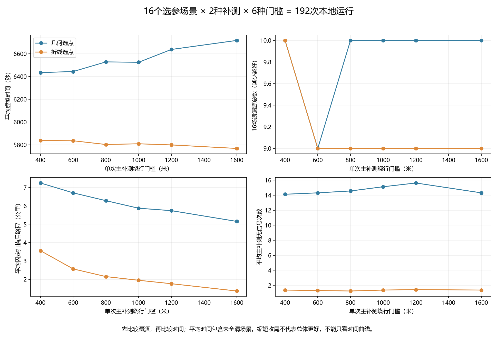
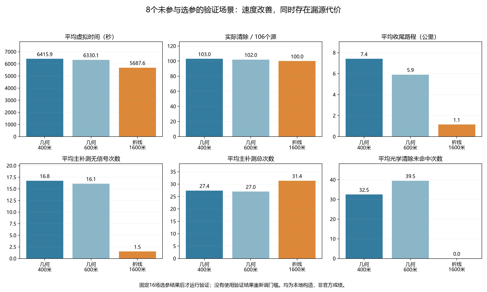
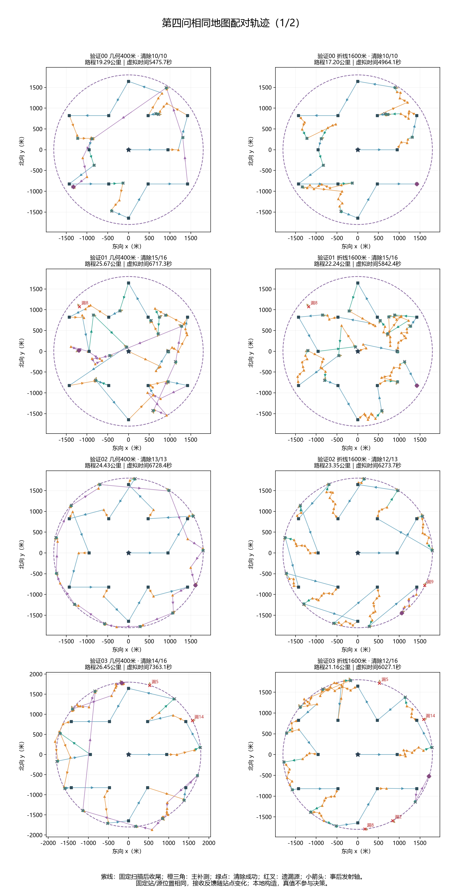
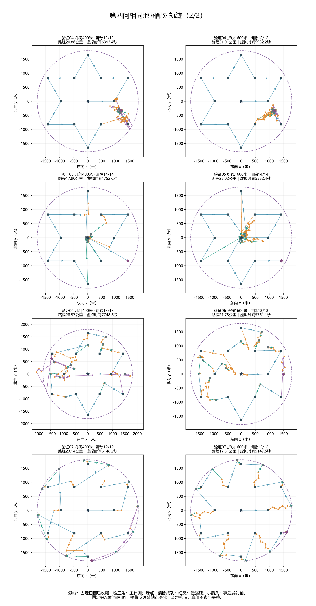

# 第四问折线补测：实现、对照实验与运行

> 状态更新：用户已撤回折线方案。本文及图表仅作历史试验记录，旧`run_q4_zigzag.py`现已转入当前几何方案，默认试用100米补测间距，见[撤回后的当前说明](撤回折线_几何补测间距.md)；下文折线运行命令不再运行历史折线策略。原运行入口已逐字节归档于`docs/第四问/历史代码/run_q4_zigzag_ccb0ad5.py.txt`。

本轮按用户示意实现“沿有效测向前进、左右交替设点”，并测试增大400米绕行门槛。**折线显著减少无信号补测与尾程，但独立验证多漏3个源，不能认定全面优于原版。** 新版作为独立试验入口；原入口与配置保留。

## 1. 当前版本与试验结论

- 原版：`scripts/run_q4.py`，仍使用原几何选点和400米默认门槛。
- 折线试验版：`scripts/run_q4_zigzag.py`，读取`configs/q4_zigzag.json`，配置文件暂取选参所得1600米。此值是本轮6个候选中的选参结果，不是全局最优或已通过覆盖验收的推荐值。
- 两版均保持13站、顺路扫描、定位后清除、路线插入、目标延后和末尾评估；没有重新加入扇形清空或自动未知源外围搜索，前三问代码不变。
- 新模块直接以类默认配置实例化时继承400米；运行入口通过JSON显式加载1600米。归档保存每次实际配置，复现时不要混用。

## 2. 如何生成折线补测点

最近一次真正收到`direction`的检测站作为锚点S，示向度给出单位向量d，n是d逆时针旋转90°的法向量。该正观测可来自固定站、主补测或顺路检测。初始发射轴未知，测得的是“站点指向源”的方向，不是干扰源的发射轴。

将当前保守位置外包投影到d上，投影区间中点相对S的距离记为估计量l（最低5米）。它只用于选择步长，不是真实距离。基本纵向步长与横向宽度为：

$$s=\min(200,\max(20,0.4l)),\qquad w=\min(80,\max(15,0.25l)).$$

最近正观测之后已经执行的该频道主补测次数记为k；该频道全程已经执行的主补测次数记为N。下一点为：

$$q=0.4^{\lfloor k/2\rfloor},\qquad
P=S+q\,s\,[1+0.15(k\bmod2)]d+(-1)^Nq\,w\,n.$$

1. 第一个补测点通常向前不超过200米、横移不超过80米，形成侧向基线。
2. 收到新方向，就把这个有效站点设为新锚点，使用新的方向与位置外包规划下一段；横向按已执行主补测次数交替。
3. 没收到信号，则保留最后有效锚点，尝试另一侧。两次都没有新方向时，下一对步长缩至40%，避免越过近处源后继续向前走。因此允许必要的局部缩回，并非所有段都强制向前。
4. 候选被路线判为暂不顺路时，不消耗折线序号；只有实际执行才计数。遇到已测重复点则转原有限覆盖分支。达到每频道8次主补测预算后也使用原回退。

200米、80米、1.15倍和40%都是本轮固定的启发式构造参数，**没有进行联合最优搜索**。新点不再使用原来的候选角评分，也没有原候选的999.5米全外包距离筛选；可能收到方向、near或无信号。新策略没有估计发射朝向或接收概率，不承诺左右测两次就一定成功。无信号仍不删除1000米圆内位置，不破坏保守定位外包。





图为扫描中核心流程；每轮连续两次无信号延后、24服务动作检查、每频道8次主补测及收尾有限光学覆盖仍按原规则执行。固定扫描完成后的处理没有“下一固定站”门槛分支，见原版[完整说明](当前策略完整说明.md)。

## 3. 门槛到底控制什么

当前位置X、候选补测点P、下一个固定站F对应额外路程：

$$\Delta=|XP|+|PF|-|XF|.$$

默认旧门槛为400米，新试验配置为1600米。只有当路线规划先选中该目标、且候选通过此门槛时才去补测；调大门槛不会强制把所有已发现源立即处理。门槛是单个补测动作的筛选，不是整频道或整局的绕行总预算，也不能保证不回头。以5米/秒计，1600米相当于该局部比较最多多320秒移动，须靠减少之后的回访等收益补偿。

路线仍使用未定位外包中心作为位置预测，未加入全局时间最优求解；已定位清除仍由原路线插入安排，不因更改补测门槛改变清除半径。

## 4. 配对试验设计

在读取本轮结果前固定：16个选参场景，种子96000—96015；8个独立验证场景，种子97000—97007。每8场依次覆盖均匀混合、均匀定向变半径、边界切向定向、边界混合变半径、聚集定向、中心混合、均匀定向最小半径、边界朝内混合。目标10—16个，定向比例50%或100%，半径最小1000米或混合1000—1500米。

每个选参场景交叉比较两种补测和400、600、800、1000、1200、1600米，共192次；同一场景的源位置、频道、发射轴、半径及误差生成规则一致，检测地点变化时反馈允许随之改变。逐份核对真值相同，策略只读公开反馈，结束后才添加真值用于评价。来源SHA256覆盖12个运行模块。

评价顺序预先固定为：先最少异常、最少漏源、最多全清局，再最低平均虚拟时间；并列取小门槛。两种选点分别选参，结果为几何600米、折线1600米。固定结果后，8个新场景只比较原几何400米、选参几何600米、选参折线1600米，共24次。**验证集不用于重新选择门槛。**

均为本地构造，非用户六局官方演练的重跑，也不是正式成绩。现有演练日志没有完整真值，无法用其直接模拟更改后的同地图反馈。全部未全清案例保留。

## 5. 选参结果

| 补测方式 | 门槛/米 | 清除/212 | 全清/16 | 平均时间/秒 | 平均尾程/公里 | 平均补测/无信号 |
|---|---:|---:|---:|---:|---:|---:|
| 几何 | 400 | 202 | 11 | 6434.6 | 7.249 | 24.25 / 14.12 |
| 几何 | 600 | 203 | 11 | 6443.6 | 6.711 | 25.56 / 14.31 |
| 几何 | 800 | 202 | 10 | 6528.3 | 6.286 | 25.75 / 14.56 |
| 几何 | 1000 | 202 | 10 | 6524.9 | 5.874 | 26.31 / 15.12 |
| 几何 | 1200 | 202 | 10 | 6637.4 | 5.742 | 27.31 / 15.62 |
| 几何 | 1600 | 202 | 10 | 6716.8 | 5.155 | 26.50 / 14.31 |
| 折线 | 400 | 202 | 11 | 5838.1 | 3.559 | 29.50 / 1.38 |
| 折线 | 600 | 203 | 11 | 5835.9 | 2.566 | 31.06 / 1.31 |
| 折线 | 800 | 203 | 11 | 5803.1 | 2.149 | 31.50 / 1.25 |
| 折线 | 1000 | 203 | 11 | 5809.3 | 1.947 | 31.88 / 1.38 |
| 折线 | 1200 | 203 | 11 | 5799.4 | 1.760 | 32.31 / 1.44 |
| 折线 | 1600 | 203 | 11 | 5768.5 | 1.363 | 32.56 / 1.38 |


几何选点单纯加大门槛并不稳定改善时间或清除率；折线版800—1600米的选参平均时间相近，1600米位于搜索区间上端，不能外推“越大越好”。折线400到1600米，平均时间只降低约69.6秒，平均尾程从3.559降至1.363公里；大量工作提前发生，尾程减少远大于总时间收益。



## 6. 独立验证：收益与代价同时报告

| 设置 | 清除/106 | 全清/8 | 平均时间/秒 | 平均路程/公里 | 平均尾程/公里 | 平均补测/无信号 |
|---|---:|---:|---:|---:|---:|---:|
| 几何400米 | 103 | 6 | 6415.9 | 23.288 | 7.412 | 27.375 / 16.750 |
| 几何600米 | 102 | 6 | 6330.1 | 22.907 | 5.909 | 27.000 / 16.125 |
| 折线1600米 | 100 | 5 | 5687.6 | 20.909 | 1.145 | 31.375 / 1.500 |


折线1600米相对原版400米，8场平均时间降低11.35%，平均路程减少约2.380公里，平均尾程从7.412降至1.145公里。主补测无信号总数从134降至12，但主补测总数从219增至251；更容易收到信号不等于一次就达到定位精度。新折线的小横移有时需要多次交会收缩，验证05中心混合场景反而从4752.6增至5552.4秒。

**平均时间包含未全清场景，不能直接解释为同等任务效率提高11.35%。** 同时报告双方都全清的5场（编号00、04、05、06、07）：原版平均6103.6秒，折线平均5471.5秒，减少10.36%；其中4场更快。这是事后描述子集，不能代替完整验证集评价或当成总体保证。



## 7. 为什么短路线反而多漏了源

折线版已发现的源均完成清除，新增遗漏发生在发现阶段。逐源用事后真值核查：验证02频道9、验证03频道2与8，在全部13个固定站均不满足接收条件；折线版实际对其执行的检测点也全部无接收。原版分别在顺路检测时首次发现这些源，其中频道9和8是在固定扫描完成后的绕行收尾阶段发现。

因此原版某些“绕路”同时提供了对未知定向源的额外扫描。减少这些轨迹，虽然降低已知源补测及回访成本，却也改变了未知源的发现机会。这不是折线定位把已发现目标丢失，也不是证明原版13站完全覆盖。详见[逐源核验JSON](../../results/tables/第四问/折线对照_核验与诊断.json)。

当前结论：保留折线作为可运行实验版；1600米只作本轮选参候选，原默认入口仍保留。后续若要把它作为最终方案，需要同时验证未知源发现能力；本轮未自动加入用户此前排除的外围搜索，也未用独立验证集反复调参来掩盖退化。

## 8. 同地图轨迹图

固定站顺序相同，方块为13个固定站；橙三角为主补测，绿圆为成功清除，紫线为固定扫描后收尾；红叉为遗漏源，细箭头为事后发射轴，不提供给策略。轨迹按真实动作顺序绘制，不人为闭合、不删除回头段。





- [验证00高清配对轨迹](../../results/figures/第四问/折线门槛对照/轨迹对照_验证00.png)
- [验证01高清配对轨迹](../../results/figures/第四问/折线门槛对照/轨迹对照_验证01.png)
- [验证02高清配对轨迹](../../results/figures/第四问/折线门槛对照/轨迹对照_验证02.png)
- [验证03高清配对轨迹](../../results/figures/第四问/折线门槛对照/轨迹对照_验证03.png)
- [验证04高清配对轨迹](../../results/figures/第四问/折线门槛对照/轨迹对照_验证04.png)
- [验证05高清配对轨迹](../../results/figures/第四问/折线门槛对照/轨迹对照_验证05.png)
- [验证06高清配对轨迹](../../results/figures/第四问/折线门槛对照/轨迹对照_验证06.png)
- [验证07高清配对轨迹](../../results/figures/第四问/折线门槛对照/轨迹对照_验证07.png)

## 9. 运行与复现

PowerShell先进入项目目录：

```powershell
Set-Location 'D:\mywork\code\cumcm2026-b'
```

仅在本地构造运行新版本：

```powershell
.\.venv\Scripts\python.exe -X utf8 scripts/run_q4_zigzag.py --mode local --seed 97000 --count 10
```

用户自行选择模拟器第四问演练后，可运行（本轮没有连接模拟器）：

```powershell
.\.venv\Scripts\python.exe -X utf8 scripts/run_q4_zigzag.py --mode http --robot-id '你的队号'
```

测试其他门槛，例如800米：

```powershell
.\.venv\Scripts\python.exe -X utf8 scripts/run_q4_zigzag.py --mode http --robot-id '你的队号' --detour-limit 800
```

日志保存于新建的`local-only/第四问/{模式-唯一编号}/`，包含源码来源、实际配置、请求响应和运行结果。回到旧版仍运行`scripts/run_q4.py`；不必删除新版。

重建并核验本轮归档与图文：

```powershell
.\.venv\Scripts\python.exe -X utf8 scripts/evaluate_q4_zigzag.py --stage 选参
.\.venv\Scripts\python.exe -X utf8 scripts/evaluate_q4_zigzag.py --stage 验证
.\.venv\Scripts\python.exe -X utf8 scripts/evaluate_q4_zigzag.py --stage 核验
.\.venv\Scripts\python.exe -X utf8 scripts/build_q4_zigzag_assets.py
.\.venv\Scripts\python.exe -X utf8 scripts/build_q4_zigzag_assets.py --verify
```

选参和验证命令默认读取已存在归档，核对源码版本，补跑缺失局；已有结果不会被悄悄重跑覆盖。若运行源码改变会拒绝混用旧实验。192+24份完整运行压缩JSON在`results/models/第四问/折线门槛对照/`，汇总在`results/tables/第四问/折线门槛对照.json`。

原几何方法仍含0.8秒候选规划上限；不同硬件重新执行可能改变实际处理的候选数量。跨机器精确复核应重读原始动作并重算物理反馈、费用和图表，不能仅以随机种子承诺逐动作完全一致。
