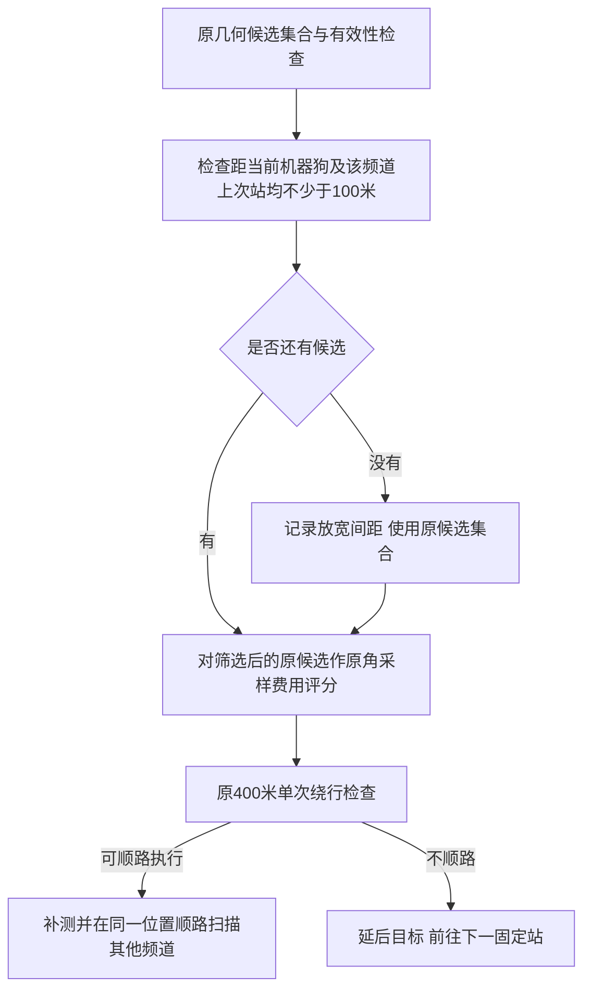
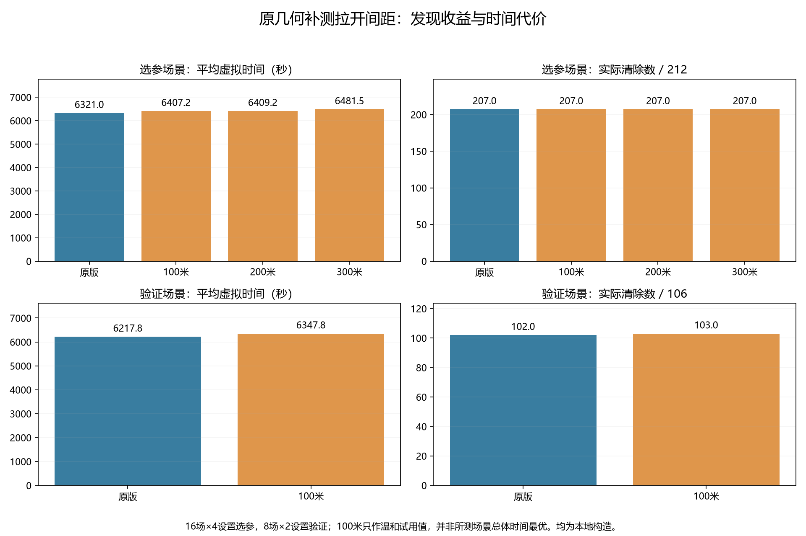
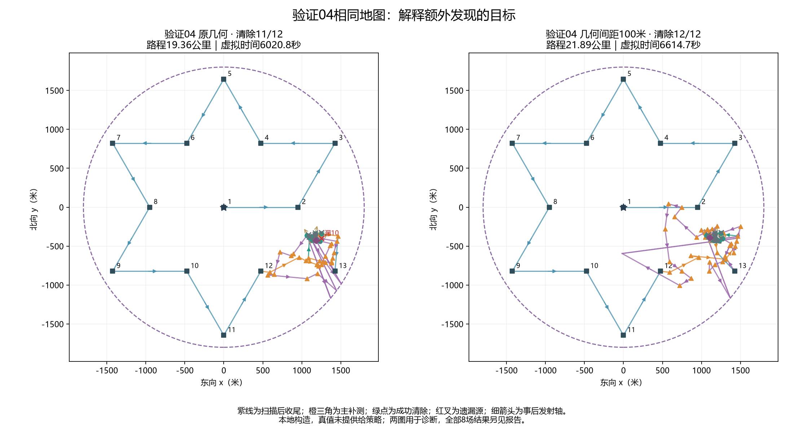
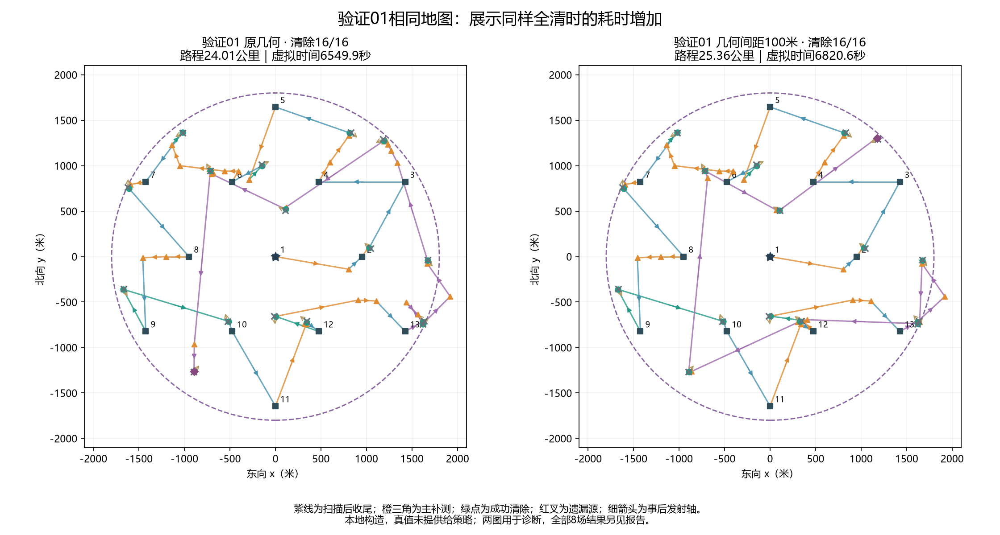

# 撤回折线，恢复原几何补测并试用100米间距

用户已取消折线方案。**当前仍使用原几何候选与角采样费用评分，试用“优先拉开100米”的补测间距。** 原命令`scripts/run_q4.py`继续使用；旧折线入口也转入当前几何方案。折线模块、216次实验及图表仅作历史复核，不重新启用折线。

## 1. 本次改动

用户说的“增大两个观测点距离”，本轮按“把主动补测站放得更分散、让机器狗实际移动到不同位置”处理。不是增大600米同频道顺路扫描间隔，也不是把400米绕行门槛改大。

原方案在候选几何筛选中只避免该频道与旧站相差不足0.01米的重复坐标，并没有100米最小间距。现在从原候选集合中，优先保留同时满足以下条件的点P：

$$|P-X|\ge b,\qquad |P-S_{\mathrm{last}}|\ge b,\qquad b=100\ \mathrm{米}.$$

X为机器狗当前位置，S_last为**该频道上一次检测位置**。约束不是所有频道所有历史站的两两距离，也不对13个固定站强制重排。当前站与该频道上次站有时不同，因此两个条件都要检查。

筛选后仍按原移动成本加角采样后续成本评分，不指定左右交替，不沿单条射线固定步进。保留原正观测外包、候选距离上限999.5米、近区过滤、8次主补测预算及有限光学覆盖。

若当前没有满足间距的候选，放宽间距并回到原候选集合，记录`间距约束已放宽=true`。这是一项优先规则，**不保证每段都至少100米**；不能为了拉开站点而直接放弃已发现目标的可行定位机会。候选仍须通过400米单次绕行门槛，不顺路时继续延后。



13个固定站和11.4公里纯遍历、停止已定位频道的重复固定检测、每轮连续两次无信号延后、顺路扫描最多4个其他频道及600米间隔、19.5米安全清除证书、结束规则均保持。没有新增未知源外围搜索，也没有改动前三问运行代码。

## 2. 80次本地对照及选值依据

16场种子98000—98015，分别比较原版（间距0）及100、200、300米，共64次；8场新种子99000—99007比较原版与100米，共16次。沿用均匀、边界、聚集、中心以及全向/定向混合等8种预设布局。每个场景的目标位置、频道、半径、发射轴和误差生成规则相同，策略只读反馈，退出后才读取真值用于评价。

16场选参按异常、漏源、全清数、平均时间的顺序，**总体仍选中0，即不增加间距的原版**。100米是非零候选中时间最小的温和值，因此选它进入8场新场景验证；没有用验证结果重新调节100/200/300米参数。

| 阶段 | 间距/米 | 清除/目标 | 全清/局数 | 平均时间/秒 | 平均路程/公里 | 平均主补测无信号 |
|---|---:|---:|---:|---:|---:|---:|
| 选参 | 0 | 207/212 | 13/16 | 6321.0 | 22.952 | 12.938 |
| 选参 | 100 | 207/212 | 13/16 | 6407.2 | 23.376 | 11.812 |
| 选参 | 200 | 207/212 | 13/16 | 6409.2 | 23.571 | 9.250 |
| 选参 | 300 | 207/212 | 13/16 | 6481.5 | 23.904 | 8.875 |
| 验证 | 0 | 102/106 | 5/8 | 6217.8 | 22.345 | 12.000 |
| 验证 | 100 | 103/106 | 6/8 | 6347.8 | 22.958 | 10.875 |


16场训练构造中，各设置均清除207/212个源；100米平均比原版慢86.2秒，没有证明发现率增加。新8场验证中，100米清除103/106，原版102/106，多清除一个；全清从5场变6场，但平均时间从6217.8增至6347.8秒，多约130.0秒，路程多约613米。

按照用户本次希望适度扩大沿途发现机会的偏好，**把100米作为试用默认值，是一次明确的发现与耗时取舍，不是统计证明的最优参数**。这24个构造不足以证明总体发现概率提高，更不能保证任意定向源全清；如果优先保留原时间策略，可直接把间距设为0。



## 3. 全部独立验证结果与轨迹

| 验证场景 | 原版清除 | 100米清除 | 原版时间/秒 | 100米时间/秒 |
|---|---:|---:|---:|---:|
| 00 均匀混合 | 9/10 | 9/10 | 5932.3 | 6022.2 |
| 01 均匀定向变半径 | 16/16 | 16/16 | 6549.9 | 6820.6 |
| 02 边界切向定向 | 13/13 | 13/13 | 6819.5 | 6819.5 |
| 03 边界混合变半径 | 14/16 | 14/16 | 5867.4 | 5927.3 |
| 04 聚集定向 | 11/12 | 12/12 | 6020.8 | 6614.7 |
| 05 中心混合 | 14/14 | 14/14 | 4667.0 | 4604.8 |
| 06 均匀定向最小半径 | 13/13 | 13/13 | 8048.5 | 8136.1 |
| 07 边界朝内混合 | 12/12 | 12/12 | 5837.2 | 5837.2 |






两组轨迹按用途选择用于解释收益与代价，没有把它们当作随机代表。完整80份运行压缩JSON保存在`results/models/第四问/几何补测间距对照/`，[逐局汇总](../../results/tables/第四问/几何补测间距对照.json)保留未全清案例。所有已发现源最终均清除；遗漏仍发生在未发现阶段。

## 4. 运行方法

在模拟器选择第四问演练后，由用户自行运行：

```powershell
Set-Location 'D:\mywork\code\cumcm2026-b'
.\.venv\Scripts\python.exe -X utf8 scripts/run_q4.py --mode http --robot-id '你的队号'
```

默认读取`configs/q4_geometric_spacing.json`，优先补测间距100米，绕行门槛400米。原`configs/q4_inner13.json`仍逐字节保留；旧折线配置不应再传入当前入口。

完全恢复未加间距的原几何选点：

```powershell
.\.venv\Scripts\python.exe -X utf8 scripts/run_q4.py --mode http --robot-id '你的队号' --probe-spacing 0
```

也可用`--probe-spacing 200`手动比较；本轮没有证据说明200或300米优于100米。无须更改源码，也不需要恢复折线。

本地复核，不连接模拟器：

```powershell
.\.venv\Scripts\python.exe -X utf8 scripts/run_q4.py --mode local --seed 99000 --count 10
.\.venv\Scripts\python.exe -X utf8 scripts/evaluate_q4_spacing.py --stage 核验
.\.venv\Scripts\python.exe -X utf8 scripts/build_q4_spacing_assets.py --verify
```

已有选参/验证命令读取归档、补跑缺失局，并拒绝混用不同运行源码。原几何候选处理有0.8秒规划上限，不同硬件重新执行可能改变实际评估数量；精确历史复核采用原动作重算，不声称只凭随机种子就能逐动作完全复现。

## 5. 归档和验证

原Q4核心`q4_strategy.py`和第三问核心保持不变，间距扩展单独实现于`q4_spacing_strategy.py`，0米直接委托原几何函数。旧运行与图表来源涉及入口变更的文件，逐字节保存在`docs/第四问/历史代码/`；核验器只允许当前文件或明确映射的历史源码与原SHA256完全匹配，不重写历史运行、原始演练或旧图表。

本轮没有调用官方模拟器。结构测试、临时本机HTTP入口测试、80次动作/外包/清除/费用/间距复核，以及旧图表来源兼容核验均应完成后再使用本试用版；具体通过记录见项目工作日志。
