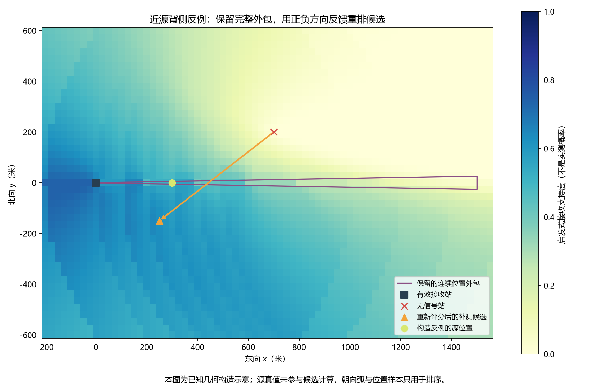
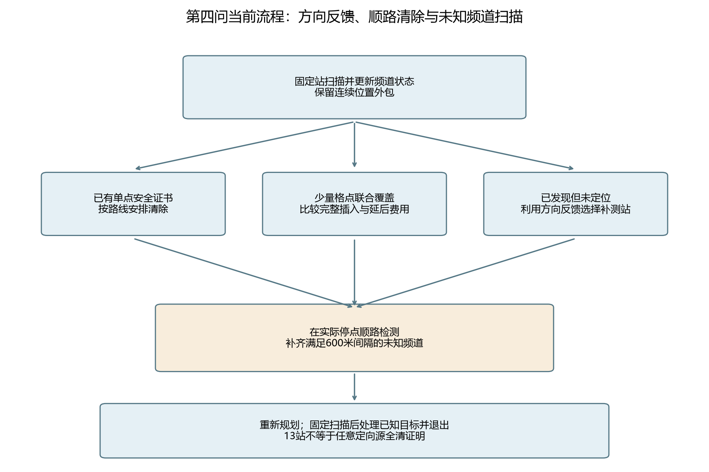
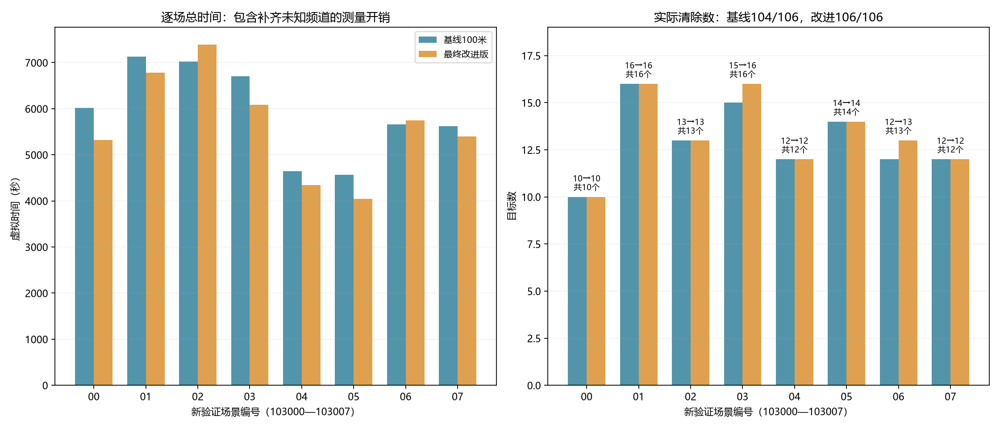

# 第四问改进版：方向反馈、顺路覆盖与未知频道补全

当前入口仍为`scripts/run_q4.py`，默认读取`configs/q4_feedback.json`。独立新8场验证：改进106/106、8/8全清；基线104/106、6/8全清。平均时间减少4.74%，从5920.2降至5639.4秒。这是本地构造证据，不是官方成绩，也不是任意定向源全清保证。

## 当前配置与运行

默认开启小范围顺路覆盖、方向反馈选点、完整任务预测及合格未知频道扫描补全；优先补测间距100米、绕行门槛800米、最多4个小范围覆盖点。同频道顺路检测的600米距离间隔、13固定站顺序、8次主补测预算、20米清除物理半径及末尾不自动外围搜索保持。

```powershell
Set-Location 'D:\mywork\code\cumcm2026-b'
.\.venv\Scripts\python.exe -X utf8 scripts/run_q4.py --mode http --robot-id '你的队号'
```

恢复本次改进前的100米几何版本：

```powershell
.\.venv\Scripts\python.exe -X utf8 scripts/run_q4.py --mode http --robot-id '你的队号' --strategy spacing
```

单独传`--probe-spacing 0`保留历史语义，恢复未增加间距的原几何版本。显式`--strategy feedback`优先；给旧配置文件且不显式指定策略时采用旧spacing类。`--detour-limit 600`可覆盖门槛，但本轮新验证没有据结果回调门槛。旧折线入口也转入当前策略，不恢复折线。

无官方接口的本地复核：

```powershell
.\.venv\Scripts\python.exe -X utf8 scripts/run_q4.py --mode local --seed 103003 --count 16 --layout boundary --radius mixed
.\.venv\Scripts\python.exe -X utf8 scripts/evaluate_q4_feedback.py --stage 核验
.\.venv\Scripts\python.exe -X utf8 scripts/evaluate_q4_discovery.py --stage 核验
.\.venv\Scripts\python.exe -X utf8 scripts/build_q4_feedback_assets.py --verify
```

命令须从项目根目录执行。HTTP题号在模拟器中选择；Python不会替用户切换题号。较早文档中的“当前”指其生成时的版本，运行参数以本文及实际日志配置为准。

## 1. 小范围覆盖也可以顺路清除

位置外包半径超过19.5米时，不能冒充单点安全证书。新版对旋转包围盒最多4个20米网格点求完整访问顺序，以当前位置X、下一固定站F计算：

`额外路程 = |XQ1| + Σ|QiQi+1| + |QkF| − |XF|`

`最坏增加费用 = 额外路程/5 + 3(k−1) + 5`

只有整组绕行不超过门槛、预测不比延后更贵、且本路段剩余动作额度能容纳整组，才执行；一旦清除成功即停止。格点联合覆盖整个外包，成功不依赖方向接收。实际清除成功后保留顺路检测，其费用另计。较大区域继续用有限回退，不在中途大面积扫网格。

## 2. 用正负方向反馈重新评价候选

此前几何候选要求对整个位置外包都处在999.5米内；近处源可能已被越过，剩余候选仍在背侧。新版在已发现频道出现可排除超距的无信号后激活方向反馈：位置G与发射朝向u同时考虑，有效站P给`u·(P−G)≥0`；距离已保证的无信号站Q给`u·(Q−G)<0`。

在完整正观测外包中取最多41个代表位置，每个位置计算允许朝向的圆弧交集；收到正反馈的最远距离与1000米下界共同给半径下界，含距离歧义的负反馈按各假设分别判断。无可用样本时回原几何方法。

候选包含原几何方向附近的位置及最后有效接收站附近的位置，没有左右交替的固定次序。候选不再一律要求离整个外包都小于1000米；可容忍部分假设超距，但会用接收支持度降低其评分，并明确记录距离保证是否成立。仍优先保持100米实际站间距；不足时记录放宽。

评分为移动与检测成本，加“接收到方向后的采样后续费用”与“无信号后保守覆盖费用”的加权值；权重是位置样本和朝向弧的启发式支持度，未被校准为真实概率。连续位置外包不因该采样删减，所有单点清除仍检查完整外包；重复无信号后样本重算，8次预算和有限回退保证已发现任务仍有终止路径。



## 3. 完整任务预测与路线

路线仍保持13固定站的先后顺序。未定位任务同时估计“去补测点→到可能目标代表位置清除→回下一站”的完整路程，以及放到后续固定路段的插入代价；只先执行一个动作，再按新反馈重规划。单次补测绕行仍受800米门槛约束；当完整任务超过门槛且预测延后更省路程时，延后处理。代表位置和后续费用均为预测，不能充当定位证书或全局最优证明。

## 4. 补齐真实停点的未知频道

第一轮800米版在旧验证场景02比基线多漏频道2、8。事后核查两源在13固定站均不可见，但新版已到达可接收它们的位置：对应频道距最近旧测量站分别827.4、816.9米，符合600米间隔，却被“最多扫描4频道”排在外面。

最终版先执行原最多4个候选的顺路检测，再把同一停点仍未发现、且距离所有该频道旧测量站至少600米的其他频道补齐。已清除频道不重测，已发现但未定位频道仍保留原限额规则。新增检测只发生在已经到达的补测或清除停点，没有加外围站或插入移动路径；检测与切换费用全部计入结果。



## 5. 实验阶段与边界

第一阶段16个预设场景101000—101015，7种设置共112次。排名先少异常、少漏源、多全清，再比总时间，选中800米。第二阶段8个新场景102000—102007，共24次，原800米设置的速度改善伴随新增遗漏，故未直接接受为最终版。

随后根据可见停点漏扫的具体机制补齐未知频道，800米及其余参数固定。原8场再跑8次只作诊断复查；第三阶段8个全新场景103000—103007与基线配对，共16次，不据其结果重新调参。合计160次完整运行。每阶段保留全部结果，包括更慢、漏源及被修正的版本。

| 阶段/设置 | 清除/目标 | 全清/局数 | 平均时间/秒 | 平均路程/公里 | 平均主补测无信号 |
|---|---:|---:|---:|---:|---:|
| 选参·两项组合400 | 203/212 | 8/16 | 5543.2 | 20.068 | 1.188 |
| 选参·仅小范围400 | 201/212 | 7/16 | 5981.8 | 21.885 | 9.312 |
| 选参·仅方向反馈400 | 203/212 | 8/16 | 5635.3 | 20.471 | 1.000 |
| 选参·基线100米 | 203/212 | 8/16 | 6066.4 | 22.238 | 9.750 |
| 选参·完整任务400 | 201/212 | 7/16 | 5576.2 | 20.249 | 0.812 |
| 选参·完整任务600 | 203/212 | 8/16 | 5514.4 | 19.923 | 1.062 |
| 选参·完整任务800 | 203/212 | 8/16 | 5440.0 | 19.686 | 1.062 |
| 验证·两项组合400 | 103/106 | 5/8 | 5605.9 | 20.099 | 1.375 |
| 验证·基线100米 | 103/106 | 5/8 | 6230.7 | 22.355 | 10.500 |
| 验证·完整任务800 | 101/106 | 4/8 | 5352.0 | 19.143 | 1.375 |


| 阶段/设置 | 清除/目标 | 全清/局数 | 平均时间/秒 | 平均路程/公里 | 平均主补测无信号 |
|---|---:|---:|---:|---:|---:|
| 新验证·基线100米 | 104/106 | 6/8 | 5920.2 | 21.391 | 7.750 |
| 新验证·完整任务800与未知补全 | 106/106 | 8/8 | 5639.4 | 19.656 | 2.000 |
| 诊断复查·完整任务800与未知补全 | 104/106 | 6/8 | 5708.5 | 20.138 | 1.875 |


小范围清除单独启用并非总能改善：选参场景11改变沿途扫描后有新增漏源，因此不能凭局部50秒测算就宣称整局必然更优。最终采用组合机制并补齐合格未知频道，已将新增扫描开销计入新验证结果。



| 新验证场景 | 基线清除 | 改进清除 | 基线时间/秒 | 改进时间/秒 |
|---|---:|---:|---:|---:|
| [00 均匀混合](../../results/figures/第四问/改进版_方向反馈与顺路覆盖/新验证00_轨迹对照.png) | 10/10 | 10/10 | 6017.6 | 5319.3 |
| [01 均匀定向变半径](../../results/figures/第四问/改进版_方向反馈与顺路覆盖/新验证01_轨迹对照.png) | 16/16 | 16/16 | 7131.8 | 6781.9 |
| [02 边界切向定向](../../results/figures/第四问/改进版_方向反馈与顺路覆盖/新验证02_轨迹对照.png) | 13/13 | 13/13 | 7022.1 | 7395.8 |
| [03 边界混合变半径](../../results/figures/第四问/改进版_方向反馈与顺路覆盖/新验证03_轨迹对照.png) | 15/16 | 16/16 | 6702.1 | 6084.3 |
| [04 聚集定向](../../results/figures/第四问/改进版_方向反馈与顺路覆盖/新验证04_轨迹对照.png) | 12/12 | 12/12 | 4646.2 | 4342.0 |
| [05 中心混合](../../results/figures/第四问/改进版_方向反馈与顺路覆盖/新验证05_轨迹对照.png) | 14/14 | 14/14 | 4566.7 | 4045.7 |
| [06 均匀定向最小半径](../../results/figures/第四问/改进版_方向反馈与顺路覆盖/新验证06_轨迹对照.png) | 12/13 | 13/13 | 5657.3 | 5745.4 |
| [07 边界朝内混合](../../results/figures/第四问/改进版_方向反馈与顺路覆盖/新验证07_轨迹对照.png) | 12/12 | 12/12 | 5617.5 | 5400.6 |


新验证场景02改进版仍更慢；场景06多清除1源但也更慢，均原样列出。双方共同全清的6场，平均时间由5833.6降至5547.5秒，减少4.90%；其中5场更快。不能把未全清时的较短时间直接当作效率优势。本轮8/8不能推出任意发射朝向的连续发现保证，特别是固定站不可见且实际路径没有经过接收区的目标。

## 6. 复现、验证和保留内容

所有运行保存完整压缩JSON、场景、配置、源码SHA256及退出后真值；逐动作核验物理反馈、示向误差、移动/检测/切换/清除费用、外包包含真值、清除证书、固定站次序及同图性。安全外包、前三问和旧Q4核心未改；新模块分别为`q4_feedback_strategy.py`与`q4_discovery_strategy.py`。

全库270项自动测试通过（86.91秒），含新方向反馈、联合覆盖、完整任务费用及未知频道补全回归；当前CLI本地种子103003的16源边界混合场景清除16/16，6084.278秒，与新验证03归档一致。未连接官方模拟器。

图表共12张，各有PNG/SVG：消融选参、新验证费用、方向反馈示意、策略流程，以及全部8组新验证配对轨迹。原始官方日志和之前图表未覆盖；变更入口及核验器逐字节留档，历史哈希只接受当前文件或指定的精确档案。运行有现实规划时限，不同机器重跑可能改变实际评估数，历史动作重算才是精确审计。
