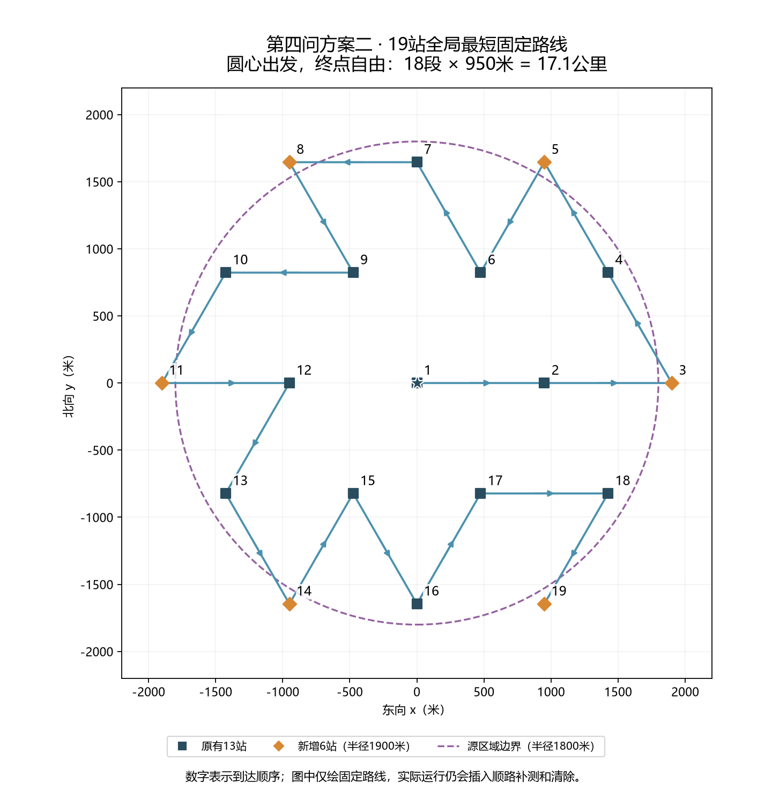
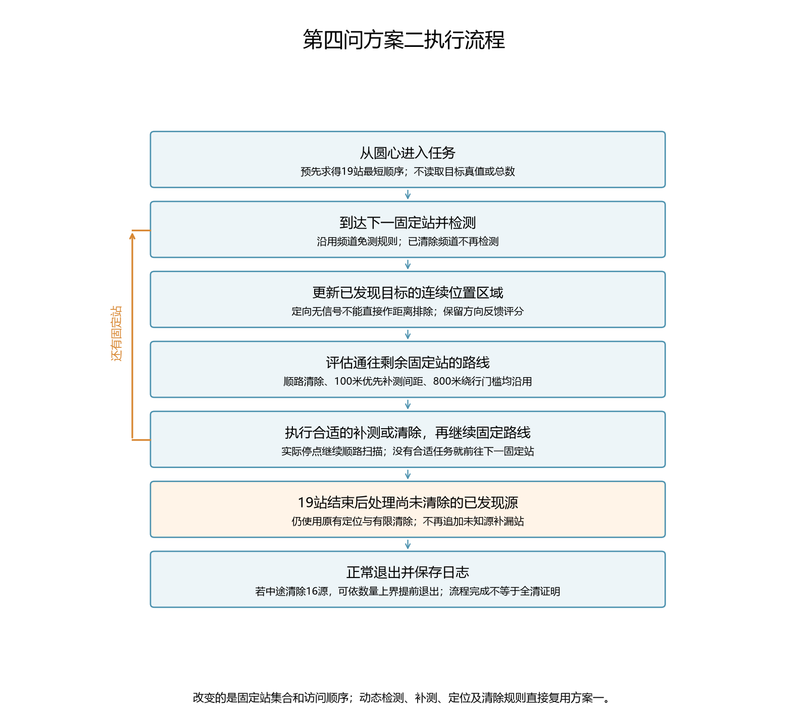
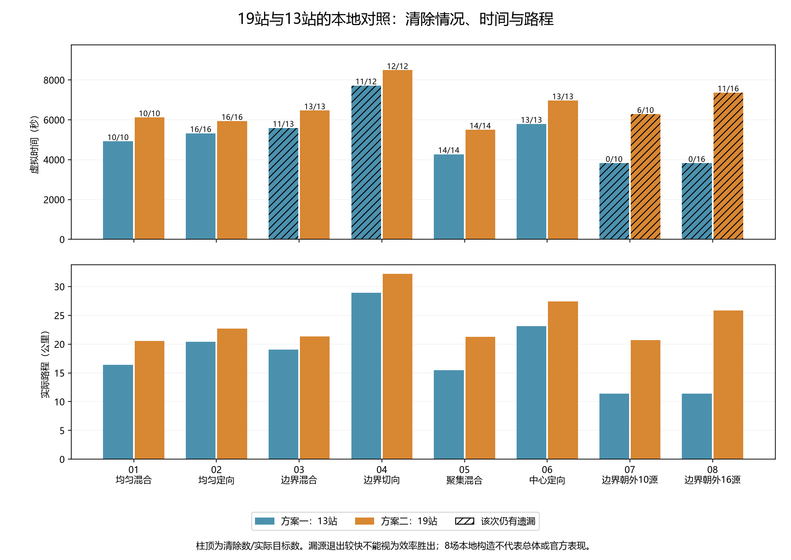

# 第四问方案二：十九站最短路线与运行

本版按用户图示，在原13站之外增加6个固定站，并重新求解全部19站的访问顺序。圆心出发、终点自由、不返回圆心时，固定站路线全局最短为 **17.1公里**。方案一仍使用原入口；两版的顺路检测、补测、定位与清除机制相同。

方案二已通过293项全库回归及16次同图本地运行的逐动作审计，没有调用官方模拟器。8个预定场景中，方案二清除95/104个源、6局全清；当前13站方案一清除75/104个源、4局全清。方案二增加了发现数量，也增加了耗时；这些本地构造不能作为官方成绩或任意地图全清保证。

## 1. 运行方法

在模拟器里选择第四问演练并准备连接，然后在PowerShell中执行。请先切换项目目录，不要在用户主目录直接执行相对路径。

```powershell
Set-Location 'D:\mywork\code\cumcm2026-b'
.\.venv\Scripts\python.exe -X utf8 .\scripts\run_q4_scheme2.py --mode http --robot-id "你的机器人编号"
```

方案一对照入口仍为：

```powershell
.\.venv\Scripts\python.exe -X utf8 .\scripts\run_q4.py --mode http --robot-id "你的机器人编号"
```

方案二默认配置为[配置文件](../../configs/q4_scheme2.json)，运行日志自动写入项目内`local-only/第四问/方案二-http-随机编号/`。每次创建新目录，不覆盖旧日志。结果中的固定站编号是本版的访问序号1—19。

若要先进行一次本地构造测试：

```powershell
.\.venv\Scripts\python.exe -X utf8 .\scripts\run_q4_scheme2.py --mode local --seed 110000 --count 10
```

`--count`仅用于本地环境生成。HTTP模式不向策略提供实际目标总数；真值只在本地任务退出后用于离线评价。退出码0表示流程正常完成，需要另看结果中的“全部完成证据”，不能把正常退出视为必然全清。

## 2. 六个新增固定站

图中的六个红圈解释为沿原950米三角网格向外补齐六个顶点，选取半径1900米、从正东起每隔60°的位置。坐标单位为米，保留完整精度参与运算；下表只为展示而四舍五入。

| 方位角 | 东向x | 北向y |
|---|---:|---:|
| 0° | 1900 | 0 |
| 60° | 950 | 1645.448 |
| 120° | -950 | 1645.448 |
| 180° | -1900 | 0 |
| 240° | -950 | -1645.448 |
| 300° | 950 | -1645.448 |

1800米仍是干扰源所在区域的半径。新增站位于该圆外100米，按机器人可在源区域外行动的既有物理/协议规则设置。这里优化的是这19个给定位置的访问顺序，没有同时优化外围站的半径或角度。



## 3. 为什么保证固定站路线最短

设访问顺序为\(\pi\)，固定站为\(p_1,\ldots,p_{19}\)，约束\(p_{\pi(1)}=(0,0)\)，终点自由，目标为

\[
L(\pi)=\sum_{i=1}^{18}\|p_{\pi(i+1)}-p_{\pi(i)}\|_2.
\]

这些站点都在边长950米的三角格上，任意两站距离至少950米。访问19个不同站至少要连接18段，故对任意顺序都有

\[
L(\pi)\ge18\times950=17100\text{米}.
\]

程序先建立由950米最短边组成的邻接图，再从圆心回溯搜索遍历全部站点的路径。找到的路径每一段恰好950米，达到下界，因此是全局最优。候选节点的排序只控制回溯搜索顺序，不以最近邻贪心或2-opt近似冒充最优；找不到下界证书时会明确报错。

[机器可核验的完整访问表与最优证书](../../results/tables/第四问/方案二十九站_最短路线.json)包含19个坐标、原站点编号、逐段距离及下界。图中数字就是采用的访问顺序。最优路线可能不唯一，本版固定采用一个可复现的最优解。

原13站最短为11.4公里；新增六站使固定路程增加5.7公里，即50%。按5米/秒，仅这部分固定路程增加1140秒。实际总路程还受到补测、清除、提前结束等因素影响，不能直接用这个差值预测整局时间。

**17.1公里的最优性仅针对固定站访问。** 在线尚不知道所有源的位置及朝向，插入动态任务后，不宣称整局实际行走路径全局最短。中途已有全清证据时仍可提前退出，不强制走完其余站。

## 4. 保留的动态机制

新增模块继承当前方案一的`ReliableFour`。两版配置内容一致，测量、清除、服务已知源、补测选点、顺路检测、免测和结束证据方法均直接复用。固定扫描循环仅调整布局长度、19站完成判断及结果说明，原方案一代码和配置没有改动。

| 机制 | 方案二处理 |
|---|---|
| 固定站检测 | 对仍未发现或已发现未完成的频道按原规则检测；已清除频道不再检测 |
| 已定位频道 | 已有安全清除位置时跳过重复固定测向；等待路线安排清除 |
| 顺路主动补测 | 优先间距100米，沿用800米绕行门槛及完整任务费用比较 |
| 路线可行替代 | 旧候选将被绕行或完整任务规则拒绝时，查找可行替代候选 |
| 无信号处理 | 保留定向可能性；不直接以1000米负圆排除目标位置 |
| 连续无信号 | 本路段连续2次无信号可延后；单目标主动补测上限8次 |
| 顺路清除 | 沿用连续位置外包的安全证书、最多4点小范围联合覆盖及路线插入 |
| 顺路附带扫描 | 复用实际检测/清除停点；未知频道默认仍按600米间隔补扫 |
| 确定超距免测 | 已知源外包到站点的最短距离超过1500米时免测 |
| 剩余固定站 | 动态任务可以插入，但保留本版预先求得的固定站相对顺序 |
| 末尾处理 | 完成已发现源的必要定位及清除；不自动为未知频道再增补漏站 |
| 提前结束 | 沿用清除16个不同频道源的数量上界证据；总数未知时不猜测已经全清 |

这里的100米是补测优先间距，800米是绕行门槛，600米是同频道顺路检测间隔，三者不是同一个参数。已取消的12个未知源保障站、折线补测及扇形清空均未重新开启。



## 5. 八组同图对照

种子110000—110007，依次覆盖均匀、边界、聚集、中心及全部朝外压力布局。两版使用相同目标坐标、接收半径、发射朝向和确定性误差规则。误差由实际观测位置决定，路线不同不会强行返回相同误差值；比较期间未调参或删去不理想场景。

| 场景 | 布局 | 方案一清除 | 方案二清除 | 方案一时间/秒 | 方案二时间/秒 | 方案一路程/公里 | 方案二路程/公里 |
|---|---|---:|---:|---:|---:|---:|---:|
| 01 | 均匀混合 | 10/10 | 10/10 | 4921.0 | 6119.1 | 16.415 | 20.530 |
| 02 | 均匀定向 | 16/16 | 16/16 | 5326.0 | 5939.0 | 20.445 | 22.695 |
| 03 | 边界混合 | 11/13 | 13/13 | 5592.7 | 6467.5 | 19.038 | 21.372 |
| 04 | 边界切向 | 11/12 | 12/12 | 7722.0 | 8490.9 | 28.900 | 32.204 |
| 05 | 聚集混合 | 14/14 | 14/14 | 4273.3 | 5501.1 | 15.466 | 21.275 |
| 06 | 中心定向 | 13/13 | 13/13 | 5795.3 | 6970.3 | 23.162 | 27.402 |
| 07 | 边界全部朝外 | 0/10 | 6/10 | 3827.0 | 6283.7 | 11.400 | 20.668 |
| 08 | 边界全部朝外 | 0/16 | 11/16 | 3827.0 | 7366.1 | 11.400 | 25.836 |

前6组中，方案一75/78、4/6局全清，方案二78/78、6/6局全清。后2组方案二多清除了17个源，但仍遗漏9个源。合计清除数从75/104增加到95/104；平均时间从5160.536秒增加到6642.211秒，增幅约28.71%。

两版均全清的第1、2、5、6组，方案一平均5078.892秒，方案二平均6132.372秒。因此，本批结果支持“增加发现、付出更多行走和检测时间”，不支持“方案二更快”。漏源退出的短时间不能拿来证明方案一完成同一任务更高效；8组构造也不足以估计所有地图上的平均表现。



完整逐动作结果保存在[本地运行归档](../../results/models/第四问/方案二十九站)，汇总见[同图对照数据](../../results/tables/第四问/方案二十九站_同图对照.json)。全部16次运行正常退出，已发现源均最终清除，没有执行未知源自动保障搜索；“实际全清”来自退出后的真值核查。

## 6. 全部配对轨迹

每张图左侧为方案一、右侧为方案二，共16条实际任务轨迹；清除位置与源真值分别标记。以下PNG均有同名SVG，适合队友编辑论文插图。

1. [场景01：均匀混合](../../results/figures/第四问/方案二十九站/03_场景01_同图轨迹.png)
2. [场景02：均匀定向](../../results/figures/第四问/方案二十九站/04_场景02_同图轨迹.png)
3. [场景03：边界混合](../../results/figures/第四问/方案二十九站/05_场景03_同图轨迹.png)
4. [场景04：边界切向](../../results/figures/第四问/方案二十九站/06_场景04_同图轨迹.png)
5. [场景05：聚集混合](../../results/figures/第四问/方案二十九站/07_场景05_同图轨迹.png)
6. [场景06：中心定向](../../results/figures/第四问/方案二十九站/08_场景06_同图轨迹.png)
7. [场景07：边界全部朝外10源](../../results/figures/第四问/方案二十九站/09_场景07_同图轨迹.png)
8. [场景08：边界全部朝外16源](../../results/figures/第四问/方案二十九站/10_场景08_同图轨迹.png)

## 7. 十九站仍有方向覆盖缺口

19站凸包为外接半径1900米的正六边形，其内切半径为

\[
1900\cos30^\circ\approx1645.448<1800.
\]

例如干扰源位于距离圆心1790米、方位30°处，朝30°向外发射。任一固定站在该发射轴上的投影最多1645.448米，小于源位置投影1790米，所以19站全部落在它的发射背侧，即使距离不超过接收半径，也可能没有信号。这个反例已纳入回归测试：完整19站扫描正常结束，未伪造不存在或全清证据，也没有悄悄增加其他站。

动态停点在部分地图上可能补上缺口，但不能事先保证。当前按用户要求先试验六个固定外围站，未加入额外保障措施。

## 8. 验证与复现

```powershell
Set-Location 'D:\mywork\code\cumcm2026-b'
.\.venv\Scripts\python.exe -X utf8 -m pytest -q
.\.venv\Scripts\python.exe -X utf8 .\scripts\evaluate_q4_scheme2.py --verify
.\.venv\Scripts\python.exe -X utf8 .\scripts\build_q4_scheme2_assets.py --verify
```

测试结果：293项通过，110.31秒。新增回归覆盖最短路下界、原13站保留、六站半径、配置和动态方法复用、19站完整扫描、未知源不能伪造全清，以及本机临时HTTP入口下10源全流程/16源有证据提前结束。没有连接官方接口。

实验审计重新计算每次移动、5米/秒费用、检测和切换费用、定向接收条件、示向误差、20米清除范围、连续外包包含真值、固定站顺序及剩余站相对顺序，并校验两版地图一致、源码SHA256与逐场汇总。已有结果存在时评估脚本核验并复用归档，不重新消耗运行；需要新试验时应另建输出目录保留旧结果。

绘图脚本不加`--verify`会按已归档数据重建11张中文图，各PNG/SVG，共22份。SVG使用LF换行并去除动态日期，以保证GitHub克隆后来源校验一致。

论文建模表述见[中文论文备用稿](../../paper/sections/第四问_方案二十九站_论文备用稿.md)。
