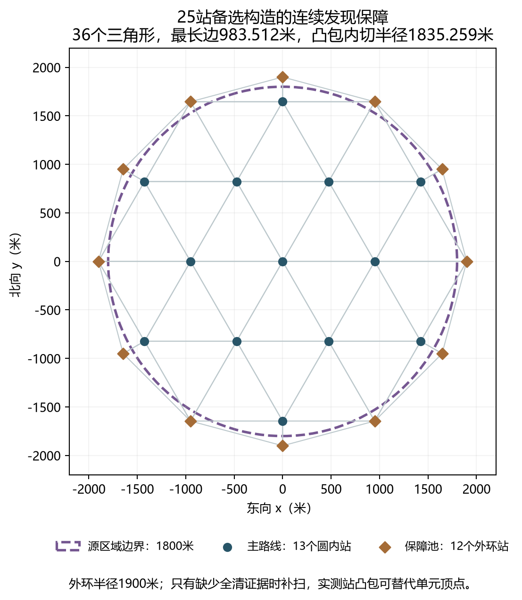
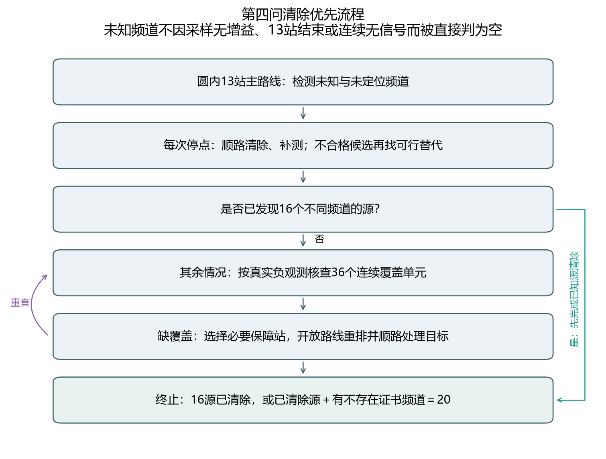
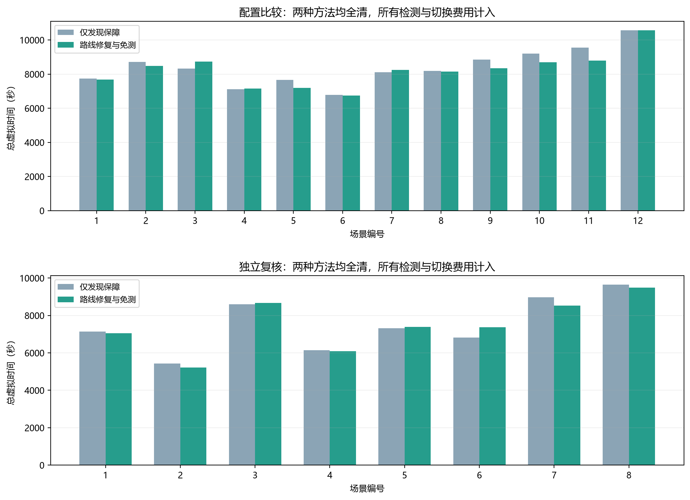

# 第四问清除优先版：方法、证书、验证与运行

用户最新要求优先避免未清除，现将默认入口切换为`reliable`，读取`configs/q4_reliable.json`。保留圆内13站、100米优先补测间距、800米绕行门槛、小范围顺路清除和方向反馈。固定扫描结束时尚无全清证据，就执行必要的连续发现补扫，包括外侧站；不再将13站流程结束当作任务结束。

## 1. 实际采用的优化

1. **发现保障。** 保留原13站主路线，另建半径1900米上的12个外环备选站。按当前频道的实际负观测逐个核查覆盖单元，已经覆盖的单元不补；已清除频道不扫。补充站路线按当前机器人位置做最近邻与开放2-opt，不要求返回圆心。每次处理已知源后重新规划，允许顺路清除，不先机械跑完外环再统一清除。
2. **合格旧候选保留，拒绝后查找替代。** 对旧方案本来会接受的补测点保持其选择；若因800米绕行门槛或完整任务预测而被延后，则将这些限制放入候选筛选，再在可行集合里评分。上一轮F4-3和F4-4的当时历史均通过回归：存在可执行替代，不再因为最佳点不合格就直接放弃整个频道。替代点不保证收到信号，仍按实测反馈处理。
3. **确定超距免测。** 只有已发现频道的连续位置外包到当前站的最短距离大于1500米，才免去必定无信号的检测。没有真实检测就不添加观测记录；未知频道不能用这条规则排除。
4. **16源发现上界。** 已发现与已清除频道合计16个时，不再规划未知源保障站，优先完成这16源的清除。仅仅“已发现16个”尚不等于清除完成。
5. **密集补扫仅保留为可选。** 实现100米停点间距加离散位置/朝向样本增益判断；该组合在对照中检测费用明显增加，因此默认继续600米顺路间隔，完整发现责任由连续保障承担。样本没有增益只允许暂缓此次可选扫描，绝不判定频道不存在。

默认选择为“路线修复与免测”。未恢复已撤回的折线或扇形策略；第三问代码未改。

## 2. 为什么保障构造能避免纯方向漏源

令目标区域为半径1800米闭圆盘。新增备选站为

`Q_k = 1900 (cos(kπ/6), sin(kπ/6)), k=0,...,11`。

与原13站合并得到25个点，其凸包为外侧正十二边形，内切半径为`1900 cos(π/12)=1835.259米`，严格包含目标圆盘。将这些点作Delaunay三角剖分，得到36个三角形；逐边检查最大长度为983.512米，小于最低接收半径1000米。这里连续覆盖的证明来自凸包包含与完整三角剖分，边界采样只是复核。

任意源G落在某三角形内，可写成三个顶点的凸组合，且到每个顶点的距离均不超过该三角形直径。对任意发射方向单位向量u，如果三个顶点都在严格背侧，则三个`u·(P_i-G)`均为负，其凸组合也为负，却又必须等于零，矛盾。因此至少一个顶点位于接收前半面且在1000米内。全向源当然也满足发现条件；源恰在顶点时，原地检测按近距离反馈处理。

该结论保证至少一次发现，不表示每个源自动有两次有效测向，也不保证一次补测定位。后续仍需已有的自适应测向或20米方格有限清除。

### 按频道建立连续不存在证书

对一个尚未发现频道，只能引用真实返回`no_signal`的站。每个三角形单元采用以下任一证据：原三个顶点均实际测过该频道；或者从实测站中选出距该单元三个顶点均不超过999.5米的站，其凸包严格包含单元三个顶点。后者使用1微米内部裕量，近边界数值不确定时保守地不接受替代。原顶点分支要求坐标逐项相等，避免把近似到站当作几何顶点。

所有36单元均通过证书后，假如该频道有源，则至少有一次应收到信号，与全部负反馈矛盾，才可标记不存在。**不能凭“连续两次无信号”“样本没找到可行源”或“13站全跑完”宣称不存在。** 每个证书保存实际负观测坐标、各单元见证站索引及所用网格。

最终全清证据只有两种：清除16个不同频道源；或者所有20频道都已清除或有连续不存在证书。预算、协议或几何异常时记录未完成并退出，不能强行报告全清。




## 3. 试验过程与选择依据

- 首轮107000—107011，共12场×4版本=48次。31站原型的发现保障有效，但成本偏高；原型及完整动作保存在步骤048提交`59237b0`和“清除优先对照”目录，未丢弃慢结果。
- 改用25站构造后，在108000—108011做36次新场景对照。密集未知补扫组合仍变慢，随后该组用于配置比较，因此不能再称其为未参与决策的独立验证。
- 在同一108000组追加“路线修复加免测”及“仅免测”两组，共24次。按异常、漏源、全清证据、总时间依次排序，选定当前配置。三种清除保障方案均157/157；旧13站版只清除104/157，四场全部朝外压力构造均未发现源。旧版提前漏源退出的短时间不能与全清耗时直接排名。
- 冻结选择后，109000—109007独立复核8场，两种有发现保障的配置各运行一次，共16次。全流程累计124次本地运行，源真值只在退出后供审计使用；没有连接官方模拟器，也没有把先前官方六局当作可重复同地图场景。

## 4. 独立复核结果

当前默认和“仅发现保障”对照均107/107清除，8/8场全清且都有连续证据。平均总时间由7506.2秒变为7476.3秒，变化-0.40%；平均路程由26.674公里变为26.938公里，反而略增加。节省部分来自少检测，不能宣称路径普遍更短。

|编号|本地布局|清除|默认总时间/秒|相对仅保障/秒|追加保障站数|
|---|---|---|---|---|---|
|1|均匀混合|10/10|7046.7|-96.0|12|
|2|均匀定向变半径|16/16|5219.8|-200.8|2|
|3|边界切向定向|13/13|8675.2|+87.1|12|
|4|边界混合变半径|16/16|6093.5|-49.0|0|
|5|聚集定向|12/12|7383.9|+60.8|12|
|6|中心混合|14/14|7374.3|+556.2|12|
|7|边界朝外10源|10/10|8526.6|-447.8|12|
|8|边界朝外16源|16/16|9490.4|-149.7|12|

第3、5、6场变慢，第6场增加约556秒；第1、2、4、7、8场变快。8场平均改善很小，不足以证明对任意地图都更快。当前选择优先保证发现和清除，再减少能够确定无收益的操作；路线评分仍属启发式。

发现保障会额外花时间。尤其实际源数少于16时，即使源已经全清，在线程序也不知道真实总数，还需排除其余频道。独立复核平均使用9.25个补充站；这一阶段平均2934.6秒，包含补充搜索、所发现源的定位和清除，不能全部归为纯扫描费用。

保证依赖题设的静止源、独立频道、半径至少1000米且不超过1500米、全向或固定180度发射、规定测向误差及20米光学清除范围，也依赖协议正常及预算足够。它是模型内连续几何保证；本地全部通过不能替代官方实测结果。



## 5. 运行与复核

PowerShell先进入项目，模拟器里选择第四问演练，再执行：

```powershell
Set-Location 'D:\mywork\code\cumcm2026-b'
.\.venv\Scripts\python.exe -X utf8 scripts/run_q4.py --mode http --robot-id '202623003006'
```

默认`--strategy reliable`，不需要额外指定。日志输出到`local-only/第四问/http-随机编号`，保留实际配置、源码SHA256、Git状态、每次动作及证书。运行成功现在要求有全清证据。`--strategy feedback`恢复此前13站800米反馈版；`--strategy spacing`恢复100米/400米几何版；单独`--probe-spacing 0`保留更早的原版恢复语义。这些恢复版本仍可能漏源，不作为本次默认。

`--dense-unknown-scans`可重试密集增益补扫，因本次对照较慢而默认关闭。`--probe-spacing`控制主动补测间距，`--detour-limit`控制绕行阈值，与未知频道顺路检测间隔是三件不同的事。

```powershell
.\.venv\Scripts\python.exe -X utf8 scripts/evaluate_q4_reliable.py --verify
.\.venv\Scripts\python.exe -X utf8 scripts/evaluate_q4_reliable_final.py --verify
.\.venv\Scripts\python.exe -X utf8 scripts/evaluate_q4_reliable_selection.py --verify
.\.venv\Scripts\python.exe -X utf8 scripts/build_q4_reliable_assets.py --verify
.\.venv\Scripts\python.exe -X utf8 -m pytest -q
```

核验从归档动作复算物理反馈、角度误差、路程、时间、切换、清除证书、实际负观测、连续覆盖、未知/已发现/已清除/不存在状态及同图性，不重新消耗演练次数。现实规划有时限，重新运行可能改变候选评估数量；精确复核用归档动作。

## 6. 图表与队友阅读

图目录为`results/figures/第四问/清除优先版`，共23张，各有PNG和SVG：覆盖构造、策略流程、费用图、12组配置比较配对轨迹和8组独立复核配对轨迹。轨迹图保留整个1800米边界、站点、运动方向、追加补测、清除位置及外侧保障站；源真值只来自退出后的本地环境，未与官方未知真值混淆。灰色固定站是计划站，深色为实际发生检测的站；紫色路径为保障及尾部处理。

核心代码：`q4_reliable_strategy.py`、`q4_coverage.py`。默认参数：`q4_reliable.json`。旧运行代码、原始材料、已有轨迹与历史结果全部保留；改变的历史入口和核验器留有逐字节档案，仍要求精确哈希匹配。

### 配置比较全部配对轨迹

- [配置比较01](../../results/figures/第四问/清除优先版/配置比较_01_配对轨迹.png)
- [配置比较02](../../results/figures/第四问/清除优先版/配置比较_02_配对轨迹.png)
- [配置比较03](../../results/figures/第四问/清除优先版/配置比较_03_配对轨迹.png)
- [配置比较04](../../results/figures/第四问/清除优先版/配置比较_04_配对轨迹.png)
- [配置比较05](../../results/figures/第四问/清除优先版/配置比较_05_配对轨迹.png)
- [配置比较06](../../results/figures/第四问/清除优先版/配置比较_06_配对轨迹.png)
- [配置比较07](../../results/figures/第四问/清除优先版/配置比较_07_配对轨迹.png)
- [配置比较08](../../results/figures/第四问/清除优先版/配置比较_08_配对轨迹.png)
- [配置比较09](../../results/figures/第四问/清除优先版/配置比较_09_配对轨迹.png)
- [配置比较10](../../results/figures/第四问/清除优先版/配置比较_10_配对轨迹.png)
- [配置比较11](../../results/figures/第四问/清除优先版/配置比较_11_配对轨迹.png)
- [配置比较12](../../results/figures/第四问/清除优先版/配置比较_12_配对轨迹.png)

### 独立复核全部配对轨迹

- [独立复核01](../../results/figures/第四问/清除优先版/独立复核_01_配对轨迹.png)
- [独立复核02](../../results/figures/第四问/清除优先版/独立复核_02_配对轨迹.png)
- [独立复核03](../../results/figures/第四问/清除优先版/独立复核_03_配对轨迹.png)
- [独立复核04](../../results/figures/第四问/清除优先版/独立复核_04_配对轨迹.png)
- [独立复核05](../../results/figures/第四问/清除优先版/独立复核_05_配对轨迹.png)
- [独立复核06](../../results/figures/第四问/清除优先版/独立复核_06_配对轨迹.png)
- [独立复核07](../../results/figures/第四问/清除优先版/独立复核_07_配对轨迹.png)
- [独立复核08](../../results/figures/第四问/清除优先版/独立复核_08_配对轨迹.png)
