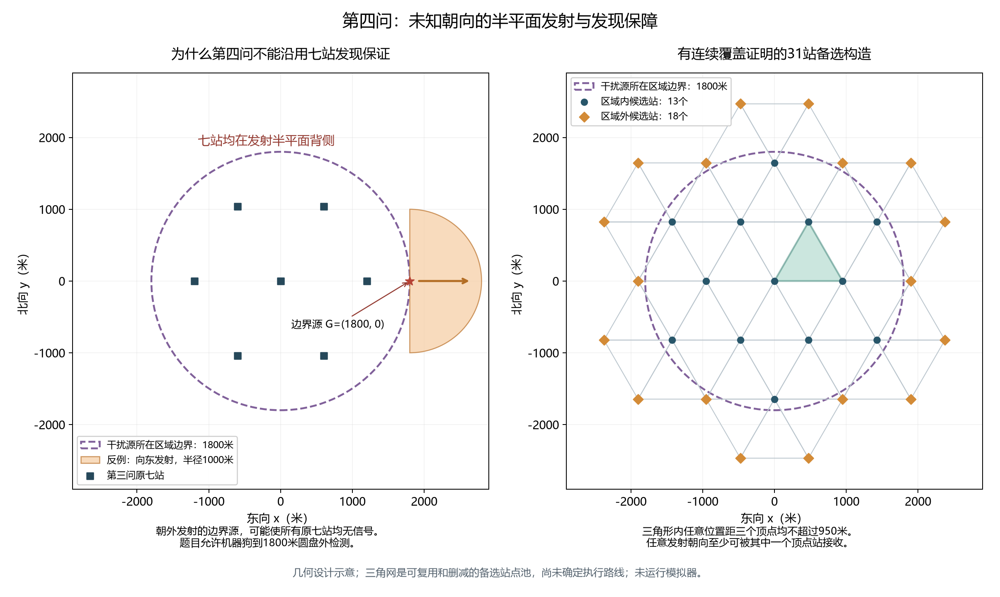
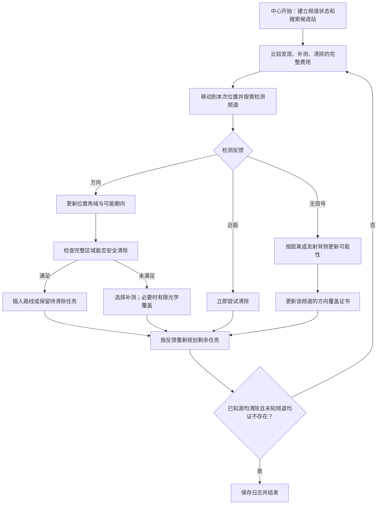

# 第四问详细思路（待审核）

状态：2026-09-11，已核对原始题面、两个附件和第三问现有路线版。用户确定第三问采用方案一；第四问本阶段仅讨论设计，未实现运行策略，未调用模拟器。下述数值属于几何构造核算，不是耗时实验或官方成绩。

建议在第三问方案一的顺路检测、目标延后、路线规划和安全清除框架上，增加未知发射朝向的发现保障，以及允许补测失去信号的定位逻辑。七站全向覆盖证明需要替换；不恢复已经撤回的逐扇形清空机制。

## 1. 题面到底增加了什么

依据：[原始B题PDF](../../materials/original/problem/B题.pdf)第2页问题4及附录1—2、第3页附录2、第4页附录3—4；[附件1](../../materials/original/problem/附件/附件1.docx)、[附件2](../../materials/original/problem/附件/附件2.docx)补充协议与运行规则。

| 项目 | 第四问条件 | 对算法的影响 |
|---|---|---|
| 源的位置 | 圆心O、半径1800米的圆盘内 | 未改变目标位置先验 |
| 源的种类 | 全向和定向混合，具体类型和朝向未知 | 不能预先按频道分类 |
| 定向发射 | 固定轴线两侧各90°，即180°半平面；边界包含 | 接收还需要位于正确的一侧 |
| 单源接收半径 | 各源固定，未知，1000—1500米 | 发现保证按最低半径1000米设计 |
| 示向度 | 从检测位置指向源的方向，有界确定性误差 | 与源的发射轴方向是两个不同量 |
| 无信号 | 频道不存在、超过半径或处于发射背侧 | 不能直接排除检测站周围1000米圆盘 |
| 清除 | 20米以内可成功，不受发射朝向影响 | 收不到信号时仍可清除 |
| near | 覆盖范围内且距离不超过5米；无示向度 | near后可以直接清除；背侧靠近未必返回near |
| 目标数、频道 | 10—16个、频道1—20、每个目标频道不同 | 运行中不能把“已清10个”当成全部完成 |
| 狗的活动范围 | 允许到1800米圆盘外 | 可以从外围接收朝外发射的源 |
| 操作费用 | 移动5米/秒；检测5秒；换频道1秒；成功清除5秒、失败3秒 | 优化完整时间，不只优化路径长度 |

同一点重复测向不会平均掉误差。示向度输出两位小数，延用保守角误差1.005°。运行中接口不直接提供源类型、发射轴、实际半径或总目标数。

## 2. 先指出第三问哪些保证失效

设源在G=(1800,0)，发射轴向东。它只能被满足x≥1800且距离足够近的站接收。原七站是中心加半径1200米的六个外围点，它们的x坐标都不超过1200，因此全部处于背侧。即使东站距离源只有600米，仍然无信号。

这说明两个问题：

1. “区域内每点至少被一个或两个检测圆覆盖”不足以保证发现未知朝向的定向源。多个站若都位于源的一侧，仍会同时漏检。
2. 有限个全部位于圆盘内的站无法保证发现所有朝外发射的边界源。圆盘在边界点的外向切半平面几乎完全位于圆盘外，不能只靠中心附近加站解决。

第二问中按距离得到的可靠补测区域，也不再保证一定接收到信号。几何候选仍可用于提出测点，但必须允许无信号分支，不能据此报错或丢弃目标。



## 3. 单个频道的状态：同时保留位置和朝向的可能性

设源位置为G，实际半径为R，定向轴单位向量为u，检测站为S。定向源的可接收条件为

\[
\|S-G\|\le R,\qquad u^\mathsf T(S-G)\ge0.
\]

全向源只有第一项距离条件。对于方向观测，还需要距离大于5米，并满足以S为顶点、观测示向度为中心的±1.005°角域。所有位置可能性始终与半径1800米的目标圆盘相交。

无信号的正确条件是

\[
\|S-G\|>R\quad\text{或}\quad
[\text{源为定向源且 }u^\mathsf T(S-G)<0].
\]

因此保存“全向可能集”和“定向可能集”的并集；只有被全部可能解释排除的位置才可删除。一次有信号、一次无信号通常不能单独证明源的种类。失败清除则明确增加距离大于20米的约束，与朝向无关。

为降低计算量，可以消掉半径这一维。对给定候选位置G和所有正观测站集合P，定义

\[
r_*(G)=\max\{1000,\max_{S\in P}\|S-G\|\}.
\]

若r_*>1500，则G不可能；否则取R=r_*最容易解释负观测。对距离G不超过r_*的每个无信号站，定向解释要求它位于背侧；更远的无信号站可由半径不足解释。正观测限制发射轴处于一个180°角区间，近距离负观测限制它处于相反的开半圆。逐一相交这些圆周区间，就能判断候选位置是否仍有某个朝向可行。

这只是对给定位置的精确可行性化简，不能把粗网格上的点直接当作整个连续可行集。实现时拟采用保守空间单元和角区间；启发式采样用于挑测点，完整外包用于清除或排除证书。首版也可先只用正观测角域和1500米上界构造安全外包，将复杂负观测推理逐步加入。

## 4. 未发现的源：用“围住”替代单纯距离覆盖

对于某个可能的源位置G，取实际已经测过该频道、距离G不超过保守阈值999.5米的站，记为N(G)。保证任意发射朝向都至少被一个站接收的判据是

\[
G\in\operatorname{conv}N(G).
\]

直观解释：这些站从各方向围住G，任何一条经过G的直线所分出的闭半平面，都会包含至少一个检测站。等价地，从G看向这些站，相邻方向之间最大的圆周角间隙不超过180°。重合站不提供方向信息；覆盖核验单独处理该退化情况。

证明：若G是站点的凸组合，则对任意u，所有u·(S−G)不可能都严格为负，否则其凸组合也为负，与u·(G−G)=0矛盾。反之，若G位于凸包外，严格分离定理给出一个没有任何站的发射半平面。

该条件保证至少一次发现，**不保证直接完成双站定位**。第二次接收及后续精度，由发现后的自适应测点负责。

### 4.1 一个已经核算的保底构造

采用边长950米的等边三角网，保留所有与闭目标圆盘相交的三角形及它们的顶点：

- 相交三角形42个，去重后31个站点，其中圆盘内13个、外部18个。
- 最远站距圆心约2513.464米，符合题目允许外出检测的条件。
- 任意G都落在某个保留三角形内，到其三个顶点的距离均不超过950米。
- G位于三顶点凸包内，因此任意180°发射朝向至少被其中一个顶点接收。若G恰好位于网格顶点，所有相邻闭三角形也被选中，周围顶点仍提供覆盖，证明不依赖“在源的精确位置一定返回near”。

这给出连续覆盖证明，不是最少站点证明。独立使用30米平面网格和720个外圆边界采样点复核，共12009项含重复边界样本；999.5米内检测站的最大圆周角间隙约139.094°，没有超过180°的样本。采样是交叉检查，不能替代上面的连续证明。

**31个站是几何备选池，尚未确定为必须逐点走完的路线。** 定位测点、清除位置也能补充发现证据；若它们已经替代某个候选站的覆盖作用，就可删去相应站或相应频道的检测。但仅仅走过、没有停下测过该频道的位置不算证据。

如果真的在31站各测20频道，每站先测当前频道再测其余19个，光检测和切换就要31×(20×5+19)=3689秒，尚未加移动、补测和清除。这个核算说明减少冗余检测必须和路线优化同时进行；不能因覆盖更强便断言总耗时更好。

### 4.2 如何对途中站颁发覆盖证书

将目标圆盘包络划成小三角形或方形单元。对每个待检查单元C，选取能证明到C所有点均不超过999.5米的实际检测站，再检查这些站的凸包是否包含整个C。距离最大值和凸包含可以在单元顶点核查。

证书通过，说明该频道的未知源不可能藏在C而所有已测站均无信号；证书失败只表示尚未证明，可以细分单元或补站。边界单元保守包含圆盘，不能用单元中心不在圆盘内就跳过。

逐频道分别记录证据。对全部无信号的未知频道，当整个目标圆盘均被这种方向覆盖证书覆盖，才能判定不存在。已发现频道不用再承担未知源发现任务，但仍需定位清除。

## 5. 首次发现以后，如何补测和清除

每个频道分为四种实际状态：未发现、已发现但未达到清除精度、已具备安全清除位置、已清除；另外保存有完整覆盖证书的不存在状态。收到两次方向也未必达到清除精度。

### 5.1 保留方向交会，但不假定下一站一定有信号

首次direction返回后，用角域、1500米最大接收半径、目标圆盘建立位置可能区域。补测候选包含第二问的几何点、当前路线附近的侧向点，以及其他已接收站附近的点。

选点需要考虑direction、near和no_signal三种反馈。评价包含当前位置到补测点、检测与切换、可能的后续清除以及回接下一搜索站的费用；在没有方向分布先验时，不把经验加权得分称为严格期望或全局最优。

若补测仍有方向，则叠加角域；near则直接尝试清除。若无信号，按第3节更新可能集，改选测点或暂缓至后续更合适位置，保留最近有效接收站，避免来回重复检测同一点。不能套用第三问的1000米负圆排除，也不能直接认定观测模型失效。

不能无条件保证“沿测得的方向向前走就始终有信号”：真实源可能位于角域一侧，原站又接近发射半平面的边界，角误差足以让新站进入背侧。

### 5.2 一个可靠的补测区域

同一源的真实接收区是圆盘，或者圆盘与半平面的交集，二者都是凸集。因此，所有已经实际收到该源信号的站的凸包，都在真实接收区内。

两站之间的线段可以作为保证仍在覆盖内的补测区域；三个不共线接收站的凸包还提供一片面积。若距源已小于5米，返回near而非direction，但仍有利于清除。

这个性质只能保证接收，不保证交会角或定位速度。一开始只有一个接收站时，凸包只有一个点，不能凭空得到第二个有保证的新站；两站同向、几乎共线时仍需评估几何精度。完整目标外包过大或无法找到高效补测时，进入有限光学覆盖回退。

### 5.3 清除判据和有限回退

延用第三问的完整可能区域P及安全半径19.5米：只有找到C满足max_{G∈P}‖C−G‖≤19.5，才作有证书的清除。不能只凭点估计接近或区域直径小于40米认定安全，也不能只取P的一部分计算。

已知源即使暂时无信号，也能执行光学清除。若角交会长期不理想，可以用间距20米的方格中心覆盖整个可能区域，逐一清除，失败就排除相应20米圆盘。

有限性构造：一次direction约束下，沿测得方向的坐标在0—1500米，横向半宽不超过1500sin(1.005°)≈26.31米。它包含于1500×60米矩形。用20米方格覆盖，最多75×3=225个中心，每格到中心最远14.142米，小于20米。这个上界证明发现后即使后续无线测向不顺利，也存在有限清除方案；它是保底办法，常规策略应利用后续角域显著减少清除候选。

## 6. 与方案一路线规划如何结合

第四问继续保留边搜索边定位、顺路清除和合理延后的机制。需要重新安排搜索站的空间布局，不是完整跑完原七站后再机械追加31站。

每次完成一个动作后，统一评估三类后续任务：

1. **发现任务**：去哪个位置检测哪些未知频道，可以补最多尚未证明的方向覆盖，同时方便后续路线。
2. **定位任务**：哪个已发现源适合在当前位置或下一段路附近补测，允许收到不同反馈后再规划。
3. **清除任务**：哪些已有安全清除点可以插入剩余路线；哪些目标现在处理比以后返回更省总时间。

基础目标记录为

\[
T=L/5+5N_{\rm measure}+N_{\rm switch}
  +5N_{\rm clear,success}+3N_{\rm clear,fail}.
\]

其中L是全部移动距离，清除成功数按实际事件记录。路线候选需把补测和清除之后的衔接计入，不能只看“当前站到源”的距离。首次实现可用少量候选的滚动前瞻与局部顺序改良；测点质量、探测收益和完整覆盖证书分开计算。

各站频道安排：已清除或已证不存在的不再测；已能安全清除的一般不再测；未定位频道按本次测量能否改善几何决定；未发现频道按覆盖责任检测。每站尽可能先测当前频道。每次省略检测都要能说明由其他实际测点保留了责任，而不能把“路很近”直接当作可以跳过。

保留发现站候选池作为有界回退：自适应尝试设预算；预算用尽时完成尚未满足证书的保底发现站和已知源的有限清除覆盖。数学上的发现和有限清除保证，不等于已经验证能在实际20分钟运行预算内完成；这仍需本地闭环和演练验证。

## 7. 整体流程



另外，若已成功清除16个不同频道的源，可依据题面总数上界确认完成。不能在没有证书时使用10个的下界或七站扫描完毕作为退出依据。

## 8. 实施顺序及要验证的问题

当前建议先审核以下分层方案，不承诺31站已经最优：

1. 建立包含全向与半平面定向源的本地物理环境，核对角度方向、包含边界、固定半径、近距和清除规则。
2. 先实现有发现覆盖证书的参考版，加正观测定位外包、失去信号后的正常分支和有限光学回退，验证“不会漏源或错误排除”。
3. 加入位置与发射朝向的联合约束，减少无效补测；加入途中站覆盖复用和剩余发现站删减。
4. 复用方案一路线调度，比较总费用；固定参数后用独立场景验证，再进行实际演练。正式测试另按用户要求进行。

至少包含以下边界构造：边界朝外、接近边界朝内、最小1000米半径、发射边缘±微小角偏移、首次有信号后补测无信号、源位置接近网格顶点、接收站共线、两位小数角度舍入、多个方向不同且空间聚集的源，以及10和16目标的混合场景。

评分同时记录：全清率与剩余源、完整虚拟时间、移动里程、检测次数、切换次数、无信号补测次数、失败清除次数、运行计算耗时。构造测试的隐藏真值只供事后核验，策略不能读取。原第三问策略保持不变用于全向场景对照。

## 9. 本阶段复现与证据

- 几何计算与绘图脚本：[analyze_q4_design.py](../../scripts/analyze_q4_design.py)。
- 坐标、三角形、采样诊断和输入哈希：[初步覆盖构造核算.json](../../results/tables/第四问/初步覆盖构造核算.json)。
- 图形：[PNG](../../results/figures/第四问/定向源发现与三角网备选.png)、[SVG](../../results/figures/第四问/定向源发现与三角网备选.svg)。

在项目根目录执行：

```powershell
.venv/Scripts/python.exe -X utf8 scripts/analyze_q4_design.py
```

该命令只重算几何并绘图，无HTTP调用，不实现第四问策略。第一至三问的运行代码、配置和历史结果均未改动。
