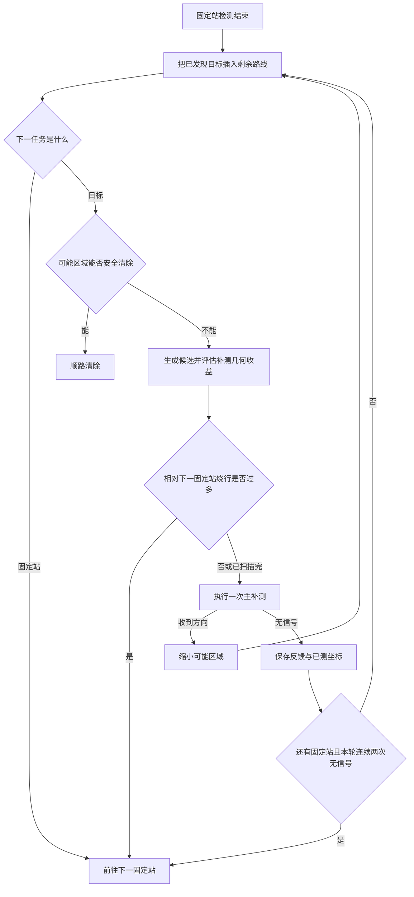

# 自动追加检测点：逻辑与P4-2、P4-4的具体成因

本说明对应上一轮六局第四问总览中的第2、第4局。只核对既有源码和脱敏演练记录，没有修改策略或重新运行模拟器。

## 1. 追加点如何触发

13个固定站仍按既定顺序扫描。每完成一个固定站，程序把已发现目标插入剩余固定站路线；路线的下一个任务若是固定站，就继续扫描；若是目标，则检查能否安全清除。

这里的“定位完成”不是固定要求收到两次方向，而是：能否找出一个清除位置，使全部可能的源位置都在其19.5米内。只有一个方向往往不足，两个方向交会角较差时也可能不足。

- 已满足安全阈值：选择清除位置，不追加主测向。
- 未满足阈值：生成候选补测点，若评分优于直接有限光学覆盖，则计划补测。
- 有后续固定站时，补测点相对“当前位置直接去下一固定站”的新增路程超过400米，则先延后该目标。
- 同一次固定站间服务中，某频道连续两次主补测无信号，则本轮延后它。下一固定站后可以重新尝试；这不是全局只尝试两次。
- 每频道主补测总预算最多8次；也可以提前选择有限覆盖。有后续固定站时暂缓有限覆盖，固定扫描完成后才执行。
- 固定扫描后的收尾阶段没有“继续去下一固定站”的选项，因此400米绕行限制和两次无信号后等待下一固定站的限制不再生效；总预算与有限覆盖仍然生效。

400米是单次补测相对于下一站的绕行限制，不是整个路段所有补测的累计路程上限。该段另有24个服务动作上限，且多个目标分别维护计数。

图中省略了预算用尽、评分选择直接覆盖、near原地清除等分支；详细规则以上述文字和源码为准。

## 2. 为什么某个具体位置会被选中

当前第一版复用了第三问的候选生成器：由可能区域的形状、第二问几何构造、不同方向和距离生成候选，也加入第三问七站坐标作为候选池。七站坐标仅是可选补测位置，不会新增一轮固定七站扫描。

候选须满足：到所有可能源位置的最大距离不超过999.5米、不处于可能近距区、未对该频道在同一位置测过。候选按距当前位置由近到远考察，在24个候选和0.8秒规划预算内，采样9个可能测向结果，比较

$$\text{评分}=\frac{\text{移动距离}}{5}+5+\max_{\text{采样方向}}\text{收到该方向后的收尾费用估计}.$$

这是“能收到方向”条件下的几何评分，没有把发射朝向、无信号分支或接收概率纳入评分。第四问包装层虽然记录了“无信号后的保守回退费用”，但该字段只是诊断信息，没有参与候选排序。这是当前实现的主要局限。

第四问对无信号的处理是：保留位置外包不变，记录已测坐标并避免对该频道再次选完全相同的点。它没有利用无信号建立朝向约束。因此下一次可能仍在同一发射背侧选中另一个几何上有利的位置，形成反复尝试。

## 3. 两局实际补测次数

| 场次 | 主动补测动作 | 收到方向 | 无信号 | 不同补测位置 | 同位置顺路检测其他频道 |
|---|---:|---:|---:|---:|---:|
| P4-2 | 14 | 6 | 8 | 14 | 30次 |
| P4-4 | 24 | 10 | 14 | 22 | 20次 |

“顺路检测”复用当前停点，不是额外移动设站；图上橙色三角形表示主补测位置。P4-4在(1200,0)先后对频道17、9、13执行了三次主补测，三个动作重合在同一坐标，并不是三个新位置。

### P4-2：主要是频道3反复失败

频道3的实际过程：

1. 第9固定站首次收到方向，外包覆盖圆半径仍约750.23米，远未达到清除阈值。
2. 扫描途中追加两次主测向，均无信号，本路段暂缓。
3. 后续固定站仍未得到新的方向。
4. 扫完13站后追加五次主测向：前四次无信号，第五次收到方向。
5. 此时外包覆盖圆半径约20.32米，仍略大于19.5米，最终采用有限方格光学覆盖，第一点成功清除。

所以仅频道3就占7次主补测，其中6次失败接收。频道10另占两次补测，均无信号；其余频道1、5、12、17共5次补测，均收到方向。

### P4-4：多个目标分别反复尝试

| 频道 | 主补测次数 | 收到方向 | 无信号 |
|---|---:|---:|---:|
| 13 | 4 | 0 | 4 |
| 14 | 4 | 2 | 2 |
| 7 | 3 | 1 | 2 |
| 15 | 3 | 1 | 2 |
| 4 | 3 | 1 | 2 |
| 8 | 2 | 0 | 2 |
| 其余5个频道合计 | 5 | 5 | 0 |

以频道13为例：第2固定站收到方向，外包覆盖圆半径约543.09米；此后主补测两次无信号，暂缓。第3固定站检测仍无信号，又主补测两次无信号。到第4固定站终于获得第二份方向，外包覆盖圆半径缩小为约16.90米，已经具备安全清除位置。

这四次主补测没有得到新的方向，当前实现也未把其负反馈转换成有效的朝向约束。频道13最终由固定站定位，而非四个额外补测点定位。不能从事后结果倒推程序事先一定知道它们会失败，但可以明确看出：这些尝试没有改善当前模型的定位外包。

## 4. 进一步核验：这两局的主动无信号确实可以排除超距

上一轮综合报告只按一般情况解释“无信号可能是超距或背侧”。对这里的具体22次主动无信号，我们可以利用后续成功清除作更强的事后判定。

记无信号检测位置为S，最终成功清除时机器狗位置为C，静止干扰源为G。成功清除说明距离CG不超过20米，所以

$$|SG|\leq |SC|+20.$$

逐次核算得到：

- P4-2的8次主动无信号，上述距离上界最大为655.633米。
- P4-4的14次主动无信号，上述距离上界最大为618.106米。

它们全部小于最小接收半径1000米。按第四问静止目标和固定半平面发射规则，能够排除超出接收半径这一解释，应归因于接收点处在发射背侧。没有解密目标真值或假定清除坐标就是精确源位置；20米清除误差已计入上界。

这与候选生成器的距离筛选相互印证。一般固定站或任意未知频道的无信号仍不能自动做同样判断，不应扩大本结论的适用范围。

## 5. 应如何理解当前机制

当前实现能最终清除这些目标，但补测选点仍是第三问几何方法加第四问无信号回退，并未完整利用定向信息。问题不是“每次多设站都是必需的”，而是“认为这个位置若收到方向会很有价值，却没充分判断它是否能收到方向”。

后续改进应让负反馈实际影响选点，结合正向站和已知接收距离约束估计发射方向；同时将等待即将到达的固定站作为可比较的选项，限制同一目标累计低收益尝试。不能只提高补测次数，也不能把全部无信号造成的路径都直接视为能够无代价删除。

本轮只解释并归档证据，没有改动任何运行策略或配置。

## 证据与代码

- [逐频道计数、22次距离上界及源码哈希](../../results/tables/第四问/P4-2与P4-4_追加检测成因核查.json)
- [P4-2归档动作](../../results/models/第四问/实测4目录/P4-2.json)、[P4-4归档动作](../../results/models/第四问/实测4目录/P4-4.json)
- [第四问触发及无信号处理](../../src/cumcm2026_b/q4_strategy.py)：`DirectionalRegion.observe`、`_observation_plan`、`_service_known`。
- [候选生成及评分](../../src/cumcm2026_b/q3_strategy.py)：`observation_plan`。
- [剩余路线的目标插入](../../src/cumcm2026_b/q3_route_planning.py)：`plan_route`。
- [完整六局轨迹与结果](实测4目录_结果分析与轨迹.md)。
