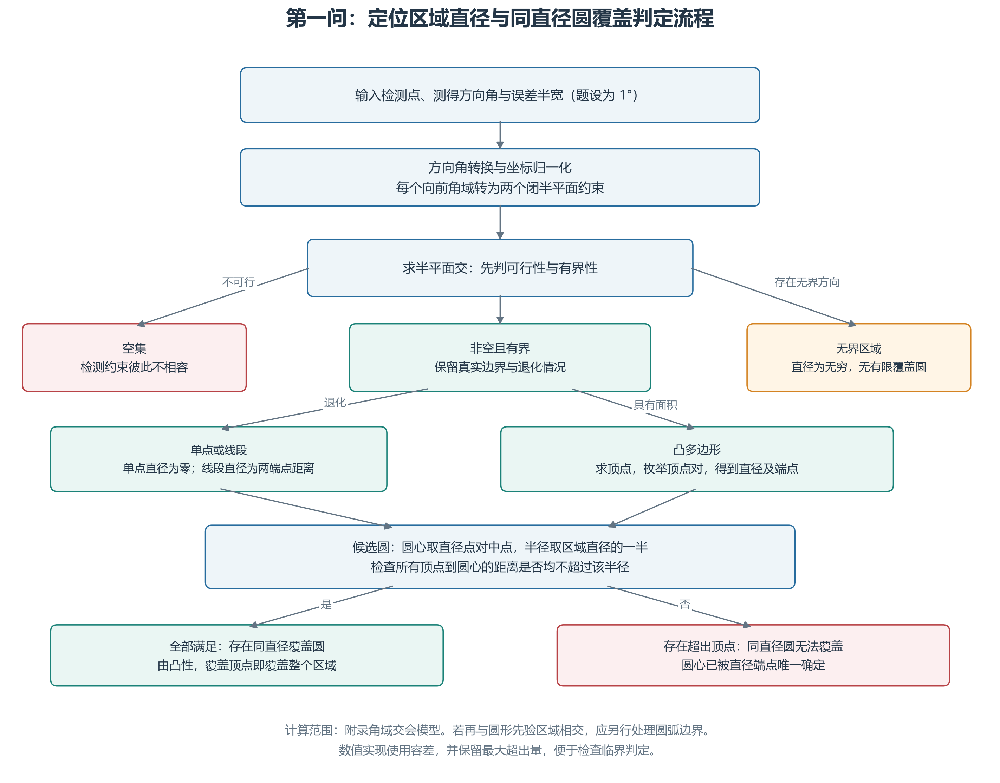
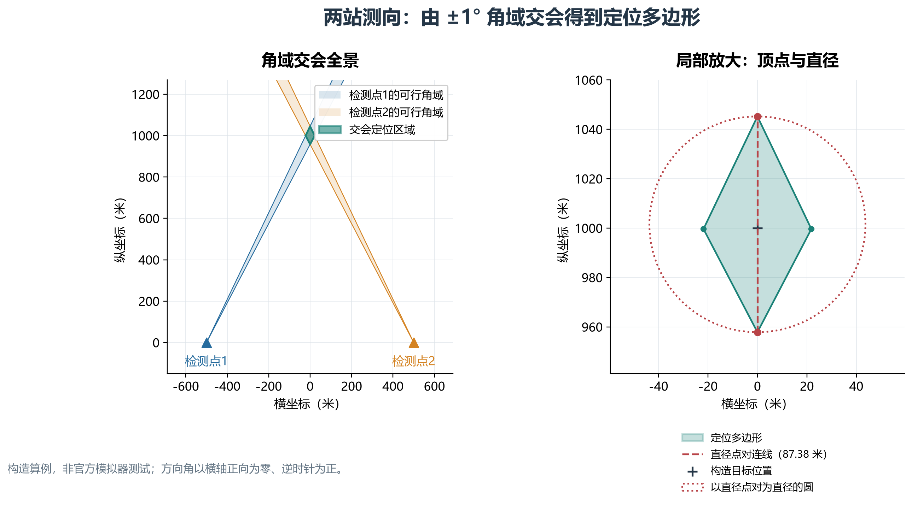
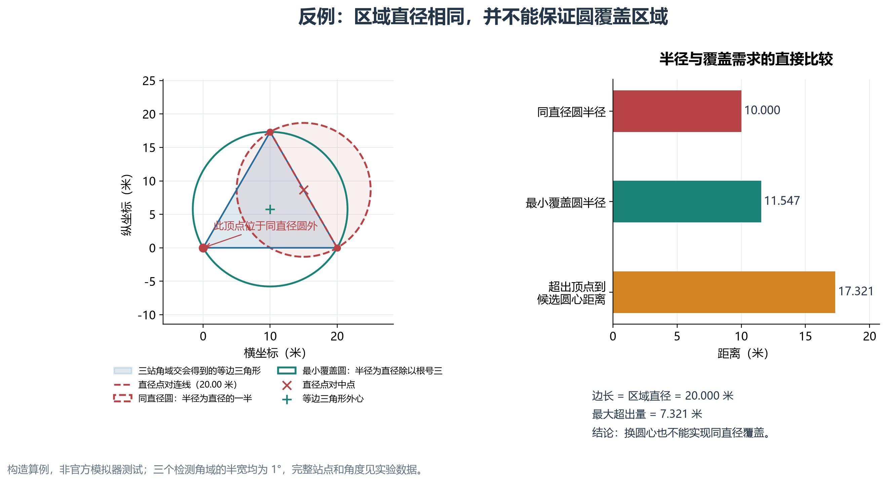

# 第一问：基于半平面交的定位区域直径计算与覆盖性判定

> 本文为中文论文备用稿，尚未合入最终论文。第一问题意与误差定义依据赛题 PDF 第 1—3 页；所有示例均为显式构造，不是官方模拟器采集数据。代码、图表及实验记录由项目对应文件提供，最终排版时统一编号和引用。

## 1. 问题分析与模型范围

第一问给定若干检测点坐标以及同一干扰源在各检测点处的示向度，要求利用交会定位法求定位多边形的直径，并判断以该直径为直径的圆能否覆盖定位区域。题目规定示向误差位于 $[-1^\circ,1^\circ]$ 内，因此每次检测对应一个朝向测量方向、张角为 $2^\circ$ 的前向角域，多个角域的公共部分构成可行定位区域。

本问采用确定性有界误差模型，不附加误差的概率分布与独立性假设。定位区域按附录 2 的多边形交会定义构造，不再与背景分布圆或接收距离圆进行裁剪，以保留题目要求的多边形几何结构。以下首先讨论非空、有界且具有面积的情形，再给出空集、无界集和退化交集的处理方式。

## 2. 角域约束及凸性

记第 $i$ 个检测点为 $S_i=(x_i,y_i)$，示向度为 $\theta_i$，最大误差为 $\delta=1^\circ$。角度从 $x$ 轴正向逆时针计算，定义边界方向向量

$$
u_i^-=(\cos(\theta_i-\delta),\sin(\theta_i-\delta)),\qquad
u_i^+=(\cos(\theta_i+\delta),\sin(\theta_i+\delta)).
$$

候选位置 $X=(x,y)$ 满足该次观测，当且仅当

$$
\operatorname{cross}(u_i^-,X-S_i)\geq0,
\qquad
\operatorname{cross}(u_i^+,X-S_i)\leq0,
\tag{1}
$$

其中 $\operatorname{cross}(a,b)=a_xb_y-a_yb_x$。式（1）同时保证角度范围与前向性，且可自然处理跨越 $0^\circ$ 的方向区间。展开后，每个检测点对应两条线性不等式：

$$
\begin{aligned}
\sin(\theta_i-\delta)x-\cos(\theta_i-\delta)y
&\leq\sin(\theta_i-\delta)x_i-\cos(\theta_i-\delta)y_i,\\
-\sin(\theta_i+\delta)x+\cos(\theta_i+\delta)y
&\leq-\sin(\theta_i+\delta)x_i+\cos(\theta_i+\delta)y_i.
\end{aligned}
\tag{2}
$$

全部观测给出的可行区域为

$$
P=\bigcap_{i=1}^nW_i=\{X\in\mathbb R^2:HX\leq b\}.
\tag{3}
$$

半平面为凸集，凸集的交集仍为凸集，故 $P$ 必为凸集。其边界由有限条直线确定；当 $P$ 非空、有界且具有非空内部时，$P$ 为凸多边形。

## 3. 定位区域直径的顶点算法

设定位多边形的顶点为 $V_1,\ldots,V_m$，则区域直径为

$$
D=\max_{X,Y\in P}\|X-Y\|_2.
$$

对任意 $X,Y\in P$，可写成顶点的凸组合：

$$
X=\sum_i\lambda_iV_i,\qquad Y=\sum_j\mu_jV_j,
\quad\lambda_i,\mu_j\geq0,\quad\sum_i\lambda_i=\sum_j\mu_j=1.
$$

由三角不等式，

$$
\|X-Y\|_2
=\left\|\sum_{i,j}\lambda_i\mu_j(V_i-V_j)\right\|_2
\leq\sum_{i,j}\lambda_i\mu_j\|V_i-V_j\|_2
\leq\max_{i,j}\|V_i-V_j\|_2.
$$

又因全部顶点属于 $P$，上述上界可由某组顶点达到，故

$$
\boxed{D=\max_{i<j}\|V_i-V_j\|_2.}
\tag{4}
$$

据此，算法先求半平面交的顶点，再枚举顶点对，保存最大平方距离及对应端点 $A,B$，最后取平方根得到 $D$。

实现时首先通过线性规划检查约束可行性；若可行，则分别优化 $x,-x,y,-y$ 判断有界性。对有界交集，枚举每两条不平行边界直线的交点，保留满足全部约束的交点，再去重取凸包。由于共有 $2n$ 条边界，交点枚举与约束过滤的复杂度为 $O(n^3)$，凸包的保守复杂度为 $O(n^2\log n)$，直径计算为 $O(m^2)$；另计线性规划的运行开销。该方法便于复核，适用于本问的一般小规模测向输入。

顶点枚举的完整性来自平面多面体的极点性质：每个顶点至少是两条不平行有效边界的交点。若没有两条独立边界约束，则可沿有效边界的公共切向向两侧作微小移动，说明该点不是极点。因此枚举全部边界对并筛选可行交点不会漏掉顶点。

## 4. 同直径圆的覆盖判定

设 $\|A-B\|=D>0$。若一个圆心为 $O$、半径为 $D/2$ 的闭圆盘覆盖 $P$，则必有

$$
D=\|A-B\|\leq\|A-O\|+\|O-B\|\leq D.
$$

等号条件要求 $O$ 位于线段 $AB$ 上，且到 $A,B$ 的距离均为 $D/2$，因此

$$
O=M=\frac{A+B}{2}.
\tag{5}
$$

候选圆心由任意一组直径端点唯一确定。由于圆盘为凸集，只要它包含全部顶点，就包含顶点的凸包 $P$。于是存在同直径覆盖圆的必要充分条件为

$$
\boxed{\max_{1\leq k\leq m}\left\|V_k-\frac{A+B}{2}\right\|_2\leq\frac D2.}
\tag{6}
$$

若式（6）不成立，更换圆心也不能实现同直径覆盖。需要注意，区域直径与最小覆盖圆直径是不同概念，前者不一定等于后者。

## 5. 可由测向交会实现的反例

取边长 $20$ 米的等边三角形

$$
A=(0,0),\quad B=(20,0),\quad C=(10,10\sqrt3).
$$

其直径为 $20$ 米。以 $AB$ 为直径的圆心为 $(10,0)$、半径为 $10$ 米，而第三个顶点到圆心的距离为 $10\sqrt3$ 米，因此不被覆盖。根据式（6），不存在直径为 $20$ 米的圆能够覆盖该区域；其最小覆盖圆半径为 $20/\sqrt3>10$ 米。

该三角形可以由符合 ±1° 误差条件的三个前向角域精确构成。沿三角形逆时针各边，记起点为 $P_i$、边向量为 $e_i$，设置

$$
S_i=P_i-25e_i,\qquad\theta_i=\arg(e_i)+1^\circ\pmod{360^\circ}.
\tag{7}
$$

即采用下表中的构造输入。

| 检测点 | 横坐标／米 | 纵坐标／米 | 示向度 |
|---|---:|---:|---:|
| 1 | $-500$ | $0$ | $1^\circ$ |
| 2 | $270$ | $-250\sqrt3$ | $121^\circ$ |
| 3 | $260$ | $260\sqrt3$ | $241^\circ$ |

各角域的下边界提供对应边的内侧半平面，三者相交恰好限制出三角形。相对于该下边界，第三个顶点的偏转角为

$$
\arctan\frac{\sqrt3/2}{25.5}=\arctan\frac{\sqrt3}{51}<2^\circ,
$$

因此各角域的上边界不会切掉三角形。由此可知，三个角域的交集恰好为上述等边三角形。取重心为实际干扰源时，三组测量误差均满足题目上界，站源距离均约为 $510$ 米，大于 $5$ 米且小于题设全部有效接收半径的下限 $1000$ 米。因此可选择全向干扰源，使这组示向观测具有物理可实现性。

该构造证明，不能仅因为定位区域是凸多边形，就认定同直径圆能够覆盖它。

## 6. 算法边界与数值处理

当角域交集为空时，算法报告观测约束不相容，不输出具有定位含义的直径；当交集无界时，其直径为无穷，不存在有限覆盖圆。若交集退化为线段，直径为两端点距离且对应圆盘可以覆盖；若退化为单点，直径为 $0$，以该点为中心的退化圆盘可以覆盖。无检测输入对应整个平面，归入无界情况。

程序对坐标进行平移和尺度归一化，并将半平面法向量单位化；可行性、顶点去重和覆盖边界使用显式浮点容差。此类容差用于计算稳定性，不能替代上述精确数学证明。尤其当测向边界近乎平行、区域极薄或圆盘恰好经过顶点时，应结合约束残差与容差敏感性复核计算结果。

## 7. 配套图表与构造验证

以下图表已经由项目脚本生成。图中采用中文标注，距离单位为米；构造算例均使用本问几何算法求解，**不是官方模拟器采集数据或比赛成绩**。输入、结果与复现记录见[构造实验报告](../../experiments/第一问/构造实验报告.md)和[实验配置与环境](../../experiments/第一问/实验配置与环境.json)。

### 7.1 算法流程

图 1：算法由半平面约束出发，先判断可行性与有界性，再处理多边形及退化交集，最后输出直径与覆盖判定。论文排版可使用[流程图矢量版](../../results/figures/第一问/01_算法流程图.svg)。

### 7.2 双站交会示意

图 2：双站构造算例。检测点取 $(-500,0)$ 和 $(500,0)$，示向度取其指向构造目标 $(0,1000)$ 的方向，误差半宽均为 $1^\circ$。左图展示前向角域交会，右图放大定位多边形、直径点对及同直径候选圆。计算得到四边形直径约为 $87.381818$ 米，本例的同直径圆可以覆盖区域。该图同时说明角域交会模型和式（4）的顶点直径计算，矢量文件见[双站交会图](../../results/figures/第一问/02_双站角域与定位区域.svg)。

### 7.3 同直径圆不可覆盖的反例

图 3：第 5 节三站构造得到的等边三角形定位区域。区域直径为 $20$ 米，同直径圆半径为 $10$ 米，第三顶点到候选圆心的距离为 $10\sqrt3\approx17.320508$ 米；最小覆盖圆半径为 $20/\sqrt3\approx11.547005$ 米。两类圆的差异直观展示了式（6）的作用。矢量文件见[覆盖反例图](../../results/figures/第一问/03_同直径覆盖圆反例.svg)。

等边三角形的三条边都是并列的直径点对。正文为方便推导选取 $AB$，绘图则使用程序返回的一组直径端点，因此图中候选圆所用的边及圆心可能与正文不同。无论选取哪条边，另一个顶点到候选圆心的距离均为 $10\sqrt3$ 米，覆盖判定完全相同。

### 7.4 结果表与补充验证资料

下表摘录[构造算例汇总](../../results/tables/第一问/构造算例汇总.md)中的实际计算结果。完整检测点、示向度、顶点及候选圆心保存在[构造算例输入输出](../../results/tables/第一问/构造算例输入输出.json)中。

| 构造算例 | 顶点数 | 直径／米 | 同直径圆半径／米 | 同直径圆覆盖 |
|---|---:|---:|---:|---|
| 双站基础算例 | 4 | 87.381818 | 43.690909 | 是 |
| 三站等边三角形反例 | 3 | 20.000000 | 10.000000 | 否 |
| 新增第三站算例 | 6 | 43.642981 | 21.821491 | 否 |

项目还保留三项补充验证，可视论文篇幅放入验证部分或附录：

| 资料 | 作用与解释边界 |
|---|---|
| [新增检测约束的区域嵌套图](../../results/figures/第一问/04_新增检测约束的区域嵌套.svg) | 展示新增相容角域约束后区域包含于原区域，验证直径不会增大；不据此推断覆盖判定也具有单调性。 |
| [构造交会角扫描图](../../results/figures/第一问/05_构造交会角扫描.svg)及[输入输出数据](../../results/tables/第一问/交会角扫描输入输出.json) | 在固定构造条件下改变两站中心射线交会角，展示定位区域直径及覆盖判定的变化；样本比例不代表概率。 |
| [构造误差半宽敏感性图](../../results/figures/第一问/06_构造误差半宽敏感性.svg)及[输入输出数据](../../results/tables/第一问/误差半宽扫描输入输出.json) | 验证误差角域扩大时区域直径不减；其中只有半宽 $1^\circ$ 对应本题设定，其余数值仅用于算法核查。 |

通用结论来自数学证明；上述图表用于解释和复核实现，不替代证明。正式论文应保留构造数据来源说明，并根据全文顺序统一图、表及公式编号。
