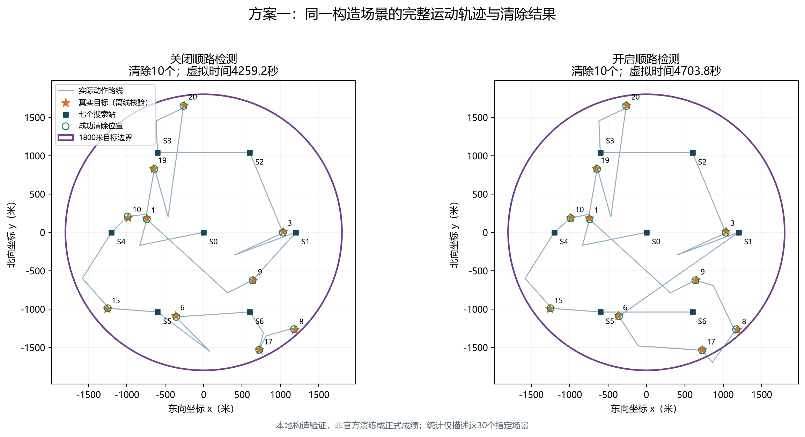
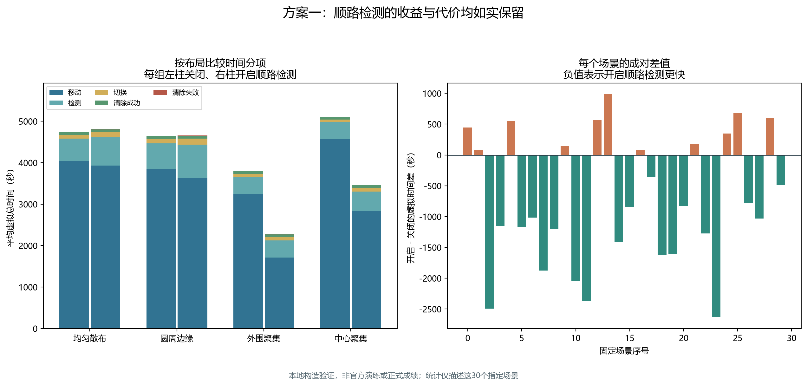
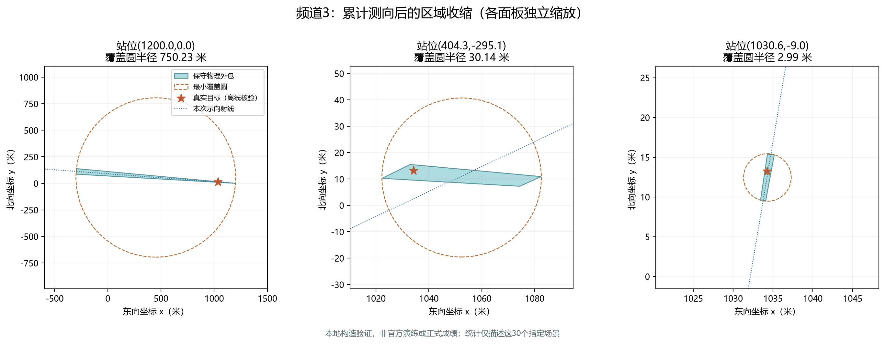

# 第三问方案一论文备用稿

本文为已实现方案一的中文备用文字，供队友改写。数值来自本地构造集，不是官方演练或正式测试；不得用本地结果代填题目正式成绩表。

## 1. 问题转化

将20个频道分别视为至多含一个静止目标的任务单元。目标数未知且介于10～16，故算法既需要处理已发现目标，也需要对未发现频道建立搜索完成证据。总虚拟时间为

\[
T=L/5+N_s+5N_m+3N_f+5N_c,
\]

其中L为总路程，N_s为测向机频道切换次数，N_m为检测次数，N_f和N_c分别为失败与成功清除次数。在全部清除约束下减小T；现实运行时间作为独立硬约束。

## 2. 具有覆盖保证的发现阶段

搜索站取原点及半径1200米正六边形的六个顶点。对径向距离r≤900米的目标，原点保证接收。对900≤r≤1800米，至少有一个外围站与目标的极角差不超过30°，因此最近站距离平方不超过r²+1200²−2400r cos30°。该凸函数在区间端点的最大值对应距离968.901572米，小于保证接收半径1000米。

若某频道在七站均无信号，则该频道不存在未清除目标。额外观测也可以积累覆盖证据，但必须以连续覆盖充分判据确认，不能把离散样本均被覆盖视为证明。程序采用七站解析证书和保守四叉树证书。

七站仅保证发现。只获得一次方向或多次观测仍未满足清除条件的目标，继续执行自适应测向。

## 3. 连续历史观测与保守几何

令W_i为第i次正向观测对应角域，维护

\[
\overline\Omega_c\supseteq A\cap\bigcap_iW_i\cap\bigcap_i B(S_i,1500).
\]

实现通过128边外切多边形包含圆约束，角域使用第一问的半平面构造，因此保守外包内仍包含真实目标。为显式处理两位小数舍入，第三问使用1.005°角半宽。负观测和失败清除圆单独保存，避免将可能非凸的精确信息集错误地当凸区域处理。

定义外包的最小覆盖圆半径

\[
r_c^*=\min_z\max_{G\in\overline\Omega_c}\|G-z\|.
\]

当可以找到点z使最远距离≤19.5米时执行清除。凸函数的最大值可在多边形顶点处核查，因而顶点证书覆盖整个外包。收到near时原地清除。第一问的D≤40米条件不是20米圆覆盖的充分条件，程序不使用这种替代。

## 4. 面向完成费用的追加测向

候选由第二问透镜近似点的内缩、当前区域主轴附近多尺度点和搜索站共同生成。每个候选须通过当前完整外包的最远距离≤999.5米、最近距离>5.5米检查，以保证接收且排除无方向的近距区域。

对候选S，以有限观测角网格计算

\[
\widehat Q(S,c)=\|S-X\|/5+5+\mathbf1_{c\ne c_{\rm current}}
 +\max_{\theta\in\Theta_{\rm grid}}B(\overline\Omega_c\cap W(S,\theta),S),
\]

其中B是明确后续清除策略的费用：足够小时移到覆盖圆心清除，其他情况用有限方格覆盖的最坏费用。当前实现每候选9个角节点、最多24个候选，并限制单次规划时间。该评分为有限采样近似，不宣称连续最坏目标的精确值或全局最优。

目标调度采用预计完成费用较小者优先，每次反馈后重新规划。开启顺路检测时，在新的追加站最多检测4个其他频道，要求距对应历史检测位置至少600米；对已发现频道还要求可靠接收。此规则利用已经发生的移动，但可能产生无效额外检测，需通过对照评价。

## 5. 完备性回退与终止

若追加测向预算达到8次或其预测费用高于直接有限覆盖，则对当前外包旋转包围盒划分边长20米的方格，逐格中心尝试清除。每格内点距中心至多10√2米，小于20米，因此在题设成立、动作正常执行且预算允许时，有限次尝试必覆盖真实目标。程序保留边界相交单元，不以中心是否在域内作不安全删减。

任务结束证据为所有频道均已清除或证明不存在；也可由已清除16个不同频道直接使用目标数上界。通信结果未决、现实或虚拟预算不足时记录未完成，不报告虚假的全清除。

## 6. 本地构造结果

采用30个固定场景，覆盖10/13/16源、四类空间布局、接收半径上下限与混合值，以及固定坐标误差、0和±1°端点。对每个场景分别开启、关闭顺路检测，共60次运行，两种设置均30/30全清除。

| 设置 | 平均总虚拟时间（秒） | 平均检测次数 | 清除失败总次数 |
|---|---:|---:|---:|
| 关闭顺路检测 | 4581.336 | 99.600 | 30 |
| 开启顺路检测 | 3862.598 | 120.933 | 38 |

开启顺路检测平均减少总时间15.688%，在19个场景更快、11个场景更慢。结果说明额外观测有时能够减少后续绕行，但并非逐场占优。失败清除来自有限覆盖尝试，费用已完整计入；带安全证书的清除均成功。评估器累计核查2137个正观测外包均包含真实目标。

本地环境是独立构造反馈器，策略只通过请求响应获取观测，真值仅在运行结束后用于评估。这些结果不构成官方场景分布上的概率保证，也不包含真实网络负载。

## 7. 图表及来源

图1为固定编号0场景；该例开启顺路检测反而更慢，展示实际路线代价而不只选择有利案例。

图2每组左右柱分别为关闭和开启顺路检测；右图负值表示开启更快。统计只描述指定30场景。

图3各面板独立缩放，图题给出检测站位置，虚线为本次示向射线，外包包含全部历史观测。

完整输入输出、环境和哈希见[结果汇总](../../results/tables/第三问/方案一_本地对照汇总.json)与[完整本地记录](../../experiments/第三问/方案一/本地对照完整记录.jsonl)。实现和复现入口见[第三问阅读导航](../../docs/第三问/阅读导航.md)。

## 8. 正式论文补充项

官方演练联调、方案二完整闭环对照和三次正式测试均未完成，正式成绩表应在取得真实案例编码与原名日志后补写。当前方法为可执行启发式基线，后续可研究路线优化和更充分的前瞻，但不能将尚未实现部分写入本版算法成果。
