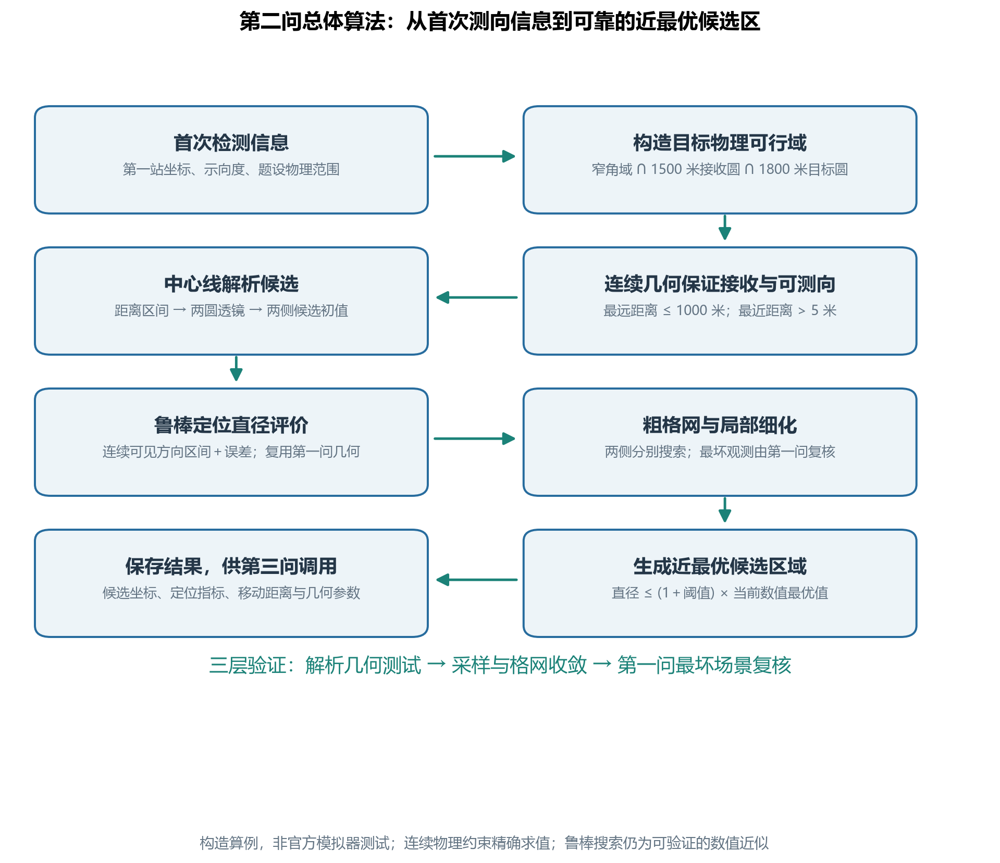
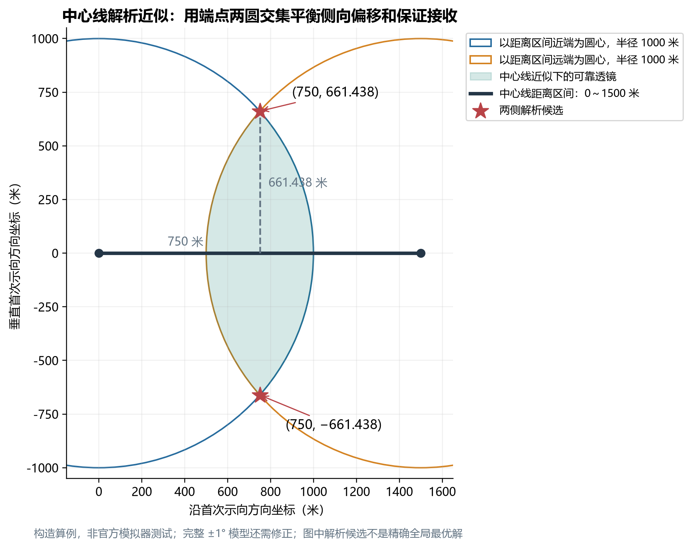
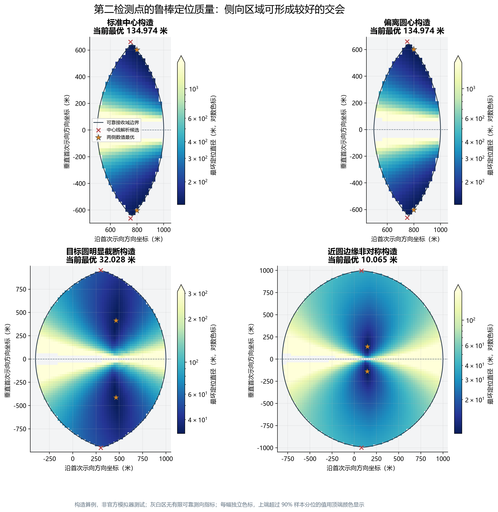
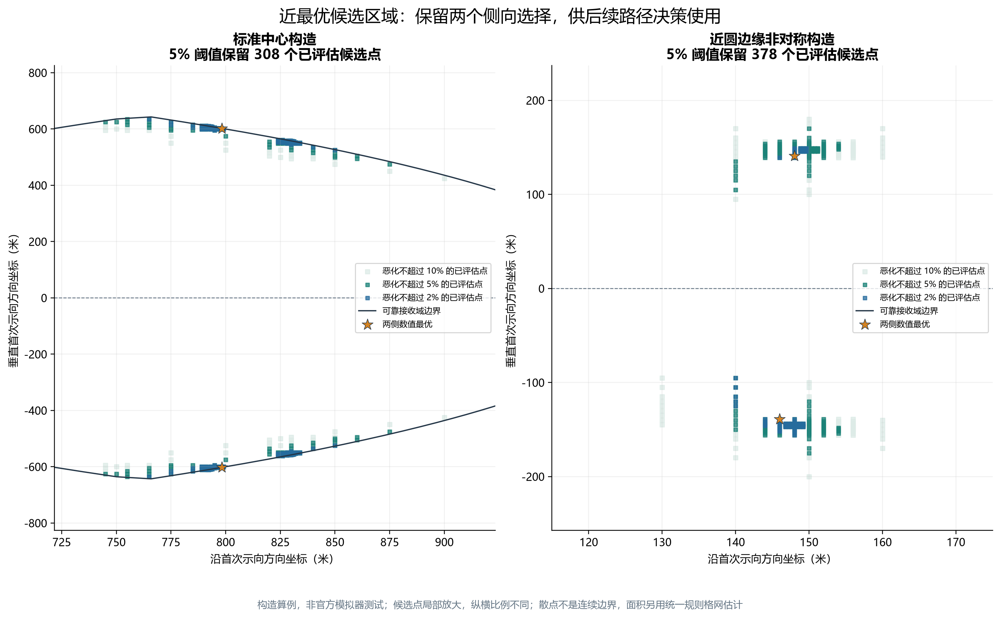

# 第二问：基于可靠接收约束与最坏定位直径的第二检测区域选择

> 本文为中文论文备用稿，尚未合入最终论文。正式参数依据归档 B 题题面及附录；数值结果由第二问统一构建脚本实际生成，均为构造算例，非官方模拟器测试。合稿时统一公式及图表编号。

## 1. 问题分析

已知机器狗在检测点 $S_1$ 成功取得某个全向干扰源的示向度 $\theta_1$，需要选择第二检测位置并给出候选区域。首次方向误差为 $\pm1^\circ$，只能将目标限制在一个前向角域内；第二位置既应保证接收尚未确定位置的目标，又应与首次测向形成较好的交会几何。

沿用第一问定位区域 $P=W_1\cap W_2$ 的直径 $D(P)$ 作为质量指标。本文通过物理先验构造目标可行域，以最小接收半径保证二次接收，再用最坏定位直径建立鲁棒选点模型。题目未给目标位置和误差分布，故不附加均匀或高斯假设。

## 2. 首次物理可行域与可靠二次检测域

题设目标位于中心为 $O=(0,0)$、半径为 $1800$ 米的圆内，全向源有效接收半径处于 $1000$～$1500$ 米。首次已成功接收，因此真实目标满足

$$
\boxed{\Omega_1=W(S_1,\theta_1,\delta)\cap B(S_1,1500)\cap B(O,1800),
\qquad\delta=1^\circ.}
\tag{1}
$$

$\Omega_1$ 是非空时有界的闭凸集，其边界包含线段和圆弧。首次取得示向度还意味着距离超过 $5$ 米；为保留凸结构，本文暂不删除这部分极小近距区域。此举扩大不确定集合，使接收约束和最坏质量评价更保守，不会导致过度乐观的结论。

要在未知接收半径条件下保证二次接收，应使第二站到全部可能目标的距离不超过半径下界 $1000$ 米。定义可靠二次检测域

$$
\boxed{\mathcal K=\left\{S:\max_{G\in\Omega_1}\|S-G\|\le1000\right\}
=\bigcap_{G\in\Omega_1}B(G,1000).}
\tag{2}
$$

该区域为闭凸集。然而题设距离不超过 $5$ 米时不返回普通示向度，因此还需使用

$$
\mathcal K_{\rm dir}=\{S\in\mathcal K:\operatorname{dist}(S,\Omega_1)>5\}
\tag{3}
$$

作为可靠二次测向域，数值实现加入正安全裕度。计算距离极值时直接检查有效线段端点、投影点及圆弧的径向驻点，保证接收约束基于连续物理边界，而非仅由有限绘图点验证。

式（2）是统一半径下的保守充分域。首次成功还隐含实际接收半径至少为 $\max(1000,\|G-S_1\|)$，因而进一步条件化可得到更宽松的 $\mathcal K_{\rm cond}=\bigcap_{G\in\Omega_1}B(G,\max(1000,\|G-S_1\|))$。本轮按统一准则建模，未优化该扩展；$\mathcal K$ 外的点不自动等于条件模型下无法保证接收，后文最优结果也只相对于本轮可行域。

## 3. 解析几何候选与交会精度分析

将坐标平移旋转至 $S_1=(0,0)$、$\theta_1=0$，以中心线距离区间 $[r_-,r_+]$ 近似首次狭窄目标角域。距离区间由 $1500$ 米接收上界及目标圆截断共同确定。

记 $m=(r_-+r_+)/2$、$a=(r_+-r_-)/2$。线段近似下，最远目标必在端点，可靠区域为两个端点半径 $1000$ 米圆盘的交。两圆边界交点为

$$
\boxed{S_{2,\rm line}^{\pm}=S_1+m\mathbf e
\pm\sqrt{1000^2-a^2}\,\mathbf n,}
\tag{4}
$$

其中 $\mathbf e=(\cos\theta_1,\sin\theta_1)$、$\mathbf n=(-\sin\theta_1,\cos\theta_1)$，要求 $a<1000$。对标准区间 $[0,1500]$，有

$$
S_{2,\rm line}^{\pm}=(750,\pm661.437827766\ldots)\ \text{米}.
$$

这两个点到线段两端均为 $1000$ 米，目标处于中点时可形成约 $90^\circ$ 交会。它们是中心线近似中的解析候选，不是完整鲁棒模型的精确最优解。完整 $\pm1^\circ$ 扇形中，其最远目标距离约为 $1017.336587$ 米，因此还须通过可靠性约束修正。

为解释交会角的影响，设站源距离为 $d_1,d_2$、测向交会角为 $\varphi$。用半宽 $w_i=d_i\tan\delta$ 的平行误差带近似局部角楔，非平行时交集为中心对称平行四边形。对其四个顶点求距可得

$$
\boxed{D_{\rm lin}=
\frac{2\sqrt{w_1^2+w_2^2+2|\cos\varphi|w_1w_2}}{|\sin\varphi|}.}
\tag{5}
$$

固定站源距离时，近 $90^\circ$ 交会较好，近共线则出现误差放大；但选点同时改变距离和夹角，不能只追求直角。第一问等距构造扫描也在 $90^\circ$ 得到最小离散直径，作为该几何分析的数值支持。式（5）仅是小角度误差带近似，最终计算仍采用第一问精确角域交会。

## 4. 鲁棒优化模型及数值求解

对于 $G\in\Omega_1$，第二站可能观测为

$$
\theta_2=\operatorname{atan2}(G_y-S_{2y},G_x-S_{2x})+\varepsilon_2,
\qquad |\varepsilon_2|\le\delta.
$$

首次 $\theta_1$ 固定，定义最坏定位直径

$$
J(S_2)=\sup_{G\in\Omega_1,\ |\varepsilon_2|\le\delta}
D\!\left(W(S_1,\theta_1,\delta)\cap W(S_2,\theta_2,\delta)\right),
$$

以及优化目标

$$
\boxed{J^*=\inf_{S_2\in\mathcal K_{\rm dir}}J(S_2).}
\tag{6}
$$

无界交会取无穷直径；理应相容的场景若得到空集，须检查数值与输入，不以零直径计分。$P$ 仍仅为角域交集，圆域约束用于目标场景和站点可行性。

由于 $\Omega_1$ 紧凸且可靠测向位置在其外部，可选连续角度分支，使所有真实方向组成闭区间 $[\beta_-,\beta_+]$。加入测量误差后，可能观测恰为 $[\beta_--\delta,\beta_++\delta]$。因此内层场景优化精确化为这个角区间上的一维直径极大化。

算法先在可靠域内进行规则二维网格搜索，再从两侧多个优良位置及解析候选附近进行约束局部细化。每次评价通过角网格和局部峰细化计算最坏直径近似；代表性及最坏观测与第一问原函数交叉核对，并加密目标、误差和角网格检验稳定性。数值结果记为 $\widehat J$、$\widehat J^*$，不把局部优化成功或有限采样等同于连续全局最优证明。

## 5. 近最优候选区域及后续复用

为回答题目要求的候选区域，定义

$$
\boxed{\mathcal C_\eta=\{S\in\mathcal K_{\rm dir}:J(S)\le(1+\eta)J^*\}.}
\tag{7}
$$

数值输出使用已评价规则格网上的对应近似。通过 $2\%、5\%、10\%$ 等阈值比较定位质量与区域大小的变化；候选面积使用单元计数估计并报告格网步长。图中区域的插值边界不额外构成连续性能保证。

每个候选位置同时保存最坏直径近似、可靠性余量以及到 $S_1$ 的移动距离 $\|S-S_1\|$，供第三问在满足质量要求的区域内进一步安排路线。第二问主目标不直接混入移动时间。

## 6. 构造数值实验与结果

实验使用 $25$ 米外层规则网格，粗筛采用 $65$ 个观测角，随后进行多起点邻域加密和 SLSQP 细化；最终方案及近优候选使用 $257$ 个观测角与局部峰细化重评。可靠性由连续圆弧边界距离极值检查，最终最坏场景经第一问原函数复核。全部实验为确定性构造，没有调用官方模拟器。

### 6.1 四类检测几何

下表来自[标准构造案例输入输出](../../results/tables/第二问/标准构造案例输入输出.json)，坐标和距离单位为米。

| 构造 | 首次检测点及示向度 | 一组数值优良第二站 | 最坏直径近似 |
|---|---|---|---:|
| 标准中心 | $(0,0),0^\circ$ | $(798.303,602.257)$ | 134.974492 |
| 偏离圆心 | $(-700,350),20^\circ$ | $(-155.825,1188.972)$ | 134.974492 |
| 目标圆截断 | $(1200,0),0^\circ$ | $(1664.600,413.600)$ | 32.028132 |
| 近圆边缘 | $(1790,0),89^\circ$ | $(1931.527,143.552)$ | 10.064513 |

标准构造两侧结果近似镜像，可写为 $(798.303,\pm602.257)$ 米；其连续最远目标距离约为 $999.999980$ 米，最近距离约为 $588.232490$ 米，满足可靠接收和可测向条件。上侧点到中心线解析候选的距离约为 $76.391$ 米。

目标圆截断使中心线可能距离上限从 $1500$ 米缩至 $600$ 米，明显改善最坏定位质量；该例数值点距最近中心线解析点约 $564.854$ 米，说明距离区间变短后，过大的侧向偏移不再有利。近边缘扇区受到不对称裁剪，两侧质量不完全相同。第二站坐标超出目标圆并不违反本模型，因为目标圆只约束干扰源分布。

### 6.2 标准策略对照

| 策略 | 是否通过本文统一可靠测向准则 | 最坏直径近似／米 | 解释 |
|---|---|---:|---|
| 沿线前进至 $(750,0)$ | 否 | 不适用 | 存在近距无示向度场景，另有无界交会场景 |
| 原地侧移至 $(0,500)$ | 否 | 423.933639 | 未通过统一接收准则，数值为几何对照 |
| 中段侧移至 $(750,500)$ | 是 | 165.106697 | 可解释且可靠，但最坏质量较差 |
| 中心线解析候选 | 否 | 135.900372 | 最远目标距离超过接收下界 |
| 解析候选可靠化回缩 | 是 | 139.227979 | 沿安全方向回缩后的可靠策略 |
| 鲁棒数值优化 | 是 | 134.974492 | 本次搜索得到的优良可执行方案 |

完整坐标、最大和最小站源距离见[策略对比数据](../../results/tables/第二问/策略对比输入输出.json)。对照说明，较好交会角、接收保证和站源距离需要联合考虑；不能只比较直径而忽略本文统一可靠测向约束；未通过统一准则不等于在扩展条件模型中必然失败。

### 6.3 候选区域与收敛验证

标准构造中，$2\%、5\%、10\%$ 阈值在 $25$ 米网格上的区域面积估计分别为 $2500$、$10000$、$22500$ 平方米。$5\%$ 候选点的移动距离约为 $972.445$～$1000$ 米，适合作为主要候选区域展示，并为后续路径安排保留其他阈值结果。

外层步长为 $50$、$25$、$12.5$、$6.25$ 米时，数值最佳直径均约为 $134.974492$ 米，而 $5\%$ 面积估计分别为 $5000$、$10000$、$9062.5$、$8984.375$ 平方米。最后一次加密的面积变化约为 $0.86\%$，故标准 $5\%$ 区域可描述为细网格复核约 $0.90$ 万平方米；主 $25$ 米格网的 $10000$ 平方米仍原样保留。最优值与区域面积具有不同收敛速度，本文把面积作为格网估计报告，不称为精确连续面积。

在固定标准数值点上，观测角网格从 $17$ 加密至 $513$，以及目标—误差验证从 $91\times5$ 增至 $651\times33$ 场景，最坏直径均保持约 $134.974492$ 米。其一个最坏目标为 $(1499.771543,26.178610)$ 米，第二次误差为 $1^\circ$。同一观测可能有不同目标—误差分解，因此单个见证不能证明最坏误差的一般取值规律；本文使用完整可能观测区间。完整对照见[采样收敛分析](../../results/tables/第二问/采样收敛分析.json)。

### 6.4 误差敏感性

在标准构造中，围绕正式半宽 $1^\circ$ 改变误差，得到下表。非正式半宽仅用于敏感性分析，数据来自[角度误差敏感性](../../results/tables/第二问/角度误差敏感性.json)。

| 误差半宽 | 固定正式方案的最坏直径／米 | 重新优化后／米 |
|---|---:|---:|
| $0.5^\circ$ | 64.146747 | 64.123858 |
| $1.0^\circ$（题设） | 134.974492 | 134.974492 |
| $1.5^\circ$ | 213.780384 | 213.693515 |
| $2.0^\circ$ | 302.218426 | 301.692078 |

随着角域扩大，最坏直径增大，符合确定性误差集合的包含关系。该比较也说明，对定位质量的解释应结合误差量级，不能仅报告一个脱离输入参数的最优坐标。

## 7. 模型结论与配图位置

第二问可归结为：在保证全部允许目标均可接收且能够获得普通示向度的条件下，寻找最坏角域定位直径较小的第二检测区域。中心线透镜提供可解释初值，连续圆弧几何提供接收约束，一维观测角极大化和两层站点搜索给出数值候选，近优区域及移动距离则为第三问保留接口。

论文正文宜保留总体算法流程、首次物理可行域与解析透镜、最坏直径热力图和近最优区域图；接收裕度、误差敏感性和收敛图可安排在模型验证部分。图表统一位于[第二问图表目录](../../results/figures/第二问/)，图注均应保留“构造算例，非官方模拟器测试”。详细符号、推导及解释边界见[第二问技术文档](../../docs/第二问/思路与数学推导.md)和[模型假设与边界说明](../../docs/第二问/模型假设与边界说明.md)。

### 7.1 方法流程

图 1：第二问由首次观测出发，分别处理物理可行域、可靠接收与测向、鲁棒几何评价及近优区域输出。圆弧距离约束连续计算，最坏直径及选点采用可验证的数值近似。构造算例，非官方模拟器测试。[SVG 排版文件](../../results/figures/第二问/01_第二问总体算法流程图.svg)。

### 7.2 中心线解析几何

图 2：标准中心线距离区间 $[0,1500]$ 米对应两个半径 $1000$ 米圆盘，交点为 $(750,\pm661.438)$ 米。该图说明解析候选的几何来源；完整角域仍须可靠性修正，不能把图中透镜直接当作完整可靠域。构造算例，非官方模拟器测试。[SVG 排版文件](../../results/figures/第二问/03_中心线近似与透镜可靠域.svg)。

### 7.3 目标函数与数值候选区域

图 3：四类构造在首次测向局部坐标中的数值最坏直径。色标分别设置，不能仅凭跨面板颜色深浅比较数值；灰白位置不提供有限可靠测向指标。红叉为中心线解析候选，星形为两侧数值优良点。构造算例，非官方模拟器测试。[SVG 排版文件](../../results/figures/第二问/05_最坏定位直径热力图.svg)。

图 4：$2\%、5\%、10\%$ 阈值下的已评价候选点，分别展示标准与非对称构造。候选点同时满足连续接收与测向条件；图示点集和插值填色不构成每个连续格网单元的性能证明，面积另用统一规则格网估计。构造算例，非官方模拟器测试。[SVG 排版文件](../../results/figures/第二问/06_近最优候选区域.svg)。

其他图表可按论文篇幅选入验证部分：[首次物理可行域](../../results/figures/第二问/02_首次测向物理可行域.svg)、[完整可靠二次检测域](../../results/figures/第二问/04_可靠二次检测域.svg)、[交会角关系](../../results/figures/第二问/07_交会角与定位直径关系.svg)、[误差敏感性](../../results/figures/第二问/08_角度误差敏感性.svg)、[策略对照](../../results/figures/第二问/09_解析策略与数值优化对比.svg)、[采样和搜索收敛](../../results/figures/第二问/10_采样与搜索收敛分析.svg)。
